# Fresh Ollama replenishment study: M5 and RetailNet

Execution status: **COMPLETE**. This report concerns the redesigned study only. It does not combine earlier repairs or earlier experiment results.

## What the study found

The study completed 1,080 runs, 7,560 portfolio decision days and 7,560 fresh local Ollama calls. Each portfolio contained 30 selected store–product series. The reported comparisons use 30 complete, balanced simulation seeds across two seven-day historical windows in each dataset and three business situations.

Live evaluation ran from 09 October 2026, 00:37 to 09 October 2026, 03:17 (Europe/Paris), taking 2.66 hours. Development, fresh forecast fitting, auditing and report preparation are additional steps within the registered time budget. Exact UTC event times are preserved in the logs.

### Customer demand fulfilled (%)

| Dataset | Conventional ordering | Structured-data planner | Ollama agents |
| --- | ---: | ---: | ---: |
| M5 | 65.05 | 90.34 | 90.33 |
| RetailNet | 83.53 | 84.52 | 84.31 |

These summary values weight the three business situations equally. Figures below show each situation separately.

### Inventory operating-cost index per demand unit

| Dataset | Conventional ordering | Structured-data planner | Ollama agents |
| --- | ---: | ---: | ---: |
| M5 | 1.768 | 0.524 | 0.525 |
| RetailNet | 0.910 | 0.860 | 0.869 |

These summary values weight the three business situations equally. Figures below show each situation separately.

**M5.** Compared with conventional ordering, the Ollama workflow changed demand fulfilment by +25.28 percentage points and the operating-cost index by -70.34%. Against the structured-data planner, the changes were -0.01 points and +0.06%. Its committed order vector matched that planner on 97.62% of portfolio days.

**RetailNet.** Compared with conventional ordering, the Ollama workflow changed demand fulfilment by +0.78 percentage points and the operating-cost index by -4.52%. Against the structured-data planner, the changes were -0.20 points and +1.01%. Its committed order vector matched that planner on 81.43% of portfolio days.

There were 0 observed committed-action constraint violations across the recorded study. That finding describes the whole guarded workflow; it does not demonstrate that an unrestricted language model would be safe.

The fair interpretation is to assess two questions separately. The comparison with conventional ordering measures the complete workflow, including numerical planning. The comparison with the structured-data planner asks whether adding the language-model roles changes the result once the same planning capability and current business rules are available.

## A simple design

Three actual language-model calls are made for each agent decision. The supplier agent reads a current supplier message. The planning coordinator requests the constrained-order tool and selects the permitted service priority. The review agent sees independent checks and either approves or holds the proposal. Numerical tools calculate quantities. A deterministic gate remains responsible for execution.

No inventory repair, sales recovery, data-fault experiment or previous response cache is used. An incorrect extraction, unavailable model, infeasible plan or failed check produces a hold. The run does not quietly substitute a conventional-policy result for a failed agent decision.

The conventional comparator uses an order-up-to rule and proportionate allocation under supplier and spending limits. The structured-data planner uses the same constrained-order tool, current rules, age projection and promotion-priority rule as the agents, without a language model. It is a strong, idealised comparator: its inputs are already structured. This study does not measure the staff time that would be needed to create those inputs in a real retailer.

Routine trading uses unchanged rules. In the supplier-disruption situation, cartons and minimum orders double, delivery takes one extra day and capacity falls by 30% from the third simulated day. In the promotion situation, an announced 30% uplift affects demand and the forecast from the third day. Every policy receives the same announced information, initial stock and keyed demand/supply draws.

Each test week is a separate simulation episode with the same opening-state rule. Inventory is not carried from the earlier window into the later one. Carton and minimum-order rules apply to individual order lines; dispatch capacity applies to each synthetic supplier group.

## Data and model

M5 uses 30 train-selected FOODS store–product pairs. RetailNet uses 30 train-selected store–product pairs from Dingdong-Inc/FreshRetailNet-50K. Both selections cover three historical sales-volume strata. These panels support the reported performance comparisons; they are not full-population evaluations of all M5 or all 50,000 RetailNet series.

M5 is tested on 9–22 May 2016, divided into two seven-day windows. RetailNet uses 19 June–2 July 2024: a seven-day rolling holdout from the released training file and the official seven-day evaluation file. A fresh LightGBM forecasting model is fitted locally for each dataset and window using only earlier observations. This is one forecasting family, shared by every policy. Forecasting uses recursive predictions and no evaluation sales as input.

The language model is pretrained Qwen2.5 1.5B, run through the local Ollama native API. It is not trained or fine-tuned on either retail dataset. The computer is Linux with a four-CPU allocation, 32 GiB memory and no GPU inference. Generation uses three CPU threads, a 4,096-token context, temperature zero and a fixed model seed. The protocol records the model digest and package versions.

## How to read the results

Fill rate is the share of simulated customer demand that stock could satisfy. Higher is better. The operating-cost index adds holding cost, a penalty for unmet demand and the cost of expired inventory. Lower is better. Purchase spend is recorded separately so acquisition and expiry are not double-counted. Costs, suppliers, inventories and supply events are experimental assumptions, not observed retailer profit.

RetailNet quantities are published normalized sales multiplied by 100. M5 uses published unit sales. Absolute commercial volumes and profits cannot be compared across these datasets. The cross-dataset comparison uses fulfilment and within-dataset relative policy effects. Fresh-stock expiry assumes three usable days and FIFO; the source dataset does not provide an observed shelf-life field.

Recorded sales can be limited by stockouts. This study deliberately uses released sales as a demand proxy, without estimating the purchases that were never recorded. Fulfilment therefore describes the declared simulation world, rather than the retailer's actual service level or recovered latent demand.

The 95% intervals resample paired simulation seeds 10,000 times. Both weekly windows are aggregated inside each seed. The intervals reflect the selected simulated weeks and demand/supply draws. They do not turn 30 chosen series into a population estimate, and the repeated days are not treated as independent observations.

## LLM reliability and workload

**M5.** Complete supplier extraction was correct on 100.00% of decisions; individual numerical fields were 100.00% correct. Service-priority selection was correct on 98.97% of decisions. The workflow held 0 agent decisions. Mean recorded decision time was 3.68 seconds; the 95th percentile was 3.99 seconds. The review model gave 0 approvals against failing independent checks and 0 holds against passing checks. The final gate still governs execution.

**RetailNet.** Complete supplier extraction was correct on 100.00% of decisions; individual numerical fields were 100.00% correct. Service-priority selection was correct on 87.46% of decisions. The workflow held 0 agent decisions. Mean recorded decision time was 3.90 seconds; the 95th percentile was 4.27 seconds. The review model gave 0 approvals against failing independent checks and 0 holds against passing checks. The final gate still governs execution.

Development was kept separate and its failures were preserved. The first development round exposed field-swapping and incorrect review decisions. Few-shot prompt examples were added before the design was frozen; there is no evaluation-time prompt tuning, response correction or model fine-tuning. Primary model requests and raw responses are all saved individually.

## Comparing M5 and RetailNet

The Ollama workflow fulfilled 90.33% of simulated demand in M5 and 84.31% in RetailNet, averaging the three situations equally. RetailNet also had 6.95% expired inventory as a share of opening stock plus receipts. M5 had no expiry within the study horizon. These are two different retail settings, rather than a ranking of dataset quality or model intelligence.

The difference matters for management. M5 tests keeping sufficient stock when delivery and ordering rules change. RetailNet adds a trade-off between availability and short-lived stock. A policy that orders more can protect customer service while increasing waste. The graphs therefore show fulfilment, operating cost and RetailNet expiry together. Absolute cost levels use synthetic quantity conventions and must not be treated as a comparison of retailer profitability.

## Business conclusion

**M5: the complete workflow.** The mean service difference was +25.28 percentage points (95% interval +24.91 to +25.65). The mean operating-cost change was -70.34% (interval -71.22% to -69.44%). These are effects of the whole agent-and-tool workflow relative to conventional ordering.

**M5: the LLM contribution.** The study did not establish an improvement from adding the LLM roles to the structured-data planner. Any benefit over conventional ordering must also be credited to the numerical planning tool.

**RetailNet: the complete workflow.** The mean service difference was +0.78 percentage points (95% interval +0.68 to +0.87). The mean operating-cost change was -4.52% (interval -5.03% to -3.98%). These are effects of the whole agent-and-tool workflow relative to conventional ordering.

**RetailNet: the LLM contribution.** The agents fell short of the structured-data planner on at least one of these measures. Their role as a reader of business messages did not translate into superior numerical replenishment performance.

A local LLM can therefore be assessed as a bounded participant in replenishment. Its useful role is to interpret supplier messages and coordinate an approved planning process. This is different from showing that it is a better forecaster or quantity optimiser. The structured-data comparison is essential because a strong planning tool may explain much of any advantage over conventional ordering.

The results support the measured workflow and identify where the LLM layer adds work, holds or interpretation capability. They do not establish production ROI, employee time savings or a universal model advantage. A retailer considering a pilot should keep the numerical planner and independent checks, test its own supplier messages, and measure the incremental value and review workload of the language-model layer.

## Limits of the evidence

The study covers two historical windows and selected panels, with controlled supplier prose, memos and tables. All inventory and supplier conditions are simulated. Historical evaluation periods were used in earlier work; fresh execution does not make them previously unseen research holdouts. No staff interviews, live purchasing or operational deployment took place. One small deterministic language model was tested, so conclusions do not automatically transfer to larger models or other retailers.

## Figures

### Figure 1. M5 + RetailNet — the new no-repair agent workflow

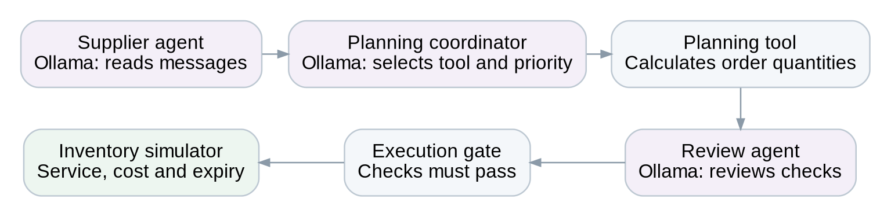

Three separate fresh Ollama calls per portfolio decision. Current contract fields are independently verified; numerical tools compute quantities and the execution gate controls permission. No repair mechanism is used.

### Figure 2. M5 + RetailNet — test-week sales profiles

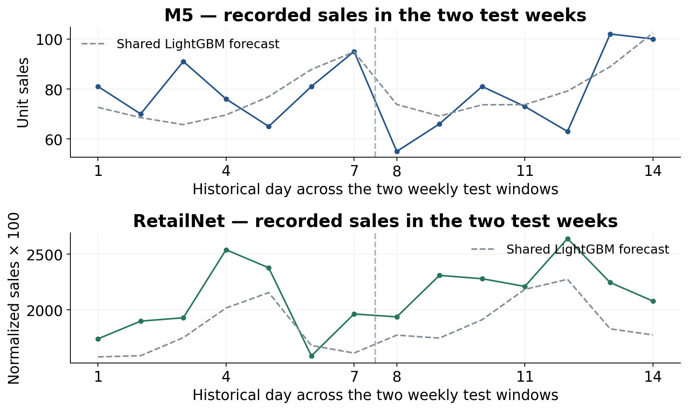

Solid lines: recorded sales across each 30-series panel. Dashed lines: the shared numerical LightGBM forecast, fitted afresh at each weekly origin. The axes use different quantity conventions; heights must not be interpreted as comparable commercial demand. The LLM does not produce these forecasts.

### Figure 3. M5 — customer-demand fulfilment

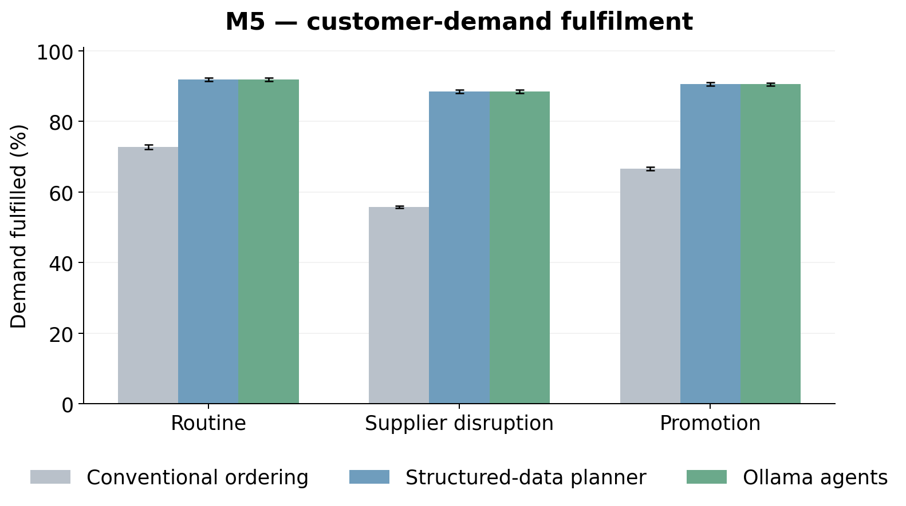

Means across 30 paired simulation seeds, with both test weeks aggregated within seed. Error bars: 95% bootstrap intervals. Higher is better.

### Figure 4. RetailNet — customer-demand fulfilment

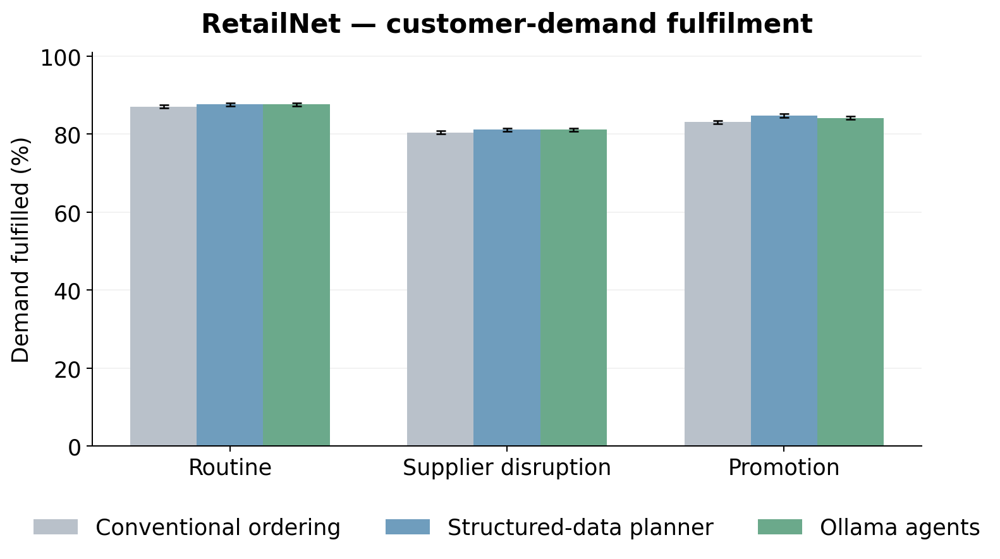

Means across 30 paired simulation seeds, with both test weeks aggregated within seed. Error bars: 95% bootstrap intervals. Higher is better.

### Figure 5. M5 — inventory operating cost

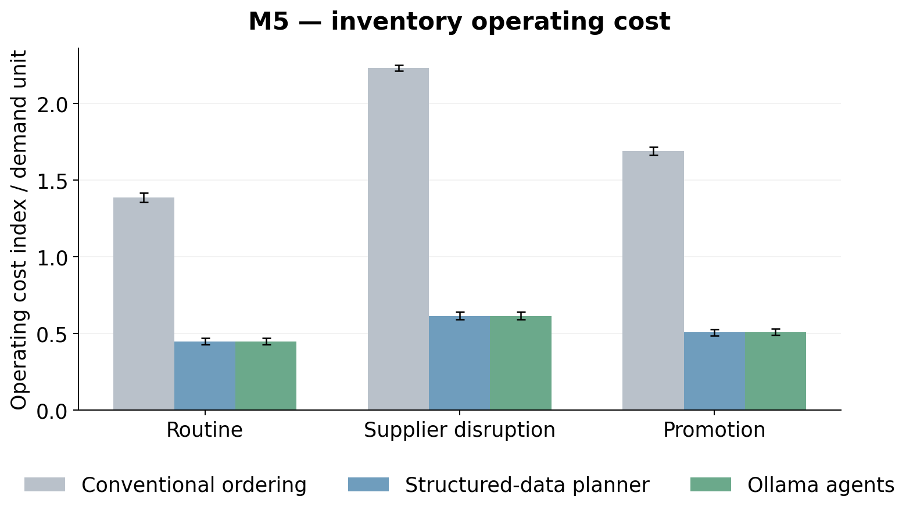

Means across 30 paired simulation seeds, with both test weeks aggregated within seed. Error bars: 95% bootstrap intervals. Lower is better.

### Figure 6. RetailNet — inventory operating cost

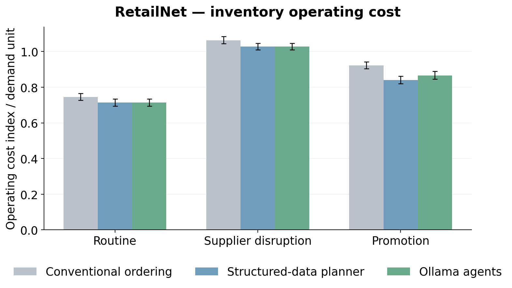

Means across 30 paired simulation seeds, with both test weeks aggregated within seed. Error bars: 95% bootstrap intervals. Lower is better.

### Figure 7. M5 — daily service

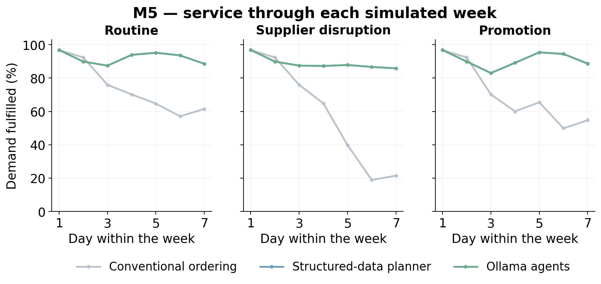

Daily demand-weighted fulfilment, pooling both weekly windows and 30 seeds within each scenario. The daily plots are descriptive; days are not treated as independent replications.

### Figure 8. RetailNet — daily service

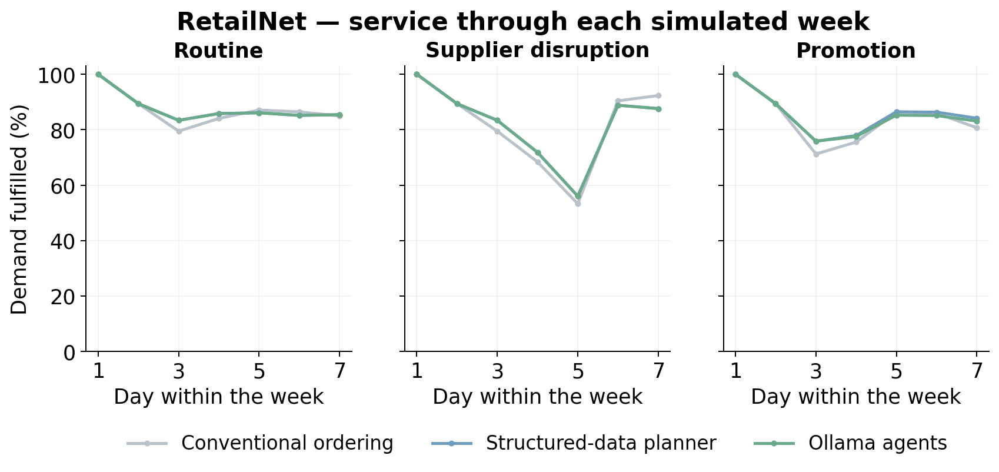

Daily demand-weighted fulfilment, pooling both weekly windows and 30 seeds within each scenario. The daily plots are descriptive; days are not treated as independent replications.

### Figure 9. RetailNet — fresh-stock expiry

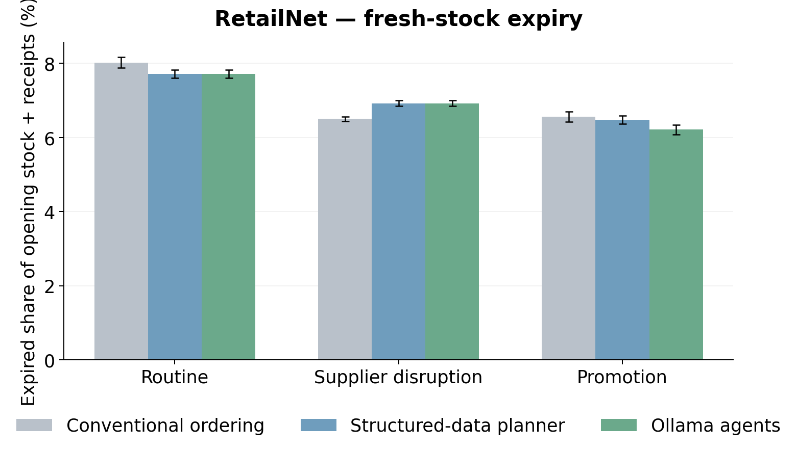

Means across 30 paired simulation seeds, with both test weeks aggregated within seed. Error bars: 95% bootstrap intervals. Lower is better.

### Figure 10. M5 + RetailNet — operating-cost components

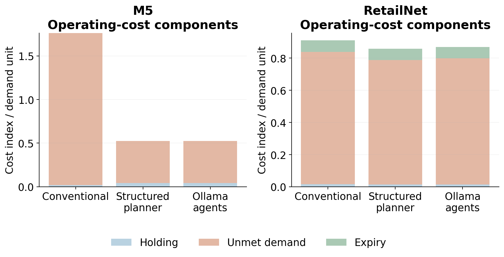

The primary index includes holding, unmet-demand penalties and expiry. Acquisition spend is reported separately. Ratios here use pooled demand; policy-mean tables use the mean of per-seed ratios.

### Figure 11. M5 + RetailNet — LLM supplier-reading accuracy

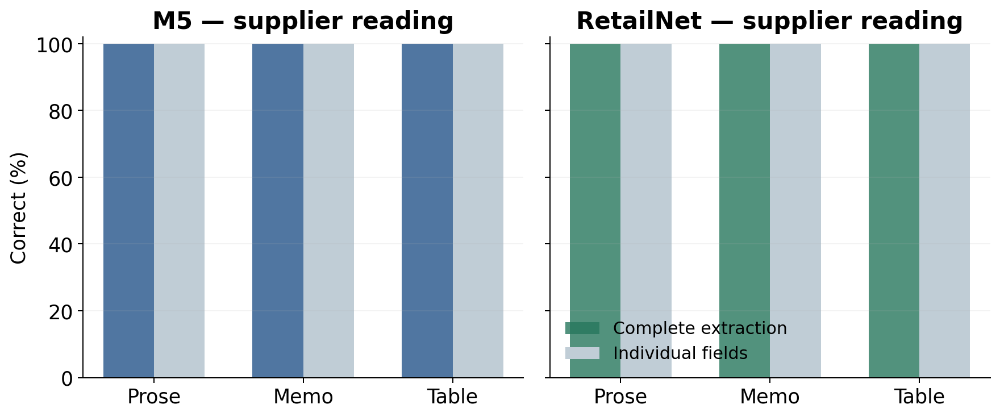

Exactly 13 numerical fields are scored per supplier call: four fields for each of three suppliers, plus the daily budget. Supplier identity/coverage must also be correct for a complete extraction. This is controlled language, not an unrestricted commercial document corpus.

### Figure 12. M5 + RetailNet — local model latency

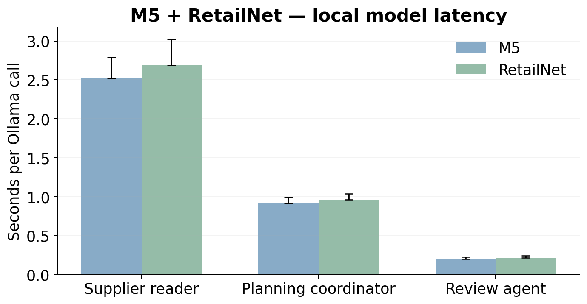

Bars show median recorded call time; upper whiskers show the 95th percentile, not a confidence interval. The local model was warm following development. Hardware and integration costs were not monetised.

### Figure 13. M5 + RetailNet — paired service effects

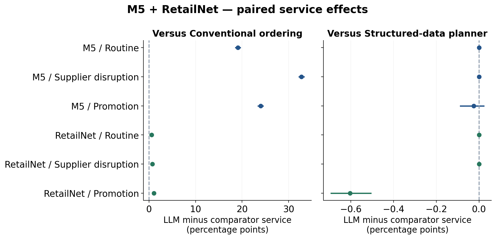

Thirty paired simulation seeds, with two weeks aggregated inside seed; 95% bootstrap intervals. The structured comparator uses the same numerical tool and current rules, isolating the model-assisted interpretation/routing layer.

### Figure 14. M5 + RetailNet — paired operating-cost effects

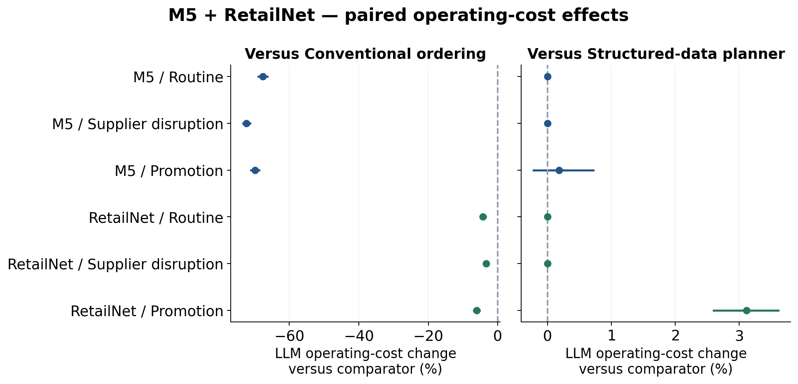

Thirty paired simulation seeds, with two weeks aggregated inside seed; 95% bootstrap intervals. Cost changes are means of paired seed-relative percentages. The structured comparator uses the same numerical tool and current rules, isolating the model-assisted interpretation/routing layer.

### Figure 15. M5 + RetailNet — held decisions

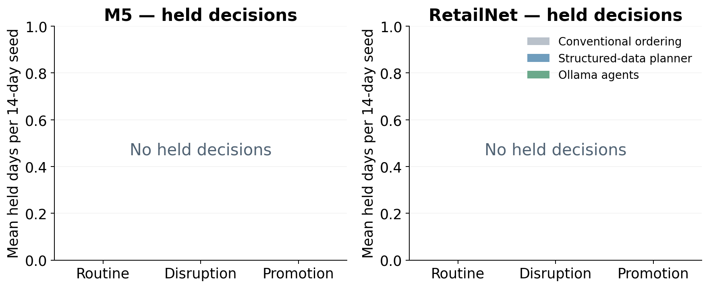

A hold is an unexecuted decision, not a successful zero-order recommendation. The same deterministic budget, capacity, pack and minimum-order checks govern all arms.

## Evidence files

The protocol and frozen source identify the prospective design. The run folders contain supplier messages, current authenticated contracts, three model requests/responses per agent day, proposals, checks, executed quantities, and series-level outcomes. The analysis folder provides run, daily, simulation-seed and paired-effect tables plus the independent audit receipt. The original experiments remain separate.

Dataset source: M5 competition retail sales; Dingdong-Inc/FreshRetailNet-50K at https://huggingface.co/datasets/Dingdong-Inc/FreshRetailNet-50K. Model source: https://huggingface.co/Qwen/Qwen2.5-1.5B-Instruct. The pinned dataset revision, license and file hashes are recorded in the data-preparation receipt.
