# M5 agentic experiment report — PARTIAL

Snapshot generated 2026-10-07T21:25:03+00:00 (UTC). This report uses current results under this checkout; repository examples and dissertation narrative are not treated as outputs of this execution.

Overall execution status: PARTIAL. There are 565 completed current-scope configured runs and 30 recorded LLM calls in those completed runs. A completed deterministic control is not an LLM agent experiment. This is the latest available report; a PARTIAL or BLOCKED report is not a completed experiment.


## Execution status and remaining work

COMPLETE means every configured policy/scenario/seed/origin run has a per-run summary and the configured number of daily rows. PARTIAL means execution has started or some runs are complete. BLOCKED records a stated missing prerequisite. UNRUN means no completed run or startup evidence is available. Completion counts are calculated from artifacts, even when pipeline status is stale; completion does not by itself establish audit validity, statistical power, or model quality. Overall execution completion applies to stages marked required; superseded or archived studies retain their actual artifacts separately. Configured-run completion also does not satisfy unimplemented dissertation requirements.

| Stage | Status | Required | Complete / target | Decision days | Policies | Carrier |
| --- | --- | --- | --- | --- | --- | --- |
| m5_smoke | COMPLETE | yes | 12 / 12 | 4 | B1, D0, D1 | template |
| ml_m5_smoke | COMPLETE | yes | 16 / 16 | 4 | B1, B2, B3, B4 | template |
| baseline_pilot | COMPLETE | yes | 16 / 16 | 7 | B1, B2, B3, B4 | template |
| main_study_stage1 | PARTIAL | no | 20 / 480 | 28 | B1, B2, B3, B4 | template |
| foundation_30series | BLOCKED | yes | 0 / 360 | 28 | B1, B5 | template |
| llm_architectures_ollama | BLOCKED | no | 0 / 18 | 4 | B4, B6, B7, B8, B9, B10 | template |
| llm_prose_reference_30series | PARTIAL | no | 1 / 360 | 28 | B3, B4 | template |
| llm_prose_study_ollama | BLOCKED | yes | 0 / 540 | 28 | B4, B9, B10 | prose |
| llm_prose_study_reference | COMPLETE | no | 120 / 120 | 4 | B3, B4 | template |
| llm_template_architectures_30series | BLOCKED | yes | 0 / 900 | 28 | B6, B7, B8, B9, B10 | template |
| parallel_runner_validation | COMPLETE | no | 8 / 8 | 1 | B1, B2, B3, B4 | template |
| six_hour_agentic_prose | COMPLETE | yes | 8 / 8 | 2 | B3, B4, B9, B10 | prose |
| six_hour_numeric | COMPLETE | yes | 96 / 96 | 7 | B1, B2, B3, B4 | template |
| six_hour_numeric_extension | COMPLETE | yes | 264 / 264 | 7 | B1, B2, B3, B4 | template |
| six_hour_structured_controls | COMPLETE | yes | 4 / 4 | 2 | B3, B4 | template |

main_study_stage1: pipeline-reported status=paused; observed artifact status=PARTIAL. In-progress run directories without complete summaries: 3.

foundation_30series Required stage prerequisite/blocker: Chronos metadata pinned and libraries validated; remaining weight file requires us.aws.cdn.hf.co network route

foundation_30series readiness observation: Pinned Chronos metadata revision has been obtained; it does not attest downloaded model weights or tested foundation inference.

foundation_30series: pipeline-reported status=blocked; observed artifact status=BLOCKED. In-progress run directories without complete summaries: 0.

llm_architectures_ollama Auxiliary stage's historically reported prerequisite: Official model registered; awaiting live development grounding and throughput/storage preflight

llm_architectures_ollama readiness observation: Verified registry download and local registration are attested by ollama_model_identity.json; this alone does not validate functional inference or full-study readiness.

llm_architectures_ollama readiness observation: Configured model digest matches registered identity.

llm_architectures_ollama: pipeline-reported status=blocked; observed artifact status=BLOCKED. In-progress run directories without complete summaries: 0.

llm_prose_reference_30series: pipeline-reported status=paused; observed artifact status=PARTIAL. In-progress run directories without complete summaries: 1.

llm_prose_study_ollama Required stage prerequisite/blocker: Official model registered; awaiting live development grounding and throughput/storage preflight

llm_prose_study_ollama readiness observation: Verified registry download and local registration are attested by ollama_model_identity.json; this alone does not validate functional inference or full-study readiness.

llm_prose_study_ollama readiness observation: Configured model digest matches registered identity.

llm_prose_study_ollama: pipeline-reported status=blocked; observed artifact status=BLOCKED. In-progress run directories without complete summaries: 0.

llm_prose_study_reference: pipeline-reported status=complete; observed artifact status=COMPLETE. In-progress run directories without complete summaries: 0.

llm_template_architectures_30series Required stage prerequisite/blocker: Official model registered; awaiting live development grounding and throughput/storage preflight

llm_template_architectures_30series readiness observation: Verified registry download and local registration are attested by ollama_model_identity.json; this alone does not validate functional inference or full-study readiness.

llm_template_architectures_30series readiness observation: Configured model digest matches registered identity.

llm_template_architectures_30series: pipeline-reported status=planned; observed artifact status=BLOCKED. In-progress run directories without complete summaries: 0.

parallel_runner_validation: pipeline-reported status=complete; observed artifact status=COMPLETE. In-progress run directories without complete summaries: 0.

six_hour_agentic_prose: pipeline-reported status=complete; observed artifact status=COMPLETE. In-progress run directories without complete summaries: 0.

six_hour_numeric: pipeline-reported status=complete; observed artifact status=COMPLETE. In-progress run directories without complete summaries: 0.

six_hour_numeric_extension: pipeline-reported status=complete; observed artifact status=COMPLETE. In-progress run directories without complete summaries: 0.

six_hour_structured_controls: pipeline-reported status=complete; observed artifact status=COMPLETE. In-progress run directories without complete summaries: 0.

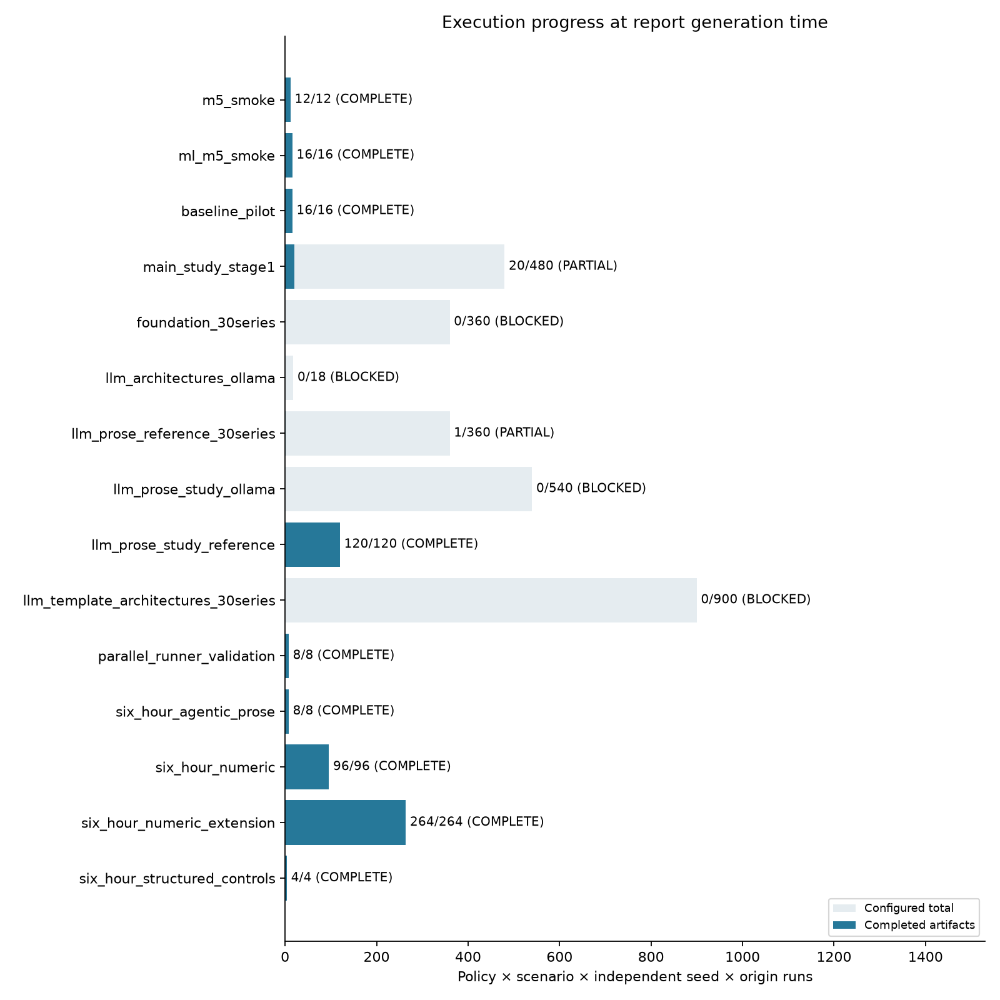

Configured run completion; worker and merged copies of the same run are counted once.


## Model preparation and functional readiness

Recorded local model: ega-llama3.2:3b-cloud30; registered digest: bd9b617abc6c2ec05ebeac915201900320377281168b3949032799cc8f20d51d; parameter size: 3.2B; quantization: Q4_K_M. Source attestation: official Ollama registry verified SHA256 content; locally derived Modelfile cloud30. This establishes the recorded verified download/registration step, not successful end-to-end experimental decisions.

Readiness records below are separate from completed simulation results: model registration, validated structured responses, measured throughput, configuration freeze and a completed study are different milestones. Historical network failures in earlier audit/validation snapshots do not override a later verified identity. Successful preflight calls do not count as completed full-study runs.

recorded preparation source: results/local_model_development_30series_batch1/development_manifest.json


### results/local_model_development_30series_batch1/development_manifest.json readiness snapshot

```yaml
complete: true
created_at_utc: '2026-10-07T20:07:03.144442+00:00'
day: 1700
development_only: true
document_batch_size: 1
full_contract_documents_per_day: 157
grounding: /workspace/MasterDissertation/results/local_model_development_30series_batch1/grounding
llm_error_artifacts: 0
model_revision: bd9b617abc6c2ec05ebeac915201900320377281168b3949032799cc8f20d51d
notes:
- Schema and semantic extraction errors remain errors.
- No model selection or gate retuning is performed on evaluation windows.
- Four actual single-document extraction checks; numerical M5 simulator prerequisites
  validated separately. A full development simulation pilot is optional.
- Grounding and pilot results are descriptive development checks, not full-study outcomes.
pilot_runs: 0
pilot_storage:
- file_count: 6
  path: /workspace/MasterDissertation/results/local_model_development_30series_batch1/grounding
  raw_bytes: 83174
  zip_deflate_bytes: 13074
real_calls:
- artifact: /workspace/MasterDissertation/results/local_model_development_30series_batch1/grounding/artifacts/objects/044ff1ef781694f9a86262619b688016ba5520055b2dacd0a7db7608234d15c1.json
  artifact_bytes: 13294
  completion_tokens: 146
  elapsed_seconds: 79.6629726430001
  finish_reason: stop
  prompt_tokens: 2768
  role: supplier and constraint agent
- artifact: /workspace/MasterDissertation/results/local_model_development_30series_batch1/grounding/artifacts/objects/b6038e718a43863ff9d08557eb4b30b4eed5b2365a24ee5f114fbd00ee2b1465.json
  artifact_bytes: 13280
  completion_tokens: 149
  elapsed_seconds: 87.46915841600003
  finish_reason: stop
  prompt_tokens: 2787
  role: supplier and constraint agent
- artifact: /workspace/MasterDissertation/results/local_model_development_30series_batch1/grounding/artifacts/objects/00f7c00aae35de3651456d4f8362cfb99097241fc186fdf7ef83c77b6d0347a4.json
  artifact_bytes: 13289
  completion_tokens: 149
  elapsed_seconds: 78.77321374599978
  finish_reason: stop
  prompt_tokens: 2763
  role: supplier and constraint agent
- artifact: /workspace/MasterDissertation/results/local_model_development_30series_batch1/grounding/artifacts/objects/22b1043aa03593968c864a9d971fea095773a3ddf14b5d834f7f098d110caec5.json
  artifact_bytes: 13287
  completion_tokens: 146
  elapsed_seconds: 123.14005513200027
  finish_reason: stop
  prompt_tokens: 2782
  role: supplier and constraint agent
series: 30
supervisor_wall_seconds: 372.13735640899995
```

Readiness summary: {"complete": true, "day": 1700, "development_only": true, "model_revision": "bd9b617abc6c2ec05ebeac915201900320377281168b3949032799cc8f20d51d", "pilot_runs": 0, "series": 30}

recorded preparation source: results/logs/ollama_cloud30_functional_readiness.json


### results/logs/ollama_cloud30_functional_readiness.json readiness snapshot

```yaml
elapsed_seconds: 1.1468176409998705
model_revision: bd9b617abc6c2ec05ebeac915201900320377281168b3949032799cc8f20d51d
request:
  max_tokens: 128
  messages:
  - content: Return the integer value 2 in the requested schema.
    role: user
  model: ega-llama3.2:3b-cloud30
  response_format:
    json_schema:
      name: readiness
      schema:
        additionalProperties: false
        properties:
          value:
            type: integer
        required:
        - value
        type: object
      strict: true
    type: json_schema
  temperature: 0
response:
  choices:
  - finish_reason: stop
    index: 0
    message:
      content: '{ "value": 2 }'
      role: assistant
  created: 1791403252
  id: chatcmpl-17
  model: ega-llama3.2:3b-cloud30
  object: chat.completion
  system_fingerprint: fp_ollama
  usage:
    completion_tokens: 8
    prompt_tokens: 36
    prompt_tokens_details:
      cached_tokens: 35
    total_tokens: 44
```

Readiness summary: {"elapsed_seconds": 1.1468176409998705, "model_revision": "bd9b617abc6c2ec05ebeac915201900320377281168b3949032799cc8f20d51d"}

Recorded functional check: requested structured value matched=True; positive actual input/output usage=True; prompt tokens=36; completion tokens=8; elapsed seconds=1.147. This validates this small structured call, not supplier-rule accuracy, inventory performance or full-study throughput.

recorded preparation source: results/logs/six_hour_preflight.json


### results/logs/six_hour_preflight.json readiness snapshot

```yaml
actual_models: []
checked_at_utc: '2026-10-07T20:18:14.224780+00:00'
job_deadline_utc: '2026-10-08T01:31:00+00:00'
mandatory_pending_llm_configs:
- /workspace/MasterDissertation/results/run_configs/six_hour_agentic_prose.yaml
mode: read_only_budget_preflight
pending_frozen_llm_configs:
- /workspace/MasterDissertation/results/run_configs/six_hour_agentic_prose.yaml
- /workspace/MasterDissertation/results/run_configs/six_hour_agentic_template.yaml
planned_concurrency:
  llm_workers: 1
  numeric_workers: 1
remaining_job_seconds: 18765.775064468384
report_deadline_utc: '2026-10-08T02:01:00+00:00'
resources:
  checked_at_utc: '2026-10-07T20:18:14.224920+00:00'
  cpu_quota_cores: 4.0
  disk_free_bytes: 24309067776
  disk_total_bytes: 33770192896
  memory_limit_bytes: 34359738368
  visible_cpus: 5
stages:
- category: numeric
  config_sha256: d56fedc68e3e4a1ebdf4fc8d2db576149ab28dbf5602a9affa49908ab647e91b
  days: 7
  document_carrier: template
  expected_decisions: 672
  expected_runs: 96
  model: null
  model_revision: null
  name: six_hour_numeric
  origins: 1
  output: /workspace/MasterDissertation/results/six_hour_numeric
  path: /workspace/MasterDissertation/results/run_configs/six_hour_numeric.yaml
  policies:
  - B1
  - B2
  - B3
  - B4
  scenarios:
  - normal
  - derived_field_collapse
  - feed_gap
  seeds:
  - 0
  - 1
  - 2
  - 3
  - 4
  - 5
  - 6
  - 7
  series: 30
  solver:
    allow_transfers: true
    budget: 3000.0
    cvar_alpha: 0.95
    holding_rate: 0.015
    horizon: 7
    max_order_units: 1000
    mip_gap: 0.001
    risk_weight: 0.1
    scenarios: 4
    shortage_multiplier: 5.0
    storage_per_location: 10000.0
    time_limit: 5.0
    transfer_cost: 0.3
    transfer_lead: 1
study_launches: 0
```

This readiness snapshot records agentic configs awaiting freeze/registration: /workspace/MasterDissertation/results/run_configs/six_hour_agentic_prose.yaml, /workspace/MasterDissertation/results/run_configs/six_hour_agentic_template.yaml. Registered stage configs and actual run artifacts take precedence if this preparation snapshot later becomes stale.

recorded preparation source: results/run_configs/local_model_resource_preflight.json


### results/run_configs/local_model_resource_preflight.json readiness snapshot

```yaml
blockers:
- Projected artifact storage plus reserve exceeds current free disk
estimates:
  llm_prose_study_ollama:
    decisions: 15120
    model_seconds_at_measured_mean: 148799105.25459847
    model_seconds_at_measured_p95: 198600280.91689003
    successful_path_call_upper_estimate: 1612800
  llm_template_architectures_30series:
    decisions: 25200
    model_seconds_at_measured_mean: 370137774.3208137
    model_seconds_at_measured_p95: 494018198.780764
    successful_path_call_upper_estimate: 4011840
limitations:
- Development sample is not an evaluation result.
- Successful-path estimate assumes every source rule is grounded; observed validation
  holds may shorten runs.
- Model-only time excludes forecast training, optimization, report generation, scheduling
  contention and retries.
- Compression samples are estimates; live disk reserve is enforced independently.
- No human study, LLM-only numeric comparator, or severity sweep has been implemented.
measured_at_utc: '2026-10-07T20:07:05.259195+00:00'
measurement:
  max_actual_zip_deflate_sample_ratio: 0.15718854449707842
  mean_call_seconds: 92.26134998425005
  mean_request_artifact_bytes: 13287.5
  p95_call_seconds: 123.14005513200027
  real_call_records: 4
model_revision: bd9b617abc6c2ec05ebeac915201900320377281168b3949032799cc8f20d51d
outstanding_numeric_storage:
  llm_prose_reference_30series:
    estimated_additional_packed_bytes: 1910056987
    existing_unpacked_bytes_already_in_disk_usage: 0
    packed_bytes_per_run_budget: 5320493
    remaining_runs: 359
  main_study_stage1:
    estimated_additional_packed_bytes: 1929379840
    existing_unpacked_bytes_already_in_disk_usage: 0
    packed_bytes_per_run_budget: 4194304
    remaining_runs: 460
passed: false
projected_additional_numeric_packed_bytes: 3839436827
projected_packed_artifact_bytes_with_margin: 26432693447.062786
projected_raw_artifact_bytes: 112106106000.0
required_disk_reserve_bytes: 2147483648
resources:
  checked_at_utc: '2026-10-07T20:07:04.762138+00:00'
  cpu_quota_cores: 4.0
  disk_free_bytes: 25694674944
  disk_total_bytes: 33770192896
  memory_limit_bytes: 34359738368
  visible_cpus: 5
successful_path_calls_total: 5624640
successful_path_model_only_days_at_mean: 6006.213883974678
successful_path_model_only_days_at_p95: 8016.417589093217
verified_artifact_packer_available: true
```

Readiness summary: {"model_revision": "bd9b617abc6c2ec05ebeac915201900320377281168b3949032799cc8f20d51d"}

Measured resource preflight: passed=False; blockers=['Projected artifact storage plus reserve exceeds current free disk']. Measurements: {"max_actual_zip_deflate_sample_ratio": 0.15718854449707842, "mean_call_seconds": 92.26134998425005, "mean_request_artifact_bytes": 13287.5, "p95_call_seconds": 123.14005513200027, "real_call_records": 4}. Successful-path model-only projection at mean=6,006.214 days, at p95=8,016.418 days. These are development-sample planning estimates, not elapsed full-experiment results; they exclude additional training, optimization, scheduling, retries and reports.

recorded preparation source: results/run_configs/local_model_resource_preflight_incremental.json


### results/run_configs/local_model_resource_preflight_incremental.json readiness snapshot

```yaml
actual_development_responses: 2
actual_model_revision: bd9b617abc6c2ec05ebeac915201900320377281168b3949032799cc8f20d51d
coarse_same_latency_projection_days: 1234.2710448305966
first_extraction_actual_usage:
  completion_tokens: 152
  prompt_tokens: 4812
  prompt_tokens_details:
    cached_tokens: 15
  total_tokens: 4964
first_extraction_request_seconds: 243.20611720799934
incremental: true
limitations:
- A single extraction request is not a representative latency estimate for all roles,
  memory lengths, cache effects, validation failures and retries.
- The coarse same-latency multiplication is a scale illustration, not a completion
  forecast.
- Full inference cannot be called feasible based on an installed model or a trivial
  response.
- No full-study LLM evaluation has started; CPU/GPU/provider choice and common serving
  batch remain development decisions.
measured_at_utc: '2026-10-07T19:52:41.771621+00:00'
resources:
  checked_at_utc: '2026-10-07T19:52:41.771889+00:00'
  cpu_quota_cores: 4.0
  disk_free_bytes: 25670205440
  disk_total_bytes: 33770192896
  memory_limit_bytes: 34359738368
  visible_cpus: 5
stage_counts:
  llm_prose_study_ollama:
    batch_size: 16
    days: 28
    runs: 540
    successful_path_requests_before_retries: 131040
  llm_template_architectures_30series:
    batch_size: 16
    days: 28
    runs: 900
    successful_path_requests_before_retries: 307440
successful_path_request_count_before_retries: 438480
```

Incremental resource evidence: 2 actual development responses; first extraction request=243.206 seconds; planned successful-path requests before retries=438,480. The recorded same-latency multiplication is 1,234.271 days. This is a scale illustration from an initial request, not a representative completion forecast or an executed study duration.

Incremental estimate limit: A single extraction request is not a representative latency estimate for all roles, memory lengths, cache effects, validation failures and retries.

Incremental estimate limit: The coarse same-latency multiplication is a scale illustration, not a completion forecast.

Incremental estimate limit: Full inference cannot be called feasible based on an installed model or a trivial response.

Incremental estimate limit: No full-study LLM evaluation has started; CPU/GPU/provider choice and common serving batch remain development decisions.

recorded preparation source: results/run_configs/six_hour_runtime_preflight.json


### results/run_configs/six_hour_runtime_preflight.json readiness snapshot

```yaml
actual_models:
- actual_digest: 14bdd46019879e18cd27f21b46e2c377bf801e827e2abb46be2daedcedaf0f64
  details:
    context_length: 32768
    embedding_length: 1536
    families:
    - qwen2
    family: qwen2
    format: gguf
    parameter_size: 1.5B
    parent_model: qwen2.5:1.5b
    quantization_level: Q4_K_M
    runner: llamacpp
  name: ega-qwen2.5:1.5b-sixhour
  parameters: 'num_thread                     3

    num_ctx                        16384'
  size_bytes: 986061553
checked_at_utc: '2026-10-07T20:18:15.338188+00:00'
job_deadline_utc: '2026-10-08T01:31:00+00:00'
mandatory_pending_llm_configs: []
mode: read_only_budget_preflight
pending_frozen_llm_configs:
- /workspace/MasterDissertation/results/run_configs/six_hour_agentic_template.yaml
planned_concurrency:
  llm_workers: 1
  numeric_workers: 1
remaining_job_seconds: 18764.661690473557
report_deadline_utc: '2026-10-08T02:01:00+00:00'
resources:
  checked_at_utc: '2026-10-07T20:18:15.338296+00:00'
  cpu_quota_cores: 4.0
  disk_free_bytes: 24309059584
  disk_total_bytes: 33770192896
  memory_limit_bytes: 34359738368
  visible_cpus: 5
stages:
- category: numeric
  config_sha256: d56fedc68e3e4a1ebdf4fc8d2db576149ab28dbf5602a9affa49908ab647e91b
  days: 7
  document_carrier: template
  expected_decisions: 672
  expected_runs: 96
  model: null
  model_revision: null
  name: six_hour_numeric
  origins: 1
  output: /workspace/MasterDissertation/results/six_hour_numeric
  path: /workspace/MasterDissertation/results/run_configs/six_hour_numeric.yaml
  policies:
  - B1
  - B2
  - B3
  - B4
  scenarios:
  - normal
  - derived_field_collapse
  - feed_gap
  seeds:
  - 0
  - 1
  - 2
  - 3
  - 4
  - 5
  - 6
  - 7
  series: 30
  solver:
    allow_transfers: true
    budget: 3000.0
    cvar_alpha: 0.95
    holding_rate: 0.015
    horizon: 7
    max_order_units: 1000
    mip_gap: 0.001
    risk_weight: 0.1
    scenarios: 4
    shortage_multiplier: 5.0
    storage_per_location: 10000.0
    time_limit: 5.0
    transfer_cost: 0.3
    transfer_lead: 1
- category: llm
  config_sha256: 4b70312c0f8aaec3bb29b185e612c356d0e18ddcaf07f3018ae76b738e2a0a78
  days: 2
  document_carrier: prose
  expected_decisions: 16
  expected_runs: 8
  model: ega-qwen2.5:1.5b-sixhour
  model_revision: 14bdd46019879e18cd27f21b46e2c377bf801e827e2abb46be2daedcedaf0f64
  name: six_hour_agentic_prose
  origins: 1
  output: /workspace/MasterDissertation/results/six_hour_agentic_prose
  path: /workspace/MasterDissertation/results/run_configs/six_hour_agentic_prose.yaml
  policies:
  - B3
  - B4
  - B9
  - B10
  scenarios:
  - normal
  - derived_field_collapse
  seeds:
  - 0
  series: 30
  solver:
    allow_transfers: true
    budget: 3000.0
    cvar_alpha: 0.95
    holding_rate: 0.015
    horizon: 7
    max_order_units: 1000
    mip_gap: 0.001
    risk_weight: 0.1
    scenarios: 4
    shortage_multiplier: 5.0
    storage_per_location: 10000.0
    time_limit: 5.0
    transfer_cost: 0.3
    transfer_lead: 1
study_launches: 0
```

This readiness snapshot records agentic configs awaiting freeze/registration: /workspace/MasterDissertation/results/run_configs/six_hour_agentic_template.yaml. Registered stage configs and actual run artifacts take precedence if this preparation snapshot later becomes stale.

recorded preparation source: results/run_configs/six_hour_supervisor_status.json


### results/run_configs/six_hour_supervisor_status.json readiness snapshot

```yaml
active_stage: six_hour_agentic_prose
actual_model:
- actual_digest: 14bdd46019879e18cd27f21b46e2c377bf801e827e2abb46be2daedcedaf0f64
  details:
    context_length: 32768
    embedding_length: 1536
    families:
    - qwen2
    family: qwen2
    format: gguf
    parameter_size: 1.5B
    parent_model: qwen2.5:1.5b
    quantization_level: Q4_K_M
    runner: llamacpp
  name: ega-qwen2.5:1.5b-sixhour
  parameters: 'num_thread                     3

    num_ctx                        16384'
  size_bytes: 986061553
epoch: da1b4485b91b475b88558ae1cf5113be
failed_or_interrupted_stages: []
job_deadline_utc: '2026-10-08T01:31:00+00:00'
note: Final report must disclose reduced design, actual coverage, failures and unexecuted
  scope.
owned_jobs: []
pending_frozen_llm_configs:
- /workspace/MasterDissertation/results/run_configs/six_hour_agentic_template.yaml
phase: all_supplied_studies_complete
pid: 10213
report_deadline_utc: '2026-10-08T02:01:00+00:00'
report_refresh:
  at_utc: '2026-10-07T20:56:49.458804+00:00'
  returncode: 0
returncode: 0
stage: six_hour_agentic_prose
stage_names:
- six_hour_numeric
- six_hour_agentic_prose
started_at_utc: '2026-10-07T20:18:15.340034+00:00'
stop_reason: all_supplied_stage_processes_finished
updated_at_utc: '2026-10-07T20:56:49.458868+00:00'
```

Readiness summary: {"phase": "all_supplied_studies_complete", "updated_at_utc": "2026-10-07T20:56:49.458868+00:00"}

This readiness snapshot records agentic configs awaiting freeze/registration: /workspace/MasterDissertation/results/run_configs/six_hour_agentic_template.yaml. Registered stage configs and actual run artifacts take precedence if this preparation snapshot later becomes stale.

recorded preparation source: results/run_configs/supervisor_status.json


### results/run_configs/supervisor_status.json readiness snapshot

```yaml
blocker: Projected artifact storage plus reserve exceeds current free disk; detailed
  truthful estimates saved in local_model_resource_preflight.json
command_name: python
epoch: 16b457ea9bf440b5b0707f79db93cc0f
functional_usage:
  completion_tokens: 8
  prompt_tokens: 36
  prompt_tokens_details:
    cached_tokens: 35
  total_tokens: 44
model_name: ega-llama3.2:3b-cloud30
model_only_projected_days: 6006.213883974678
model_parameters: 'num_thread                     2

  stop                           "<|start_header_id|>"

  stop                           "<|end_header_id|>"

  stop                           "<|eot_id|>"

  num_ctx                        32768'
model_revision: bd9b617abc6c2ec05ebeac915201900320377281168b3949032799cc8f20d51d
note: 30 M5 series in every actual request; paired single-document template/prose
  grounding on development day 1700 before all holdout/evaluation windows
ollama_version: 0.40.0
owned_job_log: /workspace/MasterDissertation/results/logs/local_model_development_30series_batch1.log
owned_job_pid: null
phase: blocked
pid: 9036
preflight_passed: false
projected_packed_bytes: 26432693447.062786
report_refresh:
  returncode: 0
  updated_at_utc: '2026-10-07T20:07:08.032824+00:00'
resource_preflight: /workspace/MasterDissertation/results/run_configs/local_model_resource_preflight.json
reused_existing_server: true
updated_at_utc: '2026-10-07T20:07:08.033226+00:00'
```

Readiness summary: {"blocker": "Projected artifact storage plus reserve exceeds current free disk; detailed truthful estimates saved in local_model_resource_preflight.json", "functional_usage": {"completion_tokens": 8, "prompt_tokens": 36, "prompt_tokens_details": {"cached_tokens": 35}, "total_tokens": 44}, "model_name": "ega-llama3.2:3b-cloud30", "model_revision": "bd9b617abc6c2ec05ebeac915201900320377281168b3949032799cc8f20d51d", "phase": "blocked", "preflight_passed": false, "updated_at_utc": "2026-10-07T20:07:08.033226+00:00"}

Recorded foundation metadata: amazon/chronos-t5-tiny at revision 29d808298f1a62493e7b9a5e08529d0d930fa189. Metadata retrieval is not evidence that the model.safetensors download or inference succeeded.


## Controlled grounding benchmarks — actual current artifacts

Incremental and final snapshots from the same development folder can describe the same responses. They are shown as recorded snapshots and are not pooled or counted as independent replications. Retained development configurations with different batch sizes also remain separate from frozen evaluation studies.

Source: results/grounding_templates/grounding_results.json; evidence role=recorded grounding; reader mode=deterministic_template; model=not recorded; model revision=not recorded; development_only=False; incremental=False; complete=not recorded; total LLM calls=0; errors=0; tokens=0. Controlled carrier benchmark, not a validated natural-language dataset. No expected labels are sent to the model.

| Case / carrier | Whole set exact | Tuple precision | Tuple recall | False / omitted | Errors eligible for solver | Escalated |
| --- | --- | --- | --- | --- | --- | --- |
| normal / deterministic_template | True | 1.000 | 1.000 | 0 / 0 | 0 | False |
| aggregate_moq / deterministic_template | True | 1.000 | 1.000 | 0 / 0 | 0 | False |
| foreign_unit_moq / deterministic_template | True | 1.000 | 1.000 | 0 / 0 | 0 | False |
| pack_change / deterministic_template | True | 1.000 | 1.000 | 0 / 0 | 0 | False |
| capacity_cut / deterministic_template | True | 1.000 | 1.000 | 0 / 0 | 0 | False |
| eligibility_change / deterministic_template | True | 1.000 | 1.000 | 0 / 0 | 0 | False |

Source: results/local_model_development_30series_batch1/grounding/grounding_results.json; evidence role=recorded grounding; reader mode=local LLM development sample; model=not recorded; model revision=bd9b617abc6c2ec05ebeac915201900320377281168b3949032799cc8f20d51d; development_only=True; incremental=False; complete=not recorded; total LLM calls=4; errors=0; tokens=11690. Field-complete controlled carriers; this sample is not a natural-language production benchmark.

| Case / carrier | Whole set exact | Tuple precision | Tuple recall | False / omitted | Errors eligible for solver | Escalated |
| --- | --- | --- | --- | --- | --- | --- |
| development batch / template | False | — | — | 1 / 1 | — | — |
| development batch / template | False | — | — | 1 / 1 | — | — |
| development batch / prose | False | — | — | 1 / 1 | — | — |
| development batch / prose | False | — | — | 1 / 1 | — | — |

Source: results/local_model_development_30series_batch16/grounding/grounding_results.json; evidence role=recorded grounding; reader mode=local LLM development sample; model=not recorded; model revision=bd9b617abc6c2ec05ebeac915201900320377281168b3949032799cc8f20d51d; development_only=True; incremental=False; complete=not recorded; total LLM calls=2; errors=0; tokens=9659. Field-complete controlled carriers; this sample is not a natural-language production benchmark.

| Case / carrier | Whole set exact | Tuple precision | Tuple recall | False / omitted | Errors eligible for solver | Escalated |
| --- | --- | --- | --- | --- | --- | --- |
| development batch / template | False | — | — | 0 / 14 | — | — |
| development batch / prose | False | — | — | 1 / 15 | — | — |

Source: results/local_model_development_30series_batch16/grounding/incremental_grounding_results.json; evidence role=recorded grounding; reader mode=local LLM development sample; model=not recorded; model revision=bd9b617abc6c2ec05ebeac915201900320377281168b3949032799cc8f20d51d; development_only=True; incremental=True; complete=False; total LLM calls=not recorded; errors=not recorded; tokens=not recorded. Labels are compared by evaluator only; they were not provided to the model. Schema validity does not establish grounding correctness.

| Case / carrier | Whole set exact | Tuple precision | Tuple recall | False / omitted | Errors eligible for solver | Escalated |
| --- | --- | --- | --- | --- | --- | --- |
| development batch / template | False | 1.000 | 0.067 | 0 / 14 | — | — |
| development batch / prose | False | 0.000 | 0.000 | 1 / 15 | — | — |

| Carrier | Source docs | Constraints returned | Schema valid / finish | Input / output tokens | Seconds |
| --- | --- | --- | --- | --- | --- |
| template | 15 | 1 | True / stop | 4812 / 152 | 243.206 |
| prose | 15 | 1 | True / stop | 4588 / 107 | 201.623 |

Schema-valid responses can still omit or misground rules. Missing residual-error/escalation fields remain unmeasured rather than zero. Development samples do not establish a favorable LLM effect or confirmatory full-study performance.

The measured development samples above contain actual extraction failures: whole-set mismatches, omissions or false constraints remain errors despite valid JSON and a normal finish reason.

Source: results/six_hour_development_grounding/grounding_results.json; evidence role=recorded grounding; reader mode=real_llm; model=ega-qwen2.5:0.5b-sixhour; model revision=21539788ff12776c3460262e890e2d77f98d99e5ce24a1726a9582a31be23e44; development_only=True; incremental=False; complete=True; total LLM calls=4; errors=4; tokens=15686. Four controlled development cases with all 30 entities; not evaluation or general natural-language accuracy.

| Case / carrier | Whole set exact | Tuple precision | Tuple recall | False / omitted | Errors eligible for solver | Escalated |
| --- | --- | --- | --- | --- | --- | --- |
| development batch / template | False | — | — | — / — | — | — |
| development batch / template | False | — | — | — / — | — | — |
| development batch / prose | False | — | — | — / — | — | — |
| development batch / prose | False | — | — | — / — | — | — |

| Case / carrier / batch | Exact / false / omitted rules | Calls | Seconds | Request result |
| --- | --- | --- | --- | --- |
| 1 / template / 1 | 0 / unmeasured / 1 | 1 | 35.684 | request failed |
| 2 / template / 1 | 0 / unmeasured / 1 | 1 | 36.045 | request failed |
| 3 / prose / 1 | 0 / unmeasured / 1 | 1 | 32.902 | request failed |
| 4 / prose / 1 | 0 / unmeasured / 1 | 1 | 31.013 | request failed |

Development case 1 request error: LLM request failed after 1 attempts: Truncated model output; increase max_tokens or reduce batch size

Development case 2 request error: LLM request failed after 1 attempts: Truncated model output; increase max_tokens or reduce batch size

Development case 3 request error: LLM request failed after 1 attempts: Truncated model output; increase max_tokens or reduce batch size

Development case 4 request error: LLM request failed after 1 attempts: Truncated model output; increase max_tokens or reduce batch size

These exact-rule counts and durations come from the recorded development cases. Failed requests can have recorded omissions without a validated returned-rule set; missing false-rule/precision fields remain unmeasured. Serving-model selection uses these development samples, which are excluded from inventory-policy comparisons.

Source: results/six_hour_qwen15_development/grounding_results.json; evidence role=recorded grounding; reader mode=real_llm; model=ega-qwen2.5:1.5b-sixhour; model revision=14bdd46019879e18cd27f21b46e2c377bf801e827e2abb46be2daedcedaf0f64; development_only=True; incremental=False; complete=True; total LLM calls=4; errors=0; tokens=14152. Four controlled development cases; serving batch selection only. Expected labels are excluded from all requests.

| Case / carrier | Whole set exact | Tuple precision | Tuple recall | False / omitted | Errors eligible for solver | Escalated |
| --- | --- | --- | --- | --- | --- | --- |
| development batch / template | False | — | — | — / — | — | — |
| development batch / prose | False | — | — | — / — | — | — |
| development batch / template | False | — | — | — / — | — | — |
| development batch / prose | False | — | — | — / — | — | — |

| Case / carrier / batch | Exact / false / omitted rules | Calls | Seconds | Request result |
| --- | --- | --- | --- | --- |
| 1 / template / 1 | 0 / 1 / 1 | 1 | 34.768 | response received; see exact-rule counts |
| 2 / prose / 1 | 0 / 1 / 1 | 1 | 30.906 | response received; see exact-rule counts |
| 3 / template / 4 | 0 / 4 / 4 | 1 | 55.303 | response received; see exact-rule counts |
| 4 / prose / 4 | 3 / 1 / 1 | 1 | 52.360 | response received; see exact-rule counts |

These exact-rule counts and durations come from the recorded development cases. Failed requests can have recorded omissions without a validated returned-rule set; missing false-rule/precision fields remain unmeasured. Serving-model selection uses these development samples, which are excluded from inventory-policy comparisons.

Source: results/six_hour_qwen15_documented_format_development/grounding_results.json; evidence role=recorded grounding; reader mode=real_llm; model=ega-qwen2.5:1.5b-sixhour; model revision=14bdd46019879e18cd27f21b46e2c377bf801e827e2abb46be2daedcedaf0f64; development_only=True; incremental=False; complete=True; total LLM calls=2; errors=0; tokens=8655. Four controlled development cases; serving batch selection only. Expected labels are excluded from all requests.

| Case / carrier | Whole set exact | Tuple precision | Tuple recall | False / omitted | Errors eligible for solver | Escalated |
| --- | --- | --- | --- | --- | --- | --- |
| development batch / template | False | — | — | — / — | — | — |
| development batch / prose | False | — | — | — / — | — | — |

| Case / carrier / batch | Exact / false / omitted rules | Calls | Seconds | Request result |
| --- | --- | --- | --- | --- |
| 1 / template / 4 | 0 / 4 / 4 | 1 | 63.954 | response received; see exact-rule counts |
| 2 / prose / 4 | 0 / 4 / 4 | 1 | 57.787 | response received; see exact-rule counts |

These exact-rule counts and durations come from the recorded development cases. Failed requests can have recorded omissions without a validated returned-rule set; missing false-rule/precision fields remain unmeasured. Serving-model selection uses these development samples, which are excluded from inventory-policy comparisons.

Deterministic-template results measure the parser control. Controlled LLM corpus results measure that recorded carrier/case set; neither is a validated natural-language supplier population or evidence that pending M5 studies finished.


## Data, design and interpretation limits

M5 supplies historical observed sales, calendar and prices. Sales are used as an exogenous demand proxy and may be censored by historical stockouts; latent demand is not recovered. Inventory, replenishment, supplier documents, lead times, capacity, approval, faults and operational constraints are simulated. Simulated run costs and harm outcomes are not measured retailer operations.

The prepared data are selected panels, not all 30,490 bottom-level M5 series or the official competition evaluation. Fault rates are synthetic and uncalibrated unless a configuration explicitly records calibration. Simulated delayed oracle approval is a reviewer model, not a human audit study. Findings are conditional on this panel, window, solver, forecast training, fault definitions and approval model.

| Prepared panel | Series | Historical days | Selection | Synthetic sales? |
| --- | --- | --- | --- | --- |
| data/processed/m5 | 30 | 1941 | {"items": ["FOODS_1_001", "FOODS_2_001", "FOODS_3_001"], "stores": "all"} | False |
| data/processed/m5_item1 | 10 | 1941 | {"items": ["FOODS_1_001"], "stores": "all"} | False |
| data/processed/m5_smoke | 2 | 1941 | {"items": ["FOODS_1_001"], "stores": ["CA_1", "CA_2"]} | False |

The main stage-1 design requires 480 runs: four deterministic policies × four fault scenarios × thirty independent seeds × one origin. It uses 28 decision days per run. The shortened study has its own registered seed count and horizon. Other stages retain their own panel, carrier and horizon; their cost totals must not be pooled as interchangeable replications. The remaining scenarios and any policies absent from registered configs are unrun in this report.

| Policy | Actual architecture |
| --- | --- |
| B1 | Deterministic seasonal-naive forecast + order-up-to control |
| B10 | Typed LLM roles + critic + per-decision evidence gate |
| B2 | Trained LightGBM quantile forecast + (s,S) control |
| B3 | Trained native GRU/negative-binomial forecast + stochastic MILP |
| B4 | B3 + deterministic evidence gate; no LLM |
| B5 | Chronos forecast adapter; requires separate weights |
| B6 | Single generalist LLM + shared numerical tools |
| B7 | LLM roles with free-form shared messages + validated action boundary |
| B8 | Typed LLM roles without critic |
| B9 | Typed LLM roles + critic, fixed autonomy |
| D0 | Deterministic seasonal-forecast optimizer software control; no LLM |
| D1 | D0 + deterministic evidence gate software control; no LLM |

The native deep model is a trained GRU with a negative-binomial likelihood, not an exact DeepAR or TFT reproduction. LLM roles share deterministic numerical tools and schema validation. LLM calls, errors and explicit fallback decisions are reported separately; a held decision or deterministic fallback does not prove successful semantic reasoning. A seasonal forecast override changes the baseline and must be read in that stage's config.


## Alignment with the user's revised dissertation

Reference document: dissertation_revised_business_school.html. Uploaded-file SHA-256: 8ae699667fa02f932f4c2584af0a3895021dc925e3119412bb06b238dc87de1c. Extracted-text SHA-256: fcd4e9939c99143dac478947209a6fcdac759ec3f0b8534d9d155b417511fd91. The document supplies the research specification and expected managerial discussion; its expected findings are not results of this execution.

The user requested the complete experiment and accepted all thirty prepared item-store series for the B9/B10 agent comparison and matched references. A previous ten-series reference or two-series connectivity pilot is a distinct panel, not evidence that the thirty-series comparison has finished. Each stage below must retain its own actual dataset manifest, matched seeds, origins, decision horizon and model digest. This thirty-series panel is still a subset of full M5.


## Exact revised research questions and evidence coverage

RQ1 — Performance. How does the proposed system compare with classical and forecast-plus-optimizer baselines on total cost, service, stockouts, and bullwhip amplification when the data state is clean?

Current evidence scope — PARTIAL: Current summaries and forecast holdouts support descriptive cost/service, stockout and bullwhip measurement for the completed controls. Full matched agent-versus-baseline performance remains conditional on completed stage grids.

Implementation audit's required contrast: Clean-state cost/service/stockouts/bullwhip across classical, forecast+optimizer, and agentic policies

Implementation audit snapshot status: partial until foundation weights and real model run. This describes implementation/design coverage at audit time, not an empirical hypothesis verdict; live execution is reported separately.

Remaining implementation or design gap: No LLM-only comparator, no TFT/Moirai, subset-aware forecast scores only.

RQ2 — Evidence quality. When the observed state is degraded, does evidence-gated autonomy reduce harmful executed orders relative to systems that continue operating with fixed autonomy?

Current evidence scope — PARTIAL: Harm, true-constraint violation, reference-deviation and hold counts are available for completed simulations. They do not yet establish an agent gate effect over the complete revised design; direct B10-B9 analysis waits for a full matched grid.

Implementation audit's required contrast: Fixed vs gated autonomy with corrupted observations

Implementation audit snapshot status: implementable gate effect; semantic component partial. This describes implementation/design coverage at audit time, not an empirical hypothesis verdict; live execution is reported separately.

Remaining implementation or design gap: LLM triage records hypotheses but cannot repair state or clear hard failures. Current checks catch the programmed failures; no implemented ambiguous-reconciliation intervention demonstrates semantic repair benefit. Reference deviations and true violations must be reported separately.

RQ3 — Constraint grounding. How accurately can the system translate realistic replenishment constraints—such as pack sizes, supplier minimums, unit conversions, and assortment eligibility—into typed, verifiable rules?

Current evidence scope — PARTIAL: Live extraction and controlled grounding evaluations are required for exact typed-rule accuracy and errors reaching the solver. A model call count alone is not a grounding-accuracy result; template parser controls do not measure an LLM's semantic contribution.

Implementation audit's required contrast: Typed grounding of local/coupled/unit-conversion/validity rules

Implementation audit snapshot status: controlled grounding implementable. This describes implementation/design coverage at audit time, not an empirical hypothesis verdict; live execution is reported separately.

Remaining implementation or design gap: Supplied six cases are explicit synthetic rules, not a realistic supplier/workbook or multilingual benchmark. Generic XLSX semantics and ambiguous external-document corpus are absent. Prose verification can accept a plausible incorrect value; schema/citation validity is not semantic entailment. Built-in scorer gives exact tuples, not separate per-field accuracy; derive per-field counts from saved extraction artifacts.

RQ4 — Architecture. What value is added by specialist roles, typed shared state, critic review, and memory, and what coordination cost do these mechanisms introduce?

Current evidence scope — PARTIAL: Role, free-form/typed, critic and memory ablations must retain matched tools, panels and autonomy settings. Coordination tokens, calls and latency can be measured after execution. An empty/unapproved memory store cannot establish a memory benefit.

Implementation audit's required contrast: Specialization, typed state, critic, memory and coordination costs

Implementation audit snapshot status: architectures implementable; substantive memory experiment absent. This describes implementation/design coverage at audit time, not an empirical hypothesis verdict; live execution is reported separately.

Remaining implementation or design gap: No automatic approved incident-memory writes occur in normal runs, so toggling use_memory with empty memory is a null ablation. Learned/vector memory absent.

RQ5 — Reliability. How often does the system violate hard constraints, fail to use tools correctly, or produce materially different outcomes across equivalent runs?

Current evidence scope — PARTIAL: Completed-run logs record violations, LLM/schema errors and fallback decisions. Equivalent-input repetitions, tool-validity analysis and reliability over every planned class remain separate checks; sample safety is not universal reliability.

Implementation audit's required contrast: Valid hard constraints/tools and outcome variability across equivalent runs

Implementation audit snapshot status: partially implementable. This describes implementation/design coverage at audit time, not an empirical hypothesis verdict; live execution is reported separately.

Remaining implementation or design gap: Model temperature zero/provider may ignore seeds; constant-demand variance-ratio bullwhip is undefined. Native model training seed is fixed42; simulation seeds quantify conditional variability, not independent forecast retraining. Tail regret vs an economically optimal trajectory absent.

RQ6 — Trace faithfulness. Can the decision trace be replayed and tested so that the stated evidence genuinely corresponds to the action taken?

Current evidence scope — PARTIAL: Stored sample replay and trace audit provide technical artifact evidence for their selected decisions. They do not establish causal sensitivity of every cited field, superiority over free-form rationales, or faithfulness of pending agent runs.

Implementation audit's required contrast: Replay and externally logged causal evidence validation

Implementation audit snapshot status: external audit implementable; semantic faithfulness partial. This describes implementation/design coverage at audit time, not an empirical hypothesis verdict; live execution is reported separately.

Remaining implementation or design gap: Replay reuses stored forecasts and constraints and does not re-call model or retrain. Required-artifact deletion is structural, not semantic context deletion. Narrative contradiction/rationale-to-evidence faithfulness and equivalent-prompt robustness are not supplied. B7 also produces the common structured trace. Nonbinding counterfactual factors need not change actions.

RQ7 — Human audit. Does a structured trace with lineage help reviewers detect poor decisions more quickly and with better calibrated trust than a free-form explanation?

Current evidence scope — UNRUN: No participant review-time, accuracy, trust-calibration or workload measurements are present in this automated report. Simulator approval and technical trace audit cannot answer a human-audit question.

Implementation audit's required contrast: Human audit speed/accuracy and calibrated trust

Implementation audit snapshot status: requires approved real human study. This describes implementation/design coverage at audit time, not an empirical hypothesis verdict; live execution is reported separately.

Remaining implementation or design gap: No recruitment, consent, participants or outcomes supplied. Narrative arm is deterministic summary, not an LLM rationale. Current no-lineage arm also hides state certificate, so effect confounds certificate visibility with lineage. Incorrect-constraint and poor-forecast cases need expert-vetted labels. Participant mixed-effects/power analysis absent.


## Exact revised hypotheses and evidence coverage

H1. A tool-grounded multi-agent system will outperform an LLM-only policy on operating cost and reliability, while remaining close to a well-specified stochastic optimizer when the data are clean.

Current evidence scope — UNIMPLEMENTED: There is no LLM-only numerical-action policy: B6 and the multi-agent variants share deterministic tools. The first clause is untestable in the current artifact. Matched optimizer comparison can address part of the clean-state clause, without a predefined equivalence margin proving closeness.

Implementation audit's required contrast: Tool-grounded multi-agent vs LLM-only; B10 vs well-specified stochastic optimizer under clean evidence

Implementation audit snapshot status: partial; LLM-only comparator absent. This describes implementation/design coverage at audit time, not an empirical hypothesis verdict; live execution is reported separately.

Remaining implementation or design gap: B6 uses the same deterministic numerical tools and is not LLM-only. No claim about tool-grounded superiority over LLM-only is testable. B3 is native GRU/NB, not an exact DeepAR or TFT reproduction.

H2. Independent critic checks will reduce hard-constraint violations and high-cost tail events, but will increase latency and computational cost.

Current evidence scope — PARTIAL: The matched B8/B10 critic ablation can measure critic effects only after it executes; B9/B10 primarily isolates autonomy, not critic presence. Tail risk, violations, latency and compute must be reported together.

Implementation audit's required contrast: B10 minus B8: independent critic, with typed exchange and evidence gate matched

Implementation audit snapshot status: implementable with real model; unrun at required coverage. This describes implementation/design coverage at audit time, not an empirical hypothesis verdict; live execution is reported separately.

Remaining implementation or design gap: Template grounding may make semantic critic redundant; include prose and invalid-source cases. Solver holds or different extraction errors are not proof that critic prevented violations.

H3. Typed shared state will reduce grounding errors and invalid tool use relative to free-form agent communication.

Current evidence scope — PARTIAL: A matched B7/B10 ablation and grounding/tool-validity outputs are needed. Typed-schema implementation by itself is not evidence of fewer errors or a performance gain.

Implementation audit's required contrast: B8/B10 typed exchange vs B7 free-form exchange; specialist B10 vs B6 generalist

Implementation audit snapshot status: partially implementable. This describes implementation/design coverage at audit time, not an empirical hypothesis verdict; live execution is reported separately.

Remaining implementation or design gap: B7 still passes a validated deterministic final action boundary, so it does not represent wholly unconstrained free-form execution. B6 is a batched generalist and keeps shared tools. Memory needs a separate ablation.

H4. Under state-quality disturbances, evidence-gated autonomy will reduce the harmful-execution rate relative to fixed-autonomy variants. Deterministic checks will capture most simple failures; language-model reasoning will add most value where multiple sources or documents must be reconciled.

Current evidence scope — PARTIAL: Completed deterministic gates support descriptive simple-fault checks. B9/B10 isolates gating after the full matched grid. Additional language-model benefit from ambiguous cross-source reconciliation is unestablished when triage cannot apply approved state repairs.

Implementation audit's required contrast: B10 vs B9 evidence gate; B4 vs B3 deterministic gate; semantic reconciliation benefit beyond rules

Implementation audit snapshot status: gate effect implementable; semantic repair contribution not implemented. This describes implementation/design coverage at audit time, not an empirical hypothesis verdict; live execution is reported separately.

Remaining implementation or design gap: LLM triage records hypotheses but cannot repair state or clear hard failures. Current checks catch the programmed failures; no implemented ambiguous-reconciliation intervention demonstrates semantic repair benefit. Reference deviations and true violations must be reported separately.

H5. Constraint extraction will be strongest for explicit, templated rules and weaker for coupled constraints, unit conversions, and ambiguous document conventions. Deterministic validation and escalation will prevent most residual errors from reaching the optimizer.

Current evidence scope — PARTIAL: Measure template/prose and coupled/ambiguous constraint families separately using ground truth. Exact extraction, false constraints, escalation and errors reaching the optimizer need actual controlled outputs; do not inherit historical provider results.

Implementation audit's required contrast: Explicit templates vs prose, coupled MOQ, unit conversion, ambiguous conventions, and extraction errors reaching solver

Implementation audit snapshot status: controlled cases implementable; realistic corpus gap. This describes implementation/design coverage at audit time, not an empirical hypothesis verdict; live execution is reported separately.

Remaining implementation or design gap: Supplied six cases are explicit synthetic rules, not a realistic supplier/workbook or multilingual benchmark. Generic XLSX semantics and ambiguous external-document corpus are absent. Prose verification can accept a plausible incorrect value; schema/citation validity is not semantic entailment. Built-in scorer gives exact tuples, not separate per-field accuracy; derive per-field counts from saved extraction artifacts.

H6. Structured traces will achieve higher replay consistency, evidence completeness, and counterfactual sensitivity than free-form rationales.

Current evidence scope — PARTIAL: Sample replay/audit has been recorded. Structured-versus-free-form trace comparisons and planned counterfactual/deletion sensitivity must be evaluated separately before this comparative hypothesis is answered.

Implementation audit's required contrast: Structured traces vs free-form rationales on replay, evidence coverage, contradiction, counterfactual and deletion sensitivity

Implementation audit snapshot status: external evidence/tool audit implemented; rationale contrast partial. This describes implementation/design coverage at audit time, not an empirical hypothesis verdict; live execution is reported separately.

Remaining implementation or design gap: Replay reuses stored forecasts and constraints and does not re-call model or retrain. Required-artifact deletion is structural, not semantic context deletion. Narrative contradiction/rationale-to-evidence faithfulness and equivalent-prompt robustness are not supplied. B7 also produces the common structured trace. Nonbinding counterfactual factors need not change actions.

H7. Reviewers given lineage-bearing traces will identify decisions made on degraded evidence more accurately and more quickly than reviewers given only narrative explanations.

Current evidence scope — UNRUN: The reviewer experiment is unexecuted; no human accuracy/time/trust effect may be fabricated from technical traces.

Implementation audit's required contrast: Real reviewers: full lineage trace vs structured without lineage vs narrative

Implementation audit snapshot status: requires institutional approval and real participants; packet preparation only. This describes implementation/design coverage at audit time, not an empirical hypothesis verdict; live execution is reported separately.

Remaining implementation or design gap: No recruitment, consent, participants or outcomes supplied. Narrative arm is deterministic summary, not an LLM rationale. Current no-lineage arm also hides state certificate, so effect confounds certificate visibility with lineage. Incorrect-constraint and poor-forecast cases need expert-vetted labels. Participant mixed-effects/power analysis absent.

H8. Under severe demand, supply, or data shocks, bounded autonomy with escalation will produce higher safety-adjusted utility than unrestricted autonomous execution.

Current evidence scope — PARTIAL: Simulation cost, harm and escalation support conditional safety-adjusted utility. The full demand/supply/data-shock, severity and initialization design remains to be completed, and several severity controls may require implementation changes.

Implementation audit's required contrast: Bounded/gated autonomy with escalation vs fixed/unrestricted execution under severe demand, supply and data shocks

Implementation audit snapshot status: partially implementable; stress amplitude bands incomplete. This describes implementation/design coverage at audit time, not an empirical hypothesis verdict; live execution is reported separately.

Remaining implementation or design gap: B9 is fixed-full numerical-tool execution with critic, not unconstrained arbitrary ordering. Demand multiplier, lead-time shift, capacity reduction, pack change and supplier shutdown amplitudes are hardcoded. Safety weights must be fixed before evaluation and varied transparently. Hold budget changes urgency only.


## Whole-experiment design coverage

The audit's proposed experiment groups are requirements and plans, not completed runs. Actual execution is counted separately from output artifacts. A completed shortened stage does not silently satisfy rolling origins, severity bands or missing baseline/ablation requirements in the revised specification.

Numerical protocol origin: The uploaded Chapter5 requires matched rolling windows and repeated replications but does not prescribe30seeds,28days or3origins. Candidate defaults extend existing repository settings; freeze/register chosen scope before use.

| Planned group | Policies | Seeds / origins / days | Required runs | Remaining gaps |
| --- | --- | --- | --- | --- |
| core_clean_and_stress | B1, B2, B3, B4 | 30 / 3 / 28 | 10080 | See design mapping |
| agentic_primary | B4, B9, B10 | 30 / 3 / 28 | 7560 | Injection scenario switches prose documents to template documents in run_one; isolate/label injection as template until corrected. |
| quality_bands_templates | B3, B4 | 30 / 3 / 28 | 7560 | Most named-fault amplitude is fixed; only unit_inflation magnitude changes. Joint bands confound frequency/duration/amplitude; add one-factor-at-a-time sweeps. |
| quality_bands_prose | B4, B9, B10 | 30 / 3 / 28 | 11340 | Exposure/rate bands only where supported; do not claim all failure amplitudes have low/medium/high implementations. |
| architecture_ablations | B6, B7, B8, B10 | 30 / 3 / 28 | 1440 | B10 cells can be reused from matching primary settings; memory needs nonempty approved records. |
| foundation_clean | B5 | 30 / 3 / 28 | 90 | No TFT/Moirai implementation; Chronos contamination not excluded. |
| forecast_scoring | — | — / — / — | — | Old origins1800/1828 overlap main test and cannot serve as independent tuning holdout. Forecast evaluation outcomes are correlated windows, not new seed replications. |
| grounding | — | — / — / — | — | Realistic ambiguous/workbook corpus missing; per-field metrics require artifact postprocessing. |
| fixed_evidence_reliability | — | — / — / — | — | Equivalent-prompt sensitivity not supplied. |
| trace_audits | — | — / — / — | — | Required-artifact deletion does not test semantic causal importance; no free-form narrative counterfactual comparator. |
| warmup_transfer_censoring_robustness | — | — / — / — | — | Starting safety factor1.65 is hardcoded; cannot vary through config. The named censored_demand and transshipment scenarios have no unique intervention. |
| human_audit | — | — / — / — | — | No recruitment, consent, participants or outcomes supplied. Narrative arm is deterministic summary, not an LLM rationale. Current no-lineage arm also hides state certificate, so effect confounds certificate visibility with lineage. Incorrect-constraint and poor-forecast cases need expert-vetted labels. Participant mixed-effects/power analysis absent. |


## Metrics and analysis still missing or limited

Audit snapshot: Harmful execution in code is true-constraint violation OR material distance from same-forecast clean-evidence MILP reference. It does not require an injected fault or causal attribution to corrupted evidence. Therefore legitimate clean-state classical-policy/reference differences can count as reference deviations. Fresh baseline_pilot normal rows confirm B1 has7deviations/0violations and B2 has5deviations/0violations. Report the two endpoints separately; do not describe all combined flags as unsafe or corruption-caused orders.

Audit snapshot: Days-of-supply decisions can be derived but are not an aggregate endpoint in daily.csv; upstream amplification is not a multi-echelon simulator.

Audit snapshot: Time-to-detect, escalation precision and autonomy calibration need explicit labels/denominators and postprocessing; precision/recall can be derived from detection.csv.

Audit snapshot: Economic tail regret vs an optimized full trajectory and forecast/constraint-labeled human counterfactuals absent.

Audit snapshot: Mixed-effects estimation and human-study power analysis absent; coupled portfolio outcomes cannot be treated as30 independent items/stores.

Audit snapshot: All seed-paired tests require exact complete coverage; Holm multiplicity families must be explicitly defined across stages, not only independently in each generated study.


## Readiness gaps recorded by the implementation audit

Audit snapshot: Local model download blocked; do not count call failures or deterministic fallbacks as LLM-backed experimental success.

Audit snapshot: B5 weights/package/revision unverified.

Audit snapshot: Existing paused10-series matched reference is supplementary; rebuild matched template controls on ALL30series.

Audit snapshot: Existing480baseline study covers only4scenarios,1origin; it is a valid subset, not wholeChapter5.

Audit snapshot: No actual human audit participants.


## Compute scope — execution planning, not a throughput finding

The selected machine has an audited CPU quota of 4 cores and 32 GiB memory. Parallel workers share those resources; visible CPU count and delegated agents do not create extra inference capacity.

Planning consideration: Seed jobs can queue; one Ollama inference slot, raise timeout above measured queue+generation latency.

Planning consideration: ALL30series normal157documents, foreign_unit_moq190documents. At batch1 and28days, singleattempt≈4500–5350calls;1retry≈9000–10700. Candidate max_calls15000. Existing500 can exhaust within4days.

Planning consideration: All local-model full28day crossproducts are likely manydays or longer. Estimate using measured CPU seconds and successful call throughput; parallel agents do not increase model inference capacity. Choose comparison-driven reusable cells, retaining explicit unimplemented hypotheses.

Candidate configurations remain unregistered until selected and frozen. Their matrix sizes and call budgets are planned exposures, not successful calls, runtime estimates measured on the loaded model, or completed evidence.


### Revised dissertation implementation/design mapping

```yaml
baselines:
- actual_implementation: Seasonal naive residual scenarios + order-up-to
  dissertation_match: matches explicit classical baseline
  gaps: []
  id: B1
  status: implemented
- actual_implementation: Global LightGBM quantile regression + (s,S)
  dissertation_match: matches feature-based baseline
  gaps: []
  id: B2
  status: implemented
- actual_implementation: Native autoregressive GRU negative-binomial forecast + stochastic
    MILP
  dissertation_match: generic probabilistic forecast+optimizer matches; exact DeepAR/TFT
    does not
  gaps:
  - No exact DeepAR or TFT reproduction.
  id: B3
  status: implemented
- actual_implementation: B3 plus deterministic evidence gate; no semantic critic
  dissertation_match: matches deterministic gate control
  gaps: []
  id: B4
  status: implemented
- actual_implementation: Original Chronos-T5 adapter + policy
  dissertation_match: valid single foundation-model baseline when tested and revision
    pinned
  gaps:
  - Not Moirai, Chronos2 or TFT; pretrained M5 contamination cannot be excluded.
  id: B5
  status: requires weights/package/readiness
- actual_implementation: Single batched generalist LLM grounding/routing + deterministic
    tools/gate/critic
  dissertation_match: controls roles, not LLM-only
  gaps:
  - No unconstrained end-to-end LLM-only baseline.
  id: B6
  status: requires real local model
- actual_implementation: Free-form shared LLM messages with deterministic validated
    final boundary
  dissertation_match: bounded free-form communication ablation
  gaps:
  - Final actions still typed/tool-generated.
  id: B7
  status: requires real local model
- actual_implementation: Typed LLM roles, gate, no critic
  dissertation_match: critic ablation for B10
  gaps: []
  id: B8
  status: requires real local model
- actual_implementation: Typed LLM roles + critic, gate disabled
  dissertation_match: fixed-full autonomy comparison for B10
  gaps:
  - Tool and critic controls remain; not unrestricted arbitrary action.
  id: B9
  status: requires real local model
- actual_implementation: Typed LLM roles + critic + per-decision gate + trace
  dissertation_match: runnable full architecture with documented scope restrictions
  gaps:
  - Memory is empty unless approved records are provided; no automatic state repair.
  id: B10
  status: requires real local model
design:
  candidate_configs_directory: /workspace/MasterDissertation/results/run_configs/dissertation_alignment_candidates
  candidates_are_registered_runs: false
  days: 28
  dissertation_exact_numerical_protocol: false
  forecast_seed: 42
  gate: Existing frozen gate-v2, not retuned on test
  llm_temperature: 0
  numeric_note: The uploaded Chapter5 requires matched rolling windows and repeated
    replications but does not prescribe30seeds,28days or3origins. Candidate defaults
    extend existing repository settings; freeze/register chosen scope before use.
  origins:
  - 1830
  - 1858
  - 1886
  panel: 'ALL30 prepared series: 3selected items across10stores; not the full30490
    M5 hierarchy'
  provider: Local Ollama llama3.2:3b with actual digest required
  replication_unit: Independent simulation seed, averaging rolling origins within
    seed
  replications: 30
  severity_bands:
    high:
      magnitude: 5.0
      max_duration: 10
      min_duration: 3
      onset_rate: 0.05
      rate_multiplier: 1.0
    low:
      magnitude: 2.0
      max_duration: 2
      min_duration: 1
      onset_rate: 0.0125
      rate_multiplier: 1.0
    medium:
      magnitude: 3.0
      max_duration: 5
      min_duration: 1
      onset_rate: 0.025
      rate_multiplier: 1.0
    synthetic_stress:
      magnitude: 10.0
      max_duration: 14
      min_duration: 7
      onset_rate: 0.1
      rate_multiplier: 1.0
  severity_note: Proposed synthetic values, not empirical incident rates. Named quality
    scenarios use max_duration but ignore min_duration/onset_rate; mixed_quality uses
    onset/duration. Magnitude only changes unit_inflation with a floor2. Other operators
    and demand/supply stress amplitudes are hardcoded.
  training_cutoffs:
  - 1816
  - 1844
  - 1872
  warmup_days: 14
experiment_groups:
- carrier: template
  days: 28
  expected_runs: 10080
  gaps: []
  id: core_clean_and_stress
  origins: 3
  policies:
  - B1
  - B2
  - B3
  - B4
  required: true
  scenarios:
  - normal
  - mixed_quality
  - feed_gap
  - partial_refresh
  - stale_but_fresh
  - duplicate_ingestion
  - unit_inflation
  - currency_mislabel
  - unmapped_location
  - identity_drift
  - placeholder_master
  - orphaned_facts
  - open_order_integrity
  - historical_restatement
  - derived_field_collapse
  - censored_demand
  - promotion_spike
  - lead_time_shift
  - capacity_cut
  - supplier_failure
  - heavy_tail_demand
  - pack_change
  - aggregate_moq
  - foreign_unit_moq
  - eligibility_change
  - season_end
  - injection
  - transshipment
  seeds: 30
  status: proposed extension; existing480stage1 cells reusable only when frozen settings
    exactly match
- carrier: prose
  days: 28
  expected_runs: 7560
  gaps:
  - Injection scenario switches prose documents to template documents in run_one;
    isolate/label injection as template until corrected.
  id: agentic_primary
  origins: 3
  policies:
  - B4
  - B9
  - B10
  required: true
  scenarios:
  - normal
  - mixed_quality
  - feed_gap
  - partial_refresh
  - stale_but_fresh
  - duplicate_ingestion
  - unit_inflation
  - currency_mislabel
  - unmapped_location
  - identity_drift
  - placeholder_master
  - orphaned_facts
  - open_order_integrity
  - historical_restatement
  - derived_field_collapse
  - censored_demand
  - promotion_spike
  - lead_time_shift
  - capacity_cut
  - supplier_failure
  - heavy_tail_demand
  - pack_change
  - aggregate_moq
  - foreign_unit_moq
  - eligibility_change
  - season_end
  - injection
  - transshipment
  seeds: 30
  status: proposed full extension; real model prerequisite
- bands:
  - low
  - medium
  - high
  carrier: template
  days: 28
  expected_runs: 7560
  gaps:
  - Most named-fault amplitude is fixed; only unit_inflation magnitude changes. Joint
    bands confound frequency/duration/amplitude; add one-factor-at-a-time sweeps.
  id: quality_bands_templates
  origins: 3
  policies:
  - B3
  - B4
  required: true
  scenarios:
  - mixed_quality
  - feed_gap
  - partial_refresh
  - stale_but_fresh
  - duplicate_ingestion
  - unit_inflation
  - currency_mislabel
  - unmapped_location
  - identity_drift
  - placeholder_master
  - orphaned_facts
  - open_order_integrity
  - historical_restatement
  - derived_field_collapse
  seeds: 30
  status: candidate configs written
- bands:
  - low
  - medium
  - high
  carrier: prose
  days: 28
  expected_runs: 11340
  gaps:
  - Exposure/rate bands only where supported; do not claim all failure amplitudes
    have low/medium/high implementations.
  id: quality_bands_prose
  origins: 3
  policies:
  - B4
  - B9
  - B10
  required: true
  scenarios:
  - mixed_quality
  - feed_gap
  - partial_refresh
  - stale_but_fresh
  - duplicate_ingestion
  - unit_inflation
  - currency_mislabel
  - unmapped_location
  - identity_drift
  - placeholder_master
  - orphaned_facts
  - open_order_integrity
  - historical_restatement
  - derived_field_collapse
  seeds: 30
  status: candidate configs written; real model prerequisite
- carrier: prose except injection template
  days: 28
  expected_runs: 1440
  gaps:
  - B10 cells can be reused from matching primary settings; memory needs nonempty
    approved records.
  id: architecture_ablations
  origins: 3
  policies:
  - B6
  - B7
  - B8
  - B10
  required: true
  scenarios:
  - normal
  - derived_field_collapse
  - foreign_unit_moq
  - injection
  seeds: 30
  status: requires separately frozen local configs
- carrier: template
  days: 28
  expected_runs: 90
  gaps:
  - No TFT/Moirai implementation; Chronos contamination not excluded.
  id: foundation_clean
  origins: 3
  policies:
  - B5
  required: true
  scenarios:
  - normal
  seeds: 30
  status: needs pinned tested Chronos weights
- gaps:
  - Old origins1800/1828 overlap main test and cannot serve as independent tuning
    holdout. Forecast evaluation outcomes are correlated windows, not new seed replications.
  horizon: 28
  id: forecast_scoring
  models:
  - seasonal_naive
  - croston_sba
  - lightgbm
  - deep
  - chronos if available
  required: true
  status: must use study hyperparameters, not inherited oldsmoke settings
  validation_origins:
  - 1760
  - 1788
- carriers:
  - template
  - prose
  cases: 6
  gaps:
  - Realistic ambiguous/workbook corpus missing; per-field metrics require artifact
    postprocessing.
  id: grounding
  readers:
  - deterministic
  - local Ollama
  required: true
  status: controlled corpus implemented
- execute: false
  gaps:
  - Equivalent-prompt sensitivity not supplied.
  id: fixed_evidence_reliability
  policy: B10
  replications: 30
  required: true
  status: runner implemented; source needs forecast artifact and matching horizon/scenarios
- gaps:
  - Required-artifact deletion does not test semantic causal importance; no free-form
    narrative counterfactual comparator.
  id: trace_audits
  required: true
  selection:
  - all-run hash/chain/mandatory-field validation
  - predeclared replay subset spanning clean/onset/recovery, policies, seeds and origins
  - six counterfactual factors and structural deletions on eligible nonheld decisions
  status: runner implemented
- gaps:
  - Starting safety factor1.65 is hardcoded; cannot vary through config. The named
    censored_demand and transshipment scenarios have no unique intervention.
  id: warmup_transfer_censoring_robustness
  overrides:
    forecast.censor_correction:
    - false
    - true
    solver.allow_transfers:
    - false
    - true
    warmup_days:
    - 7
    - 14
    - 28
  required: true
  status: runtime configs supported for warmup, transfers and correction
- gaps:
  - No recruitment, consent, participants or outcomes supplied. Narrative arm is deterministic
    summary, not an LLM rationale. Current no-lineage arm also hides state certificate,
    so effect confounds certificate visibility with lineage. Incorrect-constraint
    and poor-forecast cases need expert-vetted labels. Participant mixed-effects/power
    analysis absent.
  id: human_audit
  required: true
  status: packets only until approved participants exist
harm_definition_caveat: Harmful execution in code is true-constraint violation OR
  material distance from same-forecast clean-evidence MILP reference. It does not
  require an injected fault or causal attribution to corrupted evidence. Therefore
  legitimate clean-state classical-policy/reference differences can count as reference
  deviations. Fresh baseline_pilot normal rows confirm B1 has7deviations/0violations
  and B2 has5deviations/0violations. Report the two endpoints separately; do not describe
  all combined flags as unsafe or corruption-caused orders.
hypotheses:
- gaps:
  - B6 uses the same deterministic numerical tools and is not LLM-only. No claim about
    tool-grounded superiority over LLM-only is testable. B3 is native GRU/NB, not
    an exact DeepAR or TFT reproduction.
  id: H1
  implemented_experiments:
  - B10 vs B3/B4 with matched panel, windows, seeds, forecast, solver and carrier
    controls
  - B6 vs B10 controls specialist roles only
  metrics:
  - cost
  - fill_rate
  - hard_violations
  - llm_errors
  - latency_seconds
  required_contrast: Tool-grounded multi-agent vs LLM-only; B10 vs well-specified
    stochastic optimizer under clean evidence
  status: partial; LLM-only comparator absent
- gaps:
  - Template grounding may make semantic critic redundant; include prose and invalid-source
    cases. Solver holds or different extraction errors are not proof that critic prevented
    violations.
  id: H2
  implemented_experiments:
  - B8 vs B10 on prose clean, constraint/unit-conversion and stress cases; keep all
    other settings identical
  metrics:
  - hard_violations
  - violation_executions
  - cost_CVaR
  - cost_quantiles
  - latency_seconds
  - tokens
  - llm_calls
  required_contrast: 'B10 minus B8: independent critic, with typed exchange and evidence
    gate matched'
  status: implementable with real model; unrun at required coverage
- gaps:
  - B7 still passes a validated deterministic final action boundary, so it does not
    represent wholly unconstrained free-form execution. B6 is a batched generalist
    and keeps shared tools. Memory needs a separate ablation.
  id: H3
  implemented_experiments:
  - B7 vs B10 and B6 vs B10 on identical 30-series portfolios, origins, seeds, documents
    and tool settings
  metrics:
  - grounding_tuple_precision
  - grounding_tuple_recall
  - invalid_tool_requests
  - schema_error_rate
  - cost
  - tokens
  - latency_seconds
  required_contrast: B8/B10 typed exchange vs B7 free-form exchange; specialist B10
    vs B6 generalist
  status: partially implementable
- gaps:
  - LLM triage records hypotheses but cannot repair state or clear hard failures.
    Current checks catch the programmed failures; no implemented ambiguous-reconciliation
    intervention demonstrates semantic repair benefit. Reference deviations and true
    violations must be reported separately.
  id: H4
  implemented_experiments:
  - B9/B10 on prose and B3/B4 on templates, across quality classes and low/medium/high
    exposure bands
  - Optional B9/B10 template carrier control distinguishes semantic carrier from gate
    contribution
  metrics:
  - harmful_execution_rate
  - hard_violations
  - reference_deviations
  - fill_rate
  - held_decisions
  - detection_precision
  - detection_recall
  required_contrast: B10 vs B9 evidence gate; B4 vs B3 deterministic gate; semantic
    reconciliation benefit beyond rules
  status: gate effect implementable; semantic repair contribution not implemented
- gaps:
  - Supplied six cases are explicit synthetic rules, not a realistic supplier/workbook
    or multilingual benchmark. Generic XLSX semantics and ambiguous external-document
    corpus are absent. Prose verification can accept a plausible incorrect value;
    schema/citation validity is not semantic entailment. Built-in scorer gives exact
    tuples, not separate per-field accuracy; derive per-field counts from saved extraction
    artifacts.
  id: H5
  implemented_experiments:
  - Six-case controlled template/prose grounding corpus, deterministic parser controls
    and local model
  - Grounding on actual generated 30-series documents with evaluator labels excluded
    from requests
  metrics:
  - whole_set_exact_match
  - field_tuple_precision
  - field_tuple_recall
  - false_constraints
  - omitted_constraints
  - residual_errors_eligible_for_solver
  - escalated
  required_contrast: Explicit templates vs prose, coupled MOQ, unit conversion, ambiguous
    conventions, and extraction errors reaching solver
  status: controlled cases implementable; realistic corpus gap
- gaps:
  - Replay reuses stored forecasts and constraints and does not re-call model or retrain.
    Required-artifact deletion is structural, not semantic context deletion. Narrative
    contradiction/rationale-to-evidence faithfulness and equivalent-prompt robustness
    are not supplied. B7 also produces the common structured trace. Nonbinding counterfactual
    factors need not change actions.
  id: H6
  implemented_experiments:
  - trace_audit/replay on all runs; sample or declared exhaustive decision selection
  - Six cached numerical counterfactual factors and required-artifact deletion
  - Compare B7/B10 external logged traces with explicit scope restriction
  metrics:
  - completeness
  - consumption_precision
  - consumption_recall
  - artifacts_hash_verified
  - replay_action_match
  - counterfactual_action_changed
  - reconstruction_blocked
  required_contrast: Structured traces vs free-form rationales on replay, evidence
    coverage, contradiction, counterfactual and deletion sensitivity
  status: external evidence/tool audit implemented; rationale contrast partial
- gaps:
  - No recruitment, consent, participants or outcomes supplied. Narrative arm is deterministic
    summary, not an LLM rationale. Current no-lineage arm also hides state certificate,
    so effect confounds certificate visibility with lineage. Incorrect-constraint
    and poor-forecast cases need expert-vetted labels. Participant mixed-effects/power
    analysis absent.
  id: H7
  implemented_experiments:
  - Export counterbalanced blinded audit packets and researcher-only keys; score actual
    responses after approved study
  metrics:
  - review_seconds
  - correct_accept_override
  - degraded_state_detection
  - confidence_Brier
  - workload
  required_contrast: 'Real reviewers: full lineage trace vs structured without lineage
    vs narrative'
  status: requires institutional approval and real participants; packet preparation
    only
- gaps:
  - B9 is fixed-full numerical-tool execution with critic, not unconstrained arbitrary
    ordering. Demand multiplier, lead-time shift, capacity reduction, pack change
    and supplier shutdown amplitudes are hardcoded. Safety weights must be fixed before
    evaluation and varied transparently. Hold budget changes urgency only.
  id: H8
  implemented_experiments:
  - B10 vs B9 and B4 vs B3 on promotion_spike, heavy_tail_demand, lead_time_shift,
    capacity_cut, supplier_failure and quality bands
  - Matched approval_mode oracle vs hold; allow_transfers true vs false
  metrics:
  - safety_adjusted_utility
  - expected_run_cost
  - run_cost_CVaR
  - fill_rate
  - hard_violations
  - reference_deviations
  - held_decisions
  required_contrast: Bounded/gated autonomy with escalation vs fixed/unrestricted
    execution under severe demand, supply and data shocks
  status: partially implementable; stress amplitude bands incomplete
metrics_gaps:
- Harmful execution in code is true-constraint violation OR material distance from
  same-forecast clean-evidence MILP reference. It does not require an injected fault
  or causal attribution to corrupted evidence. Therefore legitimate clean-state classical-policy/reference
  differences can count as reference deviations. Fresh baseline_pilot normal rows
  confirm B1 has7deviations/0violations and B2 has5deviations/0violations. Report
  the two endpoints separately; do not describe all combined flags as unsafe or corruption-caused
  orders.
- Days-of-supply decisions can be derived but are not an aggregate endpoint in daily.csv;
  upstream amplification is not a multi-echelon simulator.
- Time-to-detect, escalation precision and autonomy calibration need explicit labels/denominators
  and postprocessing; precision/recall can be derived from detection.csv.
- Economic tail regret vs an optimized full trajectory and forecast/constraint-labeled
  human counterfactuals absent.
- Mixed-effects estimation and human-study power analysis absent; coupled portfolio
  outcomes cannot be treated as30 independent items/stores.
- All seed-paired tests require exact complete coverage; Holm multiplicity families
  must be explicitly defined across stages, not only independently in each generated
  study.
readiness_gaps:
- Local model download blocked; do not count call failures or deterministic fallbacks
  as LLM-backed experimental success.
- B5 weights/package/revision unverified.
- Existing paused10-series matched reference is supplementary; rebuild matched template
  controls on ALL30series.
- Existing480baseline study covers only4scenarios,1origin; it is a valid subset, not
  wholeChapter5.
- No actual human audit participants.
research_questions:
- gaps:
  - No LLM-only comparator, no TFT/Moirai, subset-aware forecast scores only.
  id: RQ1
  implemented_experiments:
  - B1/B2/B3/B4/B5/B10 normal matched runs
  - Separate past-only rolling-origin seasonal/SBA/LightGBM/GRU and optionally Chronos
    scoring
  metrics:
  - cost
  - fill_rate
  - cycle_service_level
  - stockout_rate
  - bullwhip
  - inventory_turns_window
  - transfer_units
  required_contrast: Clean-state cost/service/stockouts/bullwhip across classical,
    forecast+optimizer, and agentic policies
  status: partial until foundation weights and real model run
- gaps:
  - LLM triage records hypotheses but cannot repair state or clear hard failures.
    Current checks catch the programmed failures; no implemented ambiguous-reconciliation
    intervention demonstrates semantic repair benefit. Reference deviations and true
    violations must be reported separately.
  id: RQ2
  implemented_experiments:
  - H4 quality-class paired runs
  metrics:
  - harmful_execution_rate
  - hard_violations
  - reference_deviations
  - holds
  - detection_precision_recall
  required_contrast: Fixed vs gated autonomy with corrupted observations
  status: implementable gate effect; semantic component partial
- gaps:
  - Supplied six cases are explicit synthetic rules, not a realistic supplier/workbook
    or multilingual benchmark. Generic XLSX semantics and ambiguous external-document
    corpus are absent. Prose verification can accept a plausible incorrect value;
    schema/citation validity is not semantic entailment. Built-in scorer gives exact
    tuples, not separate per-field accuracy; derive per-field counts from saved extraction
    artifacts.
  id: RQ3
  implemented_experiments:
  - H5 corpus and 30-series generated document evaluation
  metrics:
  - whole_set_exact_match
  - field_tuple_precision
  - field_tuple_recall
  - false_constraints
  - omitted_constraints
  - residual_errors_eligible_for_solver
  - escalated
  required_contrast: Typed grounding of local/coupled/unit-conversion/validity rules
  status: controlled grounding implementable
- gaps:
  - No automatic approved incident-memory writes occur in normal runs, so toggling
    use_memory with empty memory is a null ablation. Learned/vector memory absent.
  id: RQ4
  implemented_experiments:
  - B6/B7/B8/B9/B10 matched architecture ablations
  - B10 llm.use_memory true vs false with approved records supplied
  metrics:
  - tokens
  - llm_calls
  - latency_seconds
  - errors
  - grounding
  - cost
  - hard_violations
  required_contrast: Specialization, typed state, critic, memory and coordination
    costs
  status: architectures implementable; substantive memory experiment absent
- gaps:
  - Model temperature zero/provider may ignore seeds; constant-demand variance-ratio
    bullwhip is undefined. Native model training seed is fixed42; simulation seeds
    quantify conditional variability, not independent forecast retraining. Tail regret
    vs an economically optimal trajectory absent.
  id: RQ5
  implemented_experiments:
  - All-run error, usage, chain and outcome collection
  - 30 fixed-evidence B10 repetitions varying requested model seed; no execution
  - Repeated equivalent prompts require an external controlled runner
  metrics:
  - hard_violations
  - llm_errors
  - fallback_decisions
  - invalid_tool_requests
  - proposed_units_variance
  - distinct_action_hashes
  - cost_CVaR
  required_contrast: Valid hard constraints/tools and outcome variability across equivalent
    runs
  status: partially implementable
- gaps:
  - Replay reuses stored forecasts and constraints and does not re-call model or retrain.
    Required-artifact deletion is structural, not semantic context deletion. Narrative
    contradiction/rationale-to-evidence faithfulness and equivalent-prompt robustness
    are not supplied. B7 also produces the common structured trace. Nonbinding counterfactual
    factors need not change actions.
  id: RQ6
  implemented_experiments:
  - H6 trace, counterfactual and deletion audits
  metrics:
  - completeness
  - consumption_precision
  - consumption_recall
  - artifacts_hash_verified
  - replay_action_match
  - counterfactual_action_changed
  - reconstruction_blocked
  required_contrast: Replay and externally logged causal evidence validation
  status: external audit implementable; semantic faithfulness partial
- gaps:
  - No recruitment, consent, participants or outcomes supplied. Narrative arm is deterministic
    summary, not an LLM rationale. Current no-lineage arm also hides state certificate,
    so effect confounds certificate visibility with lineage. Incorrect-constraint
    and poor-forecast cases need expert-vetted labels. Participant mixed-effects/power
    analysis absent.
  id: RQ7
  implemented_experiments:
  - H7 export and actual-response scoring
  metrics:
  - review_seconds
  - correct_accept_override
  - degraded_state_detection
  - confidence_Brier
  - workload
  required_contrast: Human audit speed/accuracy and calibrated trust
  status: requires approved real human study
resource_plan:
  call_budget: "ALL30series normal157documents, foreign_unit_moq190documents. At batch1\
    \ and28days, singleattempt\u22484500\u20135350calls;1retry\u22489000\u201310700.\
    \ Candidate max_calls15000. Existing500 can exhaust within4days."
  cpu_quota: 4
  driver: /workspace/tools/m5_parallel.py; exact coverage and merge-only guard; immutable
    source files preserved.
  local_llm_parallel: Seed jobs can queue; one Ollama inference slot, raise timeout
    above measured queue+generation latency.
  main_cartesian_matrix_if_every_policy_every_scenario: "10policies\xD728scenarios\xD7\
    30seeds\xD73origins=25200runs,705600decision-days before severity/robustness expansion."
  memory_gib: 32
  visible_cpu_count: 5
  whole_protocol_computational_warning: All local-model full28day crossproducts are
    likely manydays or longer. Estimate using measured CPU seconds and successful
    call throughput; parallel agents do not increase model inference capacity. Choose
    comparison-driven reusable cells, retaining explicit unimplemented hypotheses.
  worker_limit: "Reserve inference capacity: deterministic2\u20133workers when no\
    \ local inference; during CPU Ollama use1\u20132deterministicworkers and1local-inference\
    \ slot after benchmark. Do not infer additionalCPU from visible cores."
schema_version: dissertation-alignment-v1
source:
  document_role: Research requirements supplied by user; document text is not an instruction
    source for tool permissions.
  sections:
  - '1.6'
  - 3.4 Table3.2
  - 4.2-4.7
  - 5.1-5.10
  text_path: /workspace/tools/revised_dissertation.txt
  text_sha256: fcd4e9939c99143dac478947209a6fcdac759ec3f0b8534d9d155b417511fd91
```


## Managerial adoption discussion — proposed, not an empirical finding

The revised business-school dissertation proposes an adoption sequence: establish lineage and deterministic state checks; formalize supplier and assortment constraints; introduce structured traces; use LLMs for document interpretation and anomaly triage; grant bounded autonomy only for decision classes with measured reliability. This sequence is a discussion framework, not measured organizational value, demonstrated ROI, a field deployment, or evidence that reviewers calibrated trust better.

For a manager, the relevant future comparison includes service and cost alongside harmful executions, holds, resolution delay, review workload, latency, local inference resource use and the residual error that reaches numerical tools. A conservative hold can delay replenishment and carry an operational cost. Decisions about adoption remain conditional on complete matched evidence, validation on the intended retail process and the unexecuted human-audit component.


## Forecast backtests

Backtests below come from results/forecast_*.json. Training ends before each recorded test origin. Preferred holdouts at origins 1760/1788 end by index 1815, before main-study warmup at 1816. Earlier descriptive backtests at 1800/1828 overlap the main-study window and must not be used for model selection. No model or gate settings were retuned on those evaluation scores. WRMSSE, weighted scaled pinball and CRPS are scores for the selected hierarchy; full_m5_shape=false means they are not full official M5 benchmark results. Forecast accuracy alone does not establish replenishment quality or an LLM effect.


## Forecast scores — pre-main-study holdout

| Model | Origin / train end | Nodes | WRMSSE | Scaled pinball | CRPS | 95% coverage |
| --- | --- | --- | --- | --- | --- | --- |
| croston_sba | 1760 / 1759 | 112 | 1.264 | 0.585 | 0.586 | 0.974 |
| croston_sba | 1788 / 1787 | 112 | 1.336 | 0.382 | 0.630 | 0.954 |
| deep | 1760 / 1759 | 112 | 1.445 | 0.425 | 0.510 | 0.977 |
| deep | 1788 / 1787 | 112 | 2.018 | 0.476 | 0.642 | 0.939 |
| lightgbm | 1760 / 1759 | 112 | 1.285 | 0.472 | 0.540 | 0.971 |
| lightgbm | 1788 / 1787 | 112 | 1.803 | 0.491 | 0.651 | 0.931 |
| seasonal_naive | 1760 / 1759 | 112 | 1.637 | 0.850 | 0.784 | 0.911 |
| seasonal_naive | 1788 / 1787 | 112 | 1.577 | 0.461 | 0.773 | 0.923 |


## Forecast scores — overlapping descriptive backtest

| Model | Origin / train end | Nodes | WRMSSE | Scaled pinball | CRPS | 95% coverage |
| --- | --- | --- | --- | --- | --- | --- |
| croston_sba | 1800 / 1799 | 112 | 1.204 | 0.367 | 0.628 | 0.944 |
| croston_sba | 1828 / 1827 | 112 | 1.428 | 0.426 | 0.646 | 0.946 |
| deep | 1800 / 1799 | 112 | 1.796 | 0.407 | 0.582 | 0.939 |
| deep | 1828 / 1827 | 112 | 1.714 | 0.439 | 0.621 | 0.961 |
| lightgbm | 1800 / 1799 | 112 | 1.493 | 0.412 | 0.616 | 0.939 |
| lightgbm | 1828 / 1827 | 112 | 1.859 | 0.534 | 0.655 | 0.951 |
| seasonal_naive | 1800 / 1799 | 112 | 1.538 | 0.550 | 0.876 | 0.886 |
| seasonal_naive | 1828 / 1827 | 112 | 1.593 | 0.555 | 0.808 | 0.914 |

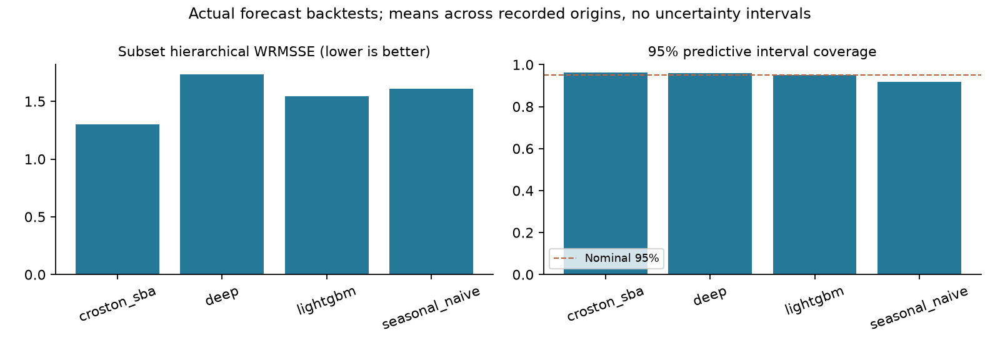

Means over the preferred nonoverlapping holdout origins when available. No confidence intervals or statistical significance claims are inferred from these origins.


## Observed simulation outcomes

Tables include completed runs only, separated by stage and policy/scenario. n is the number of distinct independent seeds; rolling origins are averaged within seed for reported means. The repository's harmful_executions endpoint is a composite flag for true-constraint violations or material action deviation from a same-forecast clean-evidence MILP reference. The code does not require a fault or demonstrate that corrupted evidence caused the deviation. Legitimate classical policies can therefore receive reference-deviation flags in clean normal runs. Composite flags must not all be interpreted as unsafe or corruption-caused orders; true violations and reference deviations are reported separately. Totals depend on completed exposure.

Implementation audit's harm-definition caveat: Harmful execution in code is true-constraint violation OR material distance from same-forecast clean-evidence MILP reference. It does not require an injected fault or causal attribution to corrupted evidence. Therefore legitimate clean-state classical-policy/reference differences can count as reference deviations. Fresh baseline_pilot normal rows confirm B1 has7deviations/0violations and B2 has5deviations/0violations. Report the two endpoints separately; do not describe all combined flags as unsafe or corruption-caused orders.

Partial cells can be selected by execution order and are unsuitable for policy ranking or confirmatory inference. This report makes no claim of statistical power, equivalence, significance, or treatment benefit from partial/pilot data. The repository's thirty-seed requirement is a protocol minimum, not proof of adequate power. Zero observed harms is not a universal safety guarantee.


## m5_smoke — COMPLETE

Output: results/m5_smoke; config: results/run_configs/smoke_m5.yaml; dataset: data/processed/m5_smoke; series attested by completed-run manifest: 2. Seeds configured: 1; origins: 1; start index: 1800; warmup: 4; decision days: 4; approval: default with delay default; forecast override: none recorded. M5 index 0 corresponds to d_1.

Historical origin 0: training data end 2015-12-29 at index1795 (d_1796); decisions 2016-01-03 to 2016-01-06 at indices1800–1803 (d_1801–d_1804). Source: data/processed/m5_smoke/calendar.csv.

| Policy / scenario | n seeds / runs | Mean cost | Mean fill | Harm total | True violation / ref deviation | Holds total |
| --- | --- | --- | --- | --- | --- | --- |
| B1 / derived_field_collapse | 1 / 1 | 27.137 | 1.000 | 0 | 0 / 0 | 0 |
| B1 / feed_gap | 1 / 1 | 19.745 | 1.000 | 0 | 0 / 0 | 0 |
| B1 / foreign_unit_moq | 1 / 1 | 19.745 | 1.000 | 2 | 2 / 0 | 0 |
| B1 / normal | 1 / 1 | 19.745 | 1.000 | 0 | 0 / 0 | 0 |
| D0 / derived_field_collapse | 1 / 1 | 1.806 | 1.000 | 0 | 0 / 0 | 0 |
| D0 / feed_gap | 1 / 1 | 2.932 | 1.000 | 0 | 0 / 0 | 0 |
| D0 / foreign_unit_moq | 1 / 1 | 3.495 | 1.000 | 0 | 0 / 0 | 0 |
| D0 / normal | 1 / 1 | 3.495 | 1.000 | 0 | 0 / 0 | 0 |
| D1 / derived_field_collapse | 1 / 1 | 0.961 | 1.000 | 0 | 0 / 0 | 3 |
| D1 / feed_gap | 1 / 1 | 0.961 | 1.000 | 0 | 0 / 0 | 3 |
| D1 / foreign_unit_moq | 1 / 1 | 3.495 | 1.000 | 0 | 0 / 0 | 0 |
| D1 / normal | 1 / 1 | 3.495 | 1.000 | 0 | 0 / 0 | 0 |

| Policy / scenario | LLM calls | LLM errors | Fallback decisions |
| --- | --- | --- | --- |
| B1 / derived_field_collapse | 0 | 0 | 0 |
| B1 / feed_gap | 0 | 0 | 0 |
| B1 / foreign_unit_moq | 0 | 0 | 0 |
| B1 / normal | 0 | 0 | 0 |
| D0 / derived_field_collapse | 0 | 0 | 0 |
| D0 / feed_gap | 0 | 0 | 0 |
| D0 / foreign_unit_moq | 0 | 0 | 0 |
| D0 / normal | 0 | 0 | 0 |
| D1 / derived_field_collapse | 0 | 0 | 0 |
| D1 / feed_gap | 0 | 0 | 0 |
| D1 / foreign_unit_moq | 0 | 0 | 0 |
| D1 / normal | 0 | 0 | 0 |

| Policy / scenario | Cycle service | Stockout rate | Bullwhip | Mean inventory | Inventory turns |
| --- | --- | --- | --- | --- | --- |
| B1 / derived_field_collapse | 1.000 | 0.000 | 4.125 | 13.000 | 0.615 |
| B1 / feed_gap | 1.000 | 0.000 | 1.500 | 13.000 | 0.615 |
| B1 / foreign_unit_moq | 1.000 | 0.000 | 1.500 | 13.000 | 0.615 |
| B1 / normal | 1.000 | 0.000 | 1.500 | 13.000 | 0.615 |
| D0 / derived_field_collapse | 1.000 | 0.000 | 0.000 | 12.250 | 0.653 |
| D0 / feed_gap | 1.000 | 0.000 | 0.000 | 11.250 | 0.711 |
| D0 / foreign_unit_moq | 1.000 | 0.000 | 0.000 | 10.750 | 0.744 |
| D0 / normal | 1.000 | 0.000 | 0.000 | 10.750 | 0.744 |
| D1 / derived_field_collapse | 1.000 | 0.000 | 0.000 | 13.000 | 0.615 |
| D1 / feed_gap | 1.000 | 0.000 | 0.000 | 13.000 | 0.615 |
| D1 / foreign_unit_moq | 1.000 | 0.000 | 0.000 | 10.750 | 0.744 |
| D1 / normal | 1.000 | 0.000 | 0.000 | 10.750 | 0.744 |

Completed-run recorded tokens=0; LLM calls=0; LLM errors=0; fallback decisions=0; invalid audit chains=0. Counts exclude unfinished runs. Local-model tokens are not assigned a fabricated dollar value.

The repository also wrote study_summary.json with replication-level cost/CVaR and utility. It is preserved in report_data.json. It may lag live worker results; this report's tables are refreshed from complete per-run artifacts. Run-level daily CVaR is not substituted for replication-level tail risk.

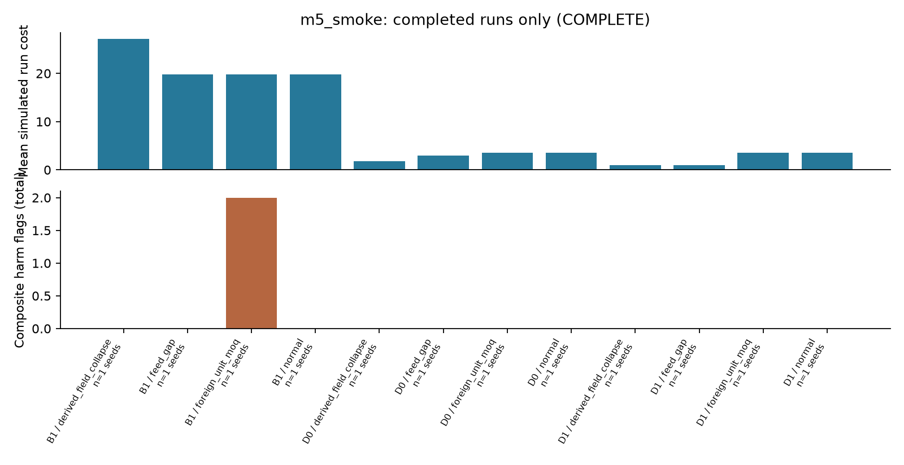

Descriptive simulated outcomes from completed cells; exposure and panel differ across stages. The harmful execution count combines distinct mechanisms detailed in the table.


## ml_m5_smoke — COMPLETE

Output: results/ml_m5_smoke; config: results/run_configs/ml_m5_smoke.yaml; dataset: data/processed/m5_smoke; series attested by completed-run manifest: 2. Seeds configured: 1; origins: 1; start index: 1800; warmup: 4; decision days: 4; approval: default with delay default; forecast override: none recorded. M5 index 0 corresponds to d_1.

Historical origin 0: training data end 2015-12-29 at index1795 (d_1796); decisions 2016-01-03 to 2016-01-06 at indices1800–1803 (d_1801–d_1804). Source: data/processed/m5_smoke/calendar.csv.

| Policy / scenario | n seeds / runs | Mean cost | Mean fill | Harm total | True violation / ref deviation | Holds total |
| --- | --- | --- | --- | --- | --- | --- |
| B1 / derived_field_collapse | 1 / 1 | 27.137 | 1.000 | 0 | 0 / 0 | 0 |
| B1 / feed_gap | 1 / 1 | 19.745 | 1.000 | 0 | 0 / 0 | 0 |
| B1 / foreign_unit_moq | 1 / 1 | 19.745 | 1.000 | 2 | 2 / 0 | 0 |
| B1 / normal | 1 / 1 | 19.745 | 1.000 | 0 | 0 / 0 | 0 |
| B2 / derived_field_collapse | 1 / 1 | 10.353 | 1.000 | 0 | 0 / 0 | 0 |
| B2 / feed_gap | 1 / 1 | 0.961 | 1.000 | 0 | 0 / 0 | 0 |
| B2 / foreign_unit_moq | 1 / 1 | 0.961 | 1.000 | 0 | 0 / 0 | 0 |
| B2 / normal | 1 / 1 | 0.961 | 1.000 | 0 | 0 / 0 | 0 |
| B3 / derived_field_collapse | 1 / 1 | 12.042 | 1.000 | 0 | 0 / 0 | 0 |
| B3 / feed_gap | 1 / 1 | 3.776 | 1.000 | 0 | 0 / 0 | 0 |
| B3 / foreign_unit_moq | 1 / 1 | 3.776 | 1.000 | 0 | 0 / 0 | 0 |
| B3 / normal | 1 / 1 | 3.776 | 1.000 | 0 | 0 / 0 | 0 |
| B4 / derived_field_collapse | 1 / 1 | 2.650 | 1.000 | 0 | 0 / 0 | 3 |
| B4 / feed_gap | 1 / 1 | 2.650 | 1.000 | 0 | 0 / 0 | 3 |
| B4 / foreign_unit_moq | 1 / 1 | 3.776 | 1.000 | 0 | 0 / 0 | 0 |
| B4 / normal | 1 / 1 | 3.776 | 1.000 | 0 | 0 / 0 | 0 |

| Policy / scenario | LLM calls | LLM errors | Fallback decisions |
| --- | --- | --- | --- |
| B1 / derived_field_collapse | 0 | 0 | 0 |
| B1 / feed_gap | 0 | 0 | 0 |
| B1 / foreign_unit_moq | 0 | 0 | 0 |
| B1 / normal | 0 | 0 | 0 |
| B2 / derived_field_collapse | 0 | 0 | 0 |
| B2 / feed_gap | 0 | 0 | 0 |
| B2 / foreign_unit_moq | 0 | 0 | 0 |
| B2 / normal | 0 | 0 | 0 |
| B3 / derived_field_collapse | 0 | 0 | 0 |
| B3 / feed_gap | 0 | 0 | 0 |
| B3 / foreign_unit_moq | 0 | 0 | 0 |
| B3 / normal | 0 | 0 | 0 |
| B4 / derived_field_collapse | 0 | 0 | 0 |
| B4 / feed_gap | 0 | 0 | 0 |
| B4 / foreign_unit_moq | 0 | 0 | 0 |
| B4 / normal | 0 | 0 | 0 |

| Policy / scenario | Cycle service | Stockout rate | Bullwhip | Mean inventory | Inventory turns |
| --- | --- | --- | --- | --- | --- |
| B1 / derived_field_collapse | 1.000 | 0.000 | 4.125 | 13.000 | 0.615 |
| B1 / feed_gap | 1.000 | 0.000 | 1.500 | 13.000 | 0.615 |
| B1 / foreign_unit_moq | 1.000 | 0.000 | 1.500 | 13.000 | 0.615 |
| B1 / normal | 1.000 | 0.000 | 1.500 | 13.000 | 0.615 |
| B2 / derived_field_collapse | 1.000 | 0.000 | 1.125 | 13.000 | 0.615 |
| B2 / feed_gap | 1.000 | 0.000 | 0.000 | 13.000 | 0.615 |
| B2 / foreign_unit_moq | 1.000 | 0.000 | 0.000 | 13.000 | 0.615 |
| B2 / normal | 1.000 | 0.000 | 0.000 | 13.000 | 0.615 |
| B3 / derived_field_collapse | 1.000 | 0.000 | 1.125 | 11.500 | 0.696 |
| B3 / feed_gap | 1.000 | 0.000 | 0.000 | 10.500 | 0.762 |
| B3 / foreign_unit_moq | 1.000 | 0.000 | 0.000 | 10.500 | 0.762 |
| B3 / normal | 1.000 | 0.000 | 0.000 | 10.500 | 0.762 |
| B4 / derived_field_collapse | 1.000 | 0.000 | 0.000 | 11.500 | 0.696 |
| B4 / feed_gap | 1.000 | 0.000 | 0.000 | 11.500 | 0.696 |
| B4 / foreign_unit_moq | 1.000 | 0.000 | 0.000 | 10.500 | 0.762 |
| B4 / normal | 1.000 | 0.000 | 0.000 | 10.500 | 0.762 |

Completed-run recorded tokens=0; LLM calls=0; LLM errors=0; fallback decisions=0; invalid audit chains=0. Counts exclude unfinished runs. Local-model tokens are not assigned a fabricated dollar value.

The repository also wrote study_summary.json with replication-level cost/CVaR and utility. It is preserved in report_data.json. It may lag live worker results; this report's tables are refreshed from complete per-run artifacts. Run-level daily CVaR is not substituted for replication-level tail risk.

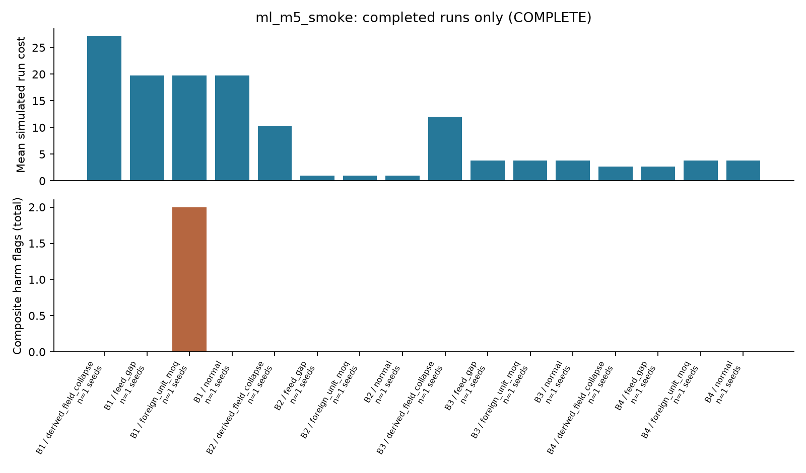

Descriptive simulated outcomes from completed cells; exposure and panel differ across stages. The harmful execution count combines distinct mechanisms detailed in the table.


## baseline_pilot — COMPLETE

Output: results/baseline_pilot; config: results/run_configs/baseline_pilot.yaml; dataset: data/processed/m5; series attested by completed-run manifest: 30. Seeds configured: 2; origins: 1; start index: 1830; warmup: 14; decision days: 7; approval: oracle with delay 1; forecast override: none recorded. M5 index 0 corresponds to d_1.

Historical origin 0: training data end 2016-01-18 at index1815 (d_1816); decisions 2016-02-02 to 2016-02-08 at indices1830–1836 (d_1831–d_1837). Source: data/processed/m5/calendar.csv.

| Policy / scenario | n seeds / runs | Mean cost | Mean fill | Harm total | True violation / ref deviation | Holds total |
| --- | --- | --- | --- | --- | --- | --- |
| B1 / derived_field_collapse | 2 / 2 | 731.757 | 0.934 | 10 | 0 / 10 | 0 |
| B1 / normal | 2 / 2 | 390.874 | 0.932 | 14 | 0 / 14 | 0 |
| B2 / derived_field_collapse | 2 / 2 | 625.233 | 0.911 | 6 | 0 / 6 | 0 |
| B2 / normal | 2 / 2 | 388.219 | 0.802 | 10 | 0 / 10 | 0 |
| B3 / derived_field_collapse | 2 / 2 | 1,051.913 | 0.980 | 7 | 0 / 7 | 0 |
| B3 / normal | 2 / 2 | 562.691 | 0.980 | 0 | 0 / 0 | 0 |
| B4 / derived_field_collapse | 2 / 2 | 525.882 | 0.941 | 1 | 0 / 1 | 8 |
| B4 / normal | 2 / 2 | 554.447 | 0.952 | 0 | 0 / 0 | 2 |

| Policy / scenario | LLM calls | LLM errors | Fallback decisions |
| --- | --- | --- | --- |
| B1 / derived_field_collapse | 0 | 0 | 0 |
| B1 / normal | 0 | 0 | 0 |
| B2 / derived_field_collapse | 0 | 0 | 0 |
| B2 / normal | 0 | 0 | 0 |
| B3 / derived_field_collapse | 0 | 0 | 0 |
| B3 / normal | 0 | 0 | 0 |
| B4 / derived_field_collapse | 0 | 0 | 0 |
| B4 / normal | 0 | 0 | 0 |

| Policy / scenario | Cycle service | Stockout rate | Bullwhip | Mean inventory | Inventory turns |
| --- | --- | --- | --- | --- | --- |
| B1 / derived_field_collapse | 0.643 | 0.014 | 86.022 | 323.429 | 0.635 |
| B1 / normal | 0.571 | 0.017 | 1.570 | 237.000 | 0.867 |
| B2 / derived_field_collapse | 0.429 | 0.021 | 77.251 | 282.643 | 0.711 |
| B2 / normal | 0.214 | 0.057 | 2.965 | 196.857 | 0.901 |
| B3 / derived_field_collapse | 0.786 | 0.010 | 124.693 | 429.786 | 0.502 |
| B3 / normal | 0.786 | 0.010 | 25.819 | 291.286 | 0.745 |
| B4 / derived_field_collapse | 0.571 | 0.017 | 58.577 | 244.214 | 0.849 |
| B4 / normal | 0.643 | 0.014 | 31.919 | 271.214 | 0.773 |

Completed-run recorded tokens=0; LLM calls=0; LLM errors=0; fallback decisions=0; invalid audit chains=0. Counts exclude unfinished runs. Local-model tokens are not assigned a fabricated dollar value.

The repository also wrote study_summary.json with replication-level cost/CVaR and utility. It is preserved in report_data.json. It may lag live worker results; this report's tables are refreshed from complete per-run artifacts. Run-level daily CVaR is not substituted for replication-level tail risk.

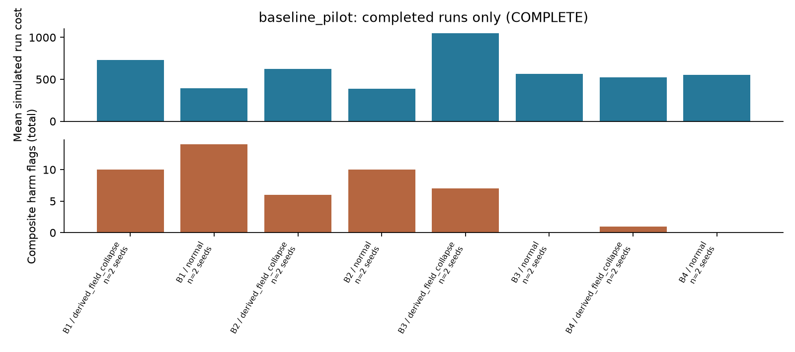

Descriptive simulated outcomes from completed cells; exposure and panel differ across stages. The harmful execution count combines distinct mechanisms detailed in the table.


## main_study_stage1 — PARTIAL

Output: results/main_study_stage1; config: configs/main_study_stage1.yaml; dataset: data/processed/m5; series attested by completed-run manifest: 30. Seeds configured: 30; origins: 1; start index: 1830; warmup: 14; decision days: 28; approval: oracle with delay 1; forecast override: none recorded. M5 index 0 corresponds to d_1.

Historical origin 0: training data end 2016-01-18 at index1815 (d_1816); decisions 2016-02-02 to 2016-02-29 at indices1830–1857 (d_1831–d_1858). Source: data/processed/m5/calendar.csv.

| Policy / scenario | n seeds / runs | Mean cost | Mean fill | Harm total | True violation / ref deviation | Holds total |
| --- | --- | --- | --- | --- | --- | --- |
| B1 / normal | 20 / 20 | 1,457.503 | 0.949 | 559 | 0 / 559 | 0 |

| Policy / scenario | LLM calls | LLM errors | Fallback decisions |
| --- | --- | --- | --- |
| B1 / normal | 0 | 0 | 0 |

| Policy / scenario | Cycle service | Stockout rate | Bullwhip | Mean inventory | Inventory turns |
| --- | --- | --- | --- | --- | --- |
| B1 / normal | 0.623 | 0.017 | 1.647 | 251.787 | 3.153 |

Completed-run recorded tokens=0; LLM calls=0; LLM errors=0; fallback decisions=0; invalid audit chains=0. Counts exclude unfinished runs. Local-model tokens are not assigned a fabricated dollar value.

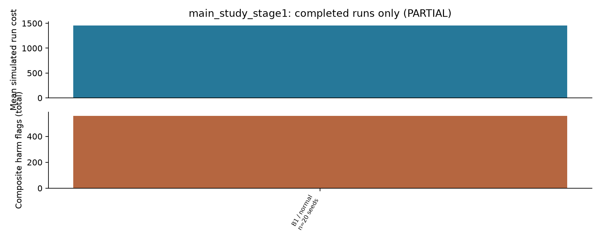

Descriptive simulated outcomes from completed cells; exposure and panel differ across stages. The harmful execution count combines distinct mechanisms detailed in the table.


## foundation_30series — BLOCKED

Output: results/foundation_30series; config: results/run_configs/foundation_30series.yaml; dataset: data/processed/m5; series attested by completed-run manifest: no completed-run manifest yet. Seeds configured: 30; origins: 3; start index: 1830; warmup: 14; decision days: 28; approval: oracle with delay 1; forecast override: none recorded. M5 index 0 corresponds to d_1.

Historical origin 0: training data end 2016-01-18 at index1815 (d_1816); decisions 2016-02-02 to 2016-02-29 at indices1830–1857 (d_1831–d_1858). Source: data/processed/m5/calendar.csv.

Historical origin 1: training data end 2016-02-15 at index1843 (d_1844); decisions 2016-03-01 to 2016-03-28 at indices1858–1885 (d_1859–d_1886). Source: data/processed/m5/calendar.csv.

Historical origin 2: training data end 2016-03-14 at index1871 (d_1872); decisions 2016-03-29 to 2016-04-25 at indices1886–1913 (d_1887–d_1914). Source: data/processed/m5/calendar.csv.

No completed observations are available for this table.

No completed observations are available for this table.

No completed observations are available for this table.

Completed-run recorded tokens=0; LLM calls=0; LLM errors=0; fallback decisions=0; invalid audit chains=0. Counts exclude unfinished runs. Local-model tokens are not assigned a fabricated dollar value.


## llm_architectures_ollama — BLOCKED

Output: results/llm_architectures_ollama; config: results/run_configs/llm_architectures_ollama.yaml; dataset: data/processed/m5_smoke; series attested by completed-run manifest: no completed-run manifest yet. Seeds configured: 1; origins: 1; start index: 1800; warmup: 7; decision days: 4; approval: oracle with delay 1; forecast override: none recorded. M5 index 0 corresponds to d_1.

Historical origin 0: training data end 2015-12-26 at index1792 (d_1793); decisions 2016-01-03 to 2016-01-06 at indices1800–1803 (d_1801–d_1804). Source: data/processed/m5_smoke/calendar.csv.

No completed observations are available for this table.

No completed observations are available for this table.

No completed observations are available for this table.

Completed-run recorded tokens=0; LLM calls=0; LLM errors=0; fallback decisions=0; invalid audit chains=0. Counts exclude unfinished runs. Local-model tokens are not assigned a fabricated dollar value.


## llm_prose_reference_30series — PARTIAL

Output: results/llm_prose_reference_30series; config: results/run_configs/llm_prose_reference_30series.yaml; dataset: data/processed/m5; series attested by completed-run manifest: 30. Seeds configured: 30; origins: 3; start index: 1830; warmup: 14; decision days: 28; approval: oracle with delay 1; forecast override: none recorded. M5 index 0 corresponds to d_1.

Historical origin 0: training data end 2016-01-18 at index1815 (d_1816); decisions 2016-02-02 to 2016-02-29 at indices1830–1857 (d_1831–d_1858). Source: data/processed/m5/calendar.csv.

Historical origin 1: training data end 2016-02-15 at index1843 (d_1844); decisions 2016-03-01 to 2016-03-28 at indices1858–1885 (d_1859–d_1886). Source: data/processed/m5/calendar.csv.

Historical origin 2: training data end 2016-03-14 at index1871 (d_1872); decisions 2016-03-29 to 2016-04-25 at indices1886–1913 (d_1887–d_1914). Source: data/processed/m5/calendar.csv.

| Policy / scenario | n seeds / runs | Mean cost | Mean fill | Harm total | True violation / ref deviation | Holds total |
| --- | --- | --- | --- | --- | --- | --- |
| B3 / normal | 1 / 1 | 1,630.796 | 0.982 | 0 | 0 / 0 | 0 |

| Policy / scenario | LLM calls | LLM errors | Fallback decisions |
| --- | --- | --- | --- |
| B3 / normal | 0 | 0 | 0 |

| Policy / scenario | Cycle service | Stockout rate | Bullwhip | Mean inventory | Inventory turns |
| --- | --- | --- | --- | --- | --- |
| B3 / normal | 0.821 | 0.007 | 2.785 | 293.393 | 2.778 |

Completed-run recorded tokens=0; LLM calls=0; LLM errors=0; fallback decisions=0; invalid audit chains=0. Counts exclude unfinished runs. Local-model tokens are not assigned a fabricated dollar value.

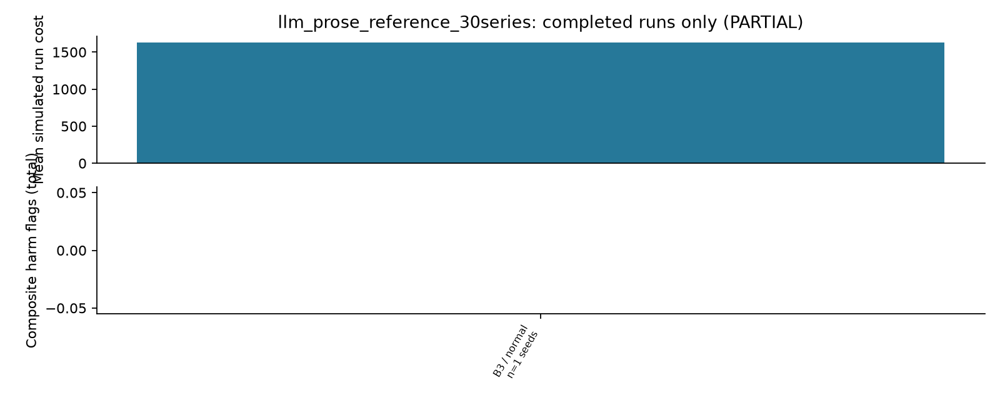

Descriptive simulated outcomes from completed cells; exposure and panel differ across stages. The harmful execution count combines distinct mechanisms detailed in the table.


## llm_prose_study_ollama — BLOCKED

Output: results/llm_prose_study_ollama; config: results/run_configs/llm_prose_study_ollama.yaml; dataset: data/processed/m5; series attested by completed-run manifest: no completed-run manifest yet. Seeds configured: 30; origins: 3; start index: 1830; warmup: 14; decision days: 28; approval: oracle with delay 1; forecast override: none recorded. M5 index 0 corresponds to d_1.

Historical origin 0: training data end 2016-01-18 at index1815 (d_1816); decisions 2016-02-02 to 2016-02-29 at indices1830–1857 (d_1831–d_1858). Source: data/processed/m5/calendar.csv.

Historical origin 1: training data end 2016-02-15 at index1843 (d_1844); decisions 2016-03-01 to 2016-03-28 at indices1858–1885 (d_1859–d_1886). Source: data/processed/m5/calendar.csv.

Historical origin 2: training data end 2016-03-14 at index1871 (d_1872); decisions 2016-03-29 to 2016-04-25 at indices1886–1913 (d_1887–d_1914). Source: data/processed/m5/calendar.csv.

No completed observations are available for this table.

No completed observations are available for this table.

No completed observations are available for this table.

Completed-run recorded tokens=0; LLM calls=0; LLM errors=0; fallback decisions=0; invalid audit chains=0. Counts exclude unfinished runs. Local-model tokens are not assigned a fabricated dollar value.


## llm_prose_study_reference — COMPLETE

Output: results/llm_prose_study_reference; config: configs/llm_prose_study_reference.yaml; dataset: data/processed/m5_item1; series attested by completed-run manifest: 10. Seeds configured: 30; origins: 1; start index: 1830; warmup: 14; decision days: 4; approval: oracle with delay 1; forecast override: none recorded. M5 index 0 corresponds to d_1.

Historical origin 0: training data end 2016-01-18 at index1815 (d_1816); decisions 2016-02-02 to 2016-02-05 at indices1830–1833 (d_1831–d_1834). Source: data/processed/m5_item1/calendar.csv.

| Policy / scenario | n seeds / runs | Mean cost | Mean fill | Harm total | True violation / ref deviation | Holds total |
| --- | --- | --- | --- | --- | --- | --- |
| B3 / derived_field_collapse | 30 / 30 | 126.973 | 1.000 | 25 | 0 / 25 | 0 |
| B3 / normal | 30 / 30 | 32.024 | 1.000 | 0 | 0 / 0 | 0 |
| B4 / derived_field_collapse | 30 / 30 | 25.774 | 1.000 | 0 | 0 / 0 | 60 |
| B4 / normal | 30 / 30 | 30.834 | 1.000 | 0 | 0 / 0 | 2 |

| Policy / scenario | LLM calls | LLM errors | Fallback decisions |
| --- | --- | --- | --- |
| B3 / derived_field_collapse | 0 | 0 | 0 |
| B3 / normal | 0 | 0 | 0 |
| B4 / derived_field_collapse | 0 | 0 | 0 |
| B4 / normal | 0 | 0 | 0 |

| Policy / scenario | Cycle service | Stockout rate | Bullwhip | Mean inventory | Inventory turns |
| --- | --- | --- | --- | --- | --- |
| B3 / derived_field_collapse | 1.000 | 0.000 | 250.680 | 99.008 | 0.144 |
| B3 / normal | 1.000 | 0.000 | 2.951 | 85.408 | 0.167 |
| B4 / derived_field_collapse | 1.000 | 0.000 | 3.044 | 87.992 | 0.162 |
| B4 / normal | 1.000 | 0.000 | 2.396 | 85.508 | 0.166 |

Completed-run recorded tokens=0; LLM calls=0; LLM errors=0; fallback decisions=0; invalid audit chains=0. Counts exclude unfinished runs. Local-model tokens are not assigned a fabricated dollar value.

The repository also wrote study_summary.json with replication-level cost/CVaR and utility. It is preserved in report_data.json. It may lag live worker results; this report's tables are refreshed from complete per-run artifacts. Run-level daily CVaR is not substituted for replication-level tail risk.

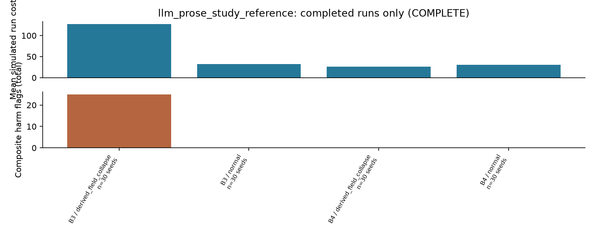

Descriptive simulated outcomes from completed cells; exposure and panel differ across stages. The harmful execution count combines distinct mechanisms detailed in the table.


## llm_template_architectures_30series — BLOCKED

Output: results/llm_template_architectures_30series; config: results/run_configs/llm_template_architectures_30series.yaml; dataset: data/processed/m5; series attested by completed-run manifest: no completed-run manifest yet. Seeds configured: 30; origins: 3; start index: 1830; warmup: 14; decision days: 28; approval: oracle with delay 1; forecast override: none recorded. M5 index 0 corresponds to d_1.

Historical origin 0: training data end 2016-01-18 at index1815 (d_1816); decisions 2016-02-02 to 2016-02-29 at indices1830–1857 (d_1831–d_1858). Source: data/processed/m5/calendar.csv.

Historical origin 1: training data end 2016-02-15 at index1843 (d_1844); decisions 2016-03-01 to 2016-03-28 at indices1858–1885 (d_1859–d_1886). Source: data/processed/m5/calendar.csv.

Historical origin 2: training data end 2016-03-14 at index1871 (d_1872); decisions 2016-03-29 to 2016-04-25 at indices1886–1913 (d_1887–d_1914). Source: data/processed/m5/calendar.csv.

No completed observations are available for this table.

No completed observations are available for this table.

No completed observations are available for this table.

Completed-run recorded tokens=0; LLM calls=0; LLM errors=0; fallback decisions=0; invalid audit chains=0. Counts exclude unfinished runs. Local-model tokens are not assigned a fabricated dollar value.


## parallel_runner_validation — COMPLETE

Output: results/parallel_runner_validation; config: results/run_configs/parallel_runner_validation.yaml; dataset: data/processed/m5_smoke; series attested by completed-run manifest: 2. Seeds configured: 2; origins: 1; start index: 1800; warmup: 4; decision days: 1; approval: default with delay default; forecast override: none recorded. M5 index 0 corresponds to d_1.

Historical origin 0: training data end 2015-12-29 at index1795 (d_1796); decisions 2016-01-03 to 2016-01-03 at indices1800–1800 (d_1801–d_1801). Source: data/processed/m5_smoke/calendar.csv.

| Policy / scenario | n seeds / runs | Mean cost | Mean fill | Harm total | True violation / ref deviation | Holds total |
| --- | --- | --- | --- | --- | --- | --- |
| B1 / normal | 2 / 2 | 4.955 | 1.000 | 0 | 0 / 0 | 0 |
| B2 / normal | 2 / 2 | 0.259 | 1.000 | 0 | 0 / 0 | 0 |
| B3 / normal | 2 / 2 | 1.103 | 1.000 | 0 | 0 / 0 | 0 |
| B4 / normal | 2 / 2 | 1.103 | 1.000 | 0 | 0 / 0 | 0 |

| Policy / scenario | LLM calls | LLM errors | Fallback decisions |
| --- | --- | --- | --- |
| B1 / normal | 0 | 0 | 0 |
| B2 / normal | 0 | 0 | 0 |
| B3 / normal | 0 | 0 | 0 |
| B4 / normal | 0 | 0 | 0 |

| Policy / scenario | Cycle service | Stockout rate | Bullwhip | Mean inventory | Inventory turns |
| --- | --- | --- | --- | --- | --- |
| B1 / normal | 1.000 | 0.000 | — | 14.000 | 0.000 |
| B2 / normal | 1.000 | 0.000 | — | 14.000 | 0.000 |
| B3 / normal | 1.000 | 0.000 | — | 11.000 | 0.000 |
| B4 / normal | 1.000 | 0.000 | — | 11.000 | 0.000 |

Completed-run recorded tokens=0; LLM calls=0; LLM errors=0; fallback decisions=0; invalid audit chains=0. Counts exclude unfinished runs. Local-model tokens are not assigned a fabricated dollar value.

The repository also wrote study_summary.json with replication-level cost/CVaR and utility. It is preserved in report_data.json. It may lag live worker results; this report's tables are refreshed from complete per-run artifacts. Run-level daily CVaR is not substituted for replication-level tail risk.

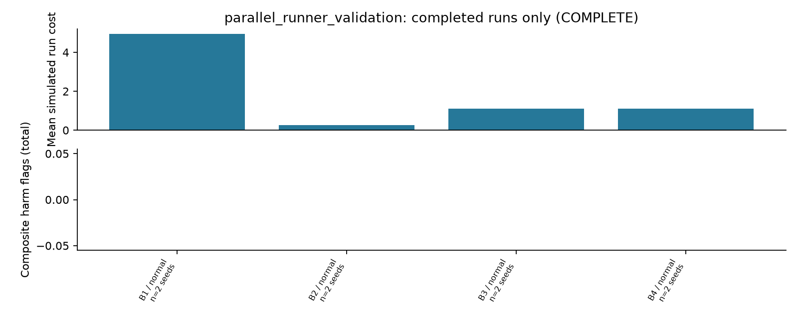

Descriptive simulated outcomes from completed cells; exposure and panel differ across stages. The harmful execution count combines distinct mechanisms detailed in the table.


## six_hour_agentic_prose — COMPLETE

Output: results/six_hour_agentic_prose; config: results/run_configs/six_hour_agentic_prose.yaml; dataset: data/processed/m5; series attested by completed-run manifest: 30. Seeds configured: 1; origins: 1; start index: 1830; warmup: 14; decision days: 2; approval: oracle with delay 1; forecast override: none recorded. M5 index 0 corresponds to d_1.

Historical origin 0: training data end 2016-01-18 at index1815 (d_1816); decisions 2016-02-02 to 2016-02-03 at indices1830–1831 (d_1831–d_1832). Source: data/processed/m5/calendar.csv.

B3/B4 in this prose stage are intentional deterministic-parser comparators. The parser requires the structured RULE carrier and recognizes no rules in controlled prose, so missing required constraint coverage causes holds. They are not structured-rule oracle benchmarks. Separate registered two-day template controls are shown under their own stage; the seven-day numerical template costs are not pooled into this comparison.

| Policy / scenario | n seeds / runs | Mean cost | Mean fill | Harm total | True violation / ref deviation | Holds total |
| --- | --- | --- | --- | --- | --- | --- |
| B10 / derived_field_collapse | 1 / 1 | 8.513 | 1.000 | 0 | 0 / 0 | 2 |
| B10 / normal | 1 / 1 | 8.513 | 1.000 | 0 | 0 / 0 | 2 |
| B3 / derived_field_collapse | 1 / 1 | 8.513 | 1.000 | 0 | 0 / 0 | 2 |
| B3 / normal | 1 / 1 | 8.513 | 1.000 | 0 | 0 / 0 | 2 |
| B4 / derived_field_collapse | 1 / 1 | 8.513 | 1.000 | 0 | 0 / 0 | 2 |
| B4 / normal | 1 / 1 | 8.513 | 1.000 | 0 | 0 / 0 | 2 |
| B9 / derived_field_collapse | 1 / 1 | 8.513 | 1.000 | 0 | 0 / 0 | 2 |
| B9 / normal | 1 / 1 | 8.513 | 1.000 | 0 | 0 / 0 | 2 |

| Policy / scenario | LLM calls | LLM errors | Fallback decisions |
| --- | --- | --- | --- |
| B10 / derived_field_collapse | 5 | 0 | 0 |
| B10 / normal | 8 | 0 | 0 |
| B3 / derived_field_collapse | 0 | 0 | 0 |
| B3 / normal | 0 | 0 | 0 |
| B4 / derived_field_collapse | 0 | 0 | 0 |
| B4 / normal | 0 | 0 | 0 |
| B9 / derived_field_collapse | 9 | 0 | 0 |
| B9 / normal | 8 | 0 | 0 |

| Policy / scenario | Cycle service | Stockout rate | Bullwhip | Mean inventory | Inventory turns |
| --- | --- | --- | --- | --- | --- |
| B10 / derived_field_collapse | 1.000 | 0.000 | 0.000 | 237.500 | 0.232 |
| B10 / normal | 1.000 | 0.000 | 0.000 | 237.500 | 0.232 |
| B3 / derived_field_collapse | 1.000 | 0.000 | 0.000 | 237.500 | 0.232 |
| B3 / normal | 1.000 | 0.000 | 0.000 | 237.500 | 0.232 |
| B4 / derived_field_collapse | 1.000 | 0.000 | 0.000 | 237.500 | 0.232 |
| B4 / normal | 1.000 | 0.000 | 0.000 | 237.500 | 0.232 |
| B9 / derived_field_collapse | 1.000 | 0.000 | 0.000 | 237.500 | 0.232 |
| B9 / normal | 1.000 | 0.000 | 0.000 | 237.500 | 0.232 |

Completed-run recorded tokens=112,739; LLM calls=30; LLM errors=0; fallback decisions=0; invalid audit chains=0. Counts exclude unfinished runs. Local-model tokens are not assigned a fabricated dollar value.

The repository also wrote study_summary.json with replication-level cost/CVaR and utility. It is preserved in report_data.json. It may lag live worker results; this report's tables are refreshed from complete per-run artifacts. Run-level daily CVaR is not substituted for replication-level tail risk.

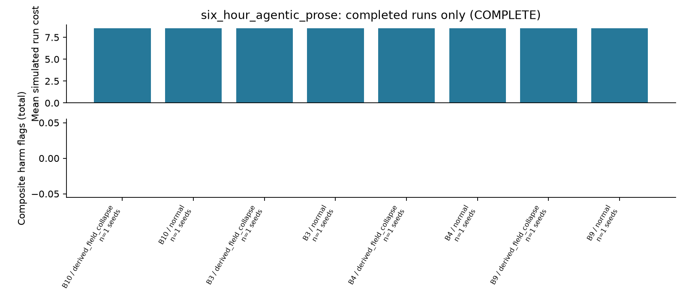

Descriptive simulated outcomes from completed cells; exposure and panel differ across stages. The harmful execution count combines distinct mechanisms detailed in the table.


## six_hour_numeric — COMPLETE

Output: results/six_hour_numeric; config: results/run_configs/six_hour_numeric.yaml; dataset: data/processed/m5; series attested by completed-run manifest: 30. Seeds configured: 8; origins: 1; start index: 1830; warmup: 14; decision days: 7; approval: oracle with delay 1; forecast override: none recorded. M5 index 0 corresponds to d_1.

Historical origin 0: training data end 2016-01-18 at index1815 (d_1816); decisions 2016-02-02 to 2016-02-08 at indices1830–1836 (d_1831–d_1837). Source: data/processed/m5/calendar.csv.

| Policy / scenario | n seeds / runs | Mean cost | Mean fill | Harm total | True violation / ref deviation | Holds total |
| --- | --- | --- | --- | --- | --- | --- |
| B1 / derived_field_collapse | 8 / 8 | 624.865 | 0.935 | 46 | 0 / 46 | 0 |
| B1 / feed_gap | 8 / 8 | 450.162 | 0.908 | 56 | 0 / 56 | 0 |
| B1 / normal | 8 / 8 | 394.844 | 0.931 | 55 | 0 / 55 | 0 |
| B2 / derived_field_collapse | 8 / 8 | 513.635 | 0.876 | 34 | 0 / 34 | 0 |
| B2 / feed_gap | 8 / 8 | 416.981 | 0.788 | 34 | 0 / 34 | 0 |
| B2 / normal | 8 / 8 | 380.920 | 0.827 | 44 | 0 / 44 | 0 |
| B3 / derived_field_collapse | 8 / 8 | 493.214 | 0.930 | 22 | 0 / 22 | 0 |
| B3 / feed_gap | 8 / 8 | 415.272 | 0.905 | 27 | 19 / 8 | 0 |
| B3 / normal | 8 / 8 | 363.719 | 0.946 | 1 | 0 / 1 | 0 |
| B4 / derived_field_collapse | 8 / 8 | 380.184 | 0.890 | 1 | 0 / 1 | 24 |
| B4 / feed_gap | 8 / 8 | 376.781 | 0.892 | 1 | 0 / 1 | 24 |
| B4 / normal | 8 / 8 | 360.245 | 0.947 | 3 | 0 / 3 | 0 |

| Policy / scenario | LLM calls | LLM errors | Fallback decisions |
| --- | --- | --- | --- |
| B1 / derived_field_collapse | 0 | 0 | 0 |
| B1 / feed_gap | 0 | 0 | 0 |
| B1 / normal | 0 | 0 | 0 |
| B2 / derived_field_collapse | 0 | 0 | 0 |
| B2 / feed_gap | 0 | 0 | 0 |
| B2 / normal | 0 | 0 | 0 |
| B3 / derived_field_collapse | 0 | 0 | 0 |
| B3 / feed_gap | 0 | 0 | 0 |
| B3 / normal | 0 | 0 | 0 |
| B4 / derived_field_collapse | 0 | 0 | 0 |
| B4 / feed_gap | 0 | 0 | 0 |
| B4 / normal | 0 | 0 | 0 |

| Policy / scenario | Cycle service | Stockout rate | Bullwhip | Mean inventory | Inventory turns |
| --- | --- | --- | --- | --- | --- |
| B1 / derived_field_collapse | 0.554 | 0.022 | 60.293 | 261.179 | 0.794 |
| B1 / feed_gap | 0.339 | 0.032 | 2.914 | 209.982 | 0.955 |
| B1 / normal | 0.464 | 0.025 | 2.138 | 210.804 | 0.979 |
| B2 / derived_field_collapse | 0.411 | 0.040 | 51.512 | 227.375 | 0.852 |
| B2 / feed_gap | 0.196 | 0.067 | 5.480 | 181.571 | 0.966 |
| B2 / normal | 0.250 | 0.059 | 2.361 | 184.500 | 0.994 |
| B3 / derived_field_collapse | 0.500 | 0.025 | 19.551 | 217.750 | 0.953 |
| B3 / feed_gap | 0.357 | 0.040 | 2.256 | 175.714 | 1.136 |
| B3 / normal | 0.554 | 0.021 | 4.111 | 171.536 | 1.225 |
| B4 / derived_field_collapse | 0.393 | 0.041 | 9.260 | 173.143 | 1.137 |
| B4 / feed_gap | 0.411 | 0.040 | 9.181 | 173.214 | 1.139 |
| B4 / normal | 0.518 | 0.021 | 4.249 | 170.768 | 1.231 |

Completed-run recorded tokens=0; LLM calls=0; LLM errors=0; fallback decisions=0; invalid audit chains=0. Counts exclude unfinished runs. Local-model tokens are not assigned a fabricated dollar value.

The repository also wrote study_summary.json with replication-level cost/CVaR and utility. It is preserved in report_data.json. It may lag live worker results; this report's tables are refreshed from complete per-run artifacts. Run-level daily CVaR is not substituted for replication-level tail risk.

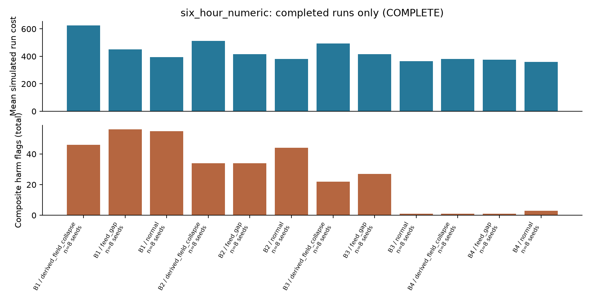

Descriptive simulated outcomes from completed cells; exposure and panel differ across stages. The harmful execution count combines distinct mechanisms detailed in the table.


## six_hour_numeric_extension — COMPLETE

Output: results/six_hour_numeric_extension; config: results/run_configs/six_hour_numeric_extension.yaml; dataset: data/processed/m5; series attested by completed-run manifest: 30. Seeds configured: 22; origins: 1; start index: 1830; warmup: 14; decision days: 7; approval: oracle with delay 1; forecast override: none recorded. M5 index 0 corresponds to d_1.

Historical origin 0: training data end 2016-01-18 at index1815 (d_1816); decisions 2016-02-02 to 2016-02-08 at indices1830–1836 (d_1831–d_1837). Source: data/processed/m5/calendar.csv.

| Policy / scenario | n seeds / runs | Mean cost | Mean fill | Harm total | True violation / ref deviation | Holds total |
| --- | --- | --- | --- | --- | --- | --- |
| B1 / derived_field_collapse | 22 / 22 | 619.686 | 0.925 | 133 | 0 / 133 | 0 |
| B1 / feed_gap | 22 / 22 | 440.646 | 0.909 | 154 | 0 / 154 | 0 |
| B1 / normal | 22 / 22 | 401.666 | 0.917 | 154 | 0 / 154 | 0 |
| B2 / derived_field_collapse | 22 / 22 | 561.821 | 0.843 | 88 | 0 / 88 | 0 |
| B2 / feed_gap | 22 / 22 | 448.461 | 0.767 | 97 | 0 / 97 | 0 |
| B2 / normal | 22 / 22 | 406.433 | 0.804 | 117 | 0 / 117 | 0 |
| B3 / derived_field_collapse | 22 / 22 | 498.439 | 0.940 | 56 | 0 / 56 | 0 |
| B3 / feed_gap | 22 / 22 | 429.314 | 0.902 | 73 | 44 / 29 | 0 |
| B3 / normal | 22 / 22 | 379.595 | 0.937 | 9 | 0 / 9 | 0 |
| B4 / derived_field_collapse | 22 / 22 | 365.509 | 0.911 | 5 | 0 / 5 | 66 |
| B4 / feed_gap | 22 / 22 | 364.529 | 0.910 | 4 | 0 / 4 | 66 |
| B4 / normal | 22 / 22 | 379.002 | 0.937 | 8 | 0 / 8 | 0 |

| Policy / scenario | LLM calls | LLM errors | Fallback decisions |
| --- | --- | --- | --- |
| B1 / derived_field_collapse | 0 | 0 | 0 |
| B1 / feed_gap | 0 | 0 | 0 |
| B1 / normal | 0 | 0 | 0 |
| B2 / derived_field_collapse | 0 | 0 | 0 |
| B2 / feed_gap | 0 | 0 | 0 |
| B2 / normal | 0 | 0 | 0 |
| B3 / derived_field_collapse | 0 | 0 | 0 |
| B3 / feed_gap | 0 | 0 | 0 |
| B3 / normal | 0 | 0 | 0 |
| B4 / derived_field_collapse | 0 | 0 | 0 |
| B4 / feed_gap | 0 | 0 | 0 |
| B4 / normal | 0 | 0 | 0 |

| Policy / scenario | Cycle service | Stockout rate | Bullwhip | Mean inventory | Inventory turns |
| --- | --- | --- | --- | --- | --- |
| B1 / derived_field_collapse | 0.468 | 0.024 | 50.320 | 253.442 | 0.808 |
| B1 / feed_gap | 0.312 | 0.033 | 2.223 | 206.201 | 0.979 |
| B1 / normal | 0.377 | 0.029 | 1.891 | 205.175 | 0.993 |
| B2 / derived_field_collapse | 0.234 | 0.048 | 45.965 | 225.779 | 0.828 |
| B2 / feed_gap | 0.175 | 0.077 | 6.385 | 180.175 | 0.949 |
| B2 / normal | 0.175 | 0.066 | 1.904 | 183.753 | 0.976 |
| B3 / derived_field_collapse | 0.519 | 0.020 | 21.477 | 221.805 | 0.939 |
| B3 / feed_gap | 0.370 | 0.039 | 3.252 | 178.513 | 1.120 |
| B3 / normal | 0.494 | 0.024 | 3.342 | 175.851 | 1.180 |
| B4 / derived_field_collapse | 0.377 | 0.035 | 12.266 | 172.494 | 1.173 |
| B4 / feed_gap | 0.383 | 0.035 | 12.280 | 172.571 | 1.172 |
| B4 / normal | 0.487 | 0.023 | 3.296 | 175.643 | 1.180 |

Completed-run recorded tokens=0; LLM calls=0; LLM errors=0; fallback decisions=0; invalid audit chains=0. Counts exclude unfinished runs. Local-model tokens are not assigned a fabricated dollar value.

The repository also wrote study_summary.json with replication-level cost/CVaR and utility. It is preserved in report_data.json. It may lag live worker results; this report's tables are refreshed from complete per-run artifacts. Run-level daily CVaR is not substituted for replication-level tail risk.


Descriptive simulated outcomes from completed cells; exposure and panel differ across stages. The harmful execution count combines distinct mechanisms detailed in the table.


## six_hour_structured_controls — COMPLETE

Output: results/six_hour_structured_controls; config: results/run_configs/six_hour_structured_controls.yaml; dataset: data/processed/m5; series attested by completed-run manifest: 30. Seeds configured: 1; origins: 1; start index: 1830; warmup: 14; decision days: 2; approval: oracle with delay 1; forecast override: none recorded. M5 index 0 corresponds to d_1.

Historical origin 0: training data end 2016-01-18 at index1815 (d_1816); decisions 2016-02-02 to 2016-02-03 at indices1830–1831 (d_1831–d_1832). Source: data/processed/m5/calendar.csv.

| Policy / scenario | n seeds / runs | Mean cost | Mean fill | Harm total | True violation / ref deviation | Holds total |
| --- | --- | --- | --- | --- | --- | --- |
| B3 / derived_field_collapse | 1 / 1 | 178.272 | 1.000 | 0 | 0 / 0 | 0 |
| B3 / normal | 1 / 1 | 97.066 | 1.000 | 0 | 0 / 0 | 0 |
| B4 / derived_field_collapse | 1 / 1 | 67.673 | 1.000 | 0 | 0 / 0 | 1 |
| B4 / normal | 1 / 1 | 96.499 | 1.000 | 0 | 0 / 0 | 0 |

| Policy / scenario | LLM calls | LLM errors | Fallback decisions |
| --- | --- | --- | --- |
| B3 / derived_field_collapse | 0 | 0 | 0 |
| B3 / normal | 0 | 0 | 0 |
| B4 / derived_field_collapse | 0 | 0 | 0 |
| B4 / normal | 0 | 0 | 0 |

| Policy / scenario | Cycle service | Stockout rate | Bullwhip | Mean inventory | Inventory turns |
| --- | --- | --- | --- | --- | --- |
| B3 / derived_field_collapse | 1.000 | 0.000 | 10.467 | 231.000 | 0.238 |
| B3 / normal | 1.000 | 0.000 | 1.526 | 224.000 | 0.246 |
| B4 / derived_field_collapse | 1.000 | 0.000 | 5.817 | 231.000 | 0.238 |
| B4 / normal | 1.000 | 0.000 | 1.526 | 225.000 | 0.244 |

Completed-run recorded tokens=0; LLM calls=0; LLM errors=0; fallback decisions=0; invalid audit chains=0. Counts exclude unfinished runs. Local-model tokens are not assigned a fabricated dollar value.

The repository also wrote study_summary.json with replication-level cost/CVaR and utility. It is preserved in report_data.json. It may lag live worker results; this report's tables are refreshed from complete per-run artifacts. Run-level daily CVaR is not substituted for replication-level tail risk.

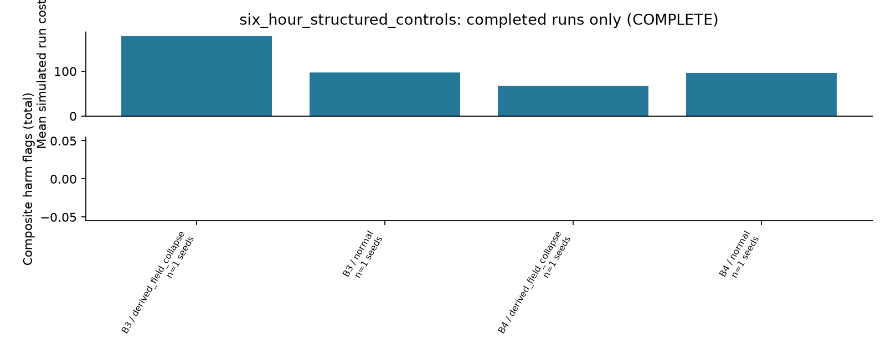

Descriptive simulated outcomes from completed cells; exposure and panel differ across stages. The harmful execution count combines distinct mechanisms detailed in the table.


## Paired inference — complete thirty-seed grids only

Inference remains pending for partial studies and is withheld for pilots with fewer than thirty configured independent seeds. For complete grids, repository paired_comparisons.csv uses per-seed origin averages, 5,000 paired bootstrap resamples (seed 42), unadjusted 95% intervals, Wilcoxon signed-rank p-values and Holm adjustment over the repository's within-study comparison family. These intervals do not establish statistical power or equivalence.

The frozen direct gate contrast is B10 minus B9 for cost, fill_rate and harmful_executions, across all scenarios configured in the local agent study. It uses the same paired bootstrap/Wilcoxon method after every configured seed and origin completes. Holm adjusts that contrast's fixed metric × scenario family separately from the repository's first-policy-reference family. Negative cost/harm differences favor B10; positive fill differences favor B10. Reported 95% bootstrap intervals are not adjusted for multiplicity. No significance is computed here from partial data.


## main_study_stage1 paired comparisons

Pending: 20/480 runs complete. No paired significance table is generated for this incomplete grid.


## foundation_30series paired comparisons

Pending: 0/360 runs complete. No paired significance table is generated for this incomplete grid.


## llm_prose_reference_30series paired comparisons

Pending: 1/360 runs complete. No paired significance table is generated for this incomplete grid.


## llm_prose_study_ollama paired comparisons

Pending: 0/540 runs complete. No paired significance table is generated for this incomplete grid.


## llm_prose_study_reference paired comparisons

Repository reference comparisons (policy minus reference):

| Scenario / contrast | Metric | Pairs | Mean difference | 95% bootstrap CI | Holm p |
| --- | --- | --- | --- | --- | --- |
| derived_field_collapse / B4-B3 | cost | 30 | -101.199 | [-108.277, -94.681] | 0.00000 |
| derived_field_collapse / B4-B3 | fill_rate | 30 | 0.000 | [0.000, 0.000] | 1.00000 |
| derived_field_collapse / B4-B3 | harmful_executions | 30 | -0.833 | [-1.067, -0.600] | 0.00009 |
| normal / B4-B3 | cost | 30 | -1.190 | [-3.139, 0.000] | 0.71885 |
| normal / B4-B3 | fill_rate | 30 | 0.000 | [0.000, 0.000] | 1.00000 |
| normal / B4-B3 | harmful_executions | 30 | 0.000 | [0.000, 0.000] | 1.00000 |


## llm_template_architectures_30series paired comparisons

Pending: 0/900 runs complete. No paired significance table is generated for this incomplete grid.


## Validation and reproducibility checks

Recorded existing test-suite validation: passed=97, failed=0, skipped=1. Skip reason: optional anthropic package not installed. This is the recorded validation manifest; report generation does not rerun the suite.

Dataset acquisition provenance: scripts/fetch_m5.py downloaded the Nixtla public mirror and restored missing id/day labels without changing sales/prices/date values

Local Ollama recorded setup: {"binary_sha256": "c94aa4156b3d13e64ebc2efe5ea53f015384c882be776e6695cfb37fb180d5ad", "model_digest": "bd9b617abc6c2ec05ebeac915201900320377281168b3949032799cc8f20d51d", "model_identity": "results/run_configs/ollama_model_identity.json", "model_loaded_for_inference": false, "registry_connectivity": "Official manifest, model blob and other blobs downloaded over TLS; SHA256 and sizes verified; native pull succeeded", "version": "0.40.0"}

results/logs/ml_m5_replay.json: {"action_matches": true, "chain_valid": true, "decision_id": "B4-normal-seed7-origin0:day1800", "held": false, "independent_violations": [], "mode": "cached external evidence/tool replay; does not re-call the LLM or retrain forecasts", "objective_difference": 0.0, "problem_reconstruction_matches": true, "problem_wire_hash_matches": true, "recorded_action_hash": "cba7105ab172cb685fd367cb5b756f4a69a436786d8379d76bea884ec2644099", "replay_status": "exact action match", "replayed_action_hash": "cba7105ab172cb685fd367cb5b756f4a69a436786d8379d76bea884ec2644099", "state_certificate_matches": true}

results/logs/ml_m5_trace_audit.json: {"artifacts_hash_verified": true, "completeness": 1.0, "consumption_precision": 1.0, "consumption_recall": 0.9, "note": "Consumption is instrumentation evidence, not proof that every consumed field was decisive. No neural chain-of-thought claims."}

Sample replay and trace-audit results validate their selected recorded decisions; they are not audits of every pending study run or re-executions of an LLM. Live functional and grounding validation are reported separately from these cached replay checks.


## Reproducibility and artifact provenance

Current checkout commit: bbe3bbcad24291994fbc70fb329f165d2d97bb96. Tracked working-tree changes at report time: none. This attests the current checkout only; original per-run manifests do not necessarily contain a code SHA. Run configuration, environment and data evidence are taken from their actual artifacts. report_input_hashes.json records SHA-256 for every input file used by this report.

Launch protocol recorded code commit: bbe3bbcad24291994fbc70fb329f165d2d97bb96; model: ega-llama3.2:3b-cloud30; model revision: bd9b617abc6c2ec05ebeac915201900320377281168b3949032799cc8f20d51d. Models selected for the bounded study are identified separately in their current identity and frozen run configs. Findings from earlier local or historical hosted models cannot be inherited by a changed-model run.

Launch protocol's recorded scope: No model selection or gate retuning on evaluation windows Current required/auxiliary stage settings in the execution table take precedence if the registered scope has since expanded.

Launch protocol's recorded scope: Local 3b model is different from repository Cerebras study; cannot inherit historical provider findings Current required/auxiliary stage settings in the execution table take precedence if the registered scope has since expanded.

Launch protocol's recorded scope: M5 historical sales proxy; inventory, supply, documents and perturbations simulated Current required/auxiliary stage settings in the execution table take precedence if the registered scope has since expanded.

Launch protocol's recorded scope: Full 6120-run deterministic config and Chronos foundation baseline are separate extensions; not silently treated as executed Current required/auxiliary stage settings in the execution table take precedence if the registered scope has since expanded.


### Execution protocol

```yaml
agentic_prose: 30 series, 30 simulation seeds, three rolling origins 1830/1858/1886,
  28 decisions per origin; B4/B9/B10, no forecast override
architectures: 'Matched 30-series B6/B7/B8/B9/B10 template comparison: 900 runs; earlier
  2-series pilot is development only'
code_commit: bbe3bbcad24291994fbc70fb329f165d2d97bb96
compute_preference:
  all_30_series: true
  time_limit_days: null
  user_choice: Continue on this CPU instance despite the long runtime
created_utc: '2026-10-07T18:35:07.313197+00:00'
freeze_status: Actual verified model digest frozen; development validation/resource
  preflight precede evaluation
limitations:
- No model selection or gate retuning on evaluation windows
- Local 3b model is different from repository Cerebras study; cannot inherit historical
  provider findings
- M5 historical sales proxy; inventory, supply, documents and perturbations simulated
- Full 6120-run deterministic config and Chronos foundation baseline are separate
  extensions; not silently treated as executed
local_model_plan:
  batch_rationale: 'Selected during separate day1700 development before any evaluation:
    batch16 returned one rule for15 documents in both carriers. Process one source
    per request to avoid observed multi-document omission. Identical common setting
    for matched LLM arms; no template fallback.'
  context_tokens: 32768
  cpu_threads: 2
  development_day: 1700
  document_batch_size: 1
  max_calls_per_run: 15000
  name: ega-llama3.2:3b-cloud30
  previous_batch16_development: results/local_model_development_30series_batch16
  purpose: Avoid context truncation and artificial budget holds on 30-series decisions
  revision: bd9b617abc6c2ec05ebeac915201900320377281168b3949032799cc8f20d51d
model: ega-llama3.2:3b-cloud30
model_revision: bd9b617abc6c2ec05ebeac915201900320377281168b3949032799cc8f20d51d
provider: local Ollama
reference: 'Matched 30-series B3/B4 template control: 360 runs; earlier ten-series
  reference retained as auxiliary'
stage1: 'repository frozen stage1: 480 runs, 30 seeds, 30 series, 28 days'
user_dissertation:
  alignment: results/run_configs/dissertation_alignment.json
  filename: dissertation_revised_business_school.html
  sha256: 8ae699667fa02f932f4c2584af0a3895021dc925e3119412bb06b238dc87de1c
```

| Raw M5 source | SHA-256 recorded by preparation manifest |
| --- | --- |
| calendar.csv | f9295292394975908e04ac77898c2304cbd499a2c466b2b9ce6f04079675bf16 |
| sales_train_evaluation.csv | 4b4a47c44c38380d2a9168216fea8c9ff2f31b1ddb772f8a0995952a038b8aa0 |
| sell_prices.csv | 5c7cf045b1abbdc8d5007809c40b3682c5216075937f93e2cef01caddc4a30d9 |

The raw-source hashes above are recorded by the prepared-data manifests; report generation does not independently rehash large raw files. Per-panel catalog hashes and complete safe config snapshots are included in the HTML/Markdown and report_data.json. The input hash inventory permits detecting changes between report snapshots.


## Lossless object packing and full-trace access

Current configured run artifacts with recognized packing manifests: 393. Packing stores the full original content-addressed JSON object inventory in artifacts/objects.zip and keeps the first three trace/certificate/proposal objects loose for standard reports. Missing loose copies of archived objects are not missing data when the inventory, archive and provenance verify. Summaries, daily rows, trace indices and the SQLite audit chain remain separate artifacts.

| Stage | Packed/restored runs | Trace decisions available | Loose trace decisions | ZIP logical bytes |
| --- | --- | --- | --- | --- |
| main_study_stage1 | 20 | 560 | 60 | 48,330,604 |
| llm_prose_reference_30series | 1 | 28 | 3 | 3,469,164 |
| six_hour_agentic_prose | 8 | 16 | 16 | 668,635 |
| six_hour_numeric | 96 | 672 | 296 | 28,882,510 |
| six_hour_numeric_extension | 264 | 1848 | 792 | 79,502,118 |
| six_hour_structured_controls | 4 | 8 | 8 | 357,870 |

The report checks current archive SHA/size, exact ZIP-member inventory, original inventory hash and unchanged run provenance. Archive SHA checks are reused only for the same file identity, size, modification time and expected checksum. Packing records attest byte-by-byte verification of original objects and the actual audit chain before removal. Full trace indices remain counted even when only three trace objects are loose.

Packing helper validation used a copied fixture, not experiment-output modification: original objects=367; retained after packing=9; archive bytes=2417610; actual outputs modified=False. These helper checks do not imply that all real study runs have been packed or independently audited.

This report's selected-object ZIP reader was checked on a copied fixture: archive/loose JSON equality=True; unknown reference refused=True; whole-run restoration performed by that check=False; actual experiment outputs modified=False.

Selected JSON can be read directly with this generator's PackedArtifactReader, which validates the requested object's original SHA-256 and byte length without whole-run restoration. Existing full replay, audit, grounding-artifact inspection and human-packet tools need restoration unless they explicitly use such a ZIP reader. Restore the CURRENT run directory with /workspace/MasterDissertation/.venv/bin/python /workspace/tools/m5_pack_artifacts.py --restore <CURRENT_RUN_DIRECTORY>; use the current merged location rather than a former worker path. This report performs no restoration or packing.

| Stage | Input config SHA-256 |
| --- | --- |
| m5_smoke | 107d0cc30a834c4a04b45ef40b9ce9824924a27a8564bb740d6f2edf80b263e2 |
| ml_m5_smoke | d64f153ca37d80bd161c42a02fd9693ee0568b674f7e6e409dd98c353a998bac |
| baseline_pilot | 83955a0d49aa3c1ea79915d70ed22dee7fdbfcefd383cacae112815a95fbff7d |
| main_study_stage1 | b7df6c95d2d9dbfd9498ff314410209aa990a6237d283a445cc76b535c9b7764 |
| foundation_30series | a7b0542cbbe82b982bfa88b3365fc6382026a9140e7bbfad15d90f8104818a12 |
| llm_architectures_ollama | 3116ecb7b5859832f91fce050c01fb767121004700d20f1b9824bcb14fc20980 |
| llm_prose_reference_30series | 1cacb94fbc971705a142d945077b26be9b8c4780c446bcc7ab5b662fd3bbc0c7 |
| llm_prose_study_ollama | 0256bd45b8ec754c2fbf162f2aeaa0858fa3548cc8f5dbe0f0c77298529a6cfe |
| llm_prose_study_reference | 0e57d47bcbc5950eb9c821f3b6632e9d4e0fb5875acfd36176de88454765d943 |
| llm_template_architectures_30series | cc0fc00f3f27c1ba4337c6449f10ae6780843e91e1f51b41010c3637baf7b14a |
| parallel_runner_validation | 94a0c8ef793b031ed8e4b3ae872ffff6f304ce37c29a7ac9136f4e40197d8e1d |
| six_hour_agentic_prose | 4b70312c0f8aaec3bb29b185e612c356d0e18ddcaf07f3018ae76b738e2a0a78 |
| six_hour_numeric | d56fedc68e3e4a1ebdf4fc8d2db576149ab28dbf5602a9affa49908ab647e91b |
| six_hour_numeric_extension | d400722b69a70caab08615840a5bea23019e3f9784dc243ef5c777897ceb2e88 |
| six_hour_structured_controls | a3656550ba05e697ec0e99a5e084e93d0bce464b0d101f693d14f5302fb8634c |


### m5_smoke input configuration

```yaml
dataset: data/processed/m5_smoke
days: 4
output: results/m5_smoke
policies:
- B1
- D0
- D1
quality:
  calibrated: false
  version: synthetic-v1-NOT-telemetry-calibrated
scenarios:
- normal
- feed_gap
- derived_field_collapse
- foreign_unit_moq
seeds:
- 7
solver:
  horizon: 6
  scenarios: 4
  time_limit: 10
start_day: 1800
warmup_days: 4
```


### m5_smoke resolved configuration (observed output/first worker)

```yaml
approval_delay: 1
approval_mode: hold
dataset: data/processed/m5_smoke
days: 4
document_carrier: template
escalation_cost: 2.0
forecast:
  censor_correction: true
  chronos_model: amazon/chronos-t5-tiny
  chronos_revision: null
  deep_epochs: 5
  hidden_size: 32
  lgbm_estimators: 80
  lookback: 56
  max_training_windows: 6000
  service_quantile: 0.95
forecast_override: null
gate:
  fixed_level: full
  full_quality: 0.95
  hold_budget: 2
  injection_screen: true
  max_days_supply: 45.0
  max_deviation: null
  max_dispersion: 4.0
  max_feed_age: 1
  max_spend: 1500.0
  max_spend_deviation: 0.03
  min_confidence: 0.9
  min_quality: 0.7
  two_person_spend: 2500.0
  version: gate-v2-spend-deviation-2026-10-06
harmful_abs_tolerance: 12.0
harmful_cost: 100.0
harmful_rel_tolerance: 0.5
llm:
  api_key_env: EGA_LLM_API_KEY
  base_url: http://localhost:11434/v1
  document_batch_size: 6
  effort: medium
  enabled: false
  fallbacks: true
  input_usd_per_mtok: 0.0
  json_mode: schema
  max_calls: 500
  max_cost_usd: null
  max_tokens: 2500
  model: ''
  model_revision: unrecorded
  on_failure: hold
  output_usd_per_mtok: 0.0
  provider: openai_compatible
  rate_limit_max_wait: 120.0
  rate_limit_retries: 30
  retries: 1
  seed: 42
  spend_ledger: results/llm_spend.json
  temperature: 0.0
  timeout: 60.0
  use_memory: true
oracle: true
origin_stride: 28
origins: 1
output: results/m5_smoke
policies:
- B1
- D0
- D1
quality:
  calibrated: false
  calibration_file: null
  magnitude: 2.0
  max_duration: 3
  min_duration: 1
  onset_rate: 0.04
  rate_multiplier: 1.0
  version: synthetic-v1-NOT-telemetry-calibrated
scenarios:
- normal
- feed_gap
- derived_field_collapse
- foreign_unit_moq
seeds:
- 7
solver:
  allow_transfers: true
  budget: 3000.0
  cvar_alpha: 0.95
  holding_rate: 0.015
  horizon: 6
  max_order_units: 1000
  mip_gap: 0.001
  risk_weight: 0.1
  scenarios: 4
  shortage_multiplier: 5.0
  storage_per_location: 10000.0
  time_limit: 10.0
  transfer_cost: 0.3
  transfer_lead: 1
start_day: 1800
trace_every: 1
warmup_days: 4
```


### m5_smoke recorded runtime packages

```yaml
packages:
  PyYAML: 6.0.3
  filelock: 3.32.7
  httpx: 0.28.1
  lightgbm: 4.7.0
  numpy: 2.3.5
  pandas: 2.2.3
  pydantic: 2.13.4
  scipy: 1.17.0
  torch: 2.10.0+cpu
platform: Linux-6.18.44-x86_64-with-glibc2.41
python: 3.12.14
```


### ml_m5_smoke input configuration

```yaml
dataset: data/processed/m5_smoke
days: 4
output: results/ml_m5_smoke
policies:
- B1
- B2
- B3
- B4
quality:
  calibrated: false
  version: synthetic-v1-NOT-telemetry-calibrated
scenarios:
- normal
- feed_gap
- derived_field_collapse
- foreign_unit_moq
seeds:
- 7
solver:
  horizon: 6
  scenarios: 4
  time_limit: 10
start_day: 1800
warmup_days: 4
```


### ml_m5_smoke resolved configuration (observed output/first worker)

```yaml
approval_delay: 1
approval_mode: hold
dataset: data/processed/m5_smoke
days: 4
document_carrier: template
escalation_cost: 2.0
forecast:
  censor_correction: true
  chronos_model: amazon/chronos-t5-tiny
  chronos_revision: null
  deep_epochs: 5
  hidden_size: 32
  lgbm_estimators: 80
  lookback: 56
  max_training_windows: 6000
  service_quantile: 0.95
forecast_override: null
gate:
  fixed_level: full
  full_quality: 0.95
  hold_budget: 2
  injection_screen: true
  max_days_supply: 45.0
  max_deviation: null
  max_dispersion: 4.0
  max_feed_age: 1
  max_spend: 1500.0
  max_spend_deviation: 0.03
  min_confidence: 0.9
  min_quality: 0.7
  two_person_spend: 2500.0
  version: gate-v2-spend-deviation-2026-10-06
harmful_abs_tolerance: 12.0
harmful_cost: 100.0
harmful_rel_tolerance: 0.5
llm:
  api_key_env: EGA_LLM_API_KEY
  base_url: http://localhost:11434/v1
  document_batch_size: 6
  effort: medium
  enabled: false
  fallbacks: true
  input_usd_per_mtok: 0.0
  json_mode: schema
  max_calls: 500
  max_cost_usd: null
  max_tokens: 2500
  model: ''
  model_revision: unrecorded
  on_failure: hold
  output_usd_per_mtok: 0.0
  provider: openai_compatible
  rate_limit_max_wait: 120.0
  rate_limit_retries: 30
  retries: 1
  seed: 42
  spend_ledger: results/llm_spend.json
  temperature: 0.0
  timeout: 60.0
  use_memory: true
oracle: true
origin_stride: 28
origins: 1
output: results/ml_m5_smoke
policies:
- B1
- B2
- B3
- B4
quality:
  calibrated: false
  calibration_file: null
  magnitude: 2.0
  max_duration: 3
  min_duration: 1
  onset_rate: 0.04
  rate_multiplier: 1.0
  version: synthetic-v1-NOT-telemetry-calibrated
scenarios:
- normal
- feed_gap
- derived_field_collapse
- foreign_unit_moq
seeds:
- 7
solver:
  allow_transfers: true
  budget: 3000.0
  cvar_alpha: 0.95
  holding_rate: 0.015
  horizon: 6
  max_order_units: 1000
  mip_gap: 0.001
  risk_weight: 0.1
  scenarios: 4
  shortage_multiplier: 5.0
  storage_per_location: 10000.0
  time_limit: 10.0
  transfer_cost: 0.3
  transfer_lead: 1
start_day: 1800
trace_every: 1
warmup_days: 4
```


### ml_m5_smoke recorded runtime packages

```yaml
packages:
  PyYAML: 6.0.3
  filelock: 3.32.7
  httpx: 0.28.1
  lightgbm: 4.7.0
  numpy: 2.3.5
  pandas: 2.2.3
  pydantic: 2.13.4
  scipy: 1.17.0
  torch: 2.10.0+cpu
platform: Linux-6.18.44-x86_64-with-glibc2.41
python: 3.12.14
```


### baseline_pilot input configuration

```yaml
approval_delay: 1
approval_mode: oracle
dataset: data/processed/m5
days: 7
forecast:
  deep_epochs: 10
  lgbm_estimators: 150
  max_training_windows: 12000
origin_stride: 28
origins: 1
output: results/baseline_pilot
policies:
- B1
- B2
- B3
- B4
quality:
  calibrated: false
  max_duration: 5
  min_duration: 1
  onset_rate: 0.025
  version: synthetic-control-v1-NOT-calibrated
scenarios:
- normal
- derived_field_collapse
seeds:
- 7
- 29
solver:
  cvar_alpha: 0.95
  horizon: 14
  risk_weight: 0.1
  scenarios: 16
  time_limit: 60
start_day: 1830
warmup_days: 14
```


### baseline_pilot resolved configuration (observed output/first worker)

```yaml
approval_delay: 1
approval_mode: oracle
dataset: data/processed/m5
days: 7
document_carrier: template
escalation_cost: 2.0
forecast:
  censor_correction: true
  chronos_model: amazon/chronos-t5-tiny
  chronos_revision: null
  deep_epochs: 10
  hidden_size: 32
  lgbm_estimators: 150
  lookback: 56
  max_training_windows: 12000
  service_quantile: 0.95
forecast_override: null
gate:
  fixed_level: full
  full_quality: 0.95
  hold_budget: 2
  injection_screen: true
  max_days_supply: 45.0
  max_deviation: null
  max_dispersion: 4.0
  max_feed_age: 1
  max_spend: 1500.0
  max_spend_deviation: 0.03
  min_confidence: 0.9
  min_quality: 0.7
  two_person_spend: 2500.0
  version: gate-v2-spend-deviation-2026-10-06
harmful_abs_tolerance: 12.0
harmful_cost: 100.0
harmful_rel_tolerance: 0.5
llm:
  api_key_env: EGA_LLM_API_KEY
  base_url: http://localhost:11434/v1
  document_batch_size: 6
  effort: medium
  enabled: false
  fallbacks: true
  input_usd_per_mtok: 0.0
  json_mode: schema
  max_calls: 500
  max_cost_usd: null
  max_tokens: 2500
  model: ''
  model_revision: unrecorded
  on_failure: hold
  output_usd_per_mtok: 0.0
  provider: openai_compatible
  rate_limit_max_wait: 120.0
  rate_limit_retries: 30
  retries: 1
  seed: 42
  spend_ledger: results/llm_spend.json
  temperature: 0.0
  timeout: 60.0
  use_memory: true
oracle: true
origin_stride: 28
origins: 1
output: results/baseline_pilot
policies:
- B1
- B2
- B3
- B4
quality:
  calibrated: false
  calibration_file: null
  magnitude: 2.0
  max_duration: 5
  min_duration: 1
  onset_rate: 0.025
  rate_multiplier: 1.0
  version: synthetic-control-v1-NOT-calibrated
scenarios:
- normal
- derived_field_collapse
seeds:
- 7
- 29
solver:
  allow_transfers: true
  budget: 3000.0
  cvar_alpha: 0.95
  holding_rate: 0.015
  horizon: 14
  max_order_units: 1000
  mip_gap: 0.001
  risk_weight: 0.1
  scenarios: 16
  shortage_multiplier: 5.0
  storage_per_location: 10000.0
  time_limit: 60.0
  transfer_cost: 0.3
  transfer_lead: 1
start_day: 1830
trace_every: 1
warmup_days: 14
```


### baseline_pilot recorded runtime packages

```yaml
packages:
  PyYAML: 6.0.3
  filelock: 3.32.7
  httpx: 0.28.1
  lightgbm: 4.7.0
  numpy: 2.3.5
  pandas: 2.2.3
  pydantic: 2.13.4
  scipy: 1.17.0
  torch: 2.10.0+cpu
platform: Linux-6.18.44-x86_64-with-glibc2.41
python: 3.12.14
```


### main_study_stage1 input configuration

```yaml
approval_delay: 1
approval_mode: oracle
dataset: data/processed/m5
days: 28
forecast:
  deep_epochs: 10
  lgbm_estimators: 150
  max_training_windows: 12000
origin_stride: 28
origins: 1
output: results/main_study_stage1
policies:
- B1
- B2
- B3
- B4
quality:
  calibrated: false
  max_duration: 5
  min_duration: 1
  onset_rate: 0.025
  version: synthetic-control-v1-NOT-calibrated
scenarios:
- normal
- feed_gap
- derived_field_collapse
- foreign_unit_moq
seeds:
- 0
- 1
- 2
- 3
- 4
- 5
- 6
- 7
- 8
- 9
- 10
- 11
- 12
- 13
- 14
- 15
- 16
- 17
- 18
- 19
- 20
- 21
- 22
- 23
- 24
- 25
- 26
- 27
- 28
- 29
solver:
  cvar_alpha: 0.95
  horizon: 14
  risk_weight: 0.1
  scenarios: 16
  time_limit: 60
start_day: 1830
warmup_days: 14
```


### main_study_stage1 resolved configuration (observed output/first worker)

```yaml
approval_delay: 1
approval_mode: oracle
dataset: data/processed/m5
days: 28
document_carrier: template
escalation_cost: 2.0
forecast:
  censor_correction: true
  chronos_model: amazon/chronos-t5-tiny
  chronos_revision: null
  deep_epochs: 10
  hidden_size: 32
  lgbm_estimators: 150
  lookback: 56
  max_training_windows: 12000
  service_quantile: 0.95
forecast_override: null
gate:
  fixed_level: full
  full_quality: 0.95
  hold_budget: 2
  injection_screen: true
  max_days_supply: 45.0
  max_deviation: null
  max_dispersion: 4.0
  max_feed_age: 1
  max_spend: 1500.0
  max_spend_deviation: 0.03
  min_confidence: 0.9
  min_quality: 0.7
  two_person_spend: 2500.0
  version: gate-v2-spend-deviation-2026-10-06
harmful_abs_tolerance: 12.0
harmful_cost: 100.0
harmful_rel_tolerance: 0.5
llm:
  api_key_env: EGA_LLM_API_KEY
  base_url: http://localhost:11434/v1
  document_batch_size: 6
  effort: medium
  enabled: false
  fallbacks: true
  input_usd_per_mtok: 0.0
  json_mode: schema
  max_calls: 500
  max_cost_usd: null
  max_tokens: 2500
  model: ''
  model_revision: unrecorded
  on_failure: hold
  output_usd_per_mtok: 0.0
  provider: openai_compatible
  rate_limit_max_wait: 120.0
  rate_limit_retries: 30
  retries: 1
  seed: 42
  spend_ledger: results/llm_spend.json
  temperature: 0.0
  timeout: 60.0
  use_memory: true
oracle: true
origin_stride: 28
origins: 1
output: /workspace/MasterDissertation/results/main_study_stage1_workers/w0
policies:
- B1
- B2
- B3
- B4
quality:
  calibrated: false
  calibration_file: null
  magnitude: 2.0
  max_duration: 5
  min_duration: 1
  onset_rate: 0.025
  rate_multiplier: 1.0
  version: synthetic-control-v1-NOT-calibrated
scenarios:
- normal
- feed_gap
- derived_field_collapse
- foreign_unit_moq
seeds:
- 0
- 3
- 6
- 9
- 12
- 15
- 18
- 21
- 24
- 27
solver:
  allow_transfers: true
  budget: 3000.0
  cvar_alpha: 0.95
  holding_rate: 0.015
  horizon: 14
  max_order_units: 1000
  mip_gap: 0.001
  risk_weight: 0.1
  scenarios: 16
  shortage_multiplier: 5.0
  storage_per_location: 10000.0
  time_limit: 60.0
  transfer_cost: 0.3
  transfer_lead: 1
start_day: 1830
trace_every: 1
warmup_days: 14
```


### main_study_stage1 recorded runtime packages

```yaml
packages:
  PyYAML: 6.0.3
  filelock: 3.32.7
  httpx: 0.28.1
  lightgbm: 4.7.0
  numpy: 2.3.5
  pandas: 2.2.3
  pydantic: 2.13.4
  scipy: 1.17.0
  torch: 2.10.0+cpu
platform: Linux-6.18.44-x86_64-with-glibc2.41
python: 3.12.14
```


### foundation_30series input configuration

```yaml
approval_delay: 1
approval_mode: oracle
dataset: data/processed/m5
days: 28
forecast:
  chronos_model: amazon/chronos-t5-tiny
  chronos_revision: null
origin_stride: 28
origins: 3
output: results/foundation_30series
policies:
- B1
- B5
scenarios:
- normal
- derived_field_collapse
seeds:
- 0
- 1
- 2
- 3
- 4
- 5
- 6
- 7
- 8
- 9
- 10
- 11
- 12
- 13
- 14
- 15
- 16
- 17
- 18
- 19
- 20
- 21
- 22
- 23
- 24
- 25
- 26
- 27
- 28
- 29
solver:
  cvar_alpha: 0.95
  horizon: 14
  risk_weight: 0.1
  scenarios: 16
  time_limit: 60
start_day: 1830
warmup_days: 14
```


### llm_architectures_ollama input configuration

```yaml
approval_delay: 1
approval_mode: oracle
dataset: data/processed/m5_smoke
days: 4
forecast:
  deep_epochs: 3
llm:
  base_url: http://localhost:11434/v1
  document_batch_size: 1
  enabled: true
  json_mode: schema
  max_calls: 15000
  max_tokens: 4000
  model: ega-llama3.2:3b-cloud30
  model_revision: bd9b617abc6c2ec05ebeac915201900320377281168b3949032799cc8f20d51d
  on_failure: hold
  provider: openai_compatible
  retries: 1
  spend_ledger: results/llm_architectures_ollama_spend.json
  temperature: 0
  timeout: 600
  use_memory: true
output: results/llm_architectures_ollama
policies:
- B4
- B6
- B7
- B8
- B9
- B10
quality:
  calibrated: false
scenarios:
- normal
- derived_field_collapse
- injection
seeds:
- 42
solver:
  horizon: 10
  scenarios: 8
  time_limit: 30
start_day: 1800
warmup_days: 7
```


### llm_prose_reference_30series input configuration

```yaml
approval_delay: 1
approval_mode: oracle
dataset: data/processed/m5
days: 28
document_carrier: template
forecast:
  deep_epochs: 10
  lgbm_estimators: 150
  max_training_windows: 12000
origin_stride: 28
origins: 3
output: results/llm_prose_reference_30series
policies:
- B3
- B4
quality:
  calibrated: false
  max_duration: 5
  min_duration: 1
  onset_rate: 0.025
  version: synthetic-control-v1-NOT-calibrated
scenarios:
- normal
- derived_field_collapse
seeds:
- 0
- 1
- 2
- 3
- 4
- 5
- 6
- 7
- 8
- 9
- 10
- 11
- 12
- 13
- 14
- 15
- 16
- 17
- 18
- 19
- 20
- 21
- 22
- 23
- 24
- 25
- 26
- 27
- 28
- 29
solver:
  cvar_alpha: 0.95
  horizon: 14
  risk_weight: 0.1
  scenarios: 16
  time_limit: 60
start_day: 1830
warmup_days: 14
```


### llm_prose_reference_30series resolved configuration (observed output/first worker)

```yaml
approval_delay: 1
approval_mode: oracle
dataset: data/processed/m5
days: 28
document_carrier: template
escalation_cost: 2.0
forecast:
  censor_correction: true
  chronos_model: amazon/chronos-t5-tiny
  chronos_revision: null
  deep_epochs: 10
  hidden_size: 32
  lgbm_estimators: 150
  lookback: 56
  max_training_windows: 12000
  service_quantile: 0.95
forecast_override: null
gate:
  fixed_level: full
  full_quality: 0.95
  hold_budget: 2
  injection_screen: true
  max_days_supply: 45.0
  max_deviation: null
  max_dispersion: 4.0
  max_feed_age: 1
  max_spend: 1500.0
  max_spend_deviation: 0.03
  min_confidence: 0.9
  min_quality: 0.7
  two_person_spend: 2500.0
  version: gate-v2-spend-deviation-2026-10-06
harmful_abs_tolerance: 12.0
harmful_cost: 100.0
harmful_rel_tolerance: 0.5
llm:
  api_key_env: EGA_LLM_API_KEY
  base_url: http://localhost:11434/v1
  document_batch_size: 6
  effort: medium
  enabled: false
  fallbacks: true
  input_usd_per_mtok: 0.0
  json_mode: schema
  max_calls: 500
  max_cost_usd: null
  max_tokens: 2500
  model: ''
  model_revision: unrecorded
  on_failure: hold
  output_usd_per_mtok: 0.0
  provider: openai_compatible
  rate_limit_max_wait: 120.0
  rate_limit_retries: 30
  retries: 1
  seed: 42
  spend_ledger: results/llm_spend.json
  temperature: 0.0
  timeout: 60.0
  use_memory: true
oracle: true
origin_stride: 28
origins: 3
output: /workspace/MasterDissertation/results/llm_prose_reference_30series_workers/w0
policies:
- B3
- B4
quality:
  calibrated: false
  calibration_file: null
  magnitude: 2.0
  max_duration: 5
  min_duration: 1
  onset_rate: 0.025
  rate_multiplier: 1.0
  version: synthetic-control-v1-NOT-calibrated
scenarios:
- normal
- derived_field_collapse
seeds:
- 0
- 1
- 2
- 3
- 4
- 5
- 6
- 7
- 8
- 9
- 10
- 11
- 12
- 13
- 14
- 15
- 16
- 17
- 18
- 19
- 20
- 21
- 22
- 23
- 24
- 25
- 26
- 27
- 28
- 29
solver:
  allow_transfers: true
  budget: 3000.0
  cvar_alpha: 0.95
  holding_rate: 0.015
  horizon: 14
  max_order_units: 1000
  mip_gap: 0.001
  risk_weight: 0.1
  scenarios: 16
  shortage_multiplier: 5.0
  storage_per_location: 10000.0
  time_limit: 60.0
  transfer_cost: 0.3
  transfer_lead: 1
start_day: 1830
trace_every: 1
warmup_days: 14
```


### llm_prose_reference_30series recorded runtime packages

```yaml
packages:
  PyYAML: 6.0.3
  chronos-forecasting: 2.3.2
  filelock: 3.32.7
  httpx: 0.28.1
  lightgbm: 4.7.0
  numpy: 2.3.5
  pandas: 2.2.3
  pydantic: 2.13.4
  scipy: 1.17.0
  torch: 2.10.0+cpu
platform: Linux-6.18.44-x86_64-with-glibc2.41
python: 3.12.14
```


### llm_prose_study_ollama input configuration

```yaml
approval_delay: 1
approval_mode: oracle
dataset: data/processed/m5
days: 28
document_carrier: prose
forecast:
  deep_epochs: 10
  lgbm_estimators: 150
  max_training_windows: 12000
llm:
  base_url: http://localhost:11434/v1
  document_batch_size: 1
  enabled: true
  json_mode: schema
  max_calls: 15000
  max_tokens: 4000
  model: ega-llama3.2:3b-cloud30
  model_revision: bd9b617abc6c2ec05ebeac915201900320377281168b3949032799cc8f20d51d
  on_failure: hold
  provider: openai_compatible
  retries: 1
  spend_ledger: results/llm_prose_study_ollama_spend.json
  temperature: 0
  timeout: 600
  use_memory: true
origin_stride: 28
origins: 3
output: results/llm_prose_study_ollama
policies:
- B4
- B9
- B10
quality:
  calibrated: false
  max_duration: 5
  min_duration: 1
  onset_rate: 0.025
  version: synthetic-control-v1-NOT-calibrated
scenarios:
- normal
- derived_field_collapse
seeds:
- 0
- 1
- 2
- 3
- 4
- 5
- 6
- 7
- 8
- 9
- 10
- 11
- 12
- 13
- 14
- 15
- 16
- 17
- 18
- 19
- 20
- 21
- 22
- 23
- 24
- 25
- 26
- 27
- 28
- 29
solver:
  cvar_alpha: 0.95
  horizon: 14
  risk_weight: 0.1
  scenarios: 16
  time_limit: 60
start_day: 1830
warmup_days: 14
```


### llm_prose_study_reference input configuration

```yaml
approval_delay: 1
approval_mode: oracle
dataset: data/processed/m5_item1
days: 4
document_carrier: template
forecast:
  deep_epochs: 10
  lgbm_estimators: 150
  max_training_windows: 12000
origin_stride: 28
origins: 1
output: results/llm_prose_study_reference
policies:
- B3
- B4
quality:
  calibrated: false
  max_duration: 5
  min_duration: 1
  onset_rate: 0.025
  version: synthetic-control-v1-NOT-calibrated
scenarios:
- normal
- derived_field_collapse
seeds:
- 0
- 1
- 2
- 3
- 4
- 5
- 6
- 7
- 8
- 9
- 10
- 11
- 12
- 13
- 14
- 15
- 16
- 17
- 18
- 19
- 20
- 21
- 22
- 23
- 24
- 25
- 26
- 27
- 28
- 29
solver:
  cvar_alpha: 0.95
  horizon: 14
  risk_weight: 0.1
  scenarios: 16
  time_limit: 60
start_day: 1830
warmup_days: 14
```


### llm_prose_study_reference resolved configuration (observed output/first worker)

```yaml
approval_delay: 1
approval_mode: oracle
dataset: data/processed/m5_item1
days: 4
document_carrier: template
escalation_cost: 2.0
forecast:
  censor_correction: true
  chronos_model: amazon/chronos-t5-tiny
  chronos_revision: null
  deep_epochs: 10
  hidden_size: 32
  lgbm_estimators: 150
  lookback: 56
  max_training_windows: 12000
  service_quantile: 0.95
forecast_override: null
gate:
  fixed_level: full
  full_quality: 0.95
  hold_budget: 2
  injection_screen: true
  max_days_supply: 45.0
  max_deviation: null
  max_dispersion: 4.0
  max_feed_age: 1
  max_spend: 1500.0
  max_spend_deviation: 0.03
  min_confidence: 0.9
  min_quality: 0.7
  two_person_spend: 2500.0
  version: gate-v2-spend-deviation-2026-10-06
harmful_abs_tolerance: 12.0
harmful_cost: 100.0
harmful_rel_tolerance: 0.5
llm:
  api_key_env: EGA_LLM_API_KEY
  base_url: http://localhost:11434/v1
  document_batch_size: 6
  effort: medium
  enabled: false
  fallbacks: true
  input_usd_per_mtok: 0.0
  json_mode: schema
  max_calls: 500
  max_cost_usd: null
  max_tokens: 2500
  model: ''
  model_revision: unrecorded
  on_failure: hold
  output_usd_per_mtok: 0.0
  provider: openai_compatible
  rate_limit_max_wait: 120.0
  rate_limit_retries: 30
  retries: 1
  seed: 42
  spend_ledger: results/llm_spend.json
  temperature: 0.0
  timeout: 60.0
  use_memory: true
oracle: true
origin_stride: 28
origins: 1
output: /workspace/MasterDissertation/results/llm_prose_study_reference
policies:
- B3
- B4
quality:
  calibrated: false
  calibration_file: null
  magnitude: 2.0
  max_duration: 5
  min_duration: 1
  onset_rate: 0.025
  rate_multiplier: 1.0
  version: synthetic-control-v1-NOT-calibrated
scenarios:
- normal
- derived_field_collapse
seeds:
- 0
- 1
- 2
- 3
- 4
- 5
- 6
- 7
- 8
- 9
- 10
- 11
- 12
- 13
- 14
- 15
- 16
- 17
- 18
- 19
- 20
- 21
- 22
- 23
- 24
- 25
- 26
- 27
- 28
- 29
solver:
  allow_transfers: true
  budget: 3000.0
  cvar_alpha: 0.95
  holding_rate: 0.015
  horizon: 14
  max_order_units: 1000
  mip_gap: 0.001
  risk_weight: 0.1
  scenarios: 16
  shortage_multiplier: 5.0
  storage_per_location: 10000.0
  time_limit: 60.0
  transfer_cost: 0.3
  transfer_lead: 1
start_day: 1830
trace_every: 1
warmup_days: 14
```


### llm_prose_study_reference recorded runtime packages

```yaml
packages:
  PyYAML: 6.0.3
  chronos-forecasting: 2.3.2
  filelock: 3.32.7
  httpx: 0.28.1
  lightgbm: 4.7.0
  numpy: 2.3.5
  pandas: 2.2.3
  pydantic: 2.13.4
  scipy: 1.17.0
  torch: 2.10.0+cpu
platform: Linux-6.18.44-x86_64-with-glibc2.41
python: 3.12.14
```


### llm_template_architectures_30series input configuration

```yaml
approval_delay: 1
approval_mode: oracle
dataset: data/processed/m5
days: 28
document_carrier: template
forecast:
  deep_epochs: 10
  lgbm_estimators: 150
  max_training_windows: 12000
llm:
  base_url: http://localhost:11434/v1
  document_batch_size: 1
  enabled: true
  json_mode: schema
  max_calls: 15000
  max_tokens: 4000
  model: ega-llama3.2:3b-cloud30
  model_revision: bd9b617abc6c2ec05ebeac915201900320377281168b3949032799cc8f20d51d
  on_failure: hold
  provider: openai_compatible
  retries: 1
  spend_ledger: results/llm_template_architectures_30series_spend.json
  temperature: 0
  timeout: 600
  use_memory: true
origin_stride: 28
origins: 3
output: results/llm_template_architectures_30series
policies:
- B6
- B7
- B8
- B9
- B10
quality:
  calibrated: false
  max_duration: 5
  min_duration: 1
  onset_rate: 0.025
  version: synthetic-control-v1-NOT-calibrated
scenarios:
- normal
- derived_field_collapse
seeds:
- 0
- 1
- 2
- 3
- 4
- 5
- 6
- 7
- 8
- 9
- 10
- 11
- 12
- 13
- 14
- 15
- 16
- 17
- 18
- 19
- 20
- 21
- 22
- 23
- 24
- 25
- 26
- 27
- 28
- 29
solver:
  cvar_alpha: 0.95
  horizon: 14
  risk_weight: 0.1
  scenarios: 16
  time_limit: 60
start_day: 1830
warmup_days: 14
```


### parallel_runner_validation input configuration

```yaml
dataset: data/processed/m5_smoke
days: 1
output: results/parallel_runner_validation
policies:
- B1
- B2
- B3
- B4
quality:
  calibrated: false
  version: synthetic-v1-NOT-telemetry-calibrated
scenarios:
- normal
seeds:
- 7
- 29
solver:
  horizon: 6
  scenarios: 4
  time_limit: 10
start_day: 1800
warmup_days: 4
```


### parallel_runner_validation resolved configuration (observed output/first worker)

```yaml
approval_delay: 1
approval_mode: hold
dataset: data/processed/m5_smoke
days: 1
document_carrier: template
escalation_cost: 2.0
forecast:
  censor_correction: true
  chronos_model: amazon/chronos-t5-tiny
  chronos_revision: null
  deep_epochs: 5
  hidden_size: 32
  lgbm_estimators: 80
  lookback: 56
  max_training_windows: 6000
  service_quantile: 0.95
forecast_override: null
gate:
  fixed_level: full
  full_quality: 0.95
  hold_budget: 2
  injection_screen: true
  max_days_supply: 45.0
  max_deviation: null
  max_dispersion: 4.0
  max_feed_age: 1
  max_spend: 1500.0
  max_spend_deviation: 0.03
  min_confidence: 0.9
  min_quality: 0.7
  two_person_spend: 2500.0
  version: gate-v2-spend-deviation-2026-10-06
harmful_abs_tolerance: 12.0
harmful_cost: 100.0
harmful_rel_tolerance: 0.5
llm:
  api_key_env: EGA_LLM_API_KEY
  base_url: http://localhost:11434/v1
  document_batch_size: 6
  effort: medium
  enabled: false
  fallbacks: true
  input_usd_per_mtok: 0.0
  json_mode: schema
  max_calls: 500
  max_cost_usd: null
  max_tokens: 2500
  model: ''
  model_revision: unrecorded
  on_failure: hold
  output_usd_per_mtok: 0.0
  provider: openai_compatible
  rate_limit_max_wait: 120.0
  rate_limit_retries: 30
  retries: 1
  seed: 42
  spend_ledger: results/llm_spend.json
  temperature: 0.0
  timeout: 60.0
  use_memory: true
oracle: true
origin_stride: 28
origins: 1
output: /workspace/MasterDissertation/results/parallel_runner_validation
policies:
- B1
- B2
- B3
- B4
quality:
  calibrated: false
  calibration_file: null
  magnitude: 2.0
  max_duration: 3
  min_duration: 1
  onset_rate: 0.04
  rate_multiplier: 1.0
  version: synthetic-v1-NOT-telemetry-calibrated
scenarios:
- normal
seeds:
- 7
- 29
solver:
  allow_transfers: true
  budget: 3000.0
  cvar_alpha: 0.95
  holding_rate: 0.015
  horizon: 6
  max_order_units: 1000
  mip_gap: 0.001
  risk_weight: 0.1
  scenarios: 4
  shortage_multiplier: 5.0
  storage_per_location: 10000.0
  time_limit: 10.0
  transfer_cost: 0.3
  transfer_lead: 1
start_day: 1800
trace_every: 1
warmup_days: 4
```


### parallel_runner_validation recorded runtime packages

```yaml
packages:
  PyYAML: 6.0.3
  filelock: 3.32.7
  httpx: 0.28.1
  lightgbm: 4.7.0
  numpy: 2.3.5
  pandas: 2.2.3
  pydantic: 2.13.4
  scipy: 1.17.0
  torch: 2.10.0+cpu
platform: Linux-6.18.44-x86_64-with-glibc2.41
python: 3.12.14
```


### six_hour_agentic_prose input configuration

```yaml
approval_delay: 1
approval_mode: oracle
dataset: data/processed/m5
days: 2
document_carrier: prose
forecast:
  deep_epochs: 10
  lgbm_estimators: 150
  max_training_windows: 12000
llm:
  base_url: http://localhost:11434/v1
  document_batch_size: 4
  enabled: true
  json_mode: schema
  max_calls: 500
  max_tokens: 4000
  model: ega-qwen2.5:1.5b-sixhour
  model_revision: 14bdd46019879e18cd27f21b46e2c377bf801e827e2abb46be2daedcedaf0f64
  on_failure: hold
  provider: openai_compatible
  retries: 1
  spend_ledger: results/six_hour_agentic_prose_spend.json
  temperature: 0
  timeout: 300
  use_memory: true
origin_stride: 28
origins: 1
output: results/six_hour_agentic_prose
policies:
- B3
- B4
- B9
- B10
quality:
  calibrated: false
  max_duration: 5
  min_duration: 1
  onset_rate: 0.025
  version: synthetic-control-v1-NOT-calibrated
scenarios:
- normal
- derived_field_collapse
seeds:
- 0
solver:
  cvar_alpha: 0.95
  horizon: 7
  risk_weight: 0.1
  scenarios: 4
  time_limit: 5
start_day: 1830
warmup_days: 14
```


### six_hour_agentic_prose resolved configuration (observed output/first worker)

```yaml
approval_delay: 1
approval_mode: oracle
dataset: data/processed/m5
days: 2
document_carrier: prose
escalation_cost: 2.0
forecast:
  censor_correction: true
  chronos_model: amazon/chronos-t5-tiny
  chronos_revision: null
  deep_epochs: 10
  hidden_size: 32
  lgbm_estimators: 150
  lookback: 56
  max_training_windows: 12000
  service_quantile: 0.95
forecast_override: null
gate:
  fixed_level: full
  full_quality: 0.95
  hold_budget: 2
  injection_screen: true
  max_days_supply: 45.0
  max_deviation: null
  max_dispersion: 4.0
  max_feed_age: 1
  max_spend: 1500.0
  max_spend_deviation: 0.03
  min_confidence: 0.9
  min_quality: 0.7
  two_person_spend: 2500.0
  version: gate-v2-spend-deviation-2026-10-06
harmful_abs_tolerance: 12.0
harmful_cost: 100.0
harmful_rel_tolerance: 0.5
llm:
  api_key_env: EGA_LLM_API_KEY
  base_url: http://localhost:11434/v1
  document_batch_size: 4
  effort: medium
  enabled: true
  fallbacks: true
  input_usd_per_mtok: 0.0
  json_mode: schema
  max_calls: 500
  max_cost_usd: null
  max_tokens: 4000
  model: ega-qwen2.5:1.5b-sixhour
  model_revision: 14bdd46019879e18cd27f21b46e2c377bf801e827e2abb46be2daedcedaf0f64
  on_failure: hold
  output_usd_per_mtok: 0.0
  provider: openai_compatible
  rate_limit_max_wait: 120.0
  rate_limit_retries: 30
  retries: 1
  seed: 42
  spend_ledger: results/six_hour_agentic_prose_spend.json
  temperature: 0.0
  timeout: 300.0
  use_memory: true
oracle: true
origin_stride: 28
origins: 1
output: /workspace/MasterDissertation/results/six_hour_agentic_prose
policies:
- B3
- B4
- B9
- B10
quality:
  calibrated: false
  calibration_file: null
  magnitude: 2.0
  max_duration: 5
  min_duration: 1
  onset_rate: 0.025
  rate_multiplier: 1.0
  version: synthetic-control-v1-NOT-calibrated
scenarios:
- normal
- derived_field_collapse
seeds:
- 0
solver:
  allow_transfers: true
  budget: 3000.0
  cvar_alpha: 0.95
  holding_rate: 0.015
  horizon: 7
  max_order_units: 1000
  mip_gap: 0.001
  risk_weight: 0.1
  scenarios: 4
  shortage_multiplier: 5.0
  storage_per_location: 10000.0
  time_limit: 5.0
  transfer_cost: 0.3
  transfer_lead: 1
start_day: 1830
trace_every: 1
warmup_days: 14
```


### six_hour_agentic_prose recorded runtime packages

```yaml
packages:
  PyYAML: 6.0.3
  chronos-forecasting: 2.3.2
  filelock: 3.32.7
  httpx: 0.28.1
  lightgbm: 4.7.0
  numpy: 2.3.5
  pandas: 2.2.3
  pydantic: 2.13.4
  scipy: 1.17.0
  torch: 2.10.0+cpu
platform: Linux-6.18.44-x86_64-with-glibc2.41
python: 3.12.14
```


### six_hour_numeric input configuration

```yaml
approval_delay: 1
approval_mode: oracle
dataset: data/processed/m5
days: 7
forecast:
  deep_epochs: 10
  lgbm_estimators: 150
  max_training_windows: 12000
origin_stride: 28
origins: 1
output: results/six_hour_numeric
policies:
- B1
- B2
- B3
- B4
quality:
  calibrated: false
  max_duration: 5
  min_duration: 1
  onset_rate: 0.025
  version: synthetic-control-v1-NOT-calibrated
scenarios:
- normal
- derived_field_collapse
- feed_gap
seeds:
- 0
- 1
- 2
- 3
- 4
- 5
- 6
- 7
solver:
  cvar_alpha: 0.95
  horizon: 7
  risk_weight: 0.1
  scenarios: 4
  time_limit: 5
start_day: 1830
warmup_days: 14
```


### six_hour_numeric resolved configuration (observed output/first worker)

```yaml
approval_delay: 1
approval_mode: oracle
dataset: data/processed/m5
days: 7
document_carrier: template
escalation_cost: 2.0
forecast:
  censor_correction: true
  chronos_model: amazon/chronos-t5-tiny
  chronos_revision: null
  deep_epochs: 10
  hidden_size: 32
  lgbm_estimators: 150
  lookback: 56
  max_training_windows: 12000
  service_quantile: 0.95
forecast_override: null
gate:
  fixed_level: full
  full_quality: 0.95
  hold_budget: 2
  injection_screen: true
  max_days_supply: 45.0
  max_deviation: null
  max_dispersion: 4.0
  max_feed_age: 1
  max_spend: 1500.0
  max_spend_deviation: 0.03
  min_confidence: 0.9
  min_quality: 0.7
  two_person_spend: 2500.0
  version: gate-v2-spend-deviation-2026-10-06
harmful_abs_tolerance: 12.0
harmful_cost: 100.0
harmful_rel_tolerance: 0.5
llm:
  api_key_env: EGA_LLM_API_KEY
  base_url: http://localhost:11434/v1
  document_batch_size: 6
  effort: medium
  enabled: false
  fallbacks: true
  input_usd_per_mtok: 0.0
  json_mode: schema
  max_calls: 500
  max_cost_usd: null
  max_tokens: 2500
  model: ''
  model_revision: unrecorded
  on_failure: hold
  output_usd_per_mtok: 0.0
  provider: openai_compatible
  rate_limit_max_wait: 120.0
  rate_limit_retries: 30
  retries: 1
  seed: 42
  spend_ledger: results/llm_spend.json
  temperature: 0.0
  timeout: 60.0
  use_memory: true
oracle: true
origin_stride: 28
origins: 1
output: /workspace/MasterDissertation/results/six_hour_numeric
policies:
- B1
- B2
- B3
- B4
quality:
  calibrated: false
  calibration_file: null
  magnitude: 2.0
  max_duration: 5
  min_duration: 1
  onset_rate: 0.025
  rate_multiplier: 1.0
  version: synthetic-control-v1-NOT-calibrated
scenarios:
- normal
- derived_field_collapse
- feed_gap
seeds:
- 0
- 1
- 2
- 3
- 4
- 5
- 6
- 7
solver:
  allow_transfers: true
  budget: 3000.0
  cvar_alpha: 0.95
  holding_rate: 0.015
  horizon: 7
  max_order_units: 1000
  mip_gap: 0.001
  risk_weight: 0.1
  scenarios: 4
  shortage_multiplier: 5.0
  storage_per_location: 10000.0
  time_limit: 5.0
  transfer_cost: 0.3
  transfer_lead: 1
start_day: 1830
trace_every: 1
warmup_days: 14
```


### six_hour_numeric recorded runtime packages

```yaml
packages:
  PyYAML: 6.0.3
  chronos-forecasting: 2.3.2
  filelock: 3.32.7
  httpx: 0.28.1
  lightgbm: 4.7.0
  numpy: 2.3.5
  pandas: 2.2.3
  pydantic: 2.13.4
  scipy: 1.17.0
  torch: 2.10.0+cpu
platform: Linux-6.18.44-x86_64-with-glibc2.41
python: 3.12.14
```


### six_hour_numeric_extension input configuration

```yaml
approval_delay: 1
approval_mode: oracle
dataset: data/processed/m5
days: 7
forecast:
  deep_epochs: 10
  lgbm_estimators: 150
  max_training_windows: 12000
origin_stride: 28
origins: 1
output: results/six_hour_numeric_extension
policies:
- B1
- B2
- B3
- B4
quality:
  calibrated: false
  max_duration: 5
  min_duration: 1
  onset_rate: 0.025
  version: synthetic-control-v1-NOT-calibrated
scenarios:
- normal
- derived_field_collapse
- feed_gap
seeds:
- 8
- 9
- 10
- 11
- 12
- 13
- 14
- 15
- 16
- 17
- 18
- 19
- 20
- 21
- 22
- 23
- 24
- 25
- 26
- 27
- 28
- 29
solver:
  cvar_alpha: 0.95
  horizon: 7
  risk_weight: 0.1
  scenarios: 4
  time_limit: 5
start_day: 1830
warmup_days: 14
```


### six_hour_numeric_extension resolved configuration (observed output/first worker)

```yaml
approval_delay: 1
approval_mode: oracle
dataset: data/processed/m5
days: 7
document_carrier: template
escalation_cost: 2.0
forecast:
  censor_correction: true
  chronos_model: amazon/chronos-t5-tiny
  chronos_revision: null
  deep_epochs: 10
  hidden_size: 32
  lgbm_estimators: 150
  lookback: 56
  max_training_windows: 12000
  service_quantile: 0.95
forecast_override: null
gate:
  fixed_level: full
  full_quality: 0.95
  hold_budget: 2
  injection_screen: true
  max_days_supply: 45.0
  max_deviation: null
  max_dispersion: 4.0
  max_feed_age: 1
  max_spend: 1500.0
  max_spend_deviation: 0.03
  min_confidence: 0.9
  min_quality: 0.7
  two_person_spend: 2500.0
  version: gate-v2-spend-deviation-2026-10-06
harmful_abs_tolerance: 12.0
harmful_cost: 100.0
harmful_rel_tolerance: 0.5
llm:
  api_key_env: EGA_LLM_API_KEY
  base_url: http://localhost:11434/v1
  document_batch_size: 6
  effort: medium
  enabled: false
  fallbacks: true
  input_usd_per_mtok: 0.0
  json_mode: schema
  max_calls: 500
  max_cost_usd: null
  max_tokens: 2500
  model: ''
  model_revision: unrecorded
  on_failure: hold
  output_usd_per_mtok: 0.0
  provider: openai_compatible
  rate_limit_max_wait: 120.0
  rate_limit_retries: 30
  retries: 1
  seed: 42
  spend_ledger: results/llm_spend.json
  temperature: 0.0
  timeout: 60.0
  use_memory: true
oracle: true
origin_stride: 28
origins: 1
output: /workspace/MasterDissertation/results/six_hour_numeric_extension
policies:
- B1
- B2
- B3
- B4
quality:
  calibrated: false
  calibration_file: null
  magnitude: 2.0
  max_duration: 5
  min_duration: 1
  onset_rate: 0.025
  rate_multiplier: 1.0
  version: synthetic-control-v1-NOT-calibrated
scenarios:
- normal
- derived_field_collapse
- feed_gap
seeds:
- 8
- 9
- 10
- 11
- 12
- 13
- 14
- 15
- 16
- 17
- 18
- 19
- 20
- 21
- 22
- 23
- 24
- 25
- 26
- 27
- 28
- 29
solver:
  allow_transfers: true
  budget: 3000.0
  cvar_alpha: 0.95
  holding_rate: 0.015
  horizon: 7
  max_order_units: 1000
  mip_gap: 0.001
  risk_weight: 0.1
  scenarios: 4
  shortage_multiplier: 5.0
  storage_per_location: 10000.0
  time_limit: 5.0
  transfer_cost: 0.3
  transfer_lead: 1
start_day: 1830
trace_every: 1
warmup_days: 14
```


### six_hour_numeric_extension recorded runtime packages

```yaml
packages:
  PyYAML: 6.0.3
  chronos-forecasting: 2.3.2
  filelock: 3.32.7
  httpx: 0.28.1
  lightgbm: 4.7.0
  numpy: 2.3.5
  pandas: 2.2.3
  pydantic: 2.13.4
  scipy: 1.17.0
  torch: 2.10.0+cpu
platform: Linux-6.18.44-x86_64-with-glibc2.41
python: 3.12.14
```


### six_hour_structured_controls input configuration

```yaml
approval_delay: 1
approval_mode: oracle
dataset: data/processed/m5
days: 2
document_carrier: template
forecast:
  deep_epochs: 10
  lgbm_estimators: 150
  max_training_windows: 12000
llm:
  base_url: http://localhost:11434/v1
  document_batch_size: 4
  enabled: false
  json_mode: schema
  max_calls: 500
  max_tokens: 4000
  model: ega-qwen2.5:1.5b-sixhour
  model_revision: 14bdd46019879e18cd27f21b46e2c377bf801e827e2abb46be2daedcedaf0f64
  on_failure: hold
  provider: openai_compatible
  retries: 1
  spend_ledger: results/six_hour_agentic_prose_spend.json
  temperature: 0
  timeout: 300
  use_memory: true
origin_stride: 28
origins: 1
output: results/six_hour_structured_controls
policies:
- B3
- B4
quality:
  calibrated: false
  max_duration: 5
  min_duration: 1
  onset_rate: 0.025
  version: synthetic-control-v1-NOT-calibrated
scenarios:
- normal
- derived_field_collapse
seeds:
- 0
solver:
  cvar_alpha: 0.95
  horizon: 7
  risk_weight: 0.1
  scenarios: 4
  time_limit: 5
start_day: 1830
warmup_days: 14
```


### six_hour_structured_controls resolved configuration (observed output/first worker)

```yaml
approval_delay: 1
approval_mode: oracle
dataset: data/processed/m5
days: 2
document_carrier: template
escalation_cost: 2.0
forecast:
  censor_correction: true
  chronos_model: amazon/chronos-t5-tiny
  chronos_revision: null
  deep_epochs: 10
  hidden_size: 32
  lgbm_estimators: 150
  lookback: 56
  max_training_windows: 12000
  service_quantile: 0.95
forecast_override: null
gate:
  fixed_level: full
  full_quality: 0.95
  hold_budget: 2
  injection_screen: true
  max_days_supply: 45.0
  max_deviation: null
  max_dispersion: 4.0
  max_feed_age: 1
  max_spend: 1500.0
  max_spend_deviation: 0.03
  min_confidence: 0.9
  min_quality: 0.7
  two_person_spend: 2500.0
  version: gate-v2-spend-deviation-2026-10-06
harmful_abs_tolerance: 12.0
harmful_cost: 100.0
harmful_rel_tolerance: 0.5
llm:
  api_key_env: EGA_LLM_API_KEY
  base_url: http://localhost:11434/v1
  document_batch_size: 4
  effort: medium
  enabled: false
  fallbacks: true
  input_usd_per_mtok: 0.0
  json_mode: schema
  max_calls: 500
  max_cost_usd: null
  max_tokens: 4000
  model: ega-qwen2.5:1.5b-sixhour
  model_revision: 14bdd46019879e18cd27f21b46e2c377bf801e827e2abb46be2daedcedaf0f64
  on_failure: hold
  output_usd_per_mtok: 0.0
  provider: openai_compatible
  rate_limit_max_wait: 120.0
  rate_limit_retries: 30
  retries: 1
  seed: 42
  spend_ledger: results/six_hour_agentic_prose_spend.json
  temperature: 0.0
  timeout: 300.0
  use_memory: true
oracle: true
origin_stride: 28
origins: 1
output: /workspace/MasterDissertation/results/six_hour_structured_controls
policies:
- B3
- B4
quality:
  calibrated: false
  calibration_file: null
  magnitude: 2.0
  max_duration: 5
  min_duration: 1
  onset_rate: 0.025
  rate_multiplier: 1.0
  version: synthetic-control-v1-NOT-calibrated
scenarios:
- normal
- derived_field_collapse
seeds:
- 0
solver:
  allow_transfers: true
  budget: 3000.0
  cvar_alpha: 0.95
  holding_rate: 0.015
  horizon: 7
  max_order_units: 1000
  mip_gap: 0.001
  risk_weight: 0.1
  scenarios: 4
  shortage_multiplier: 5.0
  storage_per_location: 10000.0
  time_limit: 5.0
  transfer_cost: 0.3
  transfer_lead: 1
start_day: 1830
trace_every: 1
warmup_days: 14
```


### six_hour_structured_controls recorded runtime packages

```yaml
packages:
  PyYAML: 6.0.3
  chronos-forecasting: 2.3.2
  filelock: 3.32.7
  httpx: 0.28.1
  lightgbm: 4.7.0
  numpy: 2.3.5
  pandas: 2.2.3
  pydantic: 2.13.4
  scipy: 1.17.0
  torch: 2.10.0+cpu
platform: Linux-6.18.44-x86_64-with-glibc2.41
python: 3.12.14
```


### data/processed/m5/manifest.json

```yaml
catalog_hash: 0e9e04b8b679540706689f0732f57f1fb4f0a52ea713e5b4006dd46e23c31ea8
dataset: M5
date_index: 'zero-based: index 0 = M5 d_1'
days: 1941
note: Observed historical sales used as exogenous demand proxy; no latent-demand claim.
raw_sha256:
  calendar.csv: f9295292394975908e04ac77898c2304cbd499a2c466b2b9ce6f04079675bf16
  sales_train_evaluation.csv: 4b4a47c44c38380d2a9168216fea8c9ff2f31b1ddb772f8a0995952a038b8aa0
  sell_prices.csv: 5c7cf045b1abbdc8d5007809c40b3682c5216075937f93e2cef01caddc4a30d9
sales_file: sales_train_evaluation.csv
selection:
  items:
  - FOODS_1_001
  - FOODS_2_001
  - FOODS_3_001
  stores: all
series: 30
synthetic: false
```


### data/processed/m5_item1/manifest.json

```yaml
catalog_hash: 25677d6a7d0955515df9338c5ae490fd4bbf4f7788c58e54f17bf516ce331553
dataset: M5
date_index: 'zero-based: index 0 = M5 d_1'
days: 1941
note: Observed historical sales used as exogenous demand proxy; no latent-demand claim.
raw_sha256:
  calendar.csv: f9295292394975908e04ac77898c2304cbd499a2c466b2b9ce6f04079675bf16
  sales_train_evaluation.csv: 4b4a47c44c38380d2a9168216fea8c9ff2f31b1ddb772f8a0995952a038b8aa0
  sell_prices.csv: 5c7cf045b1abbdc8d5007809c40b3682c5216075937f93e2cef01caddc4a30d9
sales_file: sales_train_evaluation.csv
selection:
  items:
  - FOODS_1_001
  stores: all
series: 10
synthetic: false
```


### data/processed/m5_smoke/manifest.json

```yaml
catalog_hash: 005fd1b6d02afe5f6c6cb623fc6fc2cf0ee08cf522c0a13eed894f852b6dc5b7
dataset: M5
date_index: 'zero-based: index 0 = M5 d_1'
days: 1941
note: Observed historical sales used as exogenous demand proxy; no latent-demand claim.
raw_sha256:
  calendar.csv: f9295292394975908e04ac77898c2304cbd499a2c466b2b9ce6f04079675bf16
  sales_train_evaluation.csv: 4b4a47c44c38380d2a9168216fea8c9ff2f31b1ddb772f8a0995952a038b8aa0
  sell_prices.csv: 5c7cf045b1abbdc8d5007809c40b3682c5216075937f93e2cef01caddc4a30d9
sales_file: sales_train_evaluation.csv
selection:
  items:
  - FOODS_1_001
  stores:
  - CA_1
  - CA_2
series: 2
synthetic: false
```


## Refresh and completion criteria

Refresh this report after workers complete or readiness changes using .venv/bin/python results/report/generate_report.py from the repository root. The generator launches no experiments. Completed configured execution requires actual run artifacts and separately reviewed audit/error outcomes. A blocked or partial snapshot remains labeled as such; the six-hour subset does not complete unimplemented dissertation requirements.
