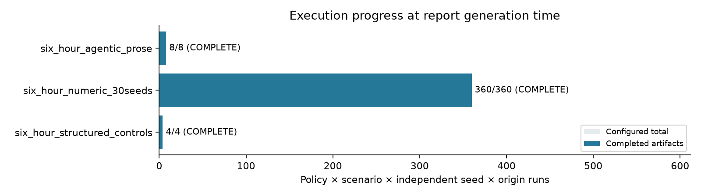
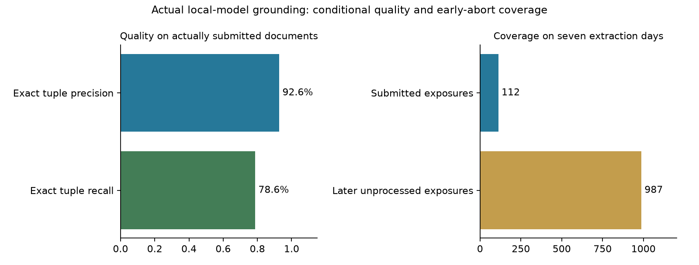

# Six-hour M5 study — final snapshot COMPLETE

Snapshot generated 2026-10-07T21:36:28+00:00 (UTC). This report uses current results under this checkout; repository examples and dissertation narrative are not treated as outputs of this execution.

Overall execution status: COMPLETE. There are 372 completed current-scope configured runs and 30 recorded LLM calls in those completed runs. A completed deterministic control is not an LLM agent experiment. This is the latest available report; a PARTIAL or BLOCKED report is not a completed experiment.


## Business results at this snapshot

Completed numerical evidence: six_hour_numeric_30seeds, 360 runs, 30 simulation seeds, seven decision days and all thirty selected series. These are simulated operational tradeoffs, not measured retailer outcomes.

| Policy / scenario | Mean cost | Mean fill | Hard violations | Holds | Reference deviations |
| --- | --- | --- | --- | --- | --- |
| B1 / derived_field_collapse | 621.067 | 0.928 | 0 | 0 | 179 |
| B1 / feed_gap | 443.184 | 0.908 | 0 | 0 | 210 |
| B1 / normal | 399.847 | 0.920 | 0 | 0 | 209 |
| B2 / derived_field_collapse | 548.971 | 0.852 | 0 | 0 | 122 |
| B2 / feed_gap | 440.066 | 0.772 | 0 | 0 | 131 |
| B2 / normal | 399.629 | 0.810 | 0 | 0 | 161 |
| B3 / derived_field_collapse | 497.046 | 0.937 | 0 | 0 | 78 |
| B3 / feed_gap | 425.570 | 0.903 | 63 | 0 | 37 |
| B3 / normal | 375.362 | 0.940 | 0 | 0 | 10 |
| B4 / derived_field_collapse | 369.423 | 0.905 | 0 | 90 | 6 |
| B4 / feed_gap | 367.796 | 0.905 | 0 | 90 | 5 |
| B4 / normal | 374.000 | 0.939 | 0 | 0 | 11 |

In the feed-gap simulation, B3 recorded 63 actual hard violations and 0 holds; the gated B4 recorded 0 hard violations and 90 holds. Mean fill was 0.903 for B3 and 0.905 for B4. The gate can reduce execution while changing service and cost. These exploratory observations do not prove long-run superiority or adequate statistical power.

Actual local-model feasibility evidence: ega-qwen2.5:1.5b-sixhour; 4 completed B9/B10 runs, 30 recorded calls, 0 executed decisions and 8 held decisions. The completed cases contain invalid or incomplete grounding, including recorded dimensional mismatches. Fail-closed validation prevents those invalid extractions from proceeding. An executed LLM replenishment benefit has not been established by these held cases. These findings concern this small local model, serving profile and controlled corpus; they do not generalize to all LLM systems.

Strict post-hoc grounding measured 88 exact eleven-field tuples among 95 returned tuples and 112 actually submitted source rules: precision=0.926, recall=0.786. It identified 7 wrong tuples and 24 omitted submitted tuples; the recorded field mismatches were unit errors. Only 16 of 157 available documents were submitted on each of 7 extraction days before early abort; later unprocessed documents are coverage gaps. One fault-gated day had no extraction. These are descriptive repeated exposures, not independent grounding trials.

Initial inventory can satisfy two days of sales even when every replenishment decision is held. Purchase expenditure is charged immediately, terminal stock has no salvage credit, and shortage/replenishment effects beyond the window are omitted. Structured controls can therefore buy inventory for future days while all-held prose cases appear cheaper. Low short-window cost must not be called LLM savings or evidence of equivalent long-run service. Mean inventory, holds and execution are reported alongside cost/fill. The seven-day numerical template grid, two-day prose parser comparators, live model arms and separate two-day structured-rule controls retain their own horizons and carriers.

| Two-day stage / policy / scenario | Cost | Fill | Mean inventory | Exec / held |
| --- | --- | --- | --- | --- |
| six_hour_agentic_prose / B10 / derived_field_collapse | 8.513 | 1.000 | 237.500 | 0 / 2 |
| six_hour_agentic_prose / B10 / normal | 8.513 | 1.000 | 237.500 | 0 / 2 |
| six_hour_agentic_prose / B3 / derived_field_collapse | 8.513 | 1.000 | 237.500 | 0 / 2 |
| six_hour_agentic_prose / B3 / normal | 8.513 | 1.000 | 237.500 | 0 / 2 |
| six_hour_agentic_prose / B4 / derived_field_collapse | 8.513 | 1.000 | 237.500 | 0 / 2 |
| six_hour_agentic_prose / B4 / normal | 8.513 | 1.000 | 237.500 | 0 / 2 |
| six_hour_agentic_prose / B9 / derived_field_collapse | 8.513 | 1.000 | 237.500 | 0 / 2 |
| six_hour_agentic_prose / B9 / normal | 8.513 | 1.000 | 237.500 | 0 / 2 |
| six_hour_structured_controls / B3 / derived_field_collapse | 178.272 | 1.000 | 231.000 | 2 / 0 |
| six_hour_structured_controls / B3 / normal | 97.066 | 1.000 | 224.000 | 2 / 0 |
| six_hour_structured_controls / B4 / derived_field_collapse | 67.673 | 1.000 | 231.000 | 1 / 1 |
| six_hour_structured_controls / B4 / normal | 96.499 | 1.000 | 225.000 | 2 / 0 |

Managerial interpretation is conditional: grounding reliability, actual hard violations, holds, service and latency must be assessed together. Historical M5 sales from thirty selected FOODS item-store series are combined with simulated inventory, suppliers and replenishment; no organizational ROI, field deployment or human-review benefit is measured.

Historical study dates are distinct from cloud execution timestamps: the registered model-training data end on 2016-01-18 (index1815, M5d_1816); numerical decisions cover 2016-02-02 through 2016-02-08 (indices1830–1836, d_1831–d_1837); two-day model/control decisions cover 2016-02-02 through 2016-02-03. The prepared panel's calendar.csv supplies the per-stage mappings below; 2026 timestamps record execution and report preparation.

Grounding safeguard limit relevant to RQ3/H3: the deployed prose verifier checks source references, entity allowlists, dimensions/ranges, conflicts and required coverage. Full source-value/scope/precedence equality is checked only for the deterministic RULE carrier. Holding the observed unit errors does not prove that every semantically wrong prose field would be caught. The strict inverse-prose assessor is an after-the-fact measurement, not a deployed repair or a hidden deterministic replacement for the model. No model-grounded proposal reached the optimizer in these held live cases.


## Reduced protocol and six-hour scope

Document status: final bounded-study snapshot. Execution and missing-data labels remain factual; finalization of this document does not turn unfinished experiments into completed runs or complete the full revised dissertation.

The user changed the objective to a study bounded to six hours while preserving all thirty prepared M5 item-store series. The long-stage studies are retained as auxiliary history and are not pooled into this study's run count, policy estimates or significance claims. This shortened protocol does not complete the full revised dissertation, thirty-seed confirmatory comparisons, the complete rolling-origin/severity matrix, or the human-audit study.

This report describes the bounded numerical controls, actual live-model grounding checks, and closed-loop LLM decisions completed within the registered scope. Planned or deadline-interrupted runs remain unrun/partial. There are no paired significance or thirty-seed power claims for this shortened study. Short decision horizons can hide service effects through warmup stock and lead times, so small cost/fill differences must not be generalized to long-run replenishment.


### Frozen six-hour study protocol

```yaml
agentic:
  carrier: controlled_prose
  config: results/run_configs/six_hour_agentic_prose.yaml
  days: 2
  document_batch_size: 4
  expected_decisions: 16
  expected_runs: 8
  origins: 1
  policies:
  - B3
  - B4
  - B9
  - B10
  profile: original repository FORMAT_CONVENTIONS; no worker sidecar
  scenarios:
  - normal
  - derived_field_collapse
  seeds:
  - 0
  source_document_count_per_normal_day: 157
dataset: data/processed/m5
dissertation_sha256: 8ae699667fa02f932f4c2584af0a3895021dc925e3119412bb06b238dc87de1c
experiment_cutoff_utc: '2026-10-08T01:31:00+00:00'
fault_timing_note: Derived-field collapse begins at start_day+1; two-day LLM study
  includes a clean first day and an active fault on the second. Seven-day numeric
  study covers the longer episode.
forecast:
  censor_correction: true
  chronos_model: amazon/chronos-t5-tiny
  chronos_revision: null
  deep_epochs: 10
  hidden_size: 32
  lgbm_estimators: 150
  lookback: 56
  max_training_windows: 12000
  service_quantile: 0.95
limitations:
- Shorter study cannot establish the full dissertation hypotheses or replace thirty-seed
  three-origin long-run evidence
- All numerical and eventual live agentic arms use the same reduced solver settings;
  no cross-configuration pooling
- Final report records actual completed grids and marks any unfinished cells at the
  hard deadline
llm_plan: Frozen Qwen2.5 1.5B local model; two-day matched prospective feasibility
  comparison, not a long-run multi-seed agentic efficacy study
model_identity:
  context_tokens: 16384
  cpu_threads: 3
  details:
    context_length: 32768
    embedding_length: 1536
    families:
    - qwen2
    family: qwen2
    format: gguf
    parameter_size: 1.5B
    parent_model: qwen2.5:1.5b
    quantization_level: Q4_K_M
    runner: llamacpp
  digest: 14bdd46019879e18cd27f21b46e2c377bf801e827e2abb46be2daedcedaf0f64
  model: ega-qwen2.5:1.5b-sixhour
  official_blob_manifest: /workspace/tools/ollama/official_qwen2.5_1.5b_manifest.json
  selection_reason: Six-hour CPU budget; Qwen0.5b development generated unsupported
    extra rules and truncated. Select larger1.5b candidate before any evaluation.
    Numerical worker uses remaining CPUcore.
  size: 986061553
numerical:
  config: results/run_configs/six_hour_numeric.yaml
  days: 7
  expected_runs: 96
  origins: 1
  policies:
  - B1
  - B2
  - B3
  - B4
  scenarios:
  - normal
  - derived_field_collapse
  - feed_gap
  seeds:
  - 0
  - 1
  - 2
  - 3
  - 4
  - 5
  - 6
  - 7
  workers: 1
numerical_extension:
  analytical_view: results/six_hour_numeric_30seeds
  concurrency_note: Two numerical workers selected before extension launch after all
    local LLM runs completed; one CPU thread each, no concurrent inference. Dataset,
    seed grid, solver and forecast remain unchanged.
  config: results/run_configs/six_hour_numeric_extension.yaml
  config_sha256: d400722b69a70caab08615840a5bea23019e3f9784dc243ef5c777897ceb2e88
  days: 7
  expected_decisions: 1848
  expected_runs: 264
  frozen_at_utc: '2026-10-07T20:58:21.469540+00:00'
  origins: 1
  owner_helper_sha256: 33dd70035ede229cb48f1785e12a90f47ac9dff4747ff4afd09cb104b20bb7b1
  owner_validation_checks: 25
  pooling_requirements: No settings difference except output and seeds; verify exact
    disjoint360cells, actual training tensors and LightGBM numerical trees, source/data/config
    hashes. Preserve original source paths and manifests. No LLM30seed claim.
  reason: Base96 actual runtime20minutes leaves sufficient deadline budget for a disjoint
    seed extension; all four policies and all three scenarios retained. This is an
    exploratory post-launch replication increase, not a confirmatory dissertation
    registration. Base results had already completed when extension was selected.
  reporting: Source phases reported separately until fully complete and equivalence
    proven; count source identities once in verified analytical union. No formal efficacy/power/significance
    claim.
  seeds:
  - 8
  - 9
  - 10
  - 11
  - 12
  - 13
  - 14
  - 15
  - 16
  - 17
  - 18
  - 19
  - 20
  - 21
  - 22
  - 23
  - 24
  - 25
  - 26
  - 27
  - 28
  - 29
  workers: 2
report_deadline_utc: '2026-10-08T02:01:00+00:00'
requested_at_utc: '2026-10-07T20:01:00+00:00'
scope: six-hour shortened computational study
series: 30
serving_selection:
  disclaimer: Development selection is disclosed; this small sample does not validate
    general grounding accuracy
  documented_format_variant: 0/4 exact for each carrier; retained as development only
  qwen15_base_batch4_prose_exact_rules: 3/4; unit_cost unit error
  qwen15_base_template_exact_rules: 0/4; precedence error
  selection: Base batch4 for practical throughput and stronger observed prose grounding;
    model/profile frozen before evaluation
  window: day1700, simulationseed4242; no evaluation labels sent to model
solver:
  allow_transfers: true
  budget: 3000
  cvar_alpha: 0.95
  holding_rate: 0.015
  horizon: 7
  max_order_units: 1000
  mip_gap: 0.001
  risk_weight: 0.1
  scenarios: 4
  shortage_multiplier: 5
  storage_per_location: 10000
  time_limit: 5.0
  transfer_cost: 0.3
  transfer_lead: 1
stage_names:
- six_hour_numeric
- six_hour_agentic_prose
- six_hour_structured_controls
- six_hour_numeric_extension
structured_reference:
  added_at_utc: '2026-10-07T20:48:52.635288+00:00'
  carrier: template
  config: results/run_configs/six_hour_structured_controls.yaml
  days: 2
  expected_decisions: 8
  expected_runs: 4
  origins: 1
  policies:
  - B3
  - B4
  purpose: Exact same information with deterministic structured-rule extraction; distinguish
    replenishment behavior from failure to parse controlled prose
  scenarios:
  - normal
  - derived_field_collapse
  seeds:
  - 0
  selection_disclosure: Added after the first four prose controls demonstrated the
    documented deterministic parser limitation, before observing completed LLM outcomes.
    No model/prompt/settings change.
superseded_stages:
- main_study_stage1
- llm_prose_reference_30series
- llm_template_architectures_30series
- llm_prose_study_ollama
- foundation_30series
```

requested at: 2026-10-07T20:01:00+00:00 (UTC).

experiment cutoff: 2026-10-08T01:31:00+00:00 (UTC).

report deadline: 2026-10-08T02:01:00+00:00 (UTC).

Bounded protocol limit: Shorter study cannot establish the full dissertation hypotheses or replace thirty-seed three-origin long-run evidence

Bounded protocol limit: All numerical and eventual live agentic arms use the same reduced solver settings; no cross-configuration pooling

Bounded protocol limit: Final report records actual completed grids and marks any unfinished cells at the hard deadline

Frozen numerical subset: policies=['B1', 'B2', 'B3', 'B4']; scenarios=['normal', 'derived_field_collapse', 'feed_gap']; seeds=8; origins=1; decision days=7; configured runs=96. All thirty prepared series are retained. Forecast/solver settings are read from each actual run config and are not pooled with the old long-study settings.

Frozen live-model subset: {"carrier": "controlled_prose", "config": "results/run_configs/six_hour_agentic_prose.yaml", "days": 2, "document_batch_size": 4, "expected_decisions": 16, "expected_runs": 8, "origins": 1, "policies": ["B3", "B4", "B9", "B10"], "profile": "original repository FORMAT_CONVENTIONS; no worker sidecar", "scenarios": ["normal", "derived_field_collapse"], "seeds": [0], "source_document_count_per_normal_day": 157}. It uses the original repository FORMAT_CONVENTIONS and the recorded common model digest. The separately tested documented-format variant was not selected for evaluation.

Development selection disclosure: {"disclaimer": "Development selection is disclosed; this small sample does not validate general grounding accuracy", "documented_format_variant": "0/4 exact for each carrier; retained as development only", "qwen15_base_batch4_prose_exact_rules": "3/4; unit_cost unit error", "qwen15_base_template_exact_rules": "0/4; precedence error", "selection": "Base batch4 for practical throughput and stronger observed prose grounding; model/profile frozen before evaluation", "window": "day1700, simulationseed4242; no evaluation labels sent to model"}

Fault timing: Derived-field collapse begins at start_day+1; two-day LLM study includes a clean first day and an active fault on the second. Seven-day numeric study covers the longer episode.

Separate structured-rule short-window control: {"added_at_utc": "2026-10-07T20:48:52.635288+00:00", "carrier": "template", "config": "results/run_configs/six_hour_structured_controls.yaml", "days": 2, "expected_decisions": 8, "expected_runs": 4, "origins": 1, "policies": ["B3", "B4"], "purpose": "Exact same information with deterministic structured-rule extraction; distinguish replenishment behavior from failure to parse controlled prose", "scenarios": ["normal", "derived_field_collapse"], "seeds": [0], "selection_disclosure": "Added after the first four prose controls demonstrated the documented deterministic parser limitation, before observing completed LLM outcomes. No model/prompt/settings change."}

Numerical extension registration: {"analytical_view": "results/six_hour_numeric_30seeds", "concurrency_note": "Two numerical workers selected before extension launch after all local LLM runs completed; one CPU thread each, no concurrent inference. Dataset, seed grid, solver and forecast remain unchanged.", "config": "results/run_configs/six_hour_numeric_extension.yaml", "config_sha256": "d400722b69a70caab08615840a5bea23019e3f9784dc243ef5c777897ceb2e88", "days": 7, "expected_decisions": 1848, "expected_runs": 264, "frozen_at_utc": "2026-10-07T20:58:21.469540+00:00", "origins": 1, "owner_helper_sha256": "33dd70035ede229cb48f1785e12a90f47ac9dff4747ff4afd09cb104b20bb7b1", "owner_validation_checks": 25, "pooling_requirements": "No settings difference except output and seeds; verify exact disjoint360cells, actual training tensors and LightGBM numerical trees, source/data/config hashes. Preserve original source paths and manifests. No LLM30seed claim.", "reason": "Base96 actual runtime20minutes leaves sufficient deadline budget for a disjoint seed extension; all four policies and all three scenarios retained. This is an exploratory post-launch replication increase, not a confirmatory dissertation registration. Base results had already completed when extension was selected.", "reporting": "Source phases reported separately until fully complete and equivalence proven; count source identities once in verified analytical union. No formal efficacy/power/significance claim.", "seeds": [8, 9, 10, 11, 12, 13, 14, 15, 16, 17, 18, 19, 20, 21, 22, 23, 24, 25, 26, 27, 28, 29], "workers": 2}. The completed initial cohort was available before extension launch. Expansion was motivated by measured runtime capacity, and the combined analysis remains exploratory rather than a confirmatory dissertation registration.


## Execution status and remaining work

COMPLETE means every configured policy/scenario/seed/origin run has a per-run summary and the configured number of daily rows. PARTIAL means execution has started or some runs are complete. BLOCKED records a stated missing prerequisite. UNRUN means no completed run or startup evidence is available. Completion counts are calculated from artifacts, even when pipeline status is stale; completion does not by itself establish audit validity, statistical power, or model quality. Overall execution completion applies to stages marked required; superseded or archived studies retain their actual artifacts separately. Configured-run completion also does not satisfy unimplemented dissertation requirements.

| Stage | Status | Required | Complete / target | Decision days | Policies | Carrier |
| --- | --- | --- | --- | --- | --- | --- |
| m5_smoke | COMPLETE | no | 12 / 12 | 4 | B1, D0, D1 | template |
| ml_m5_smoke | COMPLETE | no | 16 / 16 | 4 | B1, B2, B3, B4 | template |
| baseline_pilot | COMPLETE | no | 16 / 16 | 7 | B1, B2, B3, B4 | template |
| main_study_stage1 | PARTIAL | no | 20 / 480 | 28 | B1, B2, B3, B4 | template |
| foundation_30series | BLOCKED | no | 0 / 360 | 28 | B1, B5 | template |
| llm_architectures_ollama | BLOCKED | no | 0 / 18 | 4 | B4, B6, B7, B8, B9, B10 | template |
| llm_prose_reference_30series | PARTIAL | no | 1 / 360 | 28 | B3, B4 | template |
| llm_prose_study_ollama | BLOCKED | no | 0 / 540 | 28 | B4, B9, B10 | prose |
| llm_prose_study_reference | COMPLETE | no | 120 / 120 | 4 | B3, B4 | template |
| llm_template_architectures_30series | BLOCKED | no | 0 / 900 | 28 | B6, B7, B8, B9, B10 | template |
| parallel_runner_validation | COMPLETE | no | 8 / 8 | 1 | B1, B2, B3, B4 | template |
| six_hour_agentic_prose | COMPLETE | yes | 8 / 8 | 2 | B3, B4, B9, B10 | prose |
| six_hour_numeric | COMPLETE | yes | 96 / 96 | 7 | B1, B2, B3, B4 | template |
| six_hour_numeric_30seeds | COMPLETE | no | 360 / 360 | 7 | B1, B2, B3, B4 | template |
| six_hour_numeric_extension | COMPLETE | yes | 264 / 264 | 7 | B1, B2, B3, B4 | template |
| six_hour_structured_controls | COMPLETE | yes | 4 / 4 | 2 | B3, B4 | template |

main_study_stage1: pipeline-reported status=paused; observed artifact status=PARTIAL. In-progress run directories without complete summaries: 3.

foundation_30series Auxiliary stage's historically reported prerequisite: Chronos metadata pinned and libraries validated; remaining weight file requires us.aws.cdn.hf.co network route

foundation_30series readiness observation: Pinned Chronos metadata revision has been obtained; it does not attest downloaded model weights or tested foundation inference.

foundation_30series: pipeline-reported status=blocked; observed artifact status=BLOCKED. In-progress run directories without complete summaries: 0.

llm_architectures_ollama Auxiliary stage's historically reported prerequisite: Official model registered; awaiting live development grounding and throughput/storage preflight

llm_architectures_ollama: pipeline-reported status=blocked; observed artifact status=BLOCKED. In-progress run directories without complete summaries: 0.

llm_prose_reference_30series: pipeline-reported status=paused; observed artifact status=PARTIAL. In-progress run directories without complete summaries: 1.

llm_prose_study_ollama Auxiliary stage's historically reported prerequisite: Official model registered; awaiting live development grounding and throughput/storage preflight

llm_prose_study_ollama: pipeline-reported status=blocked; observed artifact status=BLOCKED. In-progress run directories without complete summaries: 0.

llm_prose_study_reference: pipeline-reported status=complete; observed artifact status=COMPLETE. In-progress run directories without complete summaries: 0.

llm_template_architectures_30series Auxiliary stage's historically reported prerequisite: Official model registered; awaiting live development grounding and throughput/storage preflight

llm_template_architectures_30series: pipeline-reported status=planned; observed artifact status=BLOCKED. In-progress run directories without complete summaries: 0.

parallel_runner_validation: pipeline-reported status=complete; observed artifact status=COMPLETE. In-progress run directories without complete summaries: 0.

six_hour_agentic_prose readiness observation: Verified registry download and local registration are attested by ollama_model_identity.json; this alone does not validate functional inference or full-study readiness.

six_hour_agentic_prose readiness observation: Configured model digest matches registered identity.

six_hour_agentic_prose: pipeline-reported status=complete; observed artifact status=COMPLETE. In-progress run directories without complete summaries: 0.

six_hour_numeric retains its original phase provenance and is represented in the verified six_hour_numeric_30seeds analytical view. Its runs are counted once in report totals and policy summaries.

six_hour_numeric: pipeline-reported status=complete; observed artifact status=COMPLETE. In-progress run directories without complete summaries: 0.

six_hour_numeric_30seeds is a verified external-source analytical union, not another experiment. It covers the disjoint original cohorts only after complete source coverage, matching immutable configs/data/environment and exact actual trained states across every merged and worker model. Original run paths and hash-verified archives remain unchanged.

six_hour_numeric_extension retains its original phase provenance and is represented in the verified six_hour_numeric_30seeds analytical view. Its runs are counted once in report totals and policy summaries.

six_hour_numeric_extension: pipeline-reported status=complete; observed artifact status=COMPLETE. In-progress run directories without complete summaries: 0.

six_hour_structured_controls: pipeline-reported status=complete; observed artifact status=COMPLETE. In-progress run directories without complete summaries: 0.



Configured run completion; worker and merged copies of the same run are counted once.


## Model preparation and functional readiness

Recorded local model: ega-qwen2.5:1.5b-sixhour; registered digest: 14bdd46019879e18cd27f21b46e2c377bf801e827e2abb46be2daedcedaf0f64; parameter size: 1.5B; quantization: Q4_K_M. Source attestation: unrecorded. This establishes the recorded verified download/registration step, not successful end-to-end experimental decisions.

Readiness records below are separate from completed simulation results: model registration, validated structured responses, measured throughput, configuration freeze and a completed study are different milestones. Historical network failures in earlier audit/validation snapshots do not override a later verified identity. Successful preflight calls do not count as completed full-study runs.

retained auxiliary preparation source: results/local_model_development_30series_batch1/development_manifest.json


### results/local_model_development_30series_batch1/development_manifest.json readiness snapshot

```yaml
complete: true
created_at_utc: '2026-10-07T20:07:03.144442+00:00'
day: 1700
development_only: true
document_batch_size: 1
full_contract_documents_per_day: 157
grounding: /workspace/MasterDissertation/results/local_model_development_30series_batch1/grounding
llm_error_artifacts: 0
model_revision: bd9b617abc6c2ec05ebeac915201900320377281168b3949032799cc8f20d51d
notes:
- Schema and semantic extraction errors remain errors.
- No model selection or gate retuning is performed on evaluation windows.
- Four actual single-document extraction checks; numerical M5 simulator prerequisites
  validated separately. A full development simulation pilot is optional.
- Grounding and pilot results are descriptive development checks, not full-study outcomes.
pilot_runs: 0
pilot_storage:
- file_count: 6
  path: /workspace/MasterDissertation/results/local_model_development_30series_batch1/grounding
  raw_bytes: 83174
  zip_deflate_bytes: 13074
real_calls:
- artifact: /workspace/MasterDissertation/results/local_model_development_30series_batch1/grounding/artifacts/objects/044ff1ef781694f9a86262619b688016ba5520055b2dacd0a7db7608234d15c1.json
  artifact_bytes: 13294
  completion_tokens: 146
  elapsed_seconds: 79.6629726430001
  finish_reason: stop
  prompt_tokens: 2768
  role: supplier and constraint agent
- artifact: /workspace/MasterDissertation/results/local_model_development_30series_batch1/grounding/artifacts/objects/b6038e718a43863ff9d08557eb4b30b4eed5b2365a24ee5f114fbd00ee2b1465.json
  artifact_bytes: 13280
  completion_tokens: 149
  elapsed_seconds: 87.46915841600003
  finish_reason: stop
  prompt_tokens: 2787
  role: supplier and constraint agent
- artifact: /workspace/MasterDissertation/results/local_model_development_30series_batch1/grounding/artifacts/objects/00f7c00aae35de3651456d4f8362cfb99097241fc186fdf7ef83c77b6d0347a4.json
  artifact_bytes: 13289
  completion_tokens: 149
  elapsed_seconds: 78.77321374599978
  finish_reason: stop
  prompt_tokens: 2763
  role: supplier and constraint agent
- artifact: /workspace/MasterDissertation/results/local_model_development_30series_batch1/grounding/artifacts/objects/22b1043aa03593968c864a9d971fea095773a3ddf14b5d834f7f098d110caec5.json
  artifact_bytes: 13287
  completion_tokens: 146
  elapsed_seconds: 123.14005513200027
  finish_reason: stop
  prompt_tokens: 2782
  role: supplier and constraint agent
series: 30
supervisor_wall_seconds: 372.13735640899995
```

Readiness summary: {"complete": true, "day": 1700, "development_only": true, "model_revision": "bd9b617abc6c2ec05ebeac915201900320377281168b3949032799cc8f20d51d", "pilot_runs": 0, "series": 30}

retained auxiliary preparation source: results/logs/ollama_cloud30_functional_readiness.json


### results/logs/ollama_cloud30_functional_readiness.json readiness snapshot

```yaml
elapsed_seconds: 1.1468176409998705
model_revision: bd9b617abc6c2ec05ebeac915201900320377281168b3949032799cc8f20d51d
request:
  max_tokens: 128
  messages:
  - content: Return the integer value 2 in the requested schema.
    role: user
  model: ega-llama3.2:3b-cloud30
  response_format:
    json_schema:
      name: readiness
      schema:
        additionalProperties: false
        properties:
          value:
            type: integer
        required:
        - value
        type: object
      strict: true
    type: json_schema
  temperature: 0
response:
  choices:
  - finish_reason: stop
    index: 0
    message:
      content: '{ "value": 2 }'
      role: assistant
  created: 1791403252
  id: chatcmpl-17
  model: ega-llama3.2:3b-cloud30
  object: chat.completion
  system_fingerprint: fp_ollama
  usage:
    completion_tokens: 8
    prompt_tokens: 36
    prompt_tokens_details:
      cached_tokens: 35
    total_tokens: 44
```

Readiness summary: {"elapsed_seconds": 1.1468176409998705, "model_revision": "bd9b617abc6c2ec05ebeac915201900320377281168b3949032799cc8f20d51d"}

Recorded functional check: requested structured value matched=True; positive actual input/output usage=True; prompt tokens=36; completion tokens=8; elapsed seconds=1.147. This validates this small structured call, not supplier-rule accuracy, inventory performance or full-study throughput.

current bounded-study preparation source: results/logs/six_hour_preflight.json


### results/logs/six_hour_preflight.json readiness snapshot

```yaml
actual_models: []
checked_at_utc: '2026-10-07T20:18:14.224780+00:00'
job_deadline_utc: '2026-10-08T01:31:00+00:00'
mandatory_pending_llm_configs:
- /workspace/MasterDissertation/results/run_configs/six_hour_agentic_prose.yaml
mode: read_only_budget_preflight
pending_frozen_llm_configs:
- /workspace/MasterDissertation/results/run_configs/six_hour_agentic_prose.yaml
- /workspace/MasterDissertation/results/run_configs/six_hour_agentic_template.yaml
planned_concurrency:
  llm_workers: 1
  numeric_workers: 1
remaining_job_seconds: 18765.775064468384
report_deadline_utc: '2026-10-08T02:01:00+00:00'
resources:
  checked_at_utc: '2026-10-07T20:18:14.224920+00:00'
  cpu_quota_cores: 4.0
  disk_free_bytes: 24309067776
  disk_total_bytes: 33770192896
  memory_limit_bytes: 34359738368
  visible_cpus: 5
stages:
- category: numeric
  config_sha256: d56fedc68e3e4a1ebdf4fc8d2db576149ab28dbf5602a9affa49908ab647e91b
  days: 7
  document_carrier: template
  expected_decisions: 672
  expected_runs: 96
  model: null
  model_revision: null
  name: six_hour_numeric
  origins: 1
  output: /workspace/MasterDissertation/results/six_hour_numeric
  path: /workspace/MasterDissertation/results/run_configs/six_hour_numeric.yaml
  policies:
  - B1
  - B2
  - B3
  - B4
  scenarios:
  - normal
  - derived_field_collapse
  - feed_gap
  seeds:
  - 0
  - 1
  - 2
  - 3
  - 4
  - 5
  - 6
  - 7
  series: 30
  solver:
    allow_transfers: true
    budget: 3000.0
    cvar_alpha: 0.95
    holding_rate: 0.015
    horizon: 7
    max_order_units: 1000
    mip_gap: 0.001
    risk_weight: 0.1
    scenarios: 4
    shortage_multiplier: 5.0
    storage_per_location: 10000.0
    time_limit: 5.0
    transfer_cost: 0.3
    transfer_lead: 1
study_launches: 0
```

This readiness snapshot records agentic configs awaiting freeze/registration: /workspace/MasterDissertation/results/run_configs/six_hour_agentic_prose.yaml, /workspace/MasterDissertation/results/run_configs/six_hour_agentic_template.yaml. Registered stage configs and actual run artifacts take precedence if this preparation snapshot later becomes stale.

retained auxiliary preparation source: results/run_configs/local_model_resource_preflight.json


### results/run_configs/local_model_resource_preflight.json readiness snapshot

```yaml
blockers:
- Projected artifact storage plus reserve exceeds current free disk
estimates:
  llm_prose_study_ollama:
    decisions: 15120
    model_seconds_at_measured_mean: 148799105.25459847
    model_seconds_at_measured_p95: 198600280.91689003
    successful_path_call_upper_estimate: 1612800
  llm_template_architectures_30series:
    decisions: 25200
    model_seconds_at_measured_mean: 370137774.3208137
    model_seconds_at_measured_p95: 494018198.780764
    successful_path_call_upper_estimate: 4011840
limitations:
- Development sample is not an evaluation result.
- Successful-path estimate assumes every source rule is grounded; observed validation
  holds may shorten runs.
- Model-only time excludes forecast training, optimization, report generation, scheduling
  contention and retries.
- Compression samples are estimates; live disk reserve is enforced independently.
- No human study, LLM-only numeric comparator, or severity sweep has been implemented.
measured_at_utc: '2026-10-07T20:07:05.259195+00:00'
measurement:
  max_actual_zip_deflate_sample_ratio: 0.15718854449707842
  mean_call_seconds: 92.26134998425005
  mean_request_artifact_bytes: 13287.5
  p95_call_seconds: 123.14005513200027
  real_call_records: 4
model_revision: bd9b617abc6c2ec05ebeac915201900320377281168b3949032799cc8f20d51d
outstanding_numeric_storage:
  llm_prose_reference_30series:
    estimated_additional_packed_bytes: 1910056987
    existing_unpacked_bytes_already_in_disk_usage: 0
    packed_bytes_per_run_budget: 5320493
    remaining_runs: 359
  main_study_stage1:
    estimated_additional_packed_bytes: 1929379840
    existing_unpacked_bytes_already_in_disk_usage: 0
    packed_bytes_per_run_budget: 4194304
    remaining_runs: 460
passed: false
projected_additional_numeric_packed_bytes: 3839436827
projected_packed_artifact_bytes_with_margin: 26432693447.062786
projected_raw_artifact_bytes: 112106106000.0
required_disk_reserve_bytes: 2147483648
resources:
  checked_at_utc: '2026-10-07T20:07:04.762138+00:00'
  cpu_quota_cores: 4.0
  disk_free_bytes: 25694674944
  disk_total_bytes: 33770192896
  memory_limit_bytes: 34359738368
  visible_cpus: 5
successful_path_calls_total: 5624640
successful_path_model_only_days_at_mean: 6006.213883974678
successful_path_model_only_days_at_p95: 8016.417589093217
verified_artifact_packer_available: true
```

Readiness summary: {"model_revision": "bd9b617abc6c2ec05ebeac915201900320377281168b3949032799cc8f20d51d"}

Measured resource preflight: passed=False; blockers=['Projected artifact storage plus reserve exceeds current free disk']. Measurements: {"max_actual_zip_deflate_sample_ratio": 0.15718854449707842, "mean_call_seconds": 92.26134998425005, "mean_request_artifact_bytes": 13287.5, "p95_call_seconds": 123.14005513200027, "real_call_records": 4}. Successful-path model-only projection at mean=6,006.214 days, at p95=8,016.418 days. These are development-sample planning estimates, not elapsed full-experiment results; they exclude additional training, optimization, scheduling, retries and reports.

retained auxiliary preparation source: results/run_configs/local_model_resource_preflight_incremental.json


### results/run_configs/local_model_resource_preflight_incremental.json readiness snapshot

```yaml
actual_development_responses: 2
actual_model_revision: bd9b617abc6c2ec05ebeac915201900320377281168b3949032799cc8f20d51d
coarse_same_latency_projection_days: 1234.2710448305966
first_extraction_actual_usage:
  completion_tokens: 152
  prompt_tokens: 4812
  prompt_tokens_details:
    cached_tokens: 15
  total_tokens: 4964
first_extraction_request_seconds: 243.20611720799934
incremental: true
limitations:
- A single extraction request is not a representative latency estimate for all roles,
  memory lengths, cache effects, validation failures and retries.
- The coarse same-latency multiplication is a scale illustration, not a completion
  forecast.
- Full inference cannot be called feasible based on an installed model or a trivial
  response.
- No full-study LLM evaluation has started; CPU/GPU/provider choice and common serving
  batch remain development decisions.
measured_at_utc: '2026-10-07T19:52:41.771621+00:00'
resources:
  checked_at_utc: '2026-10-07T19:52:41.771889+00:00'
  cpu_quota_cores: 4.0
  disk_free_bytes: 25670205440
  disk_total_bytes: 33770192896
  memory_limit_bytes: 34359738368
  visible_cpus: 5
stage_counts:
  llm_prose_study_ollama:
    batch_size: 16
    days: 28
    runs: 540
    successful_path_requests_before_retries: 131040
  llm_template_architectures_30series:
    batch_size: 16
    days: 28
    runs: 900
    successful_path_requests_before_retries: 307440
successful_path_request_count_before_retries: 438480
```

Incremental resource evidence: 2 actual development responses; first extraction request=243.206 seconds; planned successful-path requests before retries=438,480. The recorded same-latency multiplication is 1,234.271 days. This is a scale illustration from an initial request, not a representative completion forecast or an executed study duration.

Incremental estimate limit: A single extraction request is not a representative latency estimate for all roles, memory lengths, cache effects, validation failures and retries.

Incremental estimate limit: The coarse same-latency multiplication is a scale illustration, not a completion forecast.

Incremental estimate limit: Full inference cannot be called feasible based on an installed model or a trivial response.

Incremental estimate limit: No full-study LLM evaluation has started; CPU/GPU/provider choice and common serving batch remain development decisions.

current bounded-study preparation source: results/run_configs/six_hour_runtime_preflight.json


### results/run_configs/six_hour_runtime_preflight.json readiness snapshot

```yaml
actual_models:
- actual_digest: 14bdd46019879e18cd27f21b46e2c377bf801e827e2abb46be2daedcedaf0f64
  details:
    context_length: 32768
    embedding_length: 1536
    families:
    - qwen2
    family: qwen2
    format: gguf
    parameter_size: 1.5B
    parent_model: qwen2.5:1.5b
    quantization_level: Q4_K_M
    runner: llamacpp
  name: ega-qwen2.5:1.5b-sixhour
  parameters: 'num_thread                     3

    num_ctx                        16384'
  size_bytes: 986061553
checked_at_utc: '2026-10-07T20:18:15.338188+00:00'
job_deadline_utc: '2026-10-08T01:31:00+00:00'
mandatory_pending_llm_configs: []
mode: read_only_budget_preflight
pending_frozen_llm_configs:
- /workspace/MasterDissertation/results/run_configs/six_hour_agentic_template.yaml
planned_concurrency:
  llm_workers: 1
  numeric_workers: 1
remaining_job_seconds: 18764.661690473557
report_deadline_utc: '2026-10-08T02:01:00+00:00'
resources:
  checked_at_utc: '2026-10-07T20:18:15.338296+00:00'
  cpu_quota_cores: 4.0
  disk_free_bytes: 24309059584
  disk_total_bytes: 33770192896
  memory_limit_bytes: 34359738368
  visible_cpus: 5
stages:
- category: numeric
  config_sha256: d56fedc68e3e4a1ebdf4fc8d2db576149ab28dbf5602a9affa49908ab647e91b
  days: 7
  document_carrier: template
  expected_decisions: 672
  expected_runs: 96
  model: null
  model_revision: null
  name: six_hour_numeric
  origins: 1
  output: /workspace/MasterDissertation/results/six_hour_numeric
  path: /workspace/MasterDissertation/results/run_configs/six_hour_numeric.yaml
  policies:
  - B1
  - B2
  - B3
  - B4
  scenarios:
  - normal
  - derived_field_collapse
  - feed_gap
  seeds:
  - 0
  - 1
  - 2
  - 3
  - 4
  - 5
  - 6
  - 7
  series: 30
  solver:
    allow_transfers: true
    budget: 3000.0
    cvar_alpha: 0.95
    holding_rate: 0.015
    horizon: 7
    max_order_units: 1000
    mip_gap: 0.001
    risk_weight: 0.1
    scenarios: 4
    shortage_multiplier: 5.0
    storage_per_location: 10000.0
    time_limit: 5.0
    transfer_cost: 0.3
    transfer_lead: 1
- category: llm
  config_sha256: 4b70312c0f8aaec3bb29b185e612c356d0e18ddcaf07f3018ae76b738e2a0a78
  days: 2
  document_carrier: prose
  expected_decisions: 16
  expected_runs: 8
  model: ega-qwen2.5:1.5b-sixhour
  model_revision: 14bdd46019879e18cd27f21b46e2c377bf801e827e2abb46be2daedcedaf0f64
  name: six_hour_agentic_prose
  origins: 1
  output: /workspace/MasterDissertation/results/six_hour_agentic_prose
  path: /workspace/MasterDissertation/results/run_configs/six_hour_agentic_prose.yaml
  policies:
  - B3
  - B4
  - B9
  - B10
  scenarios:
  - normal
  - derived_field_collapse
  seeds:
  - 0
  series: 30
  solver:
    allow_transfers: true
    budget: 3000.0
    cvar_alpha: 0.95
    holding_rate: 0.015
    horizon: 7
    max_order_units: 1000
    mip_gap: 0.001
    risk_weight: 0.1
    scenarios: 4
    shortage_multiplier: 5.0
    storage_per_location: 10000.0
    time_limit: 5.0
    transfer_cost: 0.3
    transfer_lead: 1
study_launches: 0
```

This readiness snapshot records agentic configs awaiting freeze/registration: /workspace/MasterDissertation/results/run_configs/six_hour_agentic_template.yaml. Registered stage configs and actual run artifacts take precedence if this preparation snapshot later becomes stale.

current bounded-study preparation source: results/run_configs/six_hour_supervisor_status.json


### results/run_configs/six_hour_supervisor_status.json readiness snapshot

```yaml
active_stage: six_hour_agentic_prose
actual_model:
- actual_digest: 14bdd46019879e18cd27f21b46e2c377bf801e827e2abb46be2daedcedaf0f64
  details:
    context_length: 32768
    embedding_length: 1536
    families:
    - qwen2
    family: qwen2
    format: gguf
    parameter_size: 1.5B
    parent_model: qwen2.5:1.5b
    quantization_level: Q4_K_M
    runner: llamacpp
  name: ega-qwen2.5:1.5b-sixhour
  parameters: 'num_thread                     3

    num_ctx                        16384'
  size_bytes: 986061553
epoch: da1b4485b91b475b88558ae1cf5113be
failed_or_interrupted_stages: []
job_deadline_utc: '2026-10-08T01:31:00+00:00'
note: Final report must disclose reduced design, actual coverage, failures and unexecuted
  scope.
owned_jobs: []
pending_frozen_llm_configs:
- /workspace/MasterDissertation/results/run_configs/six_hour_agentic_template.yaml
phase: all_supplied_studies_complete
pid: 10213
report_deadline_utc: '2026-10-08T02:01:00+00:00'
report_refresh:
  at_utc: '2026-10-07T20:56:49.458804+00:00'
  returncode: 0
returncode: 0
stage: six_hour_agentic_prose
stage_names:
- six_hour_numeric
- six_hour_agentic_prose
started_at_utc: '2026-10-07T20:18:15.340034+00:00'
stop_reason: all_supplied_stage_processes_finished
updated_at_utc: '2026-10-07T20:56:49.458868+00:00'
```

Readiness summary: {"phase": "all_supplied_studies_complete", "updated_at_utc": "2026-10-07T20:56:49.458868+00:00"}

This readiness snapshot records agentic configs awaiting freeze/registration: /workspace/MasterDissertation/results/run_configs/six_hour_agentic_template.yaml. Registered stage configs and actual run artifacts take precedence if this preparation snapshot later becomes stale.

retained auxiliary preparation source: results/run_configs/supervisor_status.json


### results/run_configs/supervisor_status.json readiness snapshot

```yaml
blocker: Projected artifact storage plus reserve exceeds current free disk; detailed
  truthful estimates saved in local_model_resource_preflight.json
command_name: python
epoch: 16b457ea9bf440b5b0707f79db93cc0f
functional_usage:
  completion_tokens: 8
  prompt_tokens: 36
  prompt_tokens_details:
    cached_tokens: 35
  total_tokens: 44
model_name: ega-llama3.2:3b-cloud30
model_only_projected_days: 6006.213883974678
model_parameters: 'num_thread                     2

  stop                           "<|start_header_id|>"

  stop                           "<|end_header_id|>"

  stop                           "<|eot_id|>"

  num_ctx                        32768'
model_revision: bd9b617abc6c2ec05ebeac915201900320377281168b3949032799cc8f20d51d
note: 30 M5 series in every actual request; paired single-document template/prose
  grounding on development day 1700 before all holdout/evaluation windows
ollama_version: 0.40.0
owned_job_log: /workspace/MasterDissertation/results/logs/local_model_development_30series_batch1.log
owned_job_pid: null
phase: blocked
pid: 9036
preflight_passed: false
projected_packed_bytes: 26432693447.062786
report_refresh:
  returncode: 0
  updated_at_utc: '2026-10-07T20:07:08.032824+00:00'
resource_preflight: /workspace/MasterDissertation/results/run_configs/local_model_resource_preflight.json
reused_existing_server: true
updated_at_utc: '2026-10-07T20:07:08.033226+00:00'
```

Readiness summary: {"blocker": "Projected artifact storage plus reserve exceeds current free disk; detailed truthful estimates saved in local_model_resource_preflight.json", "functional_usage": {"completion_tokens": 8, "prompt_tokens": 36, "prompt_tokens_details": {"cached_tokens": 35}, "total_tokens": 44}, "model_name": "ega-llama3.2:3b-cloud30", "model_revision": "bd9b617abc6c2ec05ebeac915201900320377281168b3949032799cc8f20d51d", "phase": "blocked", "preflight_passed": false, "updated_at_utc": "2026-10-07T20:07:08.033226+00:00"}

Recorded foundation metadata: amazon/chronos-t5-tiny at revision 29d808298f1a62493e7b9a5e08529d0d930fa189. Metadata retrieval is not evidence that the model.safetensors download or inference succeeded.


## Controlled grounding benchmarks — actual current artifacts

Incremental and final snapshots from the same development folder can describe the same responses. They are shown as recorded snapshots and are not pooled or counted as independent replications. Retained development configurations with different batch sizes also remain separate from frozen evaluation studies.

Source: results/grounding_templates/grounding_results.json; evidence role=retained auxiliary grounding; reader mode=deterministic_template; model=not recorded; model revision=not recorded; development_only=False; incremental=False; complete=not recorded; total LLM calls=0; errors=0; tokens=0. Controlled carrier benchmark, not a validated natural-language dataset. No expected labels are sent to the model.

| Case / carrier | Whole set exact | Tuple precision | Tuple recall | False / omitted | Errors eligible for solver | Escalated |
| --- | --- | --- | --- | --- | --- | --- |
| normal / deterministic_template | True | 1.000 | 1.000 | 0 / 0 | 0 | False |
| aggregate_moq / deterministic_template | True | 1.000 | 1.000 | 0 / 0 | 0 | False |
| foreign_unit_moq / deterministic_template | True | 1.000 | 1.000 | 0 / 0 | 0 | False |
| pack_change / deterministic_template | True | 1.000 | 1.000 | 0 / 0 | 0 | False |
| capacity_cut / deterministic_template | True | 1.000 | 1.000 | 0 / 0 | 0 | False |
| eligibility_change / deterministic_template | True | 1.000 | 1.000 | 0 / 0 | 0 | False |

Source: results/local_model_development_30series_batch1/grounding/grounding_results.json; evidence role=retained auxiliary grounding; reader mode=local LLM development sample; model=not recorded; model revision=bd9b617abc6c2ec05ebeac915201900320377281168b3949032799cc8f20d51d; development_only=True; incremental=False; complete=not recorded; total LLM calls=4; errors=0; tokens=11690. Field-complete controlled carriers; this sample is not a natural-language production benchmark.

| Case / carrier | Whole set exact | Tuple precision | Tuple recall | False / omitted | Errors eligible for solver | Escalated |
| --- | --- | --- | --- | --- | --- | --- |
| development batch / template | False | — | — | 1 / 1 | — | — |
| development batch / template | False | — | — | 1 / 1 | — | — |
| development batch / prose | False | — | — | 1 / 1 | — | — |
| development batch / prose | False | — | — | 1 / 1 | — | — |

Source: results/local_model_development_30series_batch16/grounding/grounding_results.json; evidence role=retained auxiliary grounding; reader mode=local LLM development sample; model=not recorded; model revision=bd9b617abc6c2ec05ebeac915201900320377281168b3949032799cc8f20d51d; development_only=True; incremental=False; complete=not recorded; total LLM calls=2; errors=0; tokens=9659. Field-complete controlled carriers; this sample is not a natural-language production benchmark.

| Case / carrier | Whole set exact | Tuple precision | Tuple recall | False / omitted | Errors eligible for solver | Escalated |
| --- | --- | --- | --- | --- | --- | --- |
| development batch / template | False | — | — | 0 / 14 | — | — |
| development batch / prose | False | — | — | 1 / 15 | — | — |

Source: results/local_model_development_30series_batch16/grounding/incremental_grounding_results.json; evidence role=retained auxiliary grounding; reader mode=local LLM development sample; model=not recorded; model revision=bd9b617abc6c2ec05ebeac915201900320377281168b3949032799cc8f20d51d; development_only=True; incremental=True; complete=False; total LLM calls=not recorded; errors=not recorded; tokens=not recorded. Labels are compared by evaluator only; they were not provided to the model. Schema validity does not establish grounding correctness.

| Case / carrier | Whole set exact | Tuple precision | Tuple recall | False / omitted | Errors eligible for solver | Escalated |
| --- | --- | --- | --- | --- | --- | --- |
| development batch / template | False | 1.000 | 0.067 | 0 / 14 | — | — |
| development batch / prose | False | 0.000 | 0.000 | 1 / 15 | — | — |

| Carrier | Source docs | Constraints returned | Schema valid / finish | Input / output tokens | Seconds |
| --- | --- | --- | --- | --- | --- |
| template | 15 | 1 | True / stop | 4812 / 152 | 243.206 |
| prose | 15 | 1 | True / stop | 4588 / 107 | 201.623 |

Schema-valid responses can still omit or misground rules. Missing residual-error/escalation fields remain unmeasured rather than zero. Development samples do not establish a favorable LLM effect or confirmatory full-study performance.

The measured development samples above contain actual extraction failures: whole-set mismatches, omissions or false constraints remain errors despite valid JSON and a normal finish reason.

Source: results/six_hour_development_grounding/grounding_results.json; evidence role=current bounded-study development; reader mode=real_llm; model=ega-qwen2.5:0.5b-sixhour; model revision=21539788ff12776c3460262e890e2d77f98d99e5ce24a1726a9582a31be23e44; development_only=True; incremental=False; complete=True; total LLM calls=4; errors=4; tokens=15686. Four controlled development cases with all 30 entities; not evaluation or general natural-language accuracy.

| Case / carrier | Whole set exact | Tuple precision | Tuple recall | False / omitted | Errors eligible for solver | Escalated |
| --- | --- | --- | --- | --- | --- | --- |
| development batch / template | False | — | — | — / — | — | — |
| development batch / template | False | — | — | — / — | — | — |
| development batch / prose | False | — | — | — / — | — | — |
| development batch / prose | False | — | — | — / — | — | — |

| Case / carrier / batch | Exact / false / omitted rules | Calls | Seconds | Request result |
| --- | --- | --- | --- | --- |
| 1 / template / 1 | 0 / unmeasured / 1 | 1 | 35.684 | request failed |
| 2 / template / 1 | 0 / unmeasured / 1 | 1 | 36.045 | request failed |
| 3 / prose / 1 | 0 / unmeasured / 1 | 1 | 32.902 | request failed |
| 4 / prose / 1 | 0 / unmeasured / 1 | 1 | 31.013 | request failed |

Development case 1 request error: LLM request failed after 1 attempts: Truncated model output; increase max_tokens or reduce batch size

Development case 2 request error: LLM request failed after 1 attempts: Truncated model output; increase max_tokens or reduce batch size

Development case 3 request error: LLM request failed after 1 attempts: Truncated model output; increase max_tokens or reduce batch size

Development case 4 request error: LLM request failed after 1 attempts: Truncated model output; increase max_tokens or reduce batch size

These exact-rule counts and durations come from the recorded development cases. Failed requests can have recorded omissions without a validated returned-rule set; missing false-rule/precision fields remain unmeasured. Serving-model selection uses these development samples, which are excluded from inventory-policy comparisons.

Source: results/six_hour_qwen15_development/grounding_results.json; evidence role=current bounded-study development; reader mode=real_llm; model=ega-qwen2.5:1.5b-sixhour; model revision=14bdd46019879e18cd27f21b46e2c377bf801e827e2abb46be2daedcedaf0f64; development_only=True; incremental=False; complete=True; total LLM calls=4; errors=0; tokens=14152. Four controlled development cases; serving batch selection only. Expected labels are excluded from all requests.

| Case / carrier | Whole set exact | Tuple precision | Tuple recall | False / omitted | Errors eligible for solver | Escalated |
| --- | --- | --- | --- | --- | --- | --- |
| development batch / template | False | — | — | — / — | — | — |
| development batch / prose | False | — | — | — / — | — | — |
| development batch / template | False | — | — | — / — | — | — |
| development batch / prose | False | — | — | — / — | — | — |

| Case / carrier / batch | Exact / false / omitted rules | Calls | Seconds | Request result |
| --- | --- | --- | --- | --- |
| 1 / template / 1 | 0 / 1 / 1 | 1 | 34.768 | response received; see exact-rule counts |
| 2 / prose / 1 | 0 / 1 / 1 | 1 | 30.906 | response received; see exact-rule counts |
| 3 / template / 4 | 0 / 4 / 4 | 1 | 55.303 | response received; see exact-rule counts |
| 4 / prose / 4 | 3 / 1 / 1 | 1 | 52.360 | response received; see exact-rule counts |

These exact-rule counts and durations come from the recorded development cases. Failed requests can have recorded omissions without a validated returned-rule set; missing false-rule/precision fields remain unmeasured. Serving-model selection uses these development samples, which are excluded from inventory-policy comparisons.

Source: results/six_hour_qwen15_documented_format_development/grounding_results.json; evidence role=current bounded-study development; reader mode=real_llm; model=ega-qwen2.5:1.5b-sixhour; model revision=14bdd46019879e18cd27f21b46e2c377bf801e827e2abb46be2daedcedaf0f64; development_only=True; incremental=False; complete=True; total LLM calls=2; errors=0; tokens=8655. Four controlled development cases; serving batch selection only. Expected labels are excluded from all requests.

| Case / carrier | Whole set exact | Tuple precision | Tuple recall | False / omitted | Errors eligible for solver | Escalated |
| --- | --- | --- | --- | --- | --- | --- |
| development batch / template | False | — | — | — / — | — | — |
| development batch / prose | False | — | — | — / — | — | — |

| Case / carrier / batch | Exact / false / omitted rules | Calls | Seconds | Request result |
| --- | --- | --- | --- | --- |
| 1 / template / 4 | 0 / 4 / 4 | 1 | 63.954 | response received; see exact-rule counts |
| 2 / prose / 4 | 0 / 4 / 4 | 1 | 57.787 | response received; see exact-rule counts |

These exact-rule counts and durations come from the recorded development cases. Failed requests can have recorded omissions without a validated returned-rule set; missing false-rule/precision fields remain unmeasured. Serving-model selection uses these development samples, which are excluded from inventory-policy comparisons.

Deterministic-template results measure the parser control. Controlled LLM corpus results measure that recorded carrier/case set; neither is a validated natural-language supplier population or evidence that pending M5 studies finished.


Actual development extraction timings. Receiving a response does not establish semantic correctness; exact-rule results are reported above. Different models and batch sizes are separate cases, without pooling, extrapolated completion promises or policy-benefit claims.


## Actual live-model grounding and document coverage

The independent captured-request assessment validates the actual 8-run grid and 16 decision days, with SQLite chains and selected object hashes verified. There were 30 recorded requests: 28 supplier extractions and 2 state triage requests; 112739 tokens (99660 input, 13079 output), 807.8 seconds summed request time, and 0 recorded request errors. API success and schema validity remain distinct from semantic accuracy.

Expected tuples are recovered only from documents actually present in each captured model request. The assessor authenticates source payload SHA-256, strictly inverts the known public prose renderer and requires exact re-rendering before comparing all eleven constraint fields. It does not recall the model or supply it with labels. Confidence, constraint identifiers and provenance are outside the eleven-field tuple score. Exact precision is exact returned tuples divided by returned unique tuples; recall uses expected actually submitted tuples. Later unprocessed documents contribute to coverage, not the submitted-omission denominator.

| Conditional grounding measure | Actual value |
| --- | --- |
| Proven submitted / expected tuples | 112 / 112 |
| Exact / false returned tuples | 88 / 7 |
| Omitted submitted tuples | 24 |
| Exact tuple precision / recall | 0.92632 / 0.78571 |
| Unit mismatches / duplicate / unknown-source extras | 7 / 0 / 0 |
| Unproven sources / invalid response requests | 0 / 0 |
| Available / submitted / later unprocessed exposures | 1099 / 112 / 987 |
| Extraction days / days with no extraction | 7 / 1 |

| Decision case (M5 index) | Submitted / available | Calls | Exact / false / omitted |
| --- | --- | --- | --- |
| B10 / derived_field_collapse / 1830 | 16 / 157 | 4 | 13 / 1 / 3 |
| B10 / derived_field_collapse / 1831 | 0 / 157 | 0 | not assessed: no extraction |
| B10 / normal / 1830 | 16 / 157 | 4 | 13 / 1 / 3 |
| B10 / normal / 1831 | 16 / 157 | 4 | 12 / 1 / 4 |
| B9 / derived_field_collapse / 1830 | 16 / 157 | 4 | 13 / 1 / 3 |
| B9 / derived_field_collapse / 1831 | 16 / 157 | 4 | 12 / 1 / 4 |
| B9 / normal / 1830 | 16 / 157 | 4 | 13 / 1 / 3 |
| B9 / normal / 1831 | 16 / 157 | 4 | 12 / 1 / 4 |



Captured evaluation requests only. Repeated document exposures are not independent trials; conditional extraction accuracy does not imply full-document coverage or successful replenishment.


## Data, design and interpretation limits

M5 supplies historical observed sales, calendar and prices. Sales are used as an exogenous demand proxy and may be censored by historical stockouts; latent demand is not recovered. Inventory, replenishment, supplier documents, lead times, capacity, approval, faults and operational constraints are simulated. Simulated run costs and harm outcomes are not measured retailer operations.

The prepared data are selected panels, not all 30,490 bottom-level M5 series or the official competition evaluation. Fault rates are synthetic and uncalibrated unless a configuration explicitly records calibration. Simulated delayed oracle approval is a reviewer model, not a human audit study. Findings are conditional on this panel, window, solver, forecast training, fault definitions and approval model.

| Prepared panel | Series | Historical days | Selection | Synthetic sales? |
| --- | --- | --- | --- | --- |
| data/processed/m5 | 30 | 1941 | {"items": ["FOODS_1_001", "FOODS_2_001", "FOODS_3_001"], "stores": "all"} | False |
| data/processed/m5_item1 | 10 | 1941 | {"items": ["FOODS_1_001"], "stores": "all"} | False |
| data/processed/m5_smoke | 2 | 1941 | {"items": ["FOODS_1_001"], "stores": ["CA_1", "CA_2"]} | False |

The archived main stage-1 design requires 480 runs: four deterministic policies × four fault scenarios × thirty independent seeds × one origin. It uses 28 decision days per run. The shortened study has its own registered seed count and horizon. Other stages retain their own panel, carrier and horizon; their cost totals must not be pooled as interchangeable replications. The remaining scenarios and any policies absent from registered configs are unrun in this report.

| Policy | Actual architecture |
| --- | --- |
| B1 | Deterministic seasonal-naive forecast + order-up-to control |
| B10 | Typed LLM roles + critic + per-decision evidence gate |
| B2 | Trained LightGBM quantile forecast + (s,S) control |
| B3 | Trained native GRU/negative-binomial forecast + stochastic MILP |
| B4 | B3 + deterministic evidence gate; no LLM |
| B5 | Chronos forecast adapter; requires separate weights |
| B6 | Single generalist LLM + shared numerical tools |
| B7 | LLM roles with free-form shared messages + validated action boundary |
| B8 | Typed LLM roles without critic |
| B9 | Typed LLM roles + critic, fixed autonomy |
| D0 | Deterministic seasonal-forecast optimizer software control; no LLM |
| D1 | D0 + deterministic evidence gate software control; no LLM |

The native deep model is a trained GRU with a negative-binomial likelihood, not an exact DeepAR or TFT reproduction. LLM roles share deterministic numerical tools and schema validation. LLM calls, errors and explicit fallback decisions are reported separately; a held decision or deterministic fallback does not prove successful semantic reasoning. A seasonal forecast override changes the baseline and must be read in that stage's config.


## Revised dissertation coverage under the reduced study

Source: dissertation_revised_business_school.html; SHA-256: 8ae699667fa02f932f4c2584af0a3895021dc925e3119412bb06b238dc87de1c. The short study supplies descriptive evidence relevant to performance, grounding, safety flags and technical auditability. It does not answer the full architecture/memory, severity, equivalent-run, human-audit or universal-reliability hypotheses. No LLM-only numerical-action arm is implemented. Managerial staged adoption remains discussion, not an empirical organizational outcome.

Managerial discussion: a staged rollout would first establish sales-data lineage and deterministic checks, then introduce structured supplier-rule interpretation and auditable traces, and grant bounded autonomy only where matched validation demonstrates adequate reliability. These are proposed adoption conditions. This study does not measure organizational ROI, real reviewer workload, calibrated human trust or field service improvements.


## Forecast backtests

These are supplementary previously generated forecast backtests, not additional runs completed inside the six-hour budget. They do not establish that every earlier forecast-scoring hyperparameter matches the reduced study; each current simulation's resolved configuration is the authority. They are shown separately from current-scope outcome counts and are not used here for model selection or confirmatory inference.

Backtests below come from results/forecast_*.json. Training ends before each recorded test origin. Preferred holdouts at origins 1760/1788 end by index 1815, before main-study warmup at 1816. Earlier descriptive backtests at 1800/1828 overlap the main-study window and must not be used for model selection. No model or gate settings were retuned on those evaluation scores. WRMSSE, weighted scaled pinball and CRPS are scores for the selected hierarchy; full_m5_shape=false means they are not full official M5 benchmark results. Forecast accuracy alone does not establish replenishment quality or an LLM effect.


## Forecast scores — pre-main-study holdout

| Model | Origin / train end | Nodes | WRMSSE | Scaled pinball | CRPS | 95% coverage |
| --- | --- | --- | --- | --- | --- | --- |
| croston_sba | 1760 / 1759 | 112 | 1.264 | 0.585 | 0.586 | 0.974 |
| croston_sba | 1788 / 1787 | 112 | 1.336 | 0.382 | 0.630 | 0.954 |
| deep | 1760 / 1759 | 112 | 1.445 | 0.425 | 0.510 | 0.977 |
| deep | 1788 / 1787 | 112 | 2.018 | 0.476 | 0.642 | 0.939 |
| lightgbm | 1760 / 1759 | 112 | 1.285 | 0.472 | 0.540 | 0.971 |
| lightgbm | 1788 / 1787 | 112 | 1.803 | 0.491 | 0.651 | 0.931 |
| seasonal_naive | 1760 / 1759 | 112 | 1.637 | 0.850 | 0.784 | 0.911 |
| seasonal_naive | 1788 / 1787 | 112 | 1.577 | 0.461 | 0.773 | 0.923 |


## Forecast scores — overlapping descriptive backtest

| Model | Origin / train end | Nodes | WRMSSE | Scaled pinball | CRPS | 95% coverage |
| --- | --- | --- | --- | --- | --- | --- |
| croston_sba | 1800 / 1799 | 112 | 1.204 | 0.367 | 0.628 | 0.944 |
| croston_sba | 1828 / 1827 | 112 | 1.428 | 0.426 | 0.646 | 0.946 |
| deep | 1800 / 1799 | 112 | 1.796 | 0.407 | 0.582 | 0.939 |
| deep | 1828 / 1827 | 112 | 1.714 | 0.439 | 0.621 | 0.961 |
| lightgbm | 1800 / 1799 | 112 | 1.493 | 0.412 | 0.616 | 0.939 |
| lightgbm | 1828 / 1827 | 112 | 1.859 | 0.534 | 0.655 | 0.951 |
| seasonal_naive | 1800 / 1799 | 112 | 1.538 | 0.550 | 0.876 | 0.886 |
| seasonal_naive | 1828 / 1827 | 112 | 1.593 | 0.555 | 0.808 | 0.914 |


Means over the preferred nonoverlapping holdout origins when available. No confidence intervals or statistical significance claims are inferred from these origins.


## Observed simulation outcomes

Tables include completed runs only, separated by stage and policy/scenario. n is the number of distinct independent seeds; rolling origins are averaged within seed for reported means. The repository's harmful_executions endpoint is a composite flag for true-constraint violations or material action deviation from a same-forecast clean-evidence MILP reference. The code does not require a fault or demonstrate that corrupted evidence caused the deviation. Legitimate classical policies can therefore receive reference-deviation flags in clean normal runs. Composite flags must not all be interpreted as unsafe or corruption-caused orders; true violations and reference deviations are reported separately. Hard violations evaluate committed plans against the simulator's hidden true planning problem. The simulator can clamp physical transfers to available stock, so a plan violation does not imply negative physical inventory. Totals depend on completed exposure.

Implementation audit's harm-definition caveat: Harmful execution in code is true-constraint violation OR material distance from same-forecast clean-evidence MILP reference. It does not require an injected fault or causal attribution to corrupted evidence. Therefore legitimate clean-state classical-policy/reference differences can count as reference deviations. Fresh baseline_pilot normal rows confirm B1 has7deviations/0violations and B2 has5deviations/0violations. Report the two endpoints separately; do not describe all combined flags as unsafe or corruption-caused orders.

Partial cells can be selected by execution order and are unsuitable for policy ranking or confirmatory inference. This report makes no claim of statistical power, equivalence, significance, or treatment benefit from partial/pilot data. The repository's thirty-seed requirement is a protocol minimum, not proof of adequate power. Zero observed harms is not a universal safety guarantee.


## six_hour_agentic_prose — COMPLETE

Output: results/six_hour_agentic_prose; config: results/run_configs/six_hour_agentic_prose.yaml; dataset: data/processed/m5; series attested by completed-run manifest: 30. Seeds configured: 1; origins: 1; start index: 1830; warmup: 14; decision days: 2; approval: oracle with delay 1; forecast override: none recorded. M5 index 0 corresponds to d_1.

Historical origin 0: training data end 2016-01-18 at index1815 (d_1816); decisions 2016-02-02 to 2016-02-03 at indices1830–1831 (d_1831–d_1832). Source: data/processed/m5/calendar.csv.

B3/B4 in this prose stage are intentional deterministic-parser comparators. The parser requires the structured RULE carrier and recognizes no rules in controlled prose, so missing required constraint coverage causes holds. They are not structured-rule oracle benchmarks. Separate registered two-day template controls are shown under their own stage; the seven-day numerical template costs are not pooled into this comparison.

| Policy / scenario | n seeds / runs | Mean cost | Mean fill | Harm total | True violation / ref deviation | Holds total |
| --- | --- | --- | --- | --- | --- | --- |
| B10 / derived_field_collapse | 1 / 1 | 8.513 | 1.000 | 0 | 0 / 0 | 2 |
| B10 / normal | 1 / 1 | 8.513 | 1.000 | 0 | 0 / 0 | 2 |
| B3 / derived_field_collapse | 1 / 1 | 8.513 | 1.000 | 0 | 0 / 0 | 2 |
| B3 / normal | 1 / 1 | 8.513 | 1.000 | 0 | 0 / 0 | 2 |
| B4 / derived_field_collapse | 1 / 1 | 8.513 | 1.000 | 0 | 0 / 0 | 2 |
| B4 / normal | 1 / 1 | 8.513 | 1.000 | 0 | 0 / 0 | 2 |
| B9 / derived_field_collapse | 1 / 1 | 8.513 | 1.000 | 0 | 0 / 0 | 2 |
| B9 / normal | 1 / 1 | 8.513 | 1.000 | 0 | 0 / 0 | 2 |

| Policy / scenario | LLM calls | LLM errors | Fallback decisions |
| --- | --- | --- | --- |
| B10 / derived_field_collapse | 5 | 0 | 0 |
| B10 / normal | 8 | 0 | 0 |
| B3 / derived_field_collapse | 0 | 0 | 0 |
| B3 / normal | 0 | 0 | 0 |
| B4 / derived_field_collapse | 0 | 0 | 0 |
| B4 / normal | 0 | 0 | 0 |
| B9 / derived_field_collapse | 9 | 0 | 0 |
| B9 / normal | 8 | 0 | 0 |

| Policy / scenario | Cycle service | Stockout rate | Bullwhip | Mean inventory | Inventory turns |
| --- | --- | --- | --- | --- | --- |
| B10 / derived_field_collapse | 1.000 | 0.000 | 0.000 | 237.500 | 0.232 |
| B10 / normal | 1.000 | 0.000 | 0.000 | 237.500 | 0.232 |
| B3 / derived_field_collapse | 1.000 | 0.000 | 0.000 | 237.500 | 0.232 |
| B3 / normal | 1.000 | 0.000 | 0.000 | 237.500 | 0.232 |
| B4 / derived_field_collapse | 1.000 | 0.000 | 0.000 | 237.500 | 0.232 |
| B4 / normal | 1.000 | 0.000 | 0.000 | 237.500 | 0.232 |
| B9 / derived_field_collapse | 1.000 | 0.000 | 0.000 | 237.500 | 0.232 |
| B9 / normal | 1.000 | 0.000 | 0.000 | 237.500 | 0.232 |

Completed-run recorded tokens=112,739; LLM calls=30; LLM errors=0; fallback decisions=0; invalid audit chains=0. Counts exclude unfinished runs. Local-model tokens are not assigned a fabricated dollar value.


## six_hour_agentic_prose actual proposal-solver diagnostics

| Policy / scenario | MILP attempts | Feasible / optimal | Time-limit incumbent | Mean / max gap | Mean seconds |
| --- | --- | --- | --- | --- | --- |
| B10 / derived_field_collapse | 0 | 0 / 0 | 0 | — / — | — |
| B10 / normal | 0 | 0 / 0 | 0 | — / — | — |
| B3 / derived_field_collapse | 0 | 0 / 0 | 0 | — / — | — |
| B3 / normal | 0 | 0 / 0 | 0 | — / — | — |
| B4 / derived_field_collapse | 0 | 0 / 0 | 0 | — / — | — |
| B4 / normal | 0 | 0 / 0 | 0 | — / — | — |
| B9 / derived_field_collapse | 0 | 0 / 0 | 0 | — / — | — |
| B9 / normal | 0 | 0 / 0 | 0 | — / — | — |

These counts read every available completed-run proposal trace, including verified ZIP objects. A feasible incumbent is not necessarily optimal. Gaps are reported relative fractions (0.001 means 0.1%) over proposals that report a finite gap; missing gaps are not zero. The five-second solver limit can select different incumbents and affect cost comparisons. Held decisions can have solver status not_run; solver feasibility does not establish that a proposal was executed or safe under hidden simulator truth.

| Recorded held case | Solver status | First dimensional mismatch / reason excerpt |
| --- | --- | --- |
| B10 / derived_field_collapse / day 1830 | not_run | FOODS_1_001@CA_3:unit_cost:1830: dimensional mismatch USD |
| B10 / derived_field_collapse / day 1831 | not_run | State hard failure; hold is not a zero-order recommendation |
| B10 / normal / day 1830 | not_run | FOODS_1_001@CA_3:unit_cost:1830: dimensional mismatch USD |
| B10 / normal / day 1831 | not_run | FOODS_1_001@CA_3:unit_cost:1831: dimensional mismatch USD |
| B3 / derived_field_collapse / day 1830 | not_run | Constraint escalation: FOODS_1_001@CA_1: missing required eligibility; FOODS_1_001@CA_1: missing required lead_time; FOODS_1_001@CA_1: missing required moq; FOODS_1_001@C |
| B3 / derived_field_collapse / day 1831 | not_run | Constraint escalation: FOODS_1_001@CA_1: missing required eligibility; FOODS_1_001@CA_1: missing required lead_time; FOODS_1_001@CA_1: missing required moq; FOODS_1_001@C |
| B3 / normal / day 1830 | not_run | Constraint escalation: FOODS_1_001@CA_1: missing required eligibility; FOODS_1_001@CA_1: missing required lead_time; FOODS_1_001@CA_1: missing required moq; FOODS_1_001@C |
| B3 / normal / day 1831 | not_run | Constraint escalation: FOODS_1_001@CA_1: missing required eligibility; FOODS_1_001@CA_1: missing required lead_time; FOODS_1_001@CA_1: missing required moq; FOODS_1_001@C |
| B4 / derived_field_collapse / day 1830 | not_run | Constraint escalation: FOODS_1_001@CA_1: missing required eligibility; FOODS_1_001@CA_1: missing required lead_time; FOODS_1_001@CA_1: missing required moq; FOODS_1_001@C |
| B4 / derived_field_collapse / day 1831 | not_run | State hard failure; hold is not a zero-order recommendation |
| B4 / normal / day 1830 | not_run | Constraint escalation: FOODS_1_001@CA_1: missing required eligibility; FOODS_1_001@CA_1: missing required lead_time; FOODS_1_001@CA_1: missing required moq; FOODS_1_001@C |
| B4 / normal / day 1831 | not_run | Constraint escalation: FOODS_1_001@CA_1: missing required eligibility; FOODS_1_001@CA_1: missing required lead_time; FOODS_1_001@CA_1: missing required moq; FOODS_1_001@C |
| B9 / derived_field_collapse / day 1830 | not_run | FOODS_1_001@CA_3:unit_cost:1830: dimensional mismatch USD |
| B9 / derived_field_collapse / day 1831 | not_run | FOODS_1_001@CA_3:unit_cost:1831: dimensional mismatch USD |
| B9 / normal / day 1830 | not_run | FOODS_1_001@CA_3:unit_cost:1830: dimensional mismatch USD |
| B9 / normal / day 1831 | not_run | FOODS_1_001@CA_3:unit_cost:1831: dimensional mismatch USD |

Dimensional mismatch is a specific invalid supplied rule. Missing-required-field messages can also reflect documents never processed after early abort; they are not all model extraction omissions. Submitted-document grounding accuracy is evaluated only against captured input batches, with unprocessed coverage shown separately. Item aliases are permitted by verification; a dropped store suffix is a wrong tuple/scope, not automatically an unknown-entity runtime error.

The repository also wrote study_summary.json with replication-level cost/CVaR and utility. It is preserved in report_data.json. It may lag live worker results; this report's tables are refreshed from complete per-run artifacts. Run-level daily CVaR is not substituted for replication-level tail risk.


Descriptive simulated tradeoffs at the completed exposure (n is simulation seeds). Actual hard violations, holds, reference deviations and executed decisions remain distinct endpoints. Short-window inventory accounting and incomplete cells limit policy comparisons; no LLM savings or significance is inferred.


Descriptive simulated tradeoffs at the completed exposure (n is simulation seeds). Actual hard violations, holds, reference deviations and executed decisions remain distinct endpoints. Short-window inventory accounting and incomplete cells limit policy comparisons; no LLM savings or significance is inferred.


Descriptive simulated tradeoffs at the completed exposure (n is simulation seeds). Actual hard violations, holds, reference deviations and executed decisions remain distinct endpoints. Short-window inventory accounting and incomplete cells limit policy comparisons; no LLM savings or significance is inferred.


## six_hour_numeric_30seeds — COMPLETE

Output: results/six_hour_numeric_30seeds; config: results/six_hour_numeric_30seeds/resolved_config.json; dataset: data/processed/m5; series attested by completed-run manifest: 30. Seeds configured: 30; origins: 1; start index: 1830; warmup: 14; decision days: 7; approval: oracle with delay 1; forecast override: none recorded. M5 index 0 corresponds to d_1.

Historical origin 0: training data end 2016-01-18 at index1815 (d_1816); decisions 2016-02-02 to 2016-02-08 at indices1830–1836 (d_1831–d_1837). Source: data/processed/m5/calendar.csv.

| Policy / scenario | n seeds / runs | Mean cost | Mean fill | Harm total | True violation / ref deviation | Holds total |
| --- | --- | --- | --- | --- | --- | --- |
| B1 / derived_field_collapse | 30 / 30 | 621.067 | 0.928 | 179 | 0 / 179 | 0 |
| B1 / feed_gap | 30 / 30 | 443.184 | 0.908 | 210 | 0 / 210 | 0 |
| B1 / normal | 30 / 30 | 399.847 | 0.920 | 209 | 0 / 209 | 0 |
| B2 / derived_field_collapse | 30 / 30 | 548.971 | 0.852 | 122 | 0 / 122 | 0 |
| B2 / feed_gap | 30 / 30 | 440.066 | 0.772 | 131 | 0 / 131 | 0 |
| B2 / normal | 30 / 30 | 399.629 | 0.810 | 161 | 0 / 161 | 0 |
| B3 / derived_field_collapse | 30 / 30 | 497.046 | 0.937 | 78 | 0 / 78 | 0 |
| B3 / feed_gap | 30 / 30 | 425.570 | 0.903 | 100 | 63 / 37 | 0 |
| B3 / normal | 30 / 30 | 375.362 | 0.940 | 10 | 0 / 10 | 0 |
| B4 / derived_field_collapse | 30 / 30 | 369.423 | 0.905 | 6 | 0 / 6 | 90 |
| B4 / feed_gap | 30 / 30 | 367.796 | 0.905 | 5 | 0 / 5 | 90 |
| B4 / normal | 30 / 30 | 374.000 | 0.939 | 11 | 0 / 11 | 0 |

| Policy / scenario | LLM calls | LLM errors | Fallback decisions |
| --- | --- | --- | --- |
| B1 / derived_field_collapse | 0 | 0 | 0 |
| B1 / feed_gap | 0 | 0 | 0 |
| B1 / normal | 0 | 0 | 0 |
| B2 / derived_field_collapse | 0 | 0 | 0 |
| B2 / feed_gap | 0 | 0 | 0 |
| B2 / normal | 0 | 0 | 0 |
| B3 / derived_field_collapse | 0 | 0 | 0 |
| B3 / feed_gap | 0 | 0 | 0 |
| B3 / normal | 0 | 0 | 0 |
| B4 / derived_field_collapse | 0 | 0 | 0 |
| B4 / feed_gap | 0 | 0 | 0 |
| B4 / normal | 0 | 0 | 0 |

| Policy / scenario | Cycle service | Stockout rate | Bullwhip | Mean inventory | Inventory turns |
| --- | --- | --- | --- | --- | --- |
| B1 / derived_field_collapse | 0.490 | 0.023 | 52.979 | 255.505 | 0.804 |
| B1 / feed_gap | 0.319 | 0.033 | 2.407 | 207.210 | 0.973 |
| B1 / normal | 0.400 | 0.028 | 1.957 | 206.676 | 0.989 |
| B2 / derived_field_collapse | 0.281 | 0.046 | 47.444 | 226.205 | 0.835 |
| B2 / feed_gap | 0.181 | 0.074 | 6.143 | 180.548 | 0.954 |
| B2 / normal | 0.195 | 0.064 | 2.026 | 183.952 | 0.981 |
| B3 / derived_field_collapse | 0.514 | 0.021 | 20.964 | 220.724 | 0.943 |
| B3 / feed_gap | 0.367 | 0.040 | 2.987 | 177.767 | 1.124 |
| B3 / normal | 0.510 | 0.023 | 3.547 | 174.700 | 1.192 |
| B4 / derived_field_collapse | 0.381 | 0.037 | 11.464 | 172.667 | 1.163 |
| B4 / feed_gap | 0.390 | 0.036 | 11.454 | 172.743 | 1.163 |
| B4 / normal | 0.495 | 0.023 | 3.550 | 174.343 | 1.194 |

Completed-run recorded tokens=0; LLM calls=0; LLM errors=0; fallback decisions=0; invalid audit chains=0. Counts exclude unfinished runs. Local-model tokens are not assigned a fabricated dollar value.


## six_hour_numeric_30seeds actual proposal-solver diagnostics

| Policy / scenario | MILP attempts | Feasible / optimal | Time-limit incumbent | Mean / max gap | Mean seconds |
| --- | --- | --- | --- | --- | --- |
| B3 / derived_field_collapse | 210 | 210 / 210 | 0 | 0.00021 / 0.00100 | 0.369 |
| B3 / feed_gap | 210 | 210 / 210 | 0 | 0.00043 / 0.00100 | 0.917 |
| B3 / normal | 210 | 210 / 210 | 0 | 0.00044 / 0.00100 | 1.035 |
| B4 / derived_field_collapse | 120 | 120 / 120 | 0 | 0.00038 / 0.00100 | 0.862 |
| B4 / feed_gap | 120 | 120 / 120 | 0 | 0.00040 / 0.00100 | 0.840 |
| B4 / normal | 210 | 210 / 210 | 0 | 0.00044 / 0.00100 | 0.990 |

These counts read every available completed-run proposal trace, including verified ZIP objects. A feasible incumbent is not necessarily optimal. Gaps are reported relative fractions (0.001 means 0.1%) over proposals that report a finite gap; missing gaps are not zero. The five-second solver limit can select different incumbents and affect cost comparisons. Held decisions can have solver status not_run; solver feasibility does not establish that a proposal was executed or safe under hidden simulator truth.

The repository also wrote study_summary.json with replication-level cost/CVaR and utility. It is preserved in report_data.json. It may lag live worker results; this report's tables are refreshed from complete per-run artifacts. Run-level daily CVaR is not substituted for replication-level tail risk.


Descriptive simulated tradeoffs at the completed exposure (n is simulation seeds). Actual hard violations, holds, reference deviations and executed decisions remain distinct endpoints. Short-window inventory accounting and incomplete cells limit policy comparisons; no LLM savings or significance is inferred.


Descriptive simulated tradeoffs at the completed exposure (n is simulation seeds). Actual hard violations, holds, reference deviations and executed decisions remain distinct endpoints. Short-window inventory accounting and incomplete cells limit policy comparisons; no LLM savings or significance is inferred.


Descriptive simulated tradeoffs at the completed exposure (n is simulation seeds). Actual hard violations, holds, reference deviations and executed decisions remain distinct endpoints. Short-window inventory accounting and incomplete cells limit policy comparisons; no LLM savings or significance is inferred.


## six_hour_structured_controls — COMPLETE

Output: results/six_hour_structured_controls; config: results/run_configs/six_hour_structured_controls.yaml; dataset: data/processed/m5; series attested by completed-run manifest: 30. Seeds configured: 1; origins: 1; start index: 1830; warmup: 14; decision days: 2; approval: oracle with delay 1; forecast override: none recorded. M5 index 0 corresponds to d_1.

Historical origin 0: training data end 2016-01-18 at index1815 (d_1816); decisions 2016-02-02 to 2016-02-03 at indices1830–1831 (d_1831–d_1832). Source: data/processed/m5/calendar.csv.

| Policy / scenario | n seeds / runs | Mean cost | Mean fill | Harm total | True violation / ref deviation | Holds total |
| --- | --- | --- | --- | --- | --- | --- |
| B3 / derived_field_collapse | 1 / 1 | 178.272 | 1.000 | 0 | 0 / 0 | 0 |
| B3 / normal | 1 / 1 | 97.066 | 1.000 | 0 | 0 / 0 | 0 |
| B4 / derived_field_collapse | 1 / 1 | 67.673 | 1.000 | 0 | 0 / 0 | 1 |
| B4 / normal | 1 / 1 | 96.499 | 1.000 | 0 | 0 / 0 | 0 |

| Policy / scenario | LLM calls | LLM errors | Fallback decisions |
| --- | --- | --- | --- |
| B3 / derived_field_collapse | 0 | 0 | 0 |
| B3 / normal | 0 | 0 | 0 |
| B4 / derived_field_collapse | 0 | 0 | 0 |
| B4 / normal | 0 | 0 | 0 |

| Policy / scenario | Cycle service | Stockout rate | Bullwhip | Mean inventory | Inventory turns |
| --- | --- | --- | --- | --- | --- |
| B3 / derived_field_collapse | 1.000 | 0.000 | 10.467 | 231.000 | 0.238 |
| B3 / normal | 1.000 | 0.000 | 1.526 | 224.000 | 0.246 |
| B4 / derived_field_collapse | 1.000 | 0.000 | 5.817 | 231.000 | 0.238 |
| B4 / normal | 1.000 | 0.000 | 1.526 | 225.000 | 0.244 |

Completed-run recorded tokens=0; LLM calls=0; LLM errors=0; fallback decisions=0; invalid audit chains=0. Counts exclude unfinished runs. Local-model tokens are not assigned a fabricated dollar value.


## six_hour_structured_controls actual proposal-solver diagnostics

| Policy / scenario | MILP attempts | Feasible / optimal | Time-limit incumbent | Mean / max gap | Mean seconds |
| --- | --- | --- | --- | --- | --- |
| B3 / derived_field_collapse | 2 | 2 / 2 | 0 | 0.00077 / 0.00083 | 0.911 |
| B3 / normal | 2 | 2 / 2 | 0 | 0.00057 / 0.00083 | 1.567 |
| B4 / derived_field_collapse | 1 | 1 / 1 | 0 | 0.00083 / 0.00083 | 1.596 |
| B4 / normal | 2 | 2 / 2 | 0 | 0.00080 / 0.00083 | 1.221 |

These counts read every available completed-run proposal trace, including verified ZIP objects. A feasible incumbent is not necessarily optimal. Gaps are reported relative fractions (0.001 means 0.1%) over proposals that report a finite gap; missing gaps are not zero. The five-second solver limit can select different incumbents and affect cost comparisons. Held decisions can have solver status not_run; solver feasibility does not establish that a proposal was executed or safe under hidden simulator truth.

| Recorded held case | Solver status | First dimensional mismatch / reason excerpt |
| --- | --- | --- |
| B4 / derived_field_collapse / day 1831 | not_run | State hard failure; hold is not a zero-order recommendation |

Dimensional mismatch is a specific invalid supplied rule. Missing-required-field messages can also reflect documents never processed after early abort; they are not all model extraction omissions. Submitted-document grounding accuracy is evaluated only against captured input batches, with unprocessed coverage shown separately. Item aliases are permitted by verification; a dropped store suffix is a wrong tuple/scope, not automatically an unknown-entity runtime error.

The repository also wrote study_summary.json with replication-level cost/CVaR and utility. It is preserved in report_data.json. It may lag live worker results; this report's tables are refreshed from complete per-run artifacts. Run-level daily CVaR is not substituted for replication-level tail risk.


Descriptive simulated tradeoffs at the completed exposure (n is simulation seeds). Actual hard violations, holds, reference deviations and executed decisions remain distinct endpoints. Short-window inventory accounting and incomplete cells limit policy comparisons; no LLM savings or significance is inferred.


Descriptive simulated tradeoffs at the completed exposure (n is simulation seeds). Actual hard violations, holds, reference deviations and executed decisions remain distinct endpoints. Short-window inventory accounting and incomplete cells limit policy comparisons; no LLM savings or significance is inferred.


Descriptive simulated tradeoffs at the completed exposure (n is simulation seeds). Actual hard violations, holds, reference deviations and executed decisions remain distinct endpoints. Short-window inventory accounting and incomplete cells limit policy comparisons; no LLM savings or significance is inferred.


## Descriptive analysis only

No significance tests or confirmatory hypothesis decisions are generated for the six-hour scope. Run and seed counts are shown as actually completed. Grounding sample proportions are descriptive, with no independence or power claim; equal seeds match random streams but do not turn a small pilot into a confirmatory study. Earlier long-study paired comparisons are preserved in their original report and are excluded here.

The numerical extension was registered after the initial completed cohort was available and was justified by runtime capacity, not as a confirmatory dissertation design. The fixed B4-minus-B3 cost/fill/actual-hard-violation intervals below are explicitly exploratory: thirty matched simulation seeds, one origin, seven days, 5,000 paired percentile bootstrap resamples with seed42 and unadjusted 95% intervals. No p-values, significance-driven superiority or statistical-power claims are made. These intervals condition on this panel and fixed trained forecast, and do not establish zero-event safety, equivalence or external validity.

| Scenario | Metric | Pairs | B4 minus B3 mean | Exploratory 95% interval |
| --- | --- | --- | --- | --- |
| normal | cost | 30 | -1.36171 | [-4.11611, 1.24449] |
| normal | fill_rate | 30 | -0.00015 | [-0.00182, 0.00152] |
| normal | hard_violations | 30 | 0.00000 | [0.00000, 0.00000] |
| derived_field_collapse | cost | 30 | -127.62342 | [-141.93711, -112.62178] |
| derived_field_collapse | fill_rate | 30 | -0.03212 | [-0.04439, -0.02182] |
| derived_field_collapse | hard_violations | 30 | 0.00000 | [0.00000, 0.00000] |
| feed_gap | cost | 30 | -57.77395 | [-76.57303, -38.33628] |
| feed_gap | fill_rate | 30 | 0.00258 | [-0.01288, 0.01697] |
| feed_gap | hard_violations | 30 | -2.10000 | [-2.40000, -1.76667] |


## Validation and reproducibility checks

Independent final numerical source audit: valid=True, verified at 2026-10-07T21:28:34.281654+00:00. It checked 360 original source runs, 2520 traces, 27180 SQLite chain events and 33442 original objects. Exact disjoint coverage, immutable source hashes, all-worker trained-model equality and every archive entry's bytes/hash/size were verified. No original run manifests were cloned. This establishes source and artifact integrity, not causal grounding faithfulness or treatment superiority.

Lossless verified archives occupy 108384628 bytes for 994587177 bytes of original objects. 28612 currently removed loose objects remain recoverable; packing states at audit time: {"packed": 358, "restored": 2}. Full replay tools need a restore unless they implement the verified ZIP reader. The standalone audit and its SHA-256 are included in the report input inventory.

Recorded existing test-suite validation: passed=97, failed=0, skipped=1. Skip reason: optional anthropic package not installed. This is the recorded validation manifest; report generation does not rerun the suite.

Dataset acquisition provenance: scripts/fetch_m5.py downloaded the Nixtla public mirror and restored missing id/day labels without changing sales/prices/date values

Local Ollama recorded setup: {"binary_sha256": "c94aa4156b3d13e64ebc2efe5ea53f015384c882be776e6695cfb37fb180d5ad", "model_digest": "bd9b617abc6c2ec05ebeac915201900320377281168b3949032799cc8f20d51d", "model_identity": "results/run_configs/ollama_model_identity.json", "model_loaded_for_inference": false, "registry_connectivity": "Official manifest, model blob and other blobs downloaded over TLS; SHA256 and sizes verified; native pull succeeded", "version": "0.40.0"}

results/logs/ml_m5_replay.json: {"action_matches": true, "chain_valid": true, "decision_id": "B4-normal-seed7-origin0:day1800", "held": false, "independent_violations": [], "mode": "cached external evidence/tool replay; does not re-call the LLM or retrain forecasts", "objective_difference": 0.0, "problem_reconstruction_matches": true, "problem_wire_hash_matches": true, "recorded_action_hash": "cba7105ab172cb685fd367cb5b756f4a69a436786d8379d76bea884ec2644099", "replay_status": "exact action match", "replayed_action_hash": "cba7105ab172cb685fd367cb5b756f4a69a436786d8379d76bea884ec2644099", "state_certificate_matches": true}

results/logs/ml_m5_trace_audit.json: {"artifacts_hash_verified": true, "completeness": 1.0, "consumption_precision": 1.0, "consumption_recall": 0.9, "note": "Consumption is instrumentation evidence, not proof that every consumed field was decisive. No neural chain-of-thought claims."}

Selected six-hour replay/faithfulness evidence: Actual completed six-hour numerical and live local-LLM traces; four deliberately selected decision cases. Four deliberately selected cases, not a random or full solver-replay audit. Cached action replay uses the observed problem; separate deterministic feasibility recheck uses post-decision evaluator true_problem with comparison lineage aligned as in production evaluator. Simulator physical fulfillment clamps infeasible transfer quantities, so violations describe committed plans rather than negative physical stock.

| Selected policy / day | Replay result | Chain / state match | Completeness | Consumption precision / recall |
| --- | --- | --- | --- | --- |
| B3 / 1833 | exact action match | True / True | 1.000 | 1.000 / 0.900 |
| B4 / 1833 | reproduced fail-closed held decision | True / True | 1.000 | 0.667 / 0.800 |
| B10 / 1830 | reproduced fail-closed held decision | True / True | 1.000 | 1.000 / 0.889 |
| B10 / 1831 | reproduced fail-closed held decision | True / True | 1.000 | 0.667 / 0.800 |

The B3 feed-gap day1833 case reproduces its recorded observed problem/action/hash while the simulator daily file records a hard violation of the committed plan. An empty independent_violations list against the observed planning problem is not proof of safety under hidden simulator truth. Ground truth is stored after the decision inside reader.load(trace['evaluation'])['true_problem'], outside trace.references; it is distinct from the observed problem and was not supplied to the model. Independent checks of that post-decision truth are preserved in this selected audit artifact. Physical transfers can be clamped to available stock, so a committed-plan violation is not a negative-inventory claim. The B4 hold and two selected live B10 collapse holds reproduce fail-closed behavior. These four deliberately selected cases are not a random sample or full exact-action replay audit. Consumption scores below one remain reported; structural deletion of a required forecast blocks reconstruction but does not establish semantic context faithfulness or causal importance.


### results/report/six_hour_trace_validation.json full selected evidence

```yaml
limitation: Four deliberately selected cases, not a random or full solver-replay audit.
  Cached action replay uses the observed problem; separate deterministic feasibility
  recheck uses post-decision evaluator true_problem with comparison lineage aligned
  as in production evaluator. Simulator physical fulfillment clamps infeasible transfer
  quantities, so violations describe committed plans rather than negative physical
  stock.
mode: Cached evidence/tool replay; no LLM recalled; no forecast retraining; no humanparticipants
results:
- day: 1833
  evaluator_artifact_ref: 68ce9fc70d39039ad347e81d3a7097de46e143a6dfd374459f173774541a7b0e
  ground_truth_constraint_artifact_present: true
  independent_true_problem_violations:
  - transfer_availability
  path: results/six_hour_numeric/B3__feed_gap__seed0__origin0
  policy: B3
  raw_true_problem_checks:
  - lineage_mismatch
  - transfer_availability
  receipt:
    action_hash: 86aac12d995dd82a860ca0992cb8b5d2678737a8b42b1b0953f87c451fed807c
    decision_id: B3-feed_gap-seed0-origin0:day1833
    environment: simulator
    idempotency_key: B3-feed_gap-seed0-origin0:day1833
    order_ids:
    - B3-feed_gap-seed0-origin0:day1833:transfer:0
    - B3-feed_gap-seed0-origin0:day1833:transfer:1
    - B3-feed_gap-seed0-origin0:day1833:transfer:2
    - B3-feed_gap-seed0-origin0:day1833:transfer:3
    - B3-feed_gap-seed0-origin0:day1833:transfer:4
    - B3-feed_gap-seed0-origin0:day1833:transfer:5
    - B3-feed_gap-seed0-origin0:day1833:transfer:6
    - B3-feed_gap-seed0-origin0:day1833:transfer:7
    - B3-feed_gap-seed0-origin0:day1833:transfer:8
    - B3-feed_gap-seed0-origin0:day1833:transfer:9
    - B3-feed_gap-seed0-origin0:day1833:transfer:10
    - B3-feed_gap-seed0-origin0:day1833:transfer:11
    - B3-feed_gap-seed0-origin0:day1833:transfer:12
    - B3-feed_gap-seed0-origin0:day1833:po:FOODS_3_001@CA_1
    - B3-feed_gap-seed0-origin0:day1833:po:FOODS_3_001@CA_3
    status: executed
  replay:
    action_matches: true
    chain_valid: true
    decision_id: B3-feed_gap-seed0-origin0:day1833
    held: false
    independent_violations: []
    mode: cached external evidence/tool replay; does not re-call the LLM or retrain
      forecasts
    objective_difference: 0.0
    problem_reconstruction_matches: true
    problem_wire_hash_matches: true
    recorded_action_hash: 86aac12d995dd82a860ca0992cb8b5d2678737a8b42b1b0953f87c451fed807c
    replay_status: exact action match
    replayed_action_hash: 86aac12d995dd82a860ca0992cb8b5d2678737a8b42b1b0953f87c451fed807c
    state_certificate_matches: true
  required_evidence_deletion:
    deleted_artifact: forecast
    interpretation: Structural required-evidence deletion test, not a semantic LLM-context
      deletion or proof of causal importance.
    reconstruction_blocked: true
  trace_audit:
    artifacts_hash_verified: true
    completeness: 1.0
    consumption_precision: 1.0
    consumption_recall: 0.9
    note: Consumption is instrumentation evidence, not proof that every consumed field
      was decisive. No neural chain-of-thought claims.
  true_problem_check_matches_recorded_evaluator: true
  truth_note: Hidden simulator true planning problem is written only after the agent
    decision, outside model context. Match production evaluator by aligning only comparison
    lineage metadata to recorded plan; all physical/economic constraints and quantities
    remain unchanged.
- day: 1833
  evaluator_artifact_ref: 26be13a50e80962f999c72baa5f2bc6647d5e20e0d68477f614201d3ff30e4a2
  ground_truth_constraint_artifact_present: true
  independent_true_problem_violations: []
  path: results/six_hour_numeric/B4__feed_gap__seed0__origin0
  policy: B4
  raw_true_problem_checks:
  - lineage_mismatch
  receipt:
    action_hash: bb60880168e29f06db29ebca5101a43aa3b7cabaf7616fb91fb5624eaea3bafa
    decision_id: B4-feed_gap-seed0-origin0:day1833
    environment: simulator
    idempotency_key: B4-feed_gap-seed0-origin0:day1833
    order_ids: []
    status: held
  replay:
    action_matches: true
    chain_valid: true
    decision_id: B4-feed_gap-seed0-origin0:day1833
    held: true
    mode: cached external evidence/tool replay; does not re-call the LLM or retrain
      forecasts
    replay_status: reproduced fail-closed held decision
    state_certificate_matches: true
  trace_audit:
    artifacts_hash_verified: true
    completeness: 1.0
    consumption_precision: 0.6666666666666666
    consumption_recall: 0.8
    note: Consumption is instrumentation evidence, not proof that every consumed field
      was decisive. No neural chain-of-thought claims.
  true_problem_check_matches_recorded_evaluator: true
  truth_note: Hidden simulator true planning problem is written only after the agent
    decision, outside model context. Match production evaluator by aligning only comparison
    lineage metadata to recorded plan; all physical/economic constraints and quantities
    remain unchanged.
- day: 1830
  evaluator_artifact_ref: 4e53e9b2730f3c06ca7a6e4ce051f61e0fc78f5327106148b98cdb2746a1df9b
  ground_truth_constraint_artifact_present: true
  independent_true_problem_violations: []
  mode: actual completed live local-LLM decision; cached replay only
  path: results/six_hour_agentic_prose/B10__derived_field_collapse__seed0__origin0
  policy: B10
  raw_true_problem_checks:
  - lineage_mismatch
  replay:
    action_matches: true
    chain_valid: true
    decision_id: B10-derived_field_collapse-seed0-origin0:day1830
    held: true
    mode: cached external evidence/tool replay; does not re-call the LLM or retrain
      forecasts
    replay_status: reproduced fail-closed held decision
    state_certificate_matches: true
  trace_audit:
    artifacts_hash_verified: true
    completeness: 1.0
    consumption_precision: 1.0
    consumption_recall: 0.8888888888888888
    note: Consumption is instrumentation evidence, not proof that every consumed field
      was decisive. No neural chain-of-thought claims.
  true_problem_check_matches_recorded_evaluator: true
  truth_note: Hidden simulator true planning problem is written only after the agent
    decision, outside model context. Match production evaluator by aligning only comparison
    lineage metadata to recorded plan; all physical/economic constraints and quantities
    remain unchanged.
- day: 1831
  evaluator_artifact_ref: 4994656f98a825e96c0798f11db438a7e6072922df430c5ff2d616e6f566f81e
  ground_truth_constraint_artifact_present: true
  independent_true_problem_violations: []
  mode: actual completed live local-LLM decision; cached replay only
  path: results/six_hour_agentic_prose/B10__derived_field_collapse__seed0__origin0
  policy: B10
  raw_true_problem_checks:
  - lineage_mismatch
  replay:
    action_matches: true
    chain_valid: true
    decision_id: B10-derived_field_collapse-seed0-origin0:day1831
    held: true
    mode: cached external evidence/tool replay; does not re-call the LLM or retrain
      forecasts
    replay_status: reproduced fail-closed held decision
    state_certificate_matches: true
  trace_audit:
    artifacts_hash_verified: true
    completeness: 1.0
    consumption_precision: 0.6666666666666666
    consumption_recall: 0.8
    note: Consumption is instrumentation evidence, not proof that every consumed field
      was decisive. No neural chain-of-thought claims.
  true_problem_check_matches_recorded_evaluator: true
  truth_note: Hidden simulator true planning problem is written only after the agent
    decision, outside model context. Match production evaluator by aligning only comparison
    lineage metadata to recorded plan; all physical/economic constraints and quantities
    remain unchanged.
scope: Actual completed six-hour numerical and live local-LLM traces; four deliberately
  selected decision cases
verified_at_utc: '2026-10-07T21:29:45.022374+00:00'
```

Sample replay and trace-audit results validate their selected recorded decisions; they are not audits of every pending study run or re-executions of an LLM. Live functional and grounding validation are reported separately from these cached replay checks.


## Reproducibility and artifact provenance

Current checkout commit: bbe3bbcad24291994fbc70fb329f165d2d97bb96. Tracked working-tree changes at report time: none. This attests the current checkout only; original per-run manifests do not necessarily contain a code SHA. Run configuration, environment and data evidence are taken from their actual artifacts. M5_six_hour_study_report_input_hashes.json records SHA-256 for every input file used by this report.

Retained earlier launch protocol recorded code commit: bbe3bbcad24291994fbc70fb329f165d2d97bb96; model: ega-llama3.2:3b-cloud30; model revision: bd9b617abc6c2ec05ebeac915201900320377281168b3949032799cc8f20d51d. Models selected for the bounded study are identified separately in their current identity and frozen run configs. Findings from earlier local or historical hosted models cannot be inherited by a changed-model run.

Launch protocol's recorded scope: No model selection or gate retuning on evaluation windows Current required/auxiliary stage settings in the execution table take precedence if the registered scope has since expanded.

Launch protocol's recorded scope: Local 3b model is different from repository Cerebras study; cannot inherit historical provider findings Current required/auxiliary stage settings in the execution table take precedence if the registered scope has since expanded.

Launch protocol's recorded scope: M5 historical sales proxy; inventory, supply, documents and perturbations simulated Current required/auxiliary stage settings in the execution table take precedence if the registered scope has since expanded.

Launch protocol's recorded scope: Full 6120-run deterministic config and Chronos foundation baseline are separate extensions; not silently treated as executed Current required/auxiliary stage settings in the execution table take precedence if the registered scope has since expanded.


### Execution protocol

```yaml
agentic_prose: 30 series, 30 simulation seeds, three rolling origins 1830/1858/1886,
  28 decisions per origin; B4/B9/B10, no forecast override
architectures: 'Matched 30-series B6/B7/B8/B9/B10 template comparison: 900 runs; earlier
  2-series pilot is development only'
code_commit: bbe3bbcad24291994fbc70fb329f165d2d97bb96
compute_preference:
  all_30_series: true
  time_limit_days: null
  user_choice: Continue on this CPU instance despite the long runtime
created_utc: '2026-10-07T18:35:07.313197+00:00'
freeze_status: Actual verified model digest frozen; development validation/resource
  preflight precede evaluation
limitations:
- No model selection or gate retuning on evaluation windows
- Local 3b model is different from repository Cerebras study; cannot inherit historical
  provider findings
- M5 historical sales proxy; inventory, supply, documents and perturbations simulated
- Full 6120-run deterministic config and Chronos foundation baseline are separate
  extensions; not silently treated as executed
local_model_plan:
  batch_rationale: 'Selected during separate day1700 development before any evaluation:
    batch16 returned one rule for15 documents in both carriers. Process one source
    per request to avoid observed multi-document omission. Identical common setting
    for matched LLM arms; no template fallback.'
  context_tokens: 32768
  cpu_threads: 2
  development_day: 1700
  document_batch_size: 1
  max_calls_per_run: 15000
  name: ega-llama3.2:3b-cloud30
  previous_batch16_development: results/local_model_development_30series_batch16
  purpose: Avoid context truncation and artificial budget holds on 30-series decisions
  revision: bd9b617abc6c2ec05ebeac915201900320377281168b3949032799cc8f20d51d
model: ega-llama3.2:3b-cloud30
model_revision: bd9b617abc6c2ec05ebeac915201900320377281168b3949032799cc8f20d51d
provider: local Ollama
reference: 'Matched 30-series B3/B4 template control: 360 runs; earlier ten-series
  reference retained as auxiliary'
stage1: 'repository frozen stage1: 480 runs, 30 seeds, 30 series, 28 days'
user_dissertation:
  alignment: results/run_configs/dissertation_alignment.json
  filename: dissertation_revised_business_school.html
  sha256: 8ae699667fa02f932f4c2584af0a3895021dc925e3119412bb06b238dc87de1c
```

| Raw M5 source | SHA-256 recorded by preparation manifest |
| --- | --- |
| calendar.csv | f9295292394975908e04ac77898c2304cbd499a2c466b2b9ce6f04079675bf16 |
| sales_train_evaluation.csv | 4b4a47c44c38380d2a9168216fea8c9ff2f31b1ddb772f8a0995952a038b8aa0 |
| sell_prices.csv | 5c7cf045b1abbdc8d5007809c40b3682c5216075937f93e2cef01caddc4a30d9 |

The raw-source hashes above are recorded by the prepared-data manifests; report generation does not independently rehash large raw files. Per-panel catalog hashes and complete safe config snapshots are included in the HTML/Markdown and report_data.json. The input hash inventory permits detecting changes between report snapshots.


## Lossless object packing and full-trace access

Current configured run artifacts with recognized packing manifests: 393. Packing stores the full original content-addressed JSON object inventory in artifacts/objects.zip and keeps the first three trace/certificate/proposal objects loose for standard reports. Missing loose copies of archived objects are not missing data when the inventory, archive and provenance verify. Summaries, daily rows, trace indices and the SQLite audit chain remain separate artifacts.

| Stage | Packed/restored runs | Trace decisions available | Loose trace decisions | ZIP logical bytes |
| --- | --- | --- | --- | --- |
| main_study_stage1 | 20 | 560 | 60 | 48,330,604 |
| llm_prose_reference_30series | 1 | 28 | 3 | 3,469,164 |
| six_hour_agentic_prose | 8 | 16 | 16 | 668,635 |
| six_hour_numeric_30seeds | 360 | 2520 | 1088 | 108,384,628 |
| six_hour_structured_controls | 4 | 8 | 8 | 357,870 |

The report checks current archive SHA/size, exact ZIP-member inventory, original inventory hash and unchanged run provenance. Archive SHA checks are reused only for the same file identity, size, modification time and expected checksum. Packing records attest byte-by-byte verification of original objects and the actual audit chain before removal. Full trace indices remain counted even when only three trace objects are loose.

Packing helper validation used a copied fixture, not experiment-output modification: original objects=367; retained after packing=9; archive bytes=2417610; actual outputs modified=False. These helper checks do not imply that all real study runs have been packed or independently audited.

This report's selected-object ZIP reader was checked on a copied fixture: archive/loose JSON equality=True; unknown reference refused=True; whole-run restoration performed by that check=False; actual experiment outputs modified=False.

Selected JSON can be read directly with this generator's PackedArtifactReader, which validates the requested object's original SHA-256 and byte length without whole-run restoration. Existing full replay, audit, grounding-artifact inspection and human-packet tools need restoration unless they explicitly use such a ZIP reader. Restore the CURRENT run directory with /workspace/MasterDissertation/.venv/bin/python /workspace/tools/m5_pack_artifacts.py --restore <CURRENT_RUN_DIRECTORY>; use the current merged location rather than a former worker path. This report performs no restoration or packing.

| Stage | Input config SHA-256 |
| --- | --- |
| m5_smoke | 107d0cc30a834c4a04b45ef40b9ce9824924a27a8564bb740d6f2edf80b263e2 |
| ml_m5_smoke | d64f153ca37d80bd161c42a02fd9693ee0568b674f7e6e409dd98c353a998bac |
| baseline_pilot | 83955a0d49aa3c1ea79915d70ed22dee7fdbfcefd383cacae112815a95fbff7d |
| main_study_stage1 | b7df6c95d2d9dbfd9498ff314410209aa990a6237d283a445cc76b535c9b7764 |
| foundation_30series | a7b0542cbbe82b982bfa88b3365fc6382026a9140e7bbfad15d90f8104818a12 |
| llm_architectures_ollama | 3116ecb7b5859832f91fce050c01fb767121004700d20f1b9824bcb14fc20980 |
| llm_prose_reference_30series | 1cacb94fbc971705a142d945077b26be9b8c4780c446bcc7ab5b662fd3bbc0c7 |
| llm_prose_study_ollama | 0256bd45b8ec754c2fbf162f2aeaa0858fa3548cc8f5dbe0f0c77298529a6cfe |
| llm_prose_study_reference | 0e57d47bcbc5950eb9c821f3b6632e9d4e0fb5875acfd36176de88454765d943 |
| llm_template_architectures_30series | cc0fc00f3f27c1ba4337c6449f10ae6780843e91e1f51b41010c3637baf7b14a |
| parallel_runner_validation | 94a0c8ef793b031ed8e4b3ae872ffff6f304ce37c29a7ac9136f4e40197d8e1d |
| six_hour_agentic_prose | 4b70312c0f8aaec3bb29b185e612c356d0e18ddcaf07f3018ae76b738e2a0a78 |
| six_hour_numeric | d56fedc68e3e4a1ebdf4fc8d2db576149ab28dbf5602a9affa49908ab647e91b |
| six_hour_numeric_30seeds | 34d1bc72655b25233b2de4153752c1fe1a474db3949e9666556e22d5363affc2 |
| six_hour_numeric_extension | d400722b69a70caab08615840a5bea23019e3f9784dc243ef5c777897ceb2e88 |
| six_hour_structured_controls | a3656550ba05e697ec0e99a5e084e93d0bce464b0d101f693d14f5302fb8634c |


### m5_smoke input configuration

```yaml
dataset: data/processed/m5_smoke
days: 4
output: results/m5_smoke
policies:
- B1
- D0
- D1
quality:
  calibrated: false
  version: synthetic-v1-NOT-telemetry-calibrated
scenarios:
- normal
- feed_gap
- derived_field_collapse
- foreign_unit_moq
seeds:
- 7
solver:
  horizon: 6
  scenarios: 4
  time_limit: 10
start_day: 1800
warmup_days: 4
```


### m5_smoke resolved configuration (observed output/first worker)

```yaml
approval_delay: 1
approval_mode: hold
dataset: data/processed/m5_smoke
days: 4
document_carrier: template
escalation_cost: 2.0
forecast:
  censor_correction: true
  chronos_model: amazon/chronos-t5-tiny
  chronos_revision: null
  deep_epochs: 5
  hidden_size: 32
  lgbm_estimators: 80
  lookback: 56
  max_training_windows: 6000
  service_quantile: 0.95
forecast_override: null
gate:
  fixed_level: full
  full_quality: 0.95
  hold_budget: 2
  injection_screen: true
  max_days_supply: 45.0
  max_deviation: null
  max_dispersion: 4.0
  max_feed_age: 1
  max_spend: 1500.0
  max_spend_deviation: 0.03
  min_confidence: 0.9
  min_quality: 0.7
  two_person_spend: 2500.0
  version: gate-v2-spend-deviation-2026-10-06
harmful_abs_tolerance: 12.0
harmful_cost: 100.0
harmful_rel_tolerance: 0.5
llm:
  api_key_env: EGA_LLM_API_KEY
  base_url: http://localhost:11434/v1
  document_batch_size: 6
  effort: medium
  enabled: false
  fallbacks: true
  input_usd_per_mtok: 0.0
  json_mode: schema
  max_calls: 500
  max_cost_usd: null
  max_tokens: 2500
  model: ''
  model_revision: unrecorded
  on_failure: hold
  output_usd_per_mtok: 0.0
  provider: openai_compatible
  rate_limit_max_wait: 120.0
  rate_limit_retries: 30
  retries: 1
  seed: 42
  spend_ledger: results/llm_spend.json
  temperature: 0.0
  timeout: 60.0
  use_memory: true
oracle: true
origin_stride: 28
origins: 1
output: results/m5_smoke
policies:
- B1
- D0
- D1
quality:
  calibrated: false
  calibration_file: null
  magnitude: 2.0
  max_duration: 3
  min_duration: 1
  onset_rate: 0.04
  rate_multiplier: 1.0
  version: synthetic-v1-NOT-telemetry-calibrated
scenarios:
- normal
- feed_gap
- derived_field_collapse
- foreign_unit_moq
seeds:
- 7
solver:
  allow_transfers: true
  budget: 3000.0
  cvar_alpha: 0.95
  holding_rate: 0.015
  horizon: 6
  max_order_units: 1000
  mip_gap: 0.001
  risk_weight: 0.1
  scenarios: 4
  shortage_multiplier: 5.0
  storage_per_location: 10000.0
  time_limit: 10.0
  transfer_cost: 0.3
  transfer_lead: 1
start_day: 1800
trace_every: 1
warmup_days: 4
```


### m5_smoke recorded runtime packages

```yaml
packages:
  PyYAML: 6.0.3
  filelock: 3.32.7
  httpx: 0.28.1
  lightgbm: 4.7.0
  numpy: 2.3.5
  pandas: 2.2.3
  pydantic: 2.13.4
  scipy: 1.17.0
  torch: 2.10.0+cpu
platform: Linux-6.18.44-x86_64-with-glibc2.41
python: 3.12.14
```


### ml_m5_smoke input configuration

```yaml
dataset: data/processed/m5_smoke
days: 4
output: results/ml_m5_smoke
policies:
- B1
- B2
- B3
- B4
quality:
  calibrated: false
  version: synthetic-v1-NOT-telemetry-calibrated
scenarios:
- normal
- feed_gap
- derived_field_collapse
- foreign_unit_moq
seeds:
- 7
solver:
  horizon: 6
  scenarios: 4
  time_limit: 10
start_day: 1800
warmup_days: 4
```


### ml_m5_smoke resolved configuration (observed output/first worker)

```yaml
approval_delay: 1
approval_mode: hold
dataset: data/processed/m5_smoke
days: 4
document_carrier: template
escalation_cost: 2.0
forecast:
  censor_correction: true
  chronos_model: amazon/chronos-t5-tiny
  chronos_revision: null
  deep_epochs: 5
  hidden_size: 32
  lgbm_estimators: 80
  lookback: 56
  max_training_windows: 6000
  service_quantile: 0.95
forecast_override: null
gate:
  fixed_level: full
  full_quality: 0.95
  hold_budget: 2
  injection_screen: true
  max_days_supply: 45.0
  max_deviation: null
  max_dispersion: 4.0
  max_feed_age: 1
  max_spend: 1500.0
  max_spend_deviation: 0.03
  min_confidence: 0.9
  min_quality: 0.7
  two_person_spend: 2500.0
  version: gate-v2-spend-deviation-2026-10-06
harmful_abs_tolerance: 12.0
harmful_cost: 100.0
harmful_rel_tolerance: 0.5
llm:
  api_key_env: EGA_LLM_API_KEY
  base_url: http://localhost:11434/v1
  document_batch_size: 6
  effort: medium
  enabled: false
  fallbacks: true
  input_usd_per_mtok: 0.0
  json_mode: schema
  max_calls: 500
  max_cost_usd: null
  max_tokens: 2500
  model: ''
  model_revision: unrecorded
  on_failure: hold
  output_usd_per_mtok: 0.0
  provider: openai_compatible
  rate_limit_max_wait: 120.0
  rate_limit_retries: 30
  retries: 1
  seed: 42
  spend_ledger: results/llm_spend.json
  temperature: 0.0
  timeout: 60.0
  use_memory: true
oracle: true
origin_stride: 28
origins: 1
output: results/ml_m5_smoke
policies:
- B1
- B2
- B3
- B4
quality:
  calibrated: false
  calibration_file: null
  magnitude: 2.0
  max_duration: 3
  min_duration: 1
  onset_rate: 0.04
  rate_multiplier: 1.0
  version: synthetic-v1-NOT-telemetry-calibrated
scenarios:
- normal
- feed_gap
- derived_field_collapse
- foreign_unit_moq
seeds:
- 7
solver:
  allow_transfers: true
  budget: 3000.0
  cvar_alpha: 0.95
  holding_rate: 0.015
  horizon: 6
  max_order_units: 1000
  mip_gap: 0.001
  risk_weight: 0.1
  scenarios: 4
  shortage_multiplier: 5.0
  storage_per_location: 10000.0
  time_limit: 10.0
  transfer_cost: 0.3
  transfer_lead: 1
start_day: 1800
trace_every: 1
warmup_days: 4
```


### ml_m5_smoke recorded runtime packages

```yaml
packages:
  PyYAML: 6.0.3
  filelock: 3.32.7
  httpx: 0.28.1
  lightgbm: 4.7.0
  numpy: 2.3.5
  pandas: 2.2.3
  pydantic: 2.13.4
  scipy: 1.17.0
  torch: 2.10.0+cpu
platform: Linux-6.18.44-x86_64-with-glibc2.41
python: 3.12.14
```


### baseline_pilot input configuration

```yaml
approval_delay: 1
approval_mode: oracle
dataset: data/processed/m5
days: 7
forecast:
  deep_epochs: 10
  lgbm_estimators: 150
  max_training_windows: 12000
origin_stride: 28
origins: 1
output: results/baseline_pilot
policies:
- B1
- B2
- B3
- B4
quality:
  calibrated: false
  max_duration: 5
  min_duration: 1
  onset_rate: 0.025
  version: synthetic-control-v1-NOT-calibrated
scenarios:
- normal
- derived_field_collapse
seeds:
- 7
- 29
solver:
  cvar_alpha: 0.95
  horizon: 14
  risk_weight: 0.1
  scenarios: 16
  time_limit: 60
start_day: 1830
warmup_days: 14
```


### baseline_pilot resolved configuration (observed output/first worker)

```yaml
approval_delay: 1
approval_mode: oracle
dataset: data/processed/m5
days: 7
document_carrier: template
escalation_cost: 2.0
forecast:
  censor_correction: true
  chronos_model: amazon/chronos-t5-tiny
  chronos_revision: null
  deep_epochs: 10
  hidden_size: 32
  lgbm_estimators: 150
  lookback: 56
  max_training_windows: 12000
  service_quantile: 0.95
forecast_override: null
gate:
  fixed_level: full
  full_quality: 0.95
  hold_budget: 2
  injection_screen: true
  max_days_supply: 45.0
  max_deviation: null
  max_dispersion: 4.0
  max_feed_age: 1
  max_spend: 1500.0
  max_spend_deviation: 0.03
  min_confidence: 0.9
  min_quality: 0.7
  two_person_spend: 2500.0
  version: gate-v2-spend-deviation-2026-10-06
harmful_abs_tolerance: 12.0
harmful_cost: 100.0
harmful_rel_tolerance: 0.5
llm:
  api_key_env: EGA_LLM_API_KEY
  base_url: http://localhost:11434/v1
  document_batch_size: 6
  effort: medium
  enabled: false
  fallbacks: true
  input_usd_per_mtok: 0.0
  json_mode: schema
  max_calls: 500
  max_cost_usd: null
  max_tokens: 2500
  model: ''
  model_revision: unrecorded
  on_failure: hold
  output_usd_per_mtok: 0.0
  provider: openai_compatible
  rate_limit_max_wait: 120.0
  rate_limit_retries: 30
  retries: 1
  seed: 42
  spend_ledger: results/llm_spend.json
  temperature: 0.0
  timeout: 60.0
  use_memory: true
oracle: true
origin_stride: 28
origins: 1
output: results/baseline_pilot
policies:
- B1
- B2
- B3
- B4
quality:
  calibrated: false
  calibration_file: null
  magnitude: 2.0
  max_duration: 5
  min_duration: 1
  onset_rate: 0.025
  rate_multiplier: 1.0
  version: synthetic-control-v1-NOT-calibrated
scenarios:
- normal
- derived_field_collapse
seeds:
- 7
- 29
solver:
  allow_transfers: true
  budget: 3000.0
  cvar_alpha: 0.95
  holding_rate: 0.015
  horizon: 14
  max_order_units: 1000
  mip_gap: 0.001
  risk_weight: 0.1
  scenarios: 16
  shortage_multiplier: 5.0
  storage_per_location: 10000.0
  time_limit: 60.0
  transfer_cost: 0.3
  transfer_lead: 1
start_day: 1830
trace_every: 1
warmup_days: 14
```


### baseline_pilot recorded runtime packages

```yaml
packages:
  PyYAML: 6.0.3
  filelock: 3.32.7
  httpx: 0.28.1
  lightgbm: 4.7.0
  numpy: 2.3.5
  pandas: 2.2.3
  pydantic: 2.13.4
  scipy: 1.17.0
  torch: 2.10.0+cpu
platform: Linux-6.18.44-x86_64-with-glibc2.41
python: 3.12.14
```


### main_study_stage1 input configuration

```yaml
approval_delay: 1
approval_mode: oracle
dataset: data/processed/m5
days: 28
forecast:
  deep_epochs: 10
  lgbm_estimators: 150
  max_training_windows: 12000
origin_stride: 28
origins: 1
output: results/main_study_stage1
policies:
- B1
- B2
- B3
- B4
quality:
  calibrated: false
  max_duration: 5
  min_duration: 1
  onset_rate: 0.025
  version: synthetic-control-v1-NOT-calibrated
scenarios:
- normal
- feed_gap
- derived_field_collapse
- foreign_unit_moq
seeds:
- 0
- 1
- 2
- 3
- 4
- 5
- 6
- 7
- 8
- 9
- 10
- 11
- 12
- 13
- 14
- 15
- 16
- 17
- 18
- 19
- 20
- 21
- 22
- 23
- 24
- 25
- 26
- 27
- 28
- 29
solver:
  cvar_alpha: 0.95
  horizon: 14
  risk_weight: 0.1
  scenarios: 16
  time_limit: 60
start_day: 1830
warmup_days: 14
```


### main_study_stage1 resolved configuration (observed output/first worker)

```yaml
approval_delay: 1
approval_mode: oracle
dataset: data/processed/m5
days: 28
document_carrier: template
escalation_cost: 2.0
forecast:
  censor_correction: true
  chronos_model: amazon/chronos-t5-tiny
  chronos_revision: null
  deep_epochs: 10
  hidden_size: 32
  lgbm_estimators: 150
  lookback: 56
  max_training_windows: 12000
  service_quantile: 0.95
forecast_override: null
gate:
  fixed_level: full
  full_quality: 0.95
  hold_budget: 2
  injection_screen: true
  max_days_supply: 45.0
  max_deviation: null
  max_dispersion: 4.0
  max_feed_age: 1
  max_spend: 1500.0
  max_spend_deviation: 0.03
  min_confidence: 0.9
  min_quality: 0.7
  two_person_spend: 2500.0
  version: gate-v2-spend-deviation-2026-10-06
harmful_abs_tolerance: 12.0
harmful_cost: 100.0
harmful_rel_tolerance: 0.5
llm:
  api_key_env: EGA_LLM_API_KEY
  base_url: http://localhost:11434/v1
  document_batch_size: 6
  effort: medium
  enabled: false
  fallbacks: true
  input_usd_per_mtok: 0.0
  json_mode: schema
  max_calls: 500
  max_cost_usd: null
  max_tokens: 2500
  model: ''
  model_revision: unrecorded
  on_failure: hold
  output_usd_per_mtok: 0.0
  provider: openai_compatible
  rate_limit_max_wait: 120.0
  rate_limit_retries: 30
  retries: 1
  seed: 42
  spend_ledger: results/llm_spend.json
  temperature: 0.0
  timeout: 60.0
  use_memory: true
oracle: true
origin_stride: 28
origins: 1
output: /workspace/MasterDissertation/results/main_study_stage1_workers/w0
policies:
- B1
- B2
- B3
- B4
quality:
  calibrated: false
  calibration_file: null
  magnitude: 2.0
  max_duration: 5
  min_duration: 1
  onset_rate: 0.025
  rate_multiplier: 1.0
  version: synthetic-control-v1-NOT-calibrated
scenarios:
- normal
- feed_gap
- derived_field_collapse
- foreign_unit_moq
seeds:
- 0
- 3
- 6
- 9
- 12
- 15
- 18
- 21
- 24
- 27
solver:
  allow_transfers: true
  budget: 3000.0
  cvar_alpha: 0.95
  holding_rate: 0.015
  horizon: 14
  max_order_units: 1000
  mip_gap: 0.001
  risk_weight: 0.1
  scenarios: 16
  shortage_multiplier: 5.0
  storage_per_location: 10000.0
  time_limit: 60.0
  transfer_cost: 0.3
  transfer_lead: 1
start_day: 1830
trace_every: 1
warmup_days: 14
```


### main_study_stage1 recorded runtime packages

```yaml
packages:
  PyYAML: 6.0.3
  filelock: 3.32.7
  httpx: 0.28.1
  lightgbm: 4.7.0
  numpy: 2.3.5
  pandas: 2.2.3
  pydantic: 2.13.4
  scipy: 1.17.0
  torch: 2.10.0+cpu
platform: Linux-6.18.44-x86_64-with-glibc2.41
python: 3.12.14
```


### foundation_30series input configuration

```yaml
approval_delay: 1
approval_mode: oracle
dataset: data/processed/m5
days: 28
forecast:
  chronos_model: amazon/chronos-t5-tiny
  chronos_revision: null
origin_stride: 28
origins: 3
output: results/foundation_30series
policies:
- B1
- B5
scenarios:
- normal
- derived_field_collapse
seeds:
- 0
- 1
- 2
- 3
- 4
- 5
- 6
- 7
- 8
- 9
- 10
- 11
- 12
- 13
- 14
- 15
- 16
- 17
- 18
- 19
- 20
- 21
- 22
- 23
- 24
- 25
- 26
- 27
- 28
- 29
solver:
  cvar_alpha: 0.95
  horizon: 14
  risk_weight: 0.1
  scenarios: 16
  time_limit: 60
start_day: 1830
warmup_days: 14
```


### llm_architectures_ollama input configuration

```yaml
approval_delay: 1
approval_mode: oracle
dataset: data/processed/m5_smoke
days: 4
forecast:
  deep_epochs: 3
llm:
  base_url: http://localhost:11434/v1
  document_batch_size: 1
  enabled: true
  json_mode: schema
  max_calls: 15000
  max_tokens: 4000
  model: ega-llama3.2:3b-cloud30
  model_revision: bd9b617abc6c2ec05ebeac915201900320377281168b3949032799cc8f20d51d
  on_failure: hold
  provider: openai_compatible
  retries: 1
  spend_ledger: results/llm_architectures_ollama_spend.json
  temperature: 0
  timeout: 600
  use_memory: true
output: results/llm_architectures_ollama
policies:
- B4
- B6
- B7
- B8
- B9
- B10
quality:
  calibrated: false
scenarios:
- normal
- derived_field_collapse
- injection
seeds:
- 42
solver:
  horizon: 10
  scenarios: 8
  time_limit: 30
start_day: 1800
warmup_days: 7
```


### llm_prose_reference_30series input configuration

```yaml
approval_delay: 1
approval_mode: oracle
dataset: data/processed/m5
days: 28
document_carrier: template
forecast:
  deep_epochs: 10
  lgbm_estimators: 150
  max_training_windows: 12000
origin_stride: 28
origins: 3
output: results/llm_prose_reference_30series
policies:
- B3
- B4
quality:
  calibrated: false
  max_duration: 5
  min_duration: 1
  onset_rate: 0.025
  version: synthetic-control-v1-NOT-calibrated
scenarios:
- normal
- derived_field_collapse
seeds:
- 0
- 1
- 2
- 3
- 4
- 5
- 6
- 7
- 8
- 9
- 10
- 11
- 12
- 13
- 14
- 15
- 16
- 17
- 18
- 19
- 20
- 21
- 22
- 23
- 24
- 25
- 26
- 27
- 28
- 29
solver:
  cvar_alpha: 0.95
  horizon: 14
  risk_weight: 0.1
  scenarios: 16
  time_limit: 60
start_day: 1830
warmup_days: 14
```


### llm_prose_reference_30series resolved configuration (observed output/first worker)

```yaml
approval_delay: 1
approval_mode: oracle
dataset: data/processed/m5
days: 28
document_carrier: template
escalation_cost: 2.0
forecast:
  censor_correction: true
  chronos_model: amazon/chronos-t5-tiny
  chronos_revision: null
  deep_epochs: 10
  hidden_size: 32
  lgbm_estimators: 150
  lookback: 56
  max_training_windows: 12000
  service_quantile: 0.95
forecast_override: null
gate:
  fixed_level: full
  full_quality: 0.95
  hold_budget: 2
  injection_screen: true
  max_days_supply: 45.0
  max_deviation: null
  max_dispersion: 4.0
  max_feed_age: 1
  max_spend: 1500.0
  max_spend_deviation: 0.03
  min_confidence: 0.9
  min_quality: 0.7
  two_person_spend: 2500.0
  version: gate-v2-spend-deviation-2026-10-06
harmful_abs_tolerance: 12.0
harmful_cost: 100.0
harmful_rel_tolerance: 0.5
llm:
  api_key_env: EGA_LLM_API_KEY
  base_url: http://localhost:11434/v1
  document_batch_size: 6
  effort: medium
  enabled: false
  fallbacks: true
  input_usd_per_mtok: 0.0
  json_mode: schema
  max_calls: 500
  max_cost_usd: null
  max_tokens: 2500
  model: ''
  model_revision: unrecorded
  on_failure: hold
  output_usd_per_mtok: 0.0
  provider: openai_compatible
  rate_limit_max_wait: 120.0
  rate_limit_retries: 30
  retries: 1
  seed: 42
  spend_ledger: results/llm_spend.json
  temperature: 0.0
  timeout: 60.0
  use_memory: true
oracle: true
origin_stride: 28
origins: 3
output: /workspace/MasterDissertation/results/llm_prose_reference_30series_workers/w0
policies:
- B3
- B4
quality:
  calibrated: false
  calibration_file: null
  magnitude: 2.0
  max_duration: 5
  min_duration: 1
  onset_rate: 0.025
  rate_multiplier: 1.0
  version: synthetic-control-v1-NOT-calibrated
scenarios:
- normal
- derived_field_collapse
seeds:
- 0
- 1
- 2
- 3
- 4
- 5
- 6
- 7
- 8
- 9
- 10
- 11
- 12
- 13
- 14
- 15
- 16
- 17
- 18
- 19
- 20
- 21
- 22
- 23
- 24
- 25
- 26
- 27
- 28
- 29
solver:
  allow_transfers: true
  budget: 3000.0
  cvar_alpha: 0.95
  holding_rate: 0.015
  horizon: 14
  max_order_units: 1000
  mip_gap: 0.001
  risk_weight: 0.1
  scenarios: 16
  shortage_multiplier: 5.0
  storage_per_location: 10000.0
  time_limit: 60.0
  transfer_cost: 0.3
  transfer_lead: 1
start_day: 1830
trace_every: 1
warmup_days: 14
```


### llm_prose_reference_30series recorded runtime packages

```yaml
packages:
  PyYAML: 6.0.3
  chronos-forecasting: 2.3.2
  filelock: 3.32.7
  httpx: 0.28.1
  lightgbm: 4.7.0
  numpy: 2.3.5
  pandas: 2.2.3
  pydantic: 2.13.4
  scipy: 1.17.0
  torch: 2.10.0+cpu
platform: Linux-6.18.44-x86_64-with-glibc2.41
python: 3.12.14
```


### llm_prose_study_ollama input configuration

```yaml
approval_delay: 1
approval_mode: oracle
dataset: data/processed/m5
days: 28
document_carrier: prose
forecast:
  deep_epochs: 10
  lgbm_estimators: 150
  max_training_windows: 12000
llm:
  base_url: http://localhost:11434/v1
  document_batch_size: 1
  enabled: true
  json_mode: schema
  max_calls: 15000
  max_tokens: 4000
  model: ega-llama3.2:3b-cloud30
  model_revision: bd9b617abc6c2ec05ebeac915201900320377281168b3949032799cc8f20d51d
  on_failure: hold
  provider: openai_compatible
  retries: 1
  spend_ledger: results/llm_prose_study_ollama_spend.json
  temperature: 0
  timeout: 600
  use_memory: true
origin_stride: 28
origins: 3
output: results/llm_prose_study_ollama
policies:
- B4
- B9
- B10
quality:
  calibrated: false
  max_duration: 5
  min_duration: 1
  onset_rate: 0.025
  version: synthetic-control-v1-NOT-calibrated
scenarios:
- normal
- derived_field_collapse
seeds:
- 0
- 1
- 2
- 3
- 4
- 5
- 6
- 7
- 8
- 9
- 10
- 11
- 12
- 13
- 14
- 15
- 16
- 17
- 18
- 19
- 20
- 21
- 22
- 23
- 24
- 25
- 26
- 27
- 28
- 29
solver:
  cvar_alpha: 0.95
  horizon: 14
  risk_weight: 0.1
  scenarios: 16
  time_limit: 60
start_day: 1830
warmup_days: 14
```


### llm_prose_study_reference input configuration

```yaml
approval_delay: 1
approval_mode: oracle
dataset: data/processed/m5_item1
days: 4
document_carrier: template
forecast:
  deep_epochs: 10
  lgbm_estimators: 150
  max_training_windows: 12000
origin_stride: 28
origins: 1
output: results/llm_prose_study_reference
policies:
- B3
- B4
quality:
  calibrated: false
  max_duration: 5
  min_duration: 1
  onset_rate: 0.025
  version: synthetic-control-v1-NOT-calibrated
scenarios:
- normal
- derived_field_collapse
seeds:
- 0
- 1
- 2
- 3
- 4
- 5
- 6
- 7
- 8
- 9
- 10
- 11
- 12
- 13
- 14
- 15
- 16
- 17
- 18
- 19
- 20
- 21
- 22
- 23
- 24
- 25
- 26
- 27
- 28
- 29
solver:
  cvar_alpha: 0.95
  horizon: 14
  risk_weight: 0.1
  scenarios: 16
  time_limit: 60
start_day: 1830
warmup_days: 14
```


### llm_prose_study_reference resolved configuration (observed output/first worker)

```yaml
approval_delay: 1
approval_mode: oracle
dataset: data/processed/m5_item1
days: 4
document_carrier: template
escalation_cost: 2.0
forecast:
  censor_correction: true
  chronos_model: amazon/chronos-t5-tiny
  chronos_revision: null
  deep_epochs: 10
  hidden_size: 32
  lgbm_estimators: 150
  lookback: 56
  max_training_windows: 12000
  service_quantile: 0.95
forecast_override: null
gate:
  fixed_level: full
  full_quality: 0.95
  hold_budget: 2
  injection_screen: true
  max_days_supply: 45.0
  max_deviation: null
  max_dispersion: 4.0
  max_feed_age: 1
  max_spend: 1500.0
  max_spend_deviation: 0.03
  min_confidence: 0.9
  min_quality: 0.7
  two_person_spend: 2500.0
  version: gate-v2-spend-deviation-2026-10-06
harmful_abs_tolerance: 12.0
harmful_cost: 100.0
harmful_rel_tolerance: 0.5
llm:
  api_key_env: EGA_LLM_API_KEY
  base_url: http://localhost:11434/v1
  document_batch_size: 6
  effort: medium
  enabled: false
  fallbacks: true
  input_usd_per_mtok: 0.0
  json_mode: schema
  max_calls: 500
  max_cost_usd: null
  max_tokens: 2500
  model: ''
  model_revision: unrecorded
  on_failure: hold
  output_usd_per_mtok: 0.0
  provider: openai_compatible
  rate_limit_max_wait: 120.0
  rate_limit_retries: 30
  retries: 1
  seed: 42
  spend_ledger: results/llm_spend.json
  temperature: 0.0
  timeout: 60.0
  use_memory: true
oracle: true
origin_stride: 28
origins: 1
output: /workspace/MasterDissertation/results/llm_prose_study_reference
policies:
- B3
- B4
quality:
  calibrated: false
  calibration_file: null
  magnitude: 2.0
  max_duration: 5
  min_duration: 1
  onset_rate: 0.025
  rate_multiplier: 1.0
  version: synthetic-control-v1-NOT-calibrated
scenarios:
- normal
- derived_field_collapse
seeds:
- 0
- 1
- 2
- 3
- 4
- 5
- 6
- 7
- 8
- 9
- 10
- 11
- 12
- 13
- 14
- 15
- 16
- 17
- 18
- 19
- 20
- 21
- 22
- 23
- 24
- 25
- 26
- 27
- 28
- 29
solver:
  allow_transfers: true
  budget: 3000.0
  cvar_alpha: 0.95
  holding_rate: 0.015
  horizon: 14
  max_order_units: 1000
  mip_gap: 0.001
  risk_weight: 0.1
  scenarios: 16
  shortage_multiplier: 5.0
  storage_per_location: 10000.0
  time_limit: 60.0
  transfer_cost: 0.3
  transfer_lead: 1
start_day: 1830
trace_every: 1
warmup_days: 14
```


### llm_prose_study_reference recorded runtime packages

```yaml
packages:
  PyYAML: 6.0.3
  chronos-forecasting: 2.3.2
  filelock: 3.32.7
  httpx: 0.28.1
  lightgbm: 4.7.0
  numpy: 2.3.5
  pandas: 2.2.3
  pydantic: 2.13.4
  scipy: 1.17.0
  torch: 2.10.0+cpu
platform: Linux-6.18.44-x86_64-with-glibc2.41
python: 3.12.14
```


### llm_template_architectures_30series input configuration

```yaml
approval_delay: 1
approval_mode: oracle
dataset: data/processed/m5
days: 28
document_carrier: template
forecast:
  deep_epochs: 10
  lgbm_estimators: 150
  max_training_windows: 12000
llm:
  base_url: http://localhost:11434/v1
  document_batch_size: 1
  enabled: true
  json_mode: schema
  max_calls: 15000
  max_tokens: 4000
  model: ega-llama3.2:3b-cloud30
  model_revision: bd9b617abc6c2ec05ebeac915201900320377281168b3949032799cc8f20d51d
  on_failure: hold
  provider: openai_compatible
  retries: 1
  spend_ledger: results/llm_template_architectures_30series_spend.json
  temperature: 0
  timeout: 600
  use_memory: true
origin_stride: 28
origins: 3
output: results/llm_template_architectures_30series
policies:
- B6
- B7
- B8
- B9
- B10
quality:
  calibrated: false
  max_duration: 5
  min_duration: 1
  onset_rate: 0.025
  version: synthetic-control-v1-NOT-calibrated
scenarios:
- normal
- derived_field_collapse
seeds:
- 0
- 1
- 2
- 3
- 4
- 5
- 6
- 7
- 8
- 9
- 10
- 11
- 12
- 13
- 14
- 15
- 16
- 17
- 18
- 19
- 20
- 21
- 22
- 23
- 24
- 25
- 26
- 27
- 28
- 29
solver:
  cvar_alpha: 0.95
  horizon: 14
  risk_weight: 0.1
  scenarios: 16
  time_limit: 60
start_day: 1830
warmup_days: 14
```


### parallel_runner_validation input configuration

```yaml
dataset: data/processed/m5_smoke
days: 1
output: results/parallel_runner_validation
policies:
- B1
- B2
- B3
- B4
quality:
  calibrated: false
  version: synthetic-v1-NOT-telemetry-calibrated
scenarios:
- normal
seeds:
- 7
- 29
solver:
  horizon: 6
  scenarios: 4
  time_limit: 10
start_day: 1800
warmup_days: 4
```


### parallel_runner_validation resolved configuration (observed output/first worker)

```yaml
approval_delay: 1
approval_mode: hold
dataset: data/processed/m5_smoke
days: 1
document_carrier: template
escalation_cost: 2.0
forecast:
  censor_correction: true
  chronos_model: amazon/chronos-t5-tiny
  chronos_revision: null
  deep_epochs: 5
  hidden_size: 32
  lgbm_estimators: 80
  lookback: 56
  max_training_windows: 6000
  service_quantile: 0.95
forecast_override: null
gate:
  fixed_level: full
  full_quality: 0.95
  hold_budget: 2
  injection_screen: true
  max_days_supply: 45.0
  max_deviation: null
  max_dispersion: 4.0
  max_feed_age: 1
  max_spend: 1500.0
  max_spend_deviation: 0.03
  min_confidence: 0.9
  min_quality: 0.7
  two_person_spend: 2500.0
  version: gate-v2-spend-deviation-2026-10-06
harmful_abs_tolerance: 12.0
harmful_cost: 100.0
harmful_rel_tolerance: 0.5
llm:
  api_key_env: EGA_LLM_API_KEY
  base_url: http://localhost:11434/v1
  document_batch_size: 6
  effort: medium
  enabled: false
  fallbacks: true
  input_usd_per_mtok: 0.0
  json_mode: schema
  max_calls: 500
  max_cost_usd: null
  max_tokens: 2500
  model: ''
  model_revision: unrecorded
  on_failure: hold
  output_usd_per_mtok: 0.0
  provider: openai_compatible
  rate_limit_max_wait: 120.0
  rate_limit_retries: 30
  retries: 1
  seed: 42
  spend_ledger: results/llm_spend.json
  temperature: 0.0
  timeout: 60.0
  use_memory: true
oracle: true
origin_stride: 28
origins: 1
output: /workspace/MasterDissertation/results/parallel_runner_validation
policies:
- B1
- B2
- B3
- B4
quality:
  calibrated: false
  calibration_file: null
  magnitude: 2.0
  max_duration: 3
  min_duration: 1
  onset_rate: 0.04
  rate_multiplier: 1.0
  version: synthetic-v1-NOT-telemetry-calibrated
scenarios:
- normal
seeds:
- 7
- 29
solver:
  allow_transfers: true
  budget: 3000.0
  cvar_alpha: 0.95
  holding_rate: 0.015
  horizon: 6
  max_order_units: 1000
  mip_gap: 0.001
  risk_weight: 0.1
  scenarios: 4
  shortage_multiplier: 5.0
  storage_per_location: 10000.0
  time_limit: 10.0
  transfer_cost: 0.3
  transfer_lead: 1
start_day: 1800
trace_every: 1
warmup_days: 4
```


### parallel_runner_validation recorded runtime packages

```yaml
packages:
  PyYAML: 6.0.3
  filelock: 3.32.7
  httpx: 0.28.1
  lightgbm: 4.7.0
  numpy: 2.3.5
  pandas: 2.2.3
  pydantic: 2.13.4
  scipy: 1.17.0
  torch: 2.10.0+cpu
platform: Linux-6.18.44-x86_64-with-glibc2.41
python: 3.12.14
```


### six_hour_agentic_prose input configuration

```yaml
approval_delay: 1
approval_mode: oracle
dataset: data/processed/m5
days: 2
document_carrier: prose
forecast:
  deep_epochs: 10
  lgbm_estimators: 150
  max_training_windows: 12000
llm:
  base_url: http://localhost:11434/v1
  document_batch_size: 4
  enabled: true
  json_mode: schema
  max_calls: 500
  max_tokens: 4000
  model: ega-qwen2.5:1.5b-sixhour
  model_revision: 14bdd46019879e18cd27f21b46e2c377bf801e827e2abb46be2daedcedaf0f64
  on_failure: hold
  provider: openai_compatible
  retries: 1
  spend_ledger: results/six_hour_agentic_prose_spend.json
  temperature: 0
  timeout: 300
  use_memory: true
origin_stride: 28
origins: 1
output: results/six_hour_agentic_prose
policies:
- B3
- B4
- B9
- B10
quality:
  calibrated: false
  max_duration: 5
  min_duration: 1
  onset_rate: 0.025
  version: synthetic-control-v1-NOT-calibrated
scenarios:
- normal
- derived_field_collapse
seeds:
- 0
solver:
  cvar_alpha: 0.95
  horizon: 7
  risk_weight: 0.1
  scenarios: 4
  time_limit: 5
start_day: 1830
warmup_days: 14
```


### six_hour_agentic_prose resolved configuration (observed output/first worker)

```yaml
approval_delay: 1
approval_mode: oracle
dataset: data/processed/m5
days: 2
document_carrier: prose
escalation_cost: 2.0
forecast:
  censor_correction: true
  chronos_model: amazon/chronos-t5-tiny
  chronos_revision: null
  deep_epochs: 10
  hidden_size: 32
  lgbm_estimators: 150
  lookback: 56
  max_training_windows: 12000
  service_quantile: 0.95
forecast_override: null
gate:
  fixed_level: full
  full_quality: 0.95
  hold_budget: 2
  injection_screen: true
  max_days_supply: 45.0
  max_deviation: null
  max_dispersion: 4.0
  max_feed_age: 1
  max_spend: 1500.0
  max_spend_deviation: 0.03
  min_confidence: 0.9
  min_quality: 0.7
  two_person_spend: 2500.0
  version: gate-v2-spend-deviation-2026-10-06
harmful_abs_tolerance: 12.0
harmful_cost: 100.0
harmful_rel_tolerance: 0.5
llm:
  api_key_env: EGA_LLM_API_KEY
  base_url: http://localhost:11434/v1
  document_batch_size: 4
  effort: medium
  enabled: true
  fallbacks: true
  input_usd_per_mtok: 0.0
  json_mode: schema
  max_calls: 500
  max_cost_usd: null
  max_tokens: 4000
  model: ega-qwen2.5:1.5b-sixhour
  model_revision: 14bdd46019879e18cd27f21b46e2c377bf801e827e2abb46be2daedcedaf0f64
  on_failure: hold
  output_usd_per_mtok: 0.0
  provider: openai_compatible
  rate_limit_max_wait: 120.0
  rate_limit_retries: 30
  retries: 1
  seed: 42
  spend_ledger: results/six_hour_agentic_prose_spend.json
  temperature: 0.0
  timeout: 300.0
  use_memory: true
oracle: true
origin_stride: 28
origins: 1
output: /workspace/MasterDissertation/results/six_hour_agentic_prose
policies:
- B3
- B4
- B9
- B10
quality:
  calibrated: false
  calibration_file: null
  magnitude: 2.0
  max_duration: 5
  min_duration: 1
  onset_rate: 0.025
  rate_multiplier: 1.0
  version: synthetic-control-v1-NOT-calibrated
scenarios:
- normal
- derived_field_collapse
seeds:
- 0
solver:
  allow_transfers: true
  budget: 3000.0
  cvar_alpha: 0.95
  holding_rate: 0.015
  horizon: 7
  max_order_units: 1000
  mip_gap: 0.001
  risk_weight: 0.1
  scenarios: 4
  shortage_multiplier: 5.0
  storage_per_location: 10000.0
  time_limit: 5.0
  transfer_cost: 0.3
  transfer_lead: 1
start_day: 1830
trace_every: 1
warmup_days: 14
```


### six_hour_agentic_prose recorded runtime packages

```yaml
packages:
  PyYAML: 6.0.3
  chronos-forecasting: 2.3.2
  filelock: 3.32.7
  httpx: 0.28.1
  lightgbm: 4.7.0
  numpy: 2.3.5
  pandas: 2.2.3
  pydantic: 2.13.4
  scipy: 1.17.0
  torch: 2.10.0+cpu
platform: Linux-6.18.44-x86_64-with-glibc2.41
python: 3.12.14
```


### six_hour_numeric input configuration

```yaml
approval_delay: 1
approval_mode: oracle
dataset: data/processed/m5
days: 7
forecast:
  deep_epochs: 10
  lgbm_estimators: 150
  max_training_windows: 12000
origin_stride: 28
origins: 1
output: results/six_hour_numeric
policies:
- B1
- B2
- B3
- B4
quality:
  calibrated: false
  max_duration: 5
  min_duration: 1
  onset_rate: 0.025
  version: synthetic-control-v1-NOT-calibrated
scenarios:
- normal
- derived_field_collapse
- feed_gap
seeds:
- 0
- 1
- 2
- 3
- 4
- 5
- 6
- 7
solver:
  cvar_alpha: 0.95
  horizon: 7
  risk_weight: 0.1
  scenarios: 4
  time_limit: 5
start_day: 1830
warmup_days: 14
```


### six_hour_numeric resolved configuration (observed output/first worker)

```yaml
approval_delay: 1
approval_mode: oracle
dataset: data/processed/m5
days: 7
document_carrier: template
escalation_cost: 2.0
forecast:
  censor_correction: true
  chronos_model: amazon/chronos-t5-tiny
  chronos_revision: null
  deep_epochs: 10
  hidden_size: 32
  lgbm_estimators: 150
  lookback: 56
  max_training_windows: 12000
  service_quantile: 0.95
forecast_override: null
gate:
  fixed_level: full
  full_quality: 0.95
  hold_budget: 2
  injection_screen: true
  max_days_supply: 45.0
  max_deviation: null
  max_dispersion: 4.0
  max_feed_age: 1
  max_spend: 1500.0
  max_spend_deviation: 0.03
  min_confidence: 0.9
  min_quality: 0.7
  two_person_spend: 2500.0
  version: gate-v2-spend-deviation-2026-10-06
harmful_abs_tolerance: 12.0
harmful_cost: 100.0
harmful_rel_tolerance: 0.5
llm:
  api_key_env: EGA_LLM_API_KEY
  base_url: http://localhost:11434/v1
  document_batch_size: 6
  effort: medium
  enabled: false
  fallbacks: true
  input_usd_per_mtok: 0.0
  json_mode: schema
  max_calls: 500
  max_cost_usd: null
  max_tokens: 2500
  model: ''
  model_revision: unrecorded
  on_failure: hold
  output_usd_per_mtok: 0.0
  provider: openai_compatible
  rate_limit_max_wait: 120.0
  rate_limit_retries: 30
  retries: 1
  seed: 42
  spend_ledger: results/llm_spend.json
  temperature: 0.0
  timeout: 60.0
  use_memory: true
oracle: true
origin_stride: 28
origins: 1
output: /workspace/MasterDissertation/results/six_hour_numeric
policies:
- B1
- B2
- B3
- B4
quality:
  calibrated: false
  calibration_file: null
  magnitude: 2.0
  max_duration: 5
  min_duration: 1
  onset_rate: 0.025
  rate_multiplier: 1.0
  version: synthetic-control-v1-NOT-calibrated
scenarios:
- normal
- derived_field_collapse
- feed_gap
seeds:
- 0
- 1
- 2
- 3
- 4
- 5
- 6
- 7
solver:
  allow_transfers: true
  budget: 3000.0
  cvar_alpha: 0.95
  holding_rate: 0.015
  horizon: 7
  max_order_units: 1000
  mip_gap: 0.001
  risk_weight: 0.1
  scenarios: 4
  shortage_multiplier: 5.0
  storage_per_location: 10000.0
  time_limit: 5.0
  transfer_cost: 0.3
  transfer_lead: 1
start_day: 1830
trace_every: 1
warmup_days: 14
```


### six_hour_numeric recorded runtime packages

```yaml
packages:
  PyYAML: 6.0.3
  chronos-forecasting: 2.3.2
  filelock: 3.32.7
  httpx: 0.28.1
  lightgbm: 4.7.0
  numpy: 2.3.5
  pandas: 2.2.3
  pydantic: 2.13.4
  scipy: 1.17.0
  torch: 2.10.0+cpu
platform: Linux-6.18.44-x86_64-with-glibc2.41
python: 3.12.14
```


### six_hour_numeric_30seeds input configuration

```yaml
approval_delay: 1
approval_mode: oracle
dataset: data/processed/m5
days: 7
document_carrier: template
escalation_cost: 2.0
forecast:
  censor_correction: true
  chronos_model: amazon/chronos-t5-tiny
  chronos_revision: null
  deep_epochs: 10
  hidden_size: 32
  lgbm_estimators: 150
  lookback: 56
  max_training_windows: 12000
  service_quantile: 0.95
forecast_override: null
gate:
  fixed_level: full
  full_quality: 0.95
  hold_budget: 2
  injection_screen: true
  max_days_supply: 45.0
  max_deviation: null
  max_dispersion: 4.0
  max_feed_age: 1
  max_spend: 1500.0
  max_spend_deviation: 0.03
  min_confidence: 0.9
  min_quality: 0.7
  two_person_spend: 2500.0
  version: gate-v2-spend-deviation-2026-10-06
harmful_abs_tolerance: 12.0
harmful_cost: 100.0
harmful_rel_tolerance: 0.5
llm:
  api_key_env: EGA_LLM_API_KEY
  base_url: http://localhost:11434/v1
  document_batch_size: 6
  effort: medium
  enabled: false
  fallbacks: true
  input_usd_per_mtok: 0.0
  json_mode: schema
  max_calls: 500
  max_cost_usd: null
  max_tokens: 2500
  model: ''
  model_revision: unrecorded
  on_failure: hold
  output_usd_per_mtok: 0.0
  provider: openai_compatible
  rate_limit_max_wait: 120.0
  rate_limit_retries: 30
  retries: 1
  seed: 42
  spend_ledger: results/llm_spend.json
  temperature: 0.0
  timeout: 60.0
  use_memory: true
oracle: true
origin_stride: 28
origins: 1
output: /workspace/MasterDissertation/results/six_hour_numeric_30seeds
policies:
- B1
- B2
- B3
- B4
quality:
  calibrated: false
  calibration_file: null
  magnitude: 2.0
  max_duration: 5
  min_duration: 1
  onset_rate: 0.025
  rate_multiplier: 1.0
  version: synthetic-control-v1-NOT-calibrated
scenarios:
- normal
- derived_field_collapse
- feed_gap
seeds:
- 0
- 1
- 2
- 3
- 4
- 5
- 6
- 7
- 8
- 9
- 10
- 11
- 12
- 13
- 14
- 15
- 16
- 17
- 18
- 19
- 20
- 21
- 22
- 23
- 24
- 25
- 26
- 27
- 28
- 29
solver:
  allow_transfers: true
  budget: 3000.0
  cvar_alpha: 0.95
  holding_rate: 0.015
  horizon: 7
  max_order_units: 1000
  mip_gap: 0.001
  risk_weight: 0.1
  scenarios: 4
  shortage_multiplier: 5.0
  storage_per_location: 10000.0
  time_limit: 5.0
  transfer_cost: 0.3
  transfer_lead: 1
start_day: 1830
trace_every: 1
warmup_days: 14
```


### six_hour_numeric_30seeds resolved configuration (observed output/first worker)

```yaml
approval_delay: 1
approval_mode: oracle
dataset: data/processed/m5
days: 7
document_carrier: template
escalation_cost: 2.0
forecast:
  censor_correction: true
  chronos_model: amazon/chronos-t5-tiny
  chronos_revision: null
  deep_epochs: 10
  hidden_size: 32
  lgbm_estimators: 150
  lookback: 56
  max_training_windows: 12000
  service_quantile: 0.95
forecast_override: null
gate:
  fixed_level: full
  full_quality: 0.95
  hold_budget: 2
  injection_screen: true
  max_days_supply: 45.0
  max_deviation: null
  max_dispersion: 4.0
  max_feed_age: 1
  max_spend: 1500.0
  max_spend_deviation: 0.03
  min_confidence: 0.9
  min_quality: 0.7
  two_person_spend: 2500.0
  version: gate-v2-spend-deviation-2026-10-06
harmful_abs_tolerance: 12.0
harmful_cost: 100.0
harmful_rel_tolerance: 0.5
llm:
  api_key_env: EGA_LLM_API_KEY
  base_url: http://localhost:11434/v1
  document_batch_size: 6
  effort: medium
  enabled: false
  fallbacks: true
  input_usd_per_mtok: 0.0
  json_mode: schema
  max_calls: 500
  max_cost_usd: null
  max_tokens: 2500
  model: ''
  model_revision: unrecorded
  on_failure: hold
  output_usd_per_mtok: 0.0
  provider: openai_compatible
  rate_limit_max_wait: 120.0
  rate_limit_retries: 30
  retries: 1
  seed: 42
  spend_ledger: results/llm_spend.json
  temperature: 0.0
  timeout: 60.0
  use_memory: true
oracle: true
origin_stride: 28
origins: 1
output: /workspace/MasterDissertation/results/six_hour_numeric_30seeds
policies:
- B1
- B2
- B3
- B4
quality:
  calibrated: false
  calibration_file: null
  magnitude: 2.0
  max_duration: 5
  min_duration: 1
  onset_rate: 0.025
  rate_multiplier: 1.0
  version: synthetic-control-v1-NOT-calibrated
scenarios:
- normal
- derived_field_collapse
- feed_gap
seeds:
- 0
- 1
- 2
- 3
- 4
- 5
- 6
- 7
- 8
- 9
- 10
- 11
- 12
- 13
- 14
- 15
- 16
- 17
- 18
- 19
- 20
- 21
- 22
- 23
- 24
- 25
- 26
- 27
- 28
- 29
solver:
  allow_transfers: true
  budget: 3000.0
  cvar_alpha: 0.95
  holding_rate: 0.015
  horizon: 7
  max_order_units: 1000
  mip_gap: 0.001
  risk_weight: 0.1
  scenarios: 4
  shortage_multiplier: 5.0
  storage_per_location: 10000.0
  time_limit: 5.0
  transfer_cost: 0.3
  transfer_lead: 1
start_day: 1830
trace_every: 1
warmup_days: 14
```


### six_hour_numeric_30seeds recorded runtime packages

```yaml
packages:
  PyYAML: 6.0.3
  chronos-forecasting: 2.3.2
  filelock: 3.32.7
  httpx: 0.28.1
  lightgbm: 4.7.0
  numpy: 2.3.5
  pandas: 2.2.3
  pydantic: 2.13.4
  scipy: 1.17.0
  torch: 2.10.0+cpu
platform: Linux-6.18.44-x86_64-with-glibc2.41
python: 3.12.14
```


### six_hour_numeric_extension input configuration

```yaml
approval_delay: 1
approval_mode: oracle
dataset: data/processed/m5
days: 7
forecast:
  deep_epochs: 10
  lgbm_estimators: 150
  max_training_windows: 12000
origin_stride: 28
origins: 1
output: results/six_hour_numeric_extension
policies:
- B1
- B2
- B3
- B4
quality:
  calibrated: false
  max_duration: 5
  min_duration: 1
  onset_rate: 0.025
  version: synthetic-control-v1-NOT-calibrated
scenarios:
- normal
- derived_field_collapse
- feed_gap
seeds:
- 8
- 9
- 10
- 11
- 12
- 13
- 14
- 15
- 16
- 17
- 18
- 19
- 20
- 21
- 22
- 23
- 24
- 25
- 26
- 27
- 28
- 29
solver:
  cvar_alpha: 0.95
  horizon: 7
  risk_weight: 0.1
  scenarios: 4
  time_limit: 5
start_day: 1830
warmup_days: 14
```


### six_hour_numeric_extension resolved configuration (observed output/first worker)

```yaml
approval_delay: 1
approval_mode: oracle
dataset: data/processed/m5
days: 7
document_carrier: template
escalation_cost: 2.0
forecast:
  censor_correction: true
  chronos_model: amazon/chronos-t5-tiny
  chronos_revision: null
  deep_epochs: 10
  hidden_size: 32
  lgbm_estimators: 150
  lookback: 56
  max_training_windows: 12000
  service_quantile: 0.95
forecast_override: null
gate:
  fixed_level: full
  full_quality: 0.95
  hold_budget: 2
  injection_screen: true
  max_days_supply: 45.0
  max_deviation: null
  max_dispersion: 4.0
  max_feed_age: 1
  max_spend: 1500.0
  max_spend_deviation: 0.03
  min_confidence: 0.9
  min_quality: 0.7
  two_person_spend: 2500.0
  version: gate-v2-spend-deviation-2026-10-06
harmful_abs_tolerance: 12.0
harmful_cost: 100.0
harmful_rel_tolerance: 0.5
llm:
  api_key_env: EGA_LLM_API_KEY
  base_url: http://localhost:11434/v1
  document_batch_size: 6
  effort: medium
  enabled: false
  fallbacks: true
  input_usd_per_mtok: 0.0
  json_mode: schema
  max_calls: 500
  max_cost_usd: null
  max_tokens: 2500
  model: ''
  model_revision: unrecorded
  on_failure: hold
  output_usd_per_mtok: 0.0
  provider: openai_compatible
  rate_limit_max_wait: 120.0
  rate_limit_retries: 30
  retries: 1
  seed: 42
  spend_ledger: results/llm_spend.json
  temperature: 0.0
  timeout: 60.0
  use_memory: true
oracle: true
origin_stride: 28
origins: 1
output: /workspace/MasterDissertation/results/six_hour_numeric_extension
policies:
- B1
- B2
- B3
- B4
quality:
  calibrated: false
  calibration_file: null
  magnitude: 2.0
  max_duration: 5
  min_duration: 1
  onset_rate: 0.025
  rate_multiplier: 1.0
  version: synthetic-control-v1-NOT-calibrated
scenarios:
- normal
- derived_field_collapse
- feed_gap
seeds:
- 8
- 9
- 10
- 11
- 12
- 13
- 14
- 15
- 16
- 17
- 18
- 19
- 20
- 21
- 22
- 23
- 24
- 25
- 26
- 27
- 28
- 29
solver:
  allow_transfers: true
  budget: 3000.0
  cvar_alpha: 0.95
  holding_rate: 0.015
  horizon: 7
  max_order_units: 1000
  mip_gap: 0.001
  risk_weight: 0.1
  scenarios: 4
  shortage_multiplier: 5.0
  storage_per_location: 10000.0
  time_limit: 5.0
  transfer_cost: 0.3
  transfer_lead: 1
start_day: 1830
trace_every: 1
warmup_days: 14
```


### six_hour_numeric_extension recorded runtime packages

```yaml
packages:
  PyYAML: 6.0.3
  chronos-forecasting: 2.3.2
  filelock: 3.32.7
  httpx: 0.28.1
  lightgbm: 4.7.0
  numpy: 2.3.5
  pandas: 2.2.3
  pydantic: 2.13.4
  scipy: 1.17.0
  torch: 2.10.0+cpu
platform: Linux-6.18.44-x86_64-with-glibc2.41
python: 3.12.14
```


### six_hour_structured_controls input configuration

```yaml
approval_delay: 1
approval_mode: oracle
dataset: data/processed/m5
days: 2
document_carrier: template
forecast:
  deep_epochs: 10
  lgbm_estimators: 150
  max_training_windows: 12000
llm:
  base_url: http://localhost:11434/v1
  document_batch_size: 4
  enabled: false
  json_mode: schema
  max_calls: 500
  max_tokens: 4000
  model: ega-qwen2.5:1.5b-sixhour
  model_revision: 14bdd46019879e18cd27f21b46e2c377bf801e827e2abb46be2daedcedaf0f64
  on_failure: hold
  provider: openai_compatible
  retries: 1
  spend_ledger: results/six_hour_agentic_prose_spend.json
  temperature: 0
  timeout: 300
  use_memory: true
origin_stride: 28
origins: 1
output: results/six_hour_structured_controls
policies:
- B3
- B4
quality:
  calibrated: false
  max_duration: 5
  min_duration: 1
  onset_rate: 0.025
  version: synthetic-control-v1-NOT-calibrated
scenarios:
- normal
- derived_field_collapse
seeds:
- 0
solver:
  cvar_alpha: 0.95
  horizon: 7
  risk_weight: 0.1
  scenarios: 4
  time_limit: 5
start_day: 1830
warmup_days: 14
```


### six_hour_structured_controls resolved configuration (observed output/first worker)

```yaml
approval_delay: 1
approval_mode: oracle
dataset: data/processed/m5
days: 2
document_carrier: template
escalation_cost: 2.0
forecast:
  censor_correction: true
  chronos_model: amazon/chronos-t5-tiny
  chronos_revision: null
  deep_epochs: 10
  hidden_size: 32
  lgbm_estimators: 150
  lookback: 56
  max_training_windows: 12000
  service_quantile: 0.95
forecast_override: null
gate:
  fixed_level: full
  full_quality: 0.95
  hold_budget: 2
  injection_screen: true
  max_days_supply: 45.0
  max_deviation: null
  max_dispersion: 4.0
  max_feed_age: 1
  max_spend: 1500.0
  max_spend_deviation: 0.03
  min_confidence: 0.9
  min_quality: 0.7
  two_person_spend: 2500.0
  version: gate-v2-spend-deviation-2026-10-06
harmful_abs_tolerance: 12.0
harmful_cost: 100.0
harmful_rel_tolerance: 0.5
llm:
  api_key_env: EGA_LLM_API_KEY
  base_url: http://localhost:11434/v1
  document_batch_size: 4
  effort: medium
  enabled: false
  fallbacks: true
  input_usd_per_mtok: 0.0
  json_mode: schema
  max_calls: 500
  max_cost_usd: null
  max_tokens: 4000
  model: ega-qwen2.5:1.5b-sixhour
  model_revision: 14bdd46019879e18cd27f21b46e2c377bf801e827e2abb46be2daedcedaf0f64
  on_failure: hold
  output_usd_per_mtok: 0.0
  provider: openai_compatible
  rate_limit_max_wait: 120.0
  rate_limit_retries: 30
  retries: 1
  seed: 42
  spend_ledger: results/six_hour_agentic_prose_spend.json
  temperature: 0.0
  timeout: 300.0
  use_memory: true
oracle: true
origin_stride: 28
origins: 1
output: /workspace/MasterDissertation/results/six_hour_structured_controls
policies:
- B3
- B4
quality:
  calibrated: false
  calibration_file: null
  magnitude: 2.0
  max_duration: 5
  min_duration: 1
  onset_rate: 0.025
  rate_multiplier: 1.0
  version: synthetic-control-v1-NOT-calibrated
scenarios:
- normal
- derived_field_collapse
seeds:
- 0
solver:
  allow_transfers: true
  budget: 3000.0
  cvar_alpha: 0.95
  holding_rate: 0.015
  horizon: 7
  max_order_units: 1000
  mip_gap: 0.001
  risk_weight: 0.1
  scenarios: 4
  shortage_multiplier: 5.0
  storage_per_location: 10000.0
  time_limit: 5.0
  transfer_cost: 0.3
  transfer_lead: 1
start_day: 1830
trace_every: 1
warmup_days: 14
```


### six_hour_structured_controls recorded runtime packages

```yaml
packages:
  PyYAML: 6.0.3
  chronos-forecasting: 2.3.2
  filelock: 3.32.7
  httpx: 0.28.1
  lightgbm: 4.7.0
  numpy: 2.3.5
  pandas: 2.2.3
  pydantic: 2.13.4
  scipy: 1.17.0
  torch: 2.10.0+cpu
platform: Linux-6.18.44-x86_64-with-glibc2.41
python: 3.12.14
```


### data/processed/m5/manifest.json

```yaml
catalog_hash: 0e9e04b8b679540706689f0732f57f1fb4f0a52ea713e5b4006dd46e23c31ea8
dataset: M5
date_index: 'zero-based: index 0 = M5 d_1'
days: 1941
note: Observed historical sales used as exogenous demand proxy; no latent-demand claim.
raw_sha256:
  calendar.csv: f9295292394975908e04ac77898c2304cbd499a2c466b2b9ce6f04079675bf16
  sales_train_evaluation.csv: 4b4a47c44c38380d2a9168216fea8c9ff2f31b1ddb772f8a0995952a038b8aa0
  sell_prices.csv: 5c7cf045b1abbdc8d5007809c40b3682c5216075937f93e2cef01caddc4a30d9
sales_file: sales_train_evaluation.csv
selection:
  items:
  - FOODS_1_001
  - FOODS_2_001
  - FOODS_3_001
  stores: all
series: 30
synthetic: false
```


### data/processed/m5_item1/manifest.json

```yaml
catalog_hash: 25677d6a7d0955515df9338c5ae490fd4bbf4f7788c58e54f17bf516ce331553
dataset: M5
date_index: 'zero-based: index 0 = M5 d_1'
days: 1941
note: Observed historical sales used as exogenous demand proxy; no latent-demand claim.
raw_sha256:
  calendar.csv: f9295292394975908e04ac77898c2304cbd499a2c466b2b9ce6f04079675bf16
  sales_train_evaluation.csv: 4b4a47c44c38380d2a9168216fea8c9ff2f31b1ddb772f8a0995952a038b8aa0
  sell_prices.csv: 5c7cf045b1abbdc8d5007809c40b3682c5216075937f93e2cef01caddc4a30d9
sales_file: sales_train_evaluation.csv
selection:
  items:
  - FOODS_1_001
  stores: all
series: 10
synthetic: false
```


### data/processed/m5_smoke/manifest.json

```yaml
catalog_hash: 005fd1b6d02afe5f6c6cb623fc6fc2cf0ee08cf522c0a13eed894f852b6dc5b7
dataset: M5
date_index: 'zero-based: index 0 = M5 d_1'
days: 1941
note: Observed historical sales used as exogenous demand proxy; no latent-demand claim.
raw_sha256:
  calendar.csv: f9295292394975908e04ac77898c2304cbd499a2c466b2b9ce6f04079675bf16
  sales_train_evaluation.csv: 4b4a47c44c38380d2a9168216fea8c9ff2f31b1ddb772f8a0995952a038b8aa0
  sell_prices.csv: 5c7cf045b1abbdc8d5007809c40b3682c5216075937f93e2cef01caddc4a30d9
sales_file: sales_train_evaluation.csv
selection:
  items:
  - FOODS_1_001
  stores:
  - CA_1
  - CA_2
series: 2
synthetic: false
```


## Refresh and completion criteria

Refresh this report after workers complete or readiness changes using .venv/bin/python results/report/generate_report.py --scope six-hour from the repository root. The generator launches no experiments. Completed configured execution requires actual run artifacts and separately reviewed audit/error outcomes. A blocked or partial snapshot remains labeled as such; the six-hour subset does not complete unimplemented dissertation requirements.
