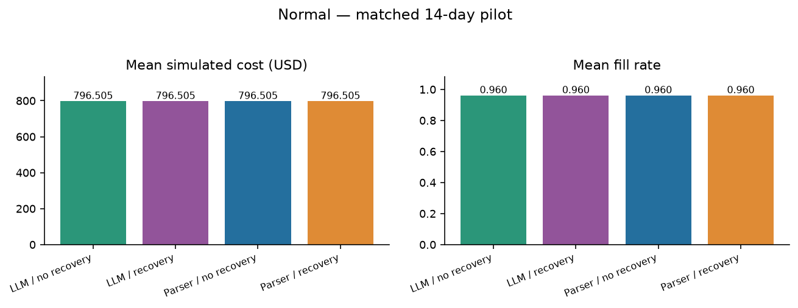
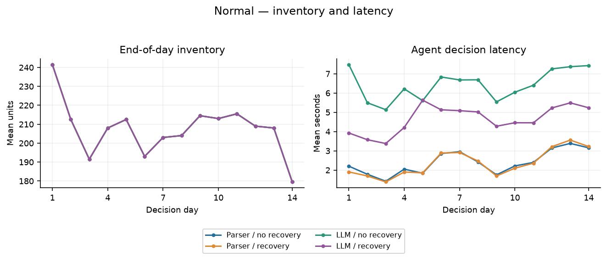
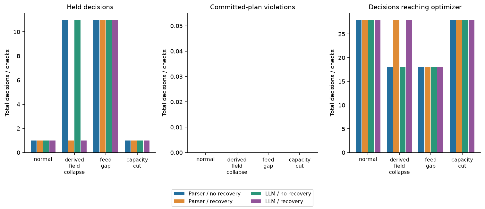
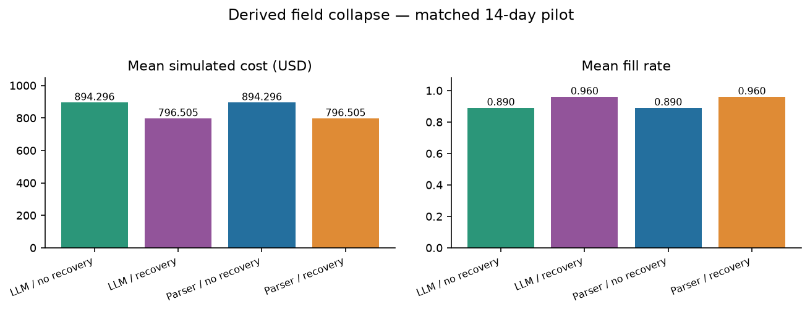
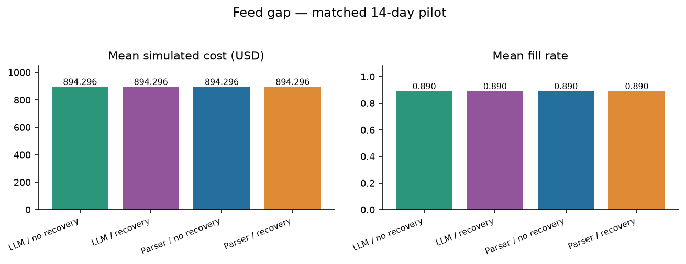
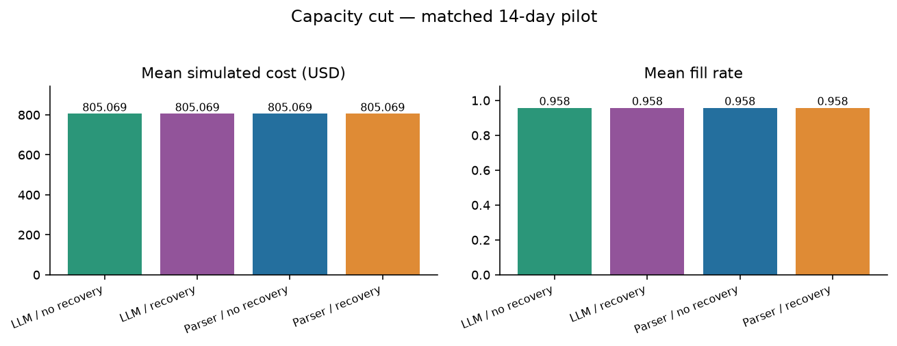
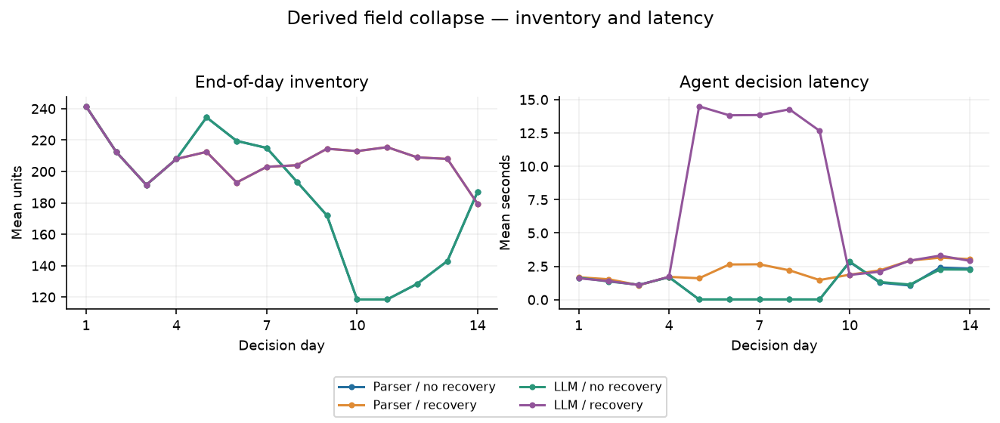
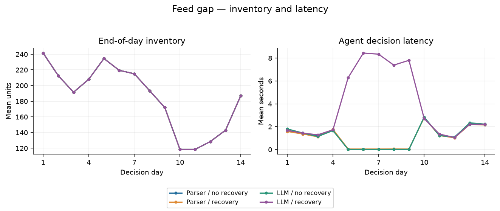
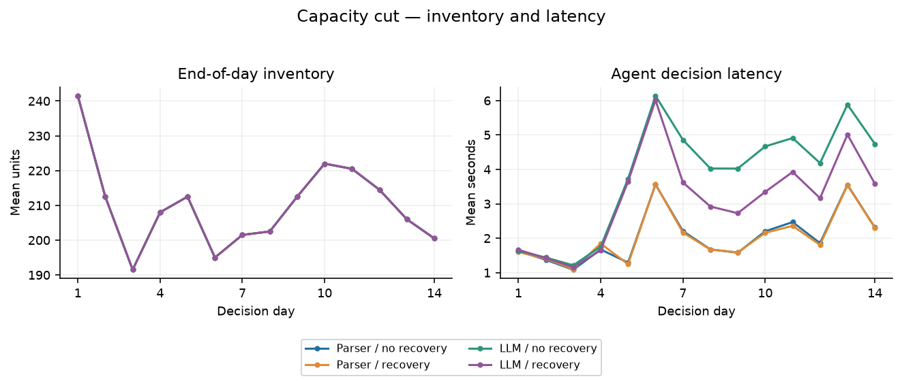

# M5 replenishment agent version-2 pilot

Execution status: COMPLETE. Report generated 2026-10-08T01:53:56+02:00 (Europe/Paris). This report describes measured simulator outputs and captured requests, not supplier field deployment.

The audited current pilot contains 32 completed runs, 448 decision traces, 68 recorded model attempts and 69073 recorded tokens. Captured successful HTTP model responses: 68. Completed deterministic parser runs are not LLM runs.

The pilot evaluates extraction, bounded repair, source-version caching and evidence-based state recovery before making replenishment claims.

Every measurement below retains its original arm, scenario, seed, origin and decision window.

Current model-enabled arms reached the optimizer on 194 decisions, executed 186 nonzero replenishment actions and held 38 decisions. Their committed-plan hard-violation count is 0. Recovery, trusted metadata binding and a capable parser control determine how these outcomes should be attributed.

The LLM and capable parser arms produced identical cost and fill results at both recovery settings in every matched scenario. This controlled-corpus pilot measured no additional operational advantage from the language model.

For derived-field collapse, adding observable-evidence recovery changed mean simulated cost from 894.30 to 796.51 USD (-10.93%) and fill from 89.0% to 96.0% (+7.0 percentage points). The same recovery effect appears in the parser control; this benefit belongs to the recovery architecture.

The recovery selector followed its instructions on 10/20 fresh choices. It requested recovery on 10 stale-feed decisions that required a hold. The independent recovery tool did not apply those repairs and the gate held the decisions. This is a semantic tool-selection failure despite zero client errors; exact numeric extraction does not establish reliable tool selection.

The following matched contrasts separate LLM versus capable parser performance from the effect of recovery. Each scenario has two paired simulation seeds, with repeated days retained within the same run. Cost percentages use the reference arm mean; fill differences are percentage points. These are descriptive engineering comparisons, without significance or power claims.

| Matched contrast | Scenario | Paired seeds | Cost change % | Fill change pp |
| --- | --- | --- | --- | --- |
| LLM minus parser / no recovery | capacity_cut | 2 | 0 | 0 |
| LLM minus parser / no recovery | derived_field_collapse | 2 | 0 | 0 |
| LLM minus parser / no recovery | feed_gap | 2 | 0 | 0 |
| LLM minus parser / no recovery | normal | 2 | 0 | 0 |
| LLM minus parser / recovery | capacity_cut | 2 | 0 | 0 |
| LLM minus parser / recovery | derived_field_collapse | 2 | 0 | 0 |
| LLM minus parser / recovery | feed_gap | 2 | 0 | 0 |
| LLM minus parser / recovery | normal | 2 | 0 | 0 |
| Recovery minus no recovery / parser | capacity_cut | 2 | 0 | 0 |
| Recovery minus no recovery / parser | derived_field_collapse | 2 | -10.935 | 7.000 |
| Recovery minus no recovery / parser | feed_gap | 2 | 0 | 0 |
| Recovery minus no recovery / parser | normal | 2 | 0 | 0 |
| Recovery minus no recovery / LLM | capacity_cut | 2 | 0 | 0 |
| Recovery minus no recovery / LLM | derived_field_collapse | 2 | -10.935 | 7.000 |
| Recovery minus no recovery / LLM | feed_gap | 2 | 0 | 0 |
| Recovery minus no recovery / LLM | normal | 2 | 0 | 0 |

## Observed replenishment results

| Arm / policy | Scenario | Runs | Mean cost | Mean fill | Holds | Nonzero execution | Hard violations |
| --- | --- | --- | --- | --- | --- | --- | --- |
| llm_v2_no_recovery / B10 | capacity_cut | 2 | 805.069 | 0.958 | 1 | 27 | 0 |
| llm_v2_no_recovery / B10 | derived_field_collapse | 2 | 894.296 | 0.890 | 11 | 17 | 0 |
| llm_v2_no_recovery / B10 | feed_gap | 2 | 894.296 | 0.890 | 11 | 17 | 0 |
| llm_v2_no_recovery / B10 | normal | 2 | 796.505 | 0.960 | 1 | 27 | 0 |
| llm_v2_recovery / B10 | capacity_cut | 2 | 805.069 | 0.958 | 1 | 27 | 0 |
| llm_v2_recovery / B10 | derived_field_collapse | 2 | 796.505 | 0.960 | 1 | 27 | 0 |
| llm_v2_recovery / B10 | feed_gap | 2 | 894.296 | 0.890 | 11 | 17 | 0 |
| llm_v2_recovery / B10 | normal | 2 | 796.505 | 0.960 | 1 | 27 | 0 |
| parser_no_recovery / B4 | capacity_cut | 2 | 805.069 | 0.958 | 1 | 27 | 0 |
| parser_no_recovery / B4 | derived_field_collapse | 2 | 894.296 | 0.890 | 11 | 17 | 0 |
| parser_no_recovery / B4 | feed_gap | 2 | 894.296 | 0.890 | 11 | 17 | 0 |
| parser_no_recovery / B4 | normal | 2 | 796.505 | 0.960 | 1 | 27 | 0 |
| parser_recovery / B4 | capacity_cut | 2 | 805.069 | 0.958 | 1 | 27 | 0 |
| parser_recovery / B4 | derived_field_collapse | 2 | 796.505 | 0.960 | 1 | 27 | 0 |
| parser_recovery / B4 | feed_gap | 2 | 894.296 | 0.890 | 11 | 17 | 0 |
| parser_recovery / B4 | normal | 2 | 796.505 | 0.960 | 1 | 27 | 0 |

Cost includes purchase, fixed order, transfer, holding, shortage and spoilage within the configured window. Purchases are charged when ordered. Terminal stock has no salvage credit. Inventory, lead times, available constraints and future service must be considered together; held orders can appear cheap until initial inventory is depleted.

Actual hard violations concern committed plans checked against the post-decision evaluator specification. Clean-reference action deviations are a separate comparator metric. The physical simulator can cap transfers and supplier fulfilment, so plan violations do not assert negative physical inventory.



## Registered design and completion

| Arm | Status | Completed | Configured | Days | Seeds | Scenarios | Policies |
| --- | --- | --- | --- | --- | --- | --- | --- |
| parser_no_recovery | COMPLETE | 8 | 8 | 14 | [13,29] | ["normal","derived_field_collapse","feed_gap","capacity_cut"] | ["B4"] |
| parser_recovery | COMPLETE | 8 | 8 | 14 | [13,29] | ["normal","derived_field_collapse","feed_gap","capacity_cut"] | ["B4"] |
| llm_v2_no_recovery | COMPLETE | 8 | 8 | 14 | [13,29] | ["normal","derived_field_collapse","feed_gap","capacity_cut"] | ["B10"] |
| llm_v2_recovery | COMPLETE | 8 | 8 | 14 | [13,29] | ["normal","derived_field_collapse","feed_gap","capacity_cut"] | ["B10"] |

Each configured run identity is a policy × scenario × independent simulation seed × rolling origin. Store-item series and repeated days are not independent replications. This pilot supplies descriptive findings; it makes no confirmatory significance, power or full-dissertation claims.

The M5 panel contains thirty selected FOODS item-store series: three items across ten stores. It is not a random or department-balanced M5 sample. Observed M5 sales are used as a demand proxy. Inventory, supplier rules, wholesale costs, contracts, disturbances and approvals are simulated.

Supplier text is controlled synthetic prose generated from public rendering grammars. More natural-looking language is not a validated real supplier corpus. A capable deterministic parser is therefore a necessary control. Findings about parsing these grammars cannot be generalized to heterogeneous commercial contracts.

| Arm | Origin | Historical evaluation dates | Last included training date |
| --- | --- | --- | --- |
| parser_no_recovery | 0 | 2016-03-01 through 2016-03-14 | 2016-02-15 |
| parser_recovery | 0 | 2016-03-01 through 2016-03-14 | 2016-02-15 |
| llm_v2_no_recovery | 0 | 2016-03-01 through 2016-03-14 | 2016-02-15 |
| llm_v2_recovery | 0 | 2016-03-01 through 2016-03-14 | 2016-02-15 |

Historical M5 dates describe the evaluated data window; report and inference timestamps describe current cloud execution. Frozen training cutoffs precede the evaluation and warmup window.

```json
{
  "schema_version": "m5-agent-v2-pilot-protocol-v1",
  "status": "frozen",
  "requested_at_utc": "2026-10-07T22:47:14+00:00",
  "frozen_at_utc": "2026-10-07T23:14:27.406740+00:00",
  "experiment_cutoff_utc": "2026-10-08T04:17:14+00:00",
  "report_deadline_utc": "2026-10-08T04:47:14+00:00",
  "selected_model": {
    "name": "ega-qwen2.5:1.5b-v2",
    "digest": "afc65fa44af0fb5f81dd6d0066bdf668521db7077c36a9635c09d13376fe4c90",
    "size": 986061578,
    "details": {
      "context_length": 32768,
      "embedding_length": 1536,
      "families": [
        "qwen2"
      ],
      "family": "qwen2",
      "format": "gguf",
      "parameter_size": "1.5B",
      "parent_model": "qwen2.5:1.5b",
      "quantization_level": "Q4_K_M",
      "runner": "llamacpp"
    }
  },
  "evaluation": {
    "approval_mode": "hold",
    "arms": {
      "llm_v2_no_recovery": {
        "policy": "B10",
        "recovery": false,
        "root": "/workspace/MasterDissertation/results/v2_pilot/llm_v2_no_recovery"
      },
      "llm_v2_recovery": {
        "policy": "B10",
        "recovery": true,
        "root": "/workspace/MasterDissertation/results/v2_pilot/llm_v2_recovery"
      },
      "parser_no_recovery": {
        "policy": "B4",
        "recovery": false,
        "root": "/workspace/MasterDissertation/results/v2_pilot/parser_no_recovery"
      },
      "parser_recovery": {
        "policy": "B4",
        "recovery": true,
        "root": "/workspace/MasterDissertation/results/v2_pilot/parser_recovery"
      }
    },
    "capacity_cut_registration": {
      "evaluation_started": false,
      "reason": "Exercise changed numerical supplier capacity, absent from constant-capacity clean development cases. Added before evaluation with no evaluation outcomes observed.",
      "registered_at_utc": "2026-10-07T23:14:27.409230+00:00"
    },
    "carrier": "hybrid_prose",
    "days": 14,
    "deterministic_critic_all_arms": true,
    "expected_decisions": 448,
    "expected_runs": 32,
    "llm_numeric_routing": false,
    "origins": 1,
    "same_source_information": true,
    "same_trained_forecaster": true,
    "scenarios": [
      "normal",
      "derived_field_collapse",
      "feed_gap",
      "capacity_cut"
    ],
    "seeds": [
      13,
      29
    ],
    "shared_source_inventory_observation": true,
    "start_day": 1858,
    "warmup_days": 14
  },
  "limits": {
    "API_dollar_cost": 0,
    "CPU_threads_for_model": 3,
    "inference_parallelism": 1,
    "max_recorded_requests": 1000,
    "minimum_disk_reserve_gib": 2,
    "new_model_downloads": false
  },
  "code_version_note": "Explicitly authorized version2 coding task. Original version1 artifacts are unchanged. Pre-freeze additions include compact source-grounding, independent recovery, stable arrival-opportunity sampling, and request-before-transport audit logging."
}
```

The complete frozen protocol, source/test/data hashes, configurations and model profiles are preserved in the downloadable evidence files.

## Fair comparisons and development boundaries

| Left arm | Right arm | Matched registered core fields | Unmatched fields |
| --- | --- | --- | --- |
| parser_no_recovery | parser_recovery | True | [] |
| parser_no_recovery | llm_v2_no_recovery | True | [] |
| parser_no_recovery | llm_v2_recovery | True | [] |
| parser_recovery | llm_v2_no_recovery | True | [] |
| parser_recovery | llm_v2_recovery | True | [] |
| llm_v2_no_recovery | llm_v2_recovery | True | [] |

The core comparison checks identical dataset, historical start and duration, seeds/origins, warmup, carrier, forecast, solver, gate, disturbances, accounting and approval configuration. Model, parser, repair and caching settings are separately disclosed in the full input inventory and report data. Shared verified caching can reuse identical contracts across registered seeds and scenarios within a configuration; cache hit and inference latency results therefore depend on run order and are not independent model-accuracy trials. Fresh physical calls come only from current trace records, not imported cached model-response objects. A policy difference or different recovery capability is a treatment difference, not a silent matched control.

The previous version-1 report is historical context only: four live model runs covered two decision days each, all eight days were held, with thirty recorded calls. Its strict conditional grounding assessment found 88 exact tuples, seven false tuples and 24 omissions from 112 submitted documents. Only sixteen of 157 available documents were submitted on each of seven extraction days. Version-1 cost and service are not pooled with this longer version-2 window and are not used as a savings baseline.

A favorable result requires actual model calls when labeled LLM, complete relevant mandatory evidence, current-state feasible decisions and adequate service. Parser fallbacks and cache hits must retain their provenance. Cache coverage alone does not establish LLM reasoning or independent validation.

## Pre-evaluation model selection

| Round / head | Model | Complete cases | Repairs | Errors | Calls | Tokens | Measured seconds | Selected |
| --- | --- | --- | --- | --- | --- | --- | --- | --- |
| 1 / full tuple | ega-qwen2.5:1.5b-v2 | 0/2 | 2 | 0 | 4 | 5520 | 75.064 | False |
| 1 / full tuple | ega-llama3.2:3b-v2 | 0/2 | 2 | 0 | 4 | 4499 | 90.582 | False |
| 2 / numeric term | ega-qwen2.5:1.5b-v2 | 2/2 | 0 | 0 | 2 | 1906 | 21.230 | True |
| 2 / numeric term | ega-llama3.2:3b-v2 | 2/2 | 0 | 0 | 2 | 1702 | 32.375 | False |

Candidate models were compared on separate development days and seeds with two controlled wording variants per round. Both local candidates failed every full-tuple case in round 1. Before inventory evaluation, the extraction head was reduced to model-proposed value, unit and a short exact source quote. IDs, entity, scope, parameter, conversion, aggregation, dates and precedence are then supplied by a disclosed trusted source-slot tool. Those structural fields are not LLM extraction accuracy. Round 2 uses fresh development cases; this is adaptive engineering development, not an untouched confirmatory test. Selection uses complete source-proved case successes, then correction count, then measured elapsed time. These two cases are a development benchmark, not an independent test set, proof of broad model quality, or part of the inventory-run totals.

The inventory pilot starts only after the registered clean-case gate passes. The selected model identity and source code are frozen before evaluation. Development cache reuse is a separate efficiency check; it never creates additional independent accuracy trials. In the repeated 157-document cases, most cached rules originate from deterministic parsing and only two from accepted model numeric terms. Cache hits must not be equated with the number of avoided model requests.

| Candidate | Fresh requests in repeat | Complete repeated case | Cache hits | Accuracy selection case |
| --- | --- | --- | --- | --- |
| qwen15 | 0 | True | 157 | False |
| llama3 | 0 | True | 157 | False |

```json
[
  {
    "round": 1,
    "candidate": "qwen15",
    "chain_events": 330,
    "chain_final_hash": "6e455d0862faaa84e42fe834ab2647bdfba4ccf2528bc79bf08f915fbaeef795",
    "objects": 334,
    "summary_sha256": "bb8d3e58e6203d4e660fbcd65a728b34df0e0667646ac7e6b2dca8ba8b2f1a1a"
  },
  {
    "round": 1,
    "candidate": "llama3",
    "chain_events": 330,
    "chain_final_hash": "08acfcd2325f9dfd5257b58763b0a5dec5b2b9195ce50e925581ab5cd6977d7d",
    "objects": 334,
    "summary_sha256": "6acc09a36edace0b5e440a19a383f9e4bb49b6f40265a4b4d5a0e40e8f860fcb"
  },
  {
    "round": 2,
    "candidate": "qwen15",
    "chain_events": 956,
    "chain_final_hash": "c0311244c9914f77d1aa4699f22468eb40dc199f1c024ce566a30ab20a720b92",
    "objects": 801,
    "summary_sha256": "775e20fed206607a01a1bb58eb196399e0a75a6e1ab111807b4182f47466398c"
  },
  {
    "round": 2,
    "candidate": "llama3",
    "chain_events": 956,
    "chain_final_hash": "21c185f4ca2a5b523b4ab2afe4dd50130449b9f244eddc839d1260797192aa44",
    "objects": 801,
    "summary_sha256": "97e6a641d4366dc9c7955af3e8e8bdbf9685df3e373d918535e9746c50685457"
  }
]
```

## Model use, optimization and latency

| Arm / policy | Scenario | Calls | Tokens | Errors | Optimizer decisions | Feasible plans | Mean sec | p95 sec |
| --- | --- | --- | --- | --- | --- | --- | --- | --- |
| llm_v2_no_recovery / B10 | capacity_cut | 10 | 7548 | 0 | 28 | 28 | 3.799 | 7.278 |
| llm_v2_no_recovery / B10 | derived_field_collapse | 0 | 0 | 0 | 18 | 18 | 1.126 | 3.190 |
| llm_v2_no_recovery / B10 | feed_gap | 0 | 0 | 0 | 18 | 18 | 1.135 | 3.260 |
| llm_v2_no_recovery / B10 | normal | 14 | 13367 | 0 | 28 | 28 | 6.439 | 12.145 |
| llm_v2_recovery / B10 | capacity_cut | 10 | 7548 | 0 | 28 | 28 | 3.132 | 5.987 |
| llm_v2_recovery / B10 | derived_field_collapse | 10 | 17054 | 0 | 28 | 28 | 6.287 | 14.852 |
| llm_v2_recovery / B10 | feed_gap | 10 | 10189 | 0 | 18 | 18 | 3.854 | 8.471 |
| llm_v2_recovery / B10 | normal | 14 | 13367 | 0 | 28 | 28 | 4.649 | 8.332 |
| parser_no_recovery / B4 | capacity_cut | 0 | 0 | 0 | 28 | 28 | 2.033 | 4.018 |
| parser_no_recovery / B4 | derived_field_collapse | 0 | 0 | 0 | 18 | 18 | 1.135 | 3.455 |
| parser_no_recovery / B4 | feed_gap | 0 | 0 | 0 | 18 | 18 | 1.119 | 3.167 |
| parser_no_recovery / B4 | normal | 0 | 0 | 0 | 28 | 28 | 2.399 | 4.671 |
| parser_recovery / B4 | capacity_cut | 0 | 0 | 0 | 28 | 28 | 2.025 | 4.042 |
| parser_recovery / B4 | derived_field_collapse | 0 | 0 | 0 | 28 | 28 | 2.129 | 4.652 |
| parser_recovery / B4 | feed_gap | 0 | 0 | 0 | 18 | 18 | 1.108 | 3.041 |
| parser_recovery / B4 | normal | 0 | 0 | 0 | 28 | 28 | 2.368 | 4.832 |

Model-call attempts, successful response artifacts and validation outcomes have different denominators. Transport or structured-output errors are not automatically semantic failures. A schema-valid response does not prove that source values, units, entities or validity are correct.

Every comparison uses the same single trained GRU forecaster, frozen before the evaluation and warmup window. This pilot does not benchmark DeepAR, TFT or foundation forecasters. The optimizer supplies numeric orders; the language model is not allowed to invent final order quantities. A solver feasible incumbent is not necessarily optimal. Any optimal flag is interpreted under the configured MIP tolerance and time limit.

Latency is measured for the agent decision, including live model work, validation, gates and relevant recovery. It excludes the evaluator reference solve. Local endpoint API token charges can be zero while infrastructure cost remains unmeasured.



## Extraction, repair, cache and recovery evidence

| Arm | Attempted sources | Parser rules | Accepted model terms | Cache hits | Fully grounded days | Repair requests | Repair success | Recovery applied |
| --- | --- | --- | --- | --- | --- | --- | --- | --- |
| llm_v2_no_recovery | 14444 | 3450 | 38 | 10956 | 92 | 0 | 0 | 0 |
| llm_v2_recovery | 16014 | 3450 | 38 | 12526 | 102 | 0 | 0 | 10 |
| parser_no_recovery | 14444 | 3488 | 0 | 10956 | 92 | 0 | 0 | 0 |
| parser_recovery | 16014 | 3488 | 0 | 12526 | 102 | 0 | 0 | 10 |

| Arm | Cached parser rules | Cached model terms | Cache rejections | Model numeric terms | Tool-bound metadata | Sources skipped by state gate |
| --- | --- | --- | --- | --- | --- | --- |
| llm_v2_no_recovery | 10810 | 146 | 0 | 38 | 38 | 3140 |
| llm_v2_recovery | 12360 | 166 | 0 | 38 | 38 | 1570 |
| parser_no_recovery | 10956 | 0 | 0 | 0 | 0 | 3140 |
| parser_recovery | 12526 | 0 | 0 | 0 | 0 | 1570 |

| Recorded version-2 event stage | Events |
| --- | --- |
| grounding_v2_cache_hit | 46964 |
| grounding_v2_cache_import | 47906 |
| grounding_v2_cache_write | 13952 |
| grounding_v2_final | 388 |
| grounding_v2_parsed | 13876 |
| grounding_v2_request | 48 |
| grounding_v2_route_model | 76 |
| grounding_v2_sources | 388 |
| grounding_v2_validation | 48 |
| llm_request_response | 68 |
| llm_request_started | 68 |
| recovery_observed_certificate | 40 |
| recovery_observed_snapshot | 40 |
| recovery_precheck | 40 |
| recovery_report | 40 |
| recovery_result_certificate | 40 |
| recovery_result_snapshot | 40 |
| recovery_selection | 40 |
| recovery_status | 448 |

In the hybrid carrier, common clauses use deterministic public-grammar parsing. At most one supplier clause and one portfolio clause per day use the language-model path. This enables an actual model-dependent decision while retaining complete source coverage across all thirty simulated series; it is not thirty-series LLM extraction coverage. The capable full-parser control recognizes those same hybrid clauses independently. Every supported version-2 mechanism must be substantiated by its recorded artifact references. A compact output credits the model only for value/unit and its literal numeric-term quote. Trusted source-slot metadata binding supplies the rest of the rule and verifies the model term; it does not replace an invalid or omitted model term. A repair can repeat the original source and exact validation feedback; it cannot receive hidden expected answers. Repairs are bounded, and failed corrections remain holds. Verified cache entries require unchanged authenticated source identity, version and validity context. Unseen or changed sources must not become cache hits.

State recovery must come from authorized observable feeds or documented reconciliation, followed by fresh certification. The post-decision evaluator state and future realized sales are never eligible recovery inputs. Parser and LLM comparison arms should receive the same recovery capability; otherwise its effect remains confounded with language-model extraction.

Independent literal regex inverse for two public and four hybrid renderings; explicit validity/precedence resolver; twelve-field recorded active-rule comparison. Model-only accuracy uses unique current physical extraction responses and four compact head fields; trusted metadata and cached reuses are not new model trials. Selector instruction compliance is assessed separately from both required observable anomalies, complete current feeds and allowlisted citations. Recovery uses only recorded observable inputs and recertification.

| Arm | Grounded days | State-gated days | Exact active sets | Rule precision | Rule recall | False rules | Omitted rules |
| --- | --- | --- | --- | --- | --- | --- | --- |
| parser_no_recovery | 92 | 20 | 92 | 1 | 1 | 0 | 0 |
| parser_recovery | 102 | 10 | 102 | 1 | 1 | 0 | 0 |
| llm_v2_no_recovery | 92 | 20 | 92 | 1 | 1 | 0 | 0 |
| llm_v2_recovery | 102 | 10 | 102 | 1 | 1 | 0 | 0 |

| Arm | Fresh extraction calls | Submitted terms | Exact terms | False terms | Omissions | Term precision | Term recall |
| --- | --- | --- | --- | --- | --- | --- | --- |
| parser_no_recovery | 0 | 0 | 0 | 0 | 0 | Not measured | Not measured |
| parser_recovery | 0 | 0 | 0 | 0 | 0 | Not measured | Not measured |
| llm_v2_no_recovery | 24 | 38 | 38 | 0 | 0 | 1 | 1 |
| llm_v2_recovery | 24 | 38 | 38 | 0 | 0 | 1 | 1 |

| Arm | Tool calls | Recoveries applied | Changed quantities | Recovery audit problems |
| --- | --- | --- | --- | --- |
| parser_no_recovery | 0 | 0 | 0 | 0 |
| parser_recovery | 20 | 10 | 279 | 0 |
| llm_v2_no_recovery | 0 | 0 | 0 | 0 |
| llm_v2_recovery | 20 | 10 | 279 | 0 |

| Arm | Fresh model selector calls | Instruction-compliant choices | Semantic choice errors |
| --- | --- | --- | --- |
| parser_no_recovery | 0 | 0 | 0 |
| parser_recovery | 0 | 0 | 0 |
| llm_v2_no_recovery | 0 | 0 | 0 |
| llm_v2_recovery | 20 | 10 | 10 |

Rule precision/recall compare recorded active constraint sets with an independent source inverse and precedence resolver; they concern the complete hybrid pipeline. Compact model term accuracy concerns only value/unit/exact span from fresh current model responses. Metadata fields, parsed rules, state-gated days and cache reuses have separate attribution and denominators.

Recovery selection is a separate language-model task. Correct extraction values and zero HTTP/schema errors do not establish correct tool choice. Instruction compliance requires both named recovery anomalies, complete current feeds and allowlisted anomaly citations. Independent tool preconditions and the autonomy gate can preserve safety despite a semantically wrong model request.

Full independent assessment: /workspace/MasterDissertation/results/v2_pilot/report_final/M5_v2_independent_assessment.json; SHA-256 3c081532fafe271d888f81aa88a1523985fcd27cc67c1749c44955bbc1fadeae. Exhaustive source-by-source cases and recovery rows remain in that file, outside the report narrative.

```json
{
  "arm": "llm_v2_no_recovery",
  "run": "B10__normal__seed13__origin0",
  "day": 1858,
  "artifact_ref": "0efef72bc0782a12b70e959485d731f0ed60654783cdddfd8cd470866ed27f2f",
  "semantic_attempt": "initial",
  "compact_model_fields": [
    "source_ref",
    "value",
    "unit",
    "value_quote"
  ],
  "tool_metadata_fields": [
    "constraint_id",
    "entity",
    "scope",
    "parameter",
    "conversion",
    "aggregation",
    "valid_from",
    "valid_to",
    "precedence"
  ],
  "submitted_terms": 2,
  "exact_numeric_terms": 2,
  "pipeline_validation_accepted": true,
  "checks": [
    {
      "errors": [],
      "exact_numeric_term": true,
      "returned_quote": "1000.0 unit",
      "returned_unit": "unit",
      "returned_value": 1000.0,
      "source_numeric_term": {
        "literal_span": "1000.0 unit",
        "unit": "unit",
        "value": 1000.0
      },
      "source_ref": "contract/SUP_FOODS_1:capacity:1858"
    },
    {
      "errors": [],
      "exact_numeric_term": true,
      "returned_quote": "3000.0 USD",
      "returned_unit": "USD",
      "returned_value": 3000.0,
      "source_numeric_term": {
        "literal_span": "3000.0 USD",
        "unit": "USD",
        "value": 3000.0
      },
      "source_ref": "contract/portfolio:budget:1858"
    }
  ]
}
```

```json
{
  "arm": "parser_recovery",
  "run": "B4__derived_field_collapse__seed13__origin0",
  "day": 1862,
  "status": "applied",
  "applied": true,
  "problems": [],
  "only_permitted_fields_changed": true,
  "changed_quantities": 28,
  "all_sources_match_ledgers": true,
  "certification_recomputed_exact": true,
  "hard_fail_before": true,
  "hard_fail_after": false,
  "truth_access": "Observed input, recorded reconciliation output and recertification only. No clean snapshot, post-decision true problem or oracle enters this recovery assessment.",
  "sample_changed_rows": [
    {
      "changed": true,
      "ledger_expected": 11.0,
      "quantity_after": 11.0,
      "quantity_before": 0.0,
      "series_id": "FOODS_1_001@CA_1",
      "source_ledger_agreement": true,
      "source_quantity": 11.0
    },
    {
      "changed": true,
      "ledger_expected": 13.0,
      "quantity_after": 13.0,
      "quantity_before": 0.0,
      "series_id": "FOODS_1_001@CA_2",
      "source_ledger_agreement": true,
      "source_quantity": 13.0
    },
    {
      "changed": true,
      "ledger_expected": 10.0,
      "quantity_after": 10.0,
      "quantity_before": 0.0,
      "series_id": "FOODS_1_001@CA_3",
      "source_ledger_agreement": true,
      "source_quantity": 10.0
    }
  ]
}
```

Controlled grammars are fully disclosed and also recognized by the capable parser. This is not natural-language corpus validation or evidence of broad semantic understanding.

Day/document exposures, wording variants and cache hits are correlated; no significance or power claim.

Recovery source/ledger values are simulated observed evidence; freshness uses table dates rather than separately authenticated row timestamps.

If an optional grounding/recovery assessment is absent, its accuracy is not measured by this generator. The raw version-2 event ledger is exported as JSON Lines and is available for independent source-by-source inspection. Submitted document exposures count retries, so they must not be treated as unique pipeline coverage without a strict coverage assessment.

## Execution, inventory and service safeguards



Held decisions, executed receipts and nonzero replenishment actions are reported separately. An executed zero-order receipt does not demonstrate successful replenishment. Longer windows help reveal shortages after initial stock is consumed, but a small pilot still cannot establish steady-state costs or retailer ROI.

Quality gates reduce exposure to suspect inputs and can also delay replenishment. Repair and recovery must improve valid coverage and service without weakening those checks. A strong parser control may perform equally well or better on this controlled corpus; that result is informative and must be reported.

## Alignment with the revised dissertation

| Research question | Evidence provided by this pilot | Remaining dissertation evidence |
| --- | --- | --- |
| RQ1: replenishment performance | Matched parser/LLM optimizer outcomes on the same 14-day window; separate recovery effects | Full multi-origin, severity and independent-seed design; broader forecast families and measured retailer outcomes |
| RQ2: evidence quality | Observed feed-gap and derived-field-collapse faults, source/ledger recovery and recertification | Full quality taxonomy, telemetry calibration and field reliability |
| RQ3: constraint grounding | Controlled synthetic clauses; compact numeric value/unit/source-span model checks; full-source metadata bound by trusted tools; capacity cut | Validated naturally occurring contracts, model interpretation of complete tuple metadata and unit conversions |
| RQ4: architecture and ablations | Capable parser controls and recovery/no-recovery factorial comparisons | LLM-only, fixed-autonomy, role, actionable-memory and critic ablations |
| RQ5: reliability | Actual committed-plan violations, solver/gate/receipt logs and complete configured traces | Powered robustness studies, external supplier systems and deployment incidents |
| RQ6: trace faithfulness | Selected copied-store cached replay and deterministic budget/capacity sensitivity when supplied | Free-form versus typed-agent comparison, model-internal faithfulness and semantic context-deletion experiments |
| RQ7: human audit | Auditable source records and evidence exports | Human participants, approved study protocol and measured reviewer outcomes |

This version-2 engineering pilot does not establish the full H1–H8 dissertation claims. It supplies a narrower, reproducible test of a safer hybrid extraction/recovery design. Deterministic numeric-tool sensitivity is not a new live LLM experiment. Deleting a forecast artifact tests a structural reconstruction requirement; it is not semantic context deletion or evidence that the model used a source faithfully.

Cached replay demonstrates that recorded software inputs reproduce the selected action/state hashes. It does not reveal internal model reasoning or replace a human audit.

## Additional scenario graphs













## Audit integrity and limits

Audited 130430 original content-addressed objects and 130542 SQLite chain events across 32 completed runs. Each original summary, daily CSV, trace index, run manifest and resolved configuration is independently hashed. All discovered object contents match their original SHA-256 references. SQLite chains and receipt identities were checked read-only.

All current pilot model attempts were persisted before HTTP transport and paired with their later response/error by role, start timestamp, attempt number and exact request hash; their SQLite sequence order was checked. Request-start objects and imported cached calls are not additional physical calls. Every captured successful model request was checked for exact submitted-source equality and explicitly forbidden evaluator fields. The audit can detect those recorded leakage patterns; it is not a proof against every possible information channel. Evaluation objects are retained after decisions for assessment and are not model context.

SHA-256 and local chains detect modification and preserve reproducibility; they are not signatures, external timestamps or WORM storage. Logs contain actual prompts, supplier source evidence, full model responses, validations, solver artifacts, gates, receipts and simulator outcomes. Credentials and authorization headers are not exported.

There are no human participants, ERP deployment, measured organizational ROI, validated naturally occurring supplier contracts, complete rolling-origin/severity matrix or independently powered full dissertation tests. The main outcome is a reproducible engineering pilot with descriptive operational evidence.

```json
[
  {
    "selection_reason": "First actual normal model-enabled replenishment",
    "arm": "llm_v2_no_recovery",
    "run": "B10__normal__seed13__origin0",
    "day": 1858,
    "decision_id": "B10-normal-seed13-origin0:day1858",
    "trace_ref": "5a5bac21b860d8a27d40e7502f9d4574e59a516c31ec706249e8c878f9e37cac",
    "plan_ref": "ca24a9b05253e2b98fab138e686f9ee24ee0d4b460386401def396b29dc5e70a",
    "evaluation_ref": "284783cb255e71169f6370f9ae9e0808cc44dd49b4a4be34e5bac926c03b87a9",
    "receipt_status": "executed",
    "executed_nonzero_action": true,
    "raw_true_problem_checks": [
      "lineage_mismatch"
    ],
    "metadata_aligned_true_problem_checks": [],
    "recorded_evaluation_violations": [],
    "recomputed_metric_matches_evaluator": true,
    "alignment": "Only problem.lineage is set to the immutable plan.lineage, matching the registered evaluator comparison. Physical/economic state, sources, constraints, quantities and forecast values are unchanged. Evaluation truth remains post-decision and is never model context."
  },
  {
    "selection_reason": "First actual replenishment after model-selected deterministic recovery",
    "arm": "llm_v2_recovery",
    "run": "B10__derived_field_collapse__seed13__origin0",
    "day": 1862,
    "decision_id": "B10-derived_field_collapse-seed13-origin0:day1862",
    "trace_ref": "04e287fa351ccd40eb9e314f4f8a0202651f94be88b533fa9b4120687a19e010",
    "plan_ref": "7cdbd65a38b745c2bb5cf54ed510ce6c90778eaa176433afcf7e8b8097b92bbe",
    "evaluation_ref": "a78da154865701cc2b2bbc180e3fe8d72fe67c4c494374b55e991107a8ec6cf1",
    "receipt_status": "executed",
    "executed_nonzero_action": true,
    "raw_true_problem_checks": [
      "lineage_mismatch"
    ],
    "metadata_aligned_true_problem_checks": [],
    "recorded_evaluation_violations": [],
    "recomputed_metric_matches_evaluator": true,
    "alignment": "Only problem.lineage is set to the immutable plan.lineage, matching the registered evaluator comparison. Physical/economic state, sources, constraints, quantities and forecast values are unchanged. Evaluation truth remains post-decision and is never model context."
  }
]
```

```json
[
  {
    "arm": "parser_no_recovery",
    "path": "/workspace/MasterDissertation/results/v2_pilot/shared/model_deep_origin0.pt",
    "sha256": "f0bbd1d91a3c7145e9da21a1e164f5881f3c7bef173395e2587140ec733f5b28"
  },
  {
    "arm": "parser_recovery",
    "path": "/workspace/MasterDissertation/results/v2_pilot/shared/model_deep_origin0.pt",
    "sha256": "f0bbd1d91a3c7145e9da21a1e164f5881f3c7bef173395e2587140ec733f5b28"
  },
  {
    "arm": "llm_v2_no_recovery",
    "path": "/workspace/MasterDissertation/results/v2_pilot/shared/model_deep_origin0.pt",
    "sha256": "f0bbd1d91a3c7145e9da21a1e164f5881f3c7bef173395e2587140ec733f5b28"
  },
  {
    "arm": "llm_v2_recovery",
    "path": "/workspace/MasterDissertation/results/v2_pilot/shared/model_deep_origin0.pt",
    "sha256": "f0bbd1d91a3c7145e9da21a1e164f5881f3c7bef173395e2587140ec733f5b28"
  }
]
```

cached external evidence and deterministic tools; no model calls or forecast retraining

Five selected decisions, not all 448. Optimizer is rerun under its frozen five-second limit.

| Arm / scenario | Day | Certificate match | Action match | Held | Forecast deletion blocked | Original bytes unchanged | Assessment error |
| --- | --- | --- | --- | --- | --- | --- | --- |
| parser_no_recovery / derived_field_collapse | 1862 | True | True | True | Not measured | True |  |
| parser_recovery / derived_field_collapse | 1862 | True | True | False | True | True |  |
| llm_v2_no_recovery / normal | 1858 | True | True | False | True | True |  |
| llm_v2_recovery / derived_field_collapse | 1862 | True | True | False | True | True |  |
| llm_v2_recovery / feed_gap | 1862 | True | True | True | Not measured | True |  |

| Arm / scenario | Day | Optimizer factor | Multiplier | Action changed | Violation count | Violations |
| --- | --- | --- | --- | --- | --- | --- |
| llm_v2_no_recovery / normal | 1858 | budget | 0.010 | True | 0 | [] |
| llm_v2_no_recovery / normal | 1858 | capacity | 0.010 | True | 0 | [] |

These copied-store checks use recorded model output and rerun deterministic tools; they make no fresh model requests. A held case has no forecast deletion test. Structural forecast deletion blocks reconstruction; it does not measure semantic model context use. Large synthetic budget/capacity interventions test optimizer sensitivity, and a nonbinding factor may leave the action unchanged.

selected_cached_replay.json: full JSON /workspace/MasterDissertation/results/v2_pilot/selected_cached_replay.json; SHA-256 5c49abf62e6c54ff1f51c65e571aebbad02a770f499df94243c55a58eea3c0e0.

Completion-integrity status: VERIFIED. Frozen source, tests, prepared data and execution helper pins were checked against the frozen protocol. Protected original dissertation and version-1 report pins were also checked.

| Integrity item | Recorded outcome |
| --- | --- |
| Status | VERIFIED |
| Audited at UTC | 2026-10-07T23:47:08.643471+00:00 |
| Exact completion totals | {"calls":68,"committed_plan_violations":0,"decision_days":448,"errors":0,"held_days":76,"runs":32,"tokens":69073} |
| Frozen input groups | {"frozen_helper_sha256":2,"frozen_prepared_data_sha256":6,"frozen_source_sha256":54} |
| Workflow records | 88 |
| Workflow final chain hash | 241e4b5b924ba9063af42fdbafca62bdea45b908be8fdd2a91e7dbf8c9d14d84 |
| Protected original files | 2 |
| Shared forecast identities | 1 |
| Selected model digest | afc65fa44af0fb5f81dd6d0066bdf668521db7077c36a9635c09d13376fe4c90 |
| Before registered cutoff | True |
| Request to completion minutes | 59.598 |

| Arm | Runs | Days | Calls | Tokens | Errors | Hard violations | Holds |
| --- | --- | --- | --- | --- | --- | --- | --- |
| llm_v2_no_recovery | 8 | 112 | 24 | 20915 | 0 | 0 | 24 |
| llm_v2_recovery | 8 | 112 | 44 | 48158 | 0 | 0 | 14 |
| parser_no_recovery | 8 | 112 | 0 | 0 | 0 | 0 | 24 |
| parser_recovery | 8 | 112 | 0 | 0 | 0 | 0 | 14 |

User-authorized local V2 changes are uncommitted; frozen source/test export, tracked patch and original base commit are preserved. No remote push or fresh environment restoration is claimed.

final_audit.json: full JSON /workspace/MasterDissertation/results/v2_pilot/final_audit.json; SHA-256 200bb6129972d4e241c099a682863f4714457a2bea8ba13ec3757fc221d5979a.

Post-decision instruction-compliance assessment of all 20 fresh recovery selections. Labels come only from the observed anomalies/source-stage declarations and source/ledger values. No clean state or future demand is used.

| Model recovery selector outcome | Count |
| --- | --- |
| Fresh selections | 20 |
| Instruction-compliant choices | 10 |
| Incorrect stale-feed choices | 10 |
| Bad choices blocked before execution | 10 |

Zero HTTP/schema errors and exact numeric extraction do not establish correct recovery selection. The small model requested recovery despite stale feeds; independent preconditions and the autonomy gate preserved safety. Prefilter tool availability using deterministic eligibility before asking the model in future versions; this frozen study is not modified.

tool_selector_assessment.json: full JSON /workspace/MasterDissertation/results/v2_pilot/tool_selector_assessment.json; SHA-256 17a167528c98d37af9593e3a3e69f991e26dfbd76283d44ec3a9e83d316dc111.

| Evidence item | Count |
| --- | --- |
| Completed runs | 32 |
| Daily decisions | 448 |
| Original objects | 130430 |
| Hash-chain events | 130542 |
| Recorded model attempts | 68 |
| Captured successful responses | 68 |
| Captured model tokens | 69073 |
| Forbidden-context key findings | 0 |
